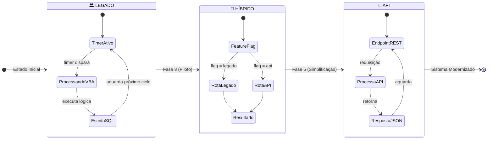
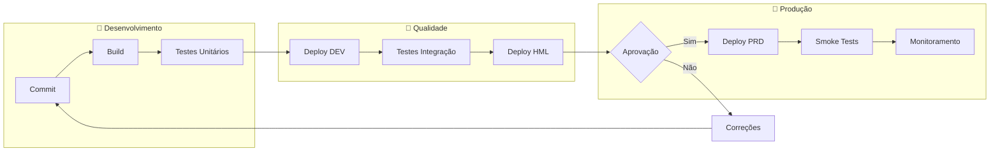
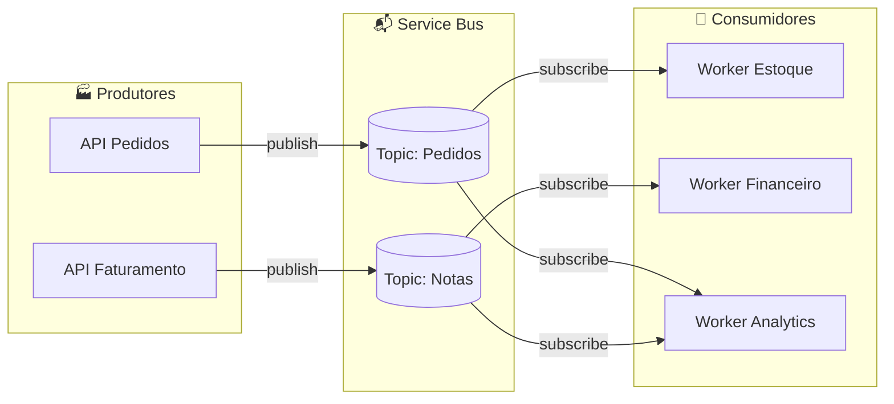

# Operação e Suporte

> **Navegação**: [← Índice](./README.md) | [← Investimentos](./07-investimentos.md) | [Glossário →](./09-glossario.md)

## Sumário

- [Modelo de Operação Híbrida](#🔄-modelo-de-operação-híbrida)
- [Estratégia de Deploy](#🚀-estratégia-de-deploy)
- [Runbooks Operacionais](#📋-runbooks-operacionais)
- [Treinamento](#📚-plano-de-treinamento)
- [Handover para Operação](#🤝-handover-para-operação)
- [Migração Futura ao Nimbus](#☁️-migração-futura-ao-nimbus)
- [Arquitetura Orientada a Eventos](#📡-arquitetura-orientada-a-eventos)

---

## 🔄 Modelo de Operação Híbrida

Durante as Fases 3-5 do projeto, o sistema operará em modo híbrido, com fluxos sendo gradualmente migrados do legado (Access/VBA) para a nova API.

### Características da Operação Híbrida

| Aspecto              | Legado (Access/VBA)                              | Nova API                              |
| -------------------- | ------------------------------------------------ | ------------------------------------- |
| **Acionamento**      | Timers e eventos manuais                         | Requisições HTTP/REST                 |
| **Monitoramento**    | Logs locais + consultas manuais                  | APM + dashboards + alertas            |
| **Rollback**         | Reativar timer + restaurar código                | Feature flag + rollback por endpoint  |
| **Dados**            | Escrita direta no SQL Server                     | Escrita via API + auditoria           |
| **Rastreabilidade**  | Limitada a logs locais                           | Correlation-ID + logs estruturados    |

### Governança da Convivência

### Regras de Convivência

1. **Source of Truth único por domínio** — definido na Fase 0
2. **Sem dual-write** — evitar escrita simultânea em legado e API
3. **Feature flags por fluxo** — controle granular de roteamento
4. **Monitoramento comparativo** — métricas de ambos os caminhos
5. **Rollback preparado** — sempre ter caminho de volta

---

## 🚀 Estratégia de Deploy

### Ambientes

| Ambiente | Propósito                           | Responsabilidade |
| -------- | ----------------------------------- | ---------------- |
| **DEV**  | Desenvolvimento e testes unitários  | Néctar           |
| **HML**  | Homologação e testes de aceite      | Néctar + Cliente |
| **PRD**  | Produção                            | Cliente          |

### Pipeline CI/CD

### Estratégia de Rollback

| Cenário                          | Ação                                          | Tempo Esperado |
| -------------------------------- | --------------------------------------------- | -------------- |
| Erro em endpoint específico      | Desabilitar feature flag                      | < 5 min        |
| Problema em fluxo inteiro        | Reverter para versão anterior                 | < 15 min       |
| Falha crítica de integração      | Reativar timer legado + comunicar operação    | < 30 min       |
| Inconsistência de dados          | Rollback + análise + reconciliação manual     | 2-4 horas      |

---

## 📋 Runbooks Operacionais

Os runbooks serão entregues durante as Fases 3 e 5, contemplando:

### Runbook 1: Operações Rotineiras

| Procedimento             | Frequência | Responsável      |
| ------------------------ | ---------- | ---------------- |
| Verificação de health    | A cada 5 min (automático) | Sistema |
| Revisão de alertas       | Diário     | Operação         |
| Backup de configurações  | Semanal    | TI               |
| Análise de métricas      | Semanal    | Tech Lead        |

### Runbook 2: Troubleshooting

| Sintoma                      | Possível Causa                     | Ação                                      |
| ---------------------------- | ---------------------------------- | ----------------------------------------- |
| Timeout em requisições       | Sobrecarga de banco                | Verificar queries + connection pool       |
| Erro 500 intermitente        | Exception não tratada              | Consultar logs com correlation-id         |
| Dados não sincronizados      | Falha em operação do legado        | Verificar timers + logs VBA               |
| API lenta                    | Falta de índice                    | Analisar query plan + criar índice        |

### Runbook 3: Incidentes

| Severidade | Descrição                    | SLA Resposta | SLA Resolução | Escalação          |
| :--------: | ---------------------------- | :----------: | :-----------: | ------------------ |
|   **P1**   | Sistema indisponível         |   15 min     |    2 horas    | Tech Lead + Arquiteto |
|   **P2**   | Funcionalidade crítica afetada |   30 min     |    4 horas    | Tech Lead          |
|   **P3**   | Funcionalidade secundária    |   2 horas    |    1 dia      | Desenvolvedor      |
|   **P4**   | Melhoria ou ajuste           |   1 dia      |    5 dias     | Backlog            |

---

## 📚 Plano de Treinamento

### Público-Alvo

| Grupo              | Conteúdo                                           | Duração   | Fase      |
| ------------------ | -------------------------------------------------- | --------- | --------- |
| Operação TI        | Runbooks, monitoramento, troubleshooting básico    | 4h        | Fase 5    |
| Suporte N1/N2      | FAQ técnico, escalação, ferramentas de diagnóstico | 2h        | Fase 5    |
| Desenvolvedores    | Arquitetura, padrões, contribuição de código       | 8h        | Fase 3-4  |
| Gestão             | Dashboards executivos, métricas de negócio         | 1h        | Fase 5    |

### Material de Treinamento

| Artefato                   | Descrição                              | Entrega   |
| -------------------------- | -------------------------------------- | --------- |
| Guia de Operação           | Manual completo de operação            | Fase 5    |
| FAQ Técnico                | Perguntas frequentes + soluções        | Fase 5    |
| Vídeos de Troubleshooting  | Demonstrações de diagnóstico           | Fase 5    |
| Diagramas de Arquitetura   | C4 atualizados                         | Fase 5    |

---

## 🤝 Handover para Operação

### Critérios de Aceite do Handover

| Critério                                          | Verificação                                   |
| ------------------------------------------------- | --------------------------------------------- |
| Documentação técnica completa                     | Review por TI Cooperflora                     |
| Runbooks validados                                | Simulação de incidentes                       |
| Treinamento realizado                             | Lista de presença + avaliação                 |
| Dashboards funcionais                             | Demonstração ao vivo                          |
| Alertas configurados                              | Teste de disparo de alertas                   |
| Acessos de operação provisionados                 | Validação de permissões                       |

### Período de Acompanhamento

| Período                   | Suporte Néctar                       | Responsabilidade |
| ------------------------- | ------------------------------------ | ---------------- |
| Semanas 1-2 pós-handover  | Disponível para chamados prioritários | Compartilhada    |
| Semanas 3-4 pós-handover  | Suporte sob demanda (consultivo)     | Cliente          |
| A partir da semana 5      | Contrato de suporte (se aplicável)   | Cliente          |

---

## ☁️ Migração Futura ao Nimbus

A arquitetura do projeto foi desenhada para facilitar uma futura migração ao Nimbus (plataforma cloud da Néctar), quando estrategicamente decidido pela Cooperflora.

### Preparação Técnica

| Aspecto                   | Estado Atual                                | Benefício para Migração           |
| ------------------------- | ------------------------------------------- | --------------------------------- |
| Contratos de API          | OpenAPI versionado e documentado            | Contratos formais reutilizáveis   |
| Desacoplamento            | Integração via API (não banco direto)       | Substituição transparente         |
| Observabilidade           | Logs estruturados + métricas                | Migração de dashboards facilitada |
| Configurações             | Externalizadas (environment variables)      | Ajuste por ambiente               |

### Passos para Migração Nimbus

1. **Avaliação de módulos candidatos** — priorizar por criticidade e complexidade
2. **Mapeamento de integrações** — validar contratos existentes
3. **Planejamento de migração** — cronograma por módulo
4. **Execução por ondas** — similar ao Strangler Pattern já utilizado

---

## 📡 Arquitetura Orientada a Eventos (Evolução Opcional)

Para cenários futuros de maior escala ou desacoplamento, a introdução de Service Bus pode ser avaliada.

### Quando Considerar

| Indicador                                | Gatilho                                         |
| ---------------------------------------- | ----------------------------------------------- |
| Picos de carga                           | Quando filas são necessárias para absorver picos |
| Desacoplamento entre domínios            | Quando integrações síncronas causam acoplamento |
| Eventos de negócio cross-sistema         | Quando múltiplos consumidores precisam do mesmo evento |
| Requisitos de resiliência                | Quando falhas temporárias não podem perder dados |

### Eventos Candidatos

| Domínio          | Evento Exemplo          | Consumidores Potenciais          |
| ---------------- | ----------------------- | -------------------------------- |
| **Pedidos**      | `PedidoCriado`          | Faturamento, Estoque, Logística  |
| **Faturamento**  | `NotaFiscalEmitida`     | Financeiro, Contabilidade        |
| **Estoque**      | `EstoqueAtualizado`     | Compras, Vendas                  |
| **Financeiro**   | `PagamentoRecebido`     | Cobrança, CRM                    |

### Modelo de Implementação

> **⚠️ Nota:** A implementação de Service Bus está fora do escopo das Fases 0-5 e seria tratada como evolução opcional (Fase 6) mediante aprovação e orçamento adicional.

---

## 📚 Documentos Relacionados

| Documento                                            | Descrição                          |
| ---------------------------------------------------- | ---------------------------------- |
| [Fundamentos Técnicos](./02-fundamentos-tecnicos.md) | Arquitetura e padrões técnicos     |
| [Execução do Projeto](./03-execucao-projeto.md)      | Fases e cronograma                 |
| [Riscos e Mitigações](./05-riscos-mitigacoes.md)     | Registro RAID                      |
| [Investimentos](./07-investimentos.md)               | Estimativa de horas e custos       |

---

> **Navegação**: [← Índice](./README.md) | [← Investimentos](./07-investimentos.md) | [Glossário →](./09-glossario.md)
