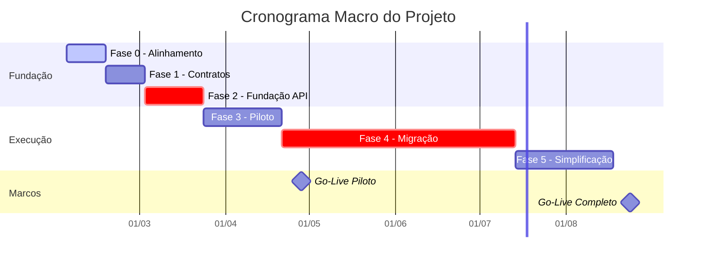

# 📄 Plano de Projeto – Modernização do Módulo Integrador do Sistema Néctar (Cooperflora)

> 📅 **Data de referência:** 13 de janeiro de 2026

---

## 📑 Índice

- [📑 Estrutura da Documentação](#-estrutura-da-documentação)
- [🎯 Acesso Rápido por Interesse](#-acesso-rápido-por-interesse)
- [📊 Resumo Executivo](#-resumo-executivo)
  - [Principais Números](#principais-números)
  - [📊 Visão Geral do Cronograma](#-visão-geral-do-cronograma)
  - [✅ Benefícios Esperados](#-benefícios-esperados)

---

## 📑 Estrutura da Documentação

Este documento está organizado em módulos para atender às necessidades de diferentes stakeholders. Utilize este guia para navegar diretamente às seções mais relevantes para sua função.

| Documento                                                            | Descrição                                                 | Público Principal | Tempo de Leitura |
| -------------------------------------------------------------------- | --------------------------------------------------------- | ----------------- | :--------------: |
| [01 - Visão Executiva](./01-visao-executiva.md)                      | Introdução, Escopo, Governança, Riscos e Critérios        | BDMs              |   ~15 minutos    |
| [02 - Fundamentos Técnicos](./02-fundamentos-tecnicos.md)            | Arquitetura, Padrões técnicos, Diretrizes de dev          | TDMs              |   ~25 minutos    |
| [03 - Execução do Projeto](./03-execucao-projeto.md)                 | Fases, Cronograma, Roadmap, Strangler Pattern             | BDMs + TDMs       |   ~20 minutos    |
| [04 - Gestão do Projeto](./04-gestao-projeto.md)                     | Stakeholders, RACI, Governança, Change Control            | BDMs + TDMs       |   ~15 minutos    |
| [05 - Riscos e Mitigações](./05-riscos-mitigacoes.md)                | RAID, Matriz de Severidade, Planos de Contingência        | BDMs + TDMs       |   ~10 minutos    |
| [06 - Premissas e Restrições](./06-premissas-restricoes.md)          | Premissas gerais, Premissas de escopo, Restrições         | BDMs + TDMs       |   ~15 minutos    |
| [07 - Investimentos](./07-investimentos.md)                          | Estimativa de horas (WBS), Custos, Cronograma de pagamento| BDMs              |   ~15 minutos    |
| [08 - Operação e Suporte](./08-operacao-suporte.md)                  | Implantação, Operação híbrida, Runbooks, Evolução futura  | TDMs              |   ~10 minutos    |
| [09 - Glossário](./09-glossario.md)                                  | Definições de termos técnicos e de negócio                | Todos             |   ~5 minutos     |

---

## 🎯 Acesso Rápido por Interesse

| Se você precisa de...                     | Vá para o documento...                                               |
| ----------------------------------------- | -------------------------------------------------------------------- |
| Entender o problema e a solução proposta  | [01 - Visão Executiva](./01-visao-executiva.md#-introdução)          |
| Saber o que será entregue                 | [01 - Visão Executiva](./01-visao-executiva.md#-escopo-do-projeto)   |
| Ver prazos e marcos                       | [03 - Execução do Projeto](./03-execucao-projeto.md)                 |
| Entender quem decide o quê                | [04 - Gestão do Projeto](./04-gestao-projeto.md)                     |
| Avaliar riscos do projeto                 | [05 - Riscos e Mitigações](./05-riscos-mitigacoes.md)                |
| Detalhes de cada fase                     | [03 - Execução do Projeto](./03-execucao-projeto.md)                 |
| Premissas e dependências                  | [06 - Premissas e Restrições](./06-premissas-restricoes.md)          |
| Como será a operação pós-implantação      | [08 - Operação e Suporte](./08-operacao-suporte.md)                  |
| **Ver estimativa de horas por atividade** | [07 - Investimentos](./07-investimentos.md)                          |
| **Ver custos e cronograma de pagamentos** | [07 - Investimentos](./07-investimentos.md#-cronograma-de-pagamento) |
| Arquitetura técnica detalhada             | [02 - Fundamentos Técnicos](./02-fundamentos-tecnicos.md)            |
| Roadmap de evolução futura                | [08 - Operação e Suporte](./08-operacao-suporte.md#-próximos-passos) |
| Definições de termos técnicos             | [09 - Glossário](./09-glossario.md)                                  |

---

## 📊 Resumo Executivo

Este projeto visa modernizar o **Módulo Integrador/Interface (Access + VBA)** utilizado pela Cooperflora para integrar com o ERP Néctar, substituindo o modelo de **acesso direto ao SQL Server** por uma **camada de serviços (API)** com contratos explícitos, segurança e observabilidade.

### Principais Números

| Métrica                | Valor                 |
| ---------------------- | --------------------- |
| **Duração Total**      | 28 semanas (~7 meses) |
| **Total de Horas**     | 1.600 horas           |
| **Investimento Total** | R$ 240.000,00         |
| **Fases**              | 6 (Fase 0 a Fase 5)   |
| **Fluxos a Migrar**    | 6 domínios de negócio |

### 📊 Visão Geral do Cronograma

---

### ✅ Benefícios Esperados

- ✅ Redução de risco operacional
- ✅ Contratos OpenAPI versionados
- ✅ Observabilidade ponta a ponta
- ✅ Segurança e controle de acesso
- ✅ Preparação para cenários cloud/segregados

---

[⬆️ Voltar ao topo](#-plano-de-projeto--modernização-do-módulo-integrador-do-sistema-néctar-cooperflora)

---

**📄 Documentação Completa**

_Plano de Projeto – Modernização do Módulo Integrador do Sistema Néctar (Cooperflora)_
_Versão 1.0 | Janeiro de 2026 | Néctar_
