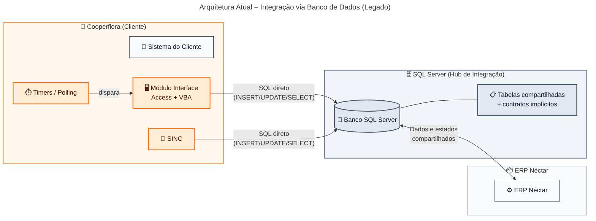
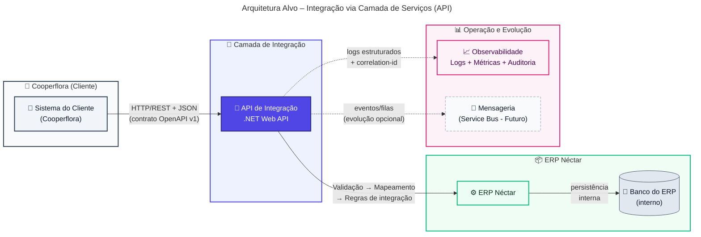
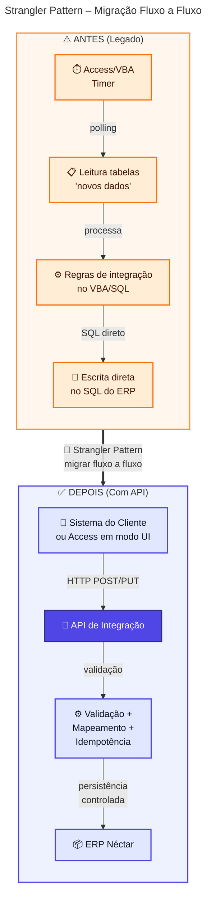
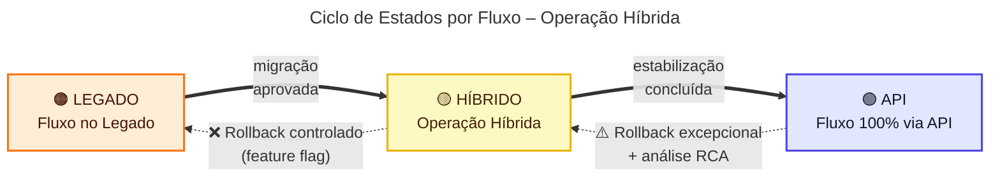
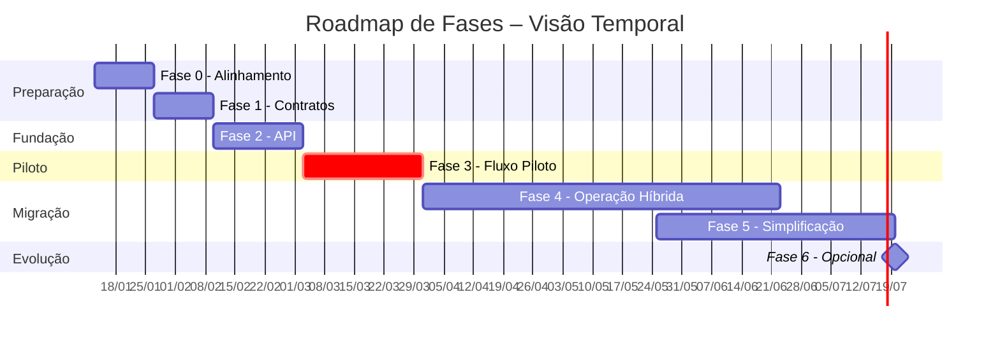

# Plano de Projeto – Modernização do Módulo Integrador do Sistema Néctar (Cooperflora)

> Data de referência: **13 de janeiro de 2026**

## Introdução

Este projeto visa modernizar o **Módulo Integrador/Interface (Access + VBA)** utilizado pela Cooperflora para integrar com o ERP Néctar, reduzindo a dependência de **acesso direto ao SQL Server** (banco como “hub” de integração). O objetivo é assegurar **continuidade operacional** e **previsibilidade** para o negócio, ao mesmo tempo em que se prepara a integração para cenários em que **não haverá banco compartilhado** e onde podem existir **restrições de rede/credenciais** e evolução para nuvem.

A modernização será conduzida de forma **incremental**, por fluxo, seguindo o **Strangler Pattern**: seleciona-se um fluxo piloto, implementa-se via API com contratos e observabilidade, e mantém-se convivência controlada com o legado até estabilização. Essa estratégia reduz risco de transição, melhora governança (definição de dono do dado, versionamento e critérios de aceite) e aumenta a capacidade de resposta a mudanças sem impacto desproporcional em operação e suporte.

Ao final, espera-se uma integração com **contratos explícitos** (OpenAPI), **segurança e controle de acesso**, e **rastreabilidade de ponta a ponta** (logs estruturados, métricas e auditoria por transação). Para BDMs, isso se traduz em menor risco operacional, menor custo de incidentes e maior agilidade para habilitar novos fluxos e evoluções; para TDMs, em uma base técnica governável e sustentável para evolução contínua.

### Objetivo

Este documento consolida o **plano de projeto** para modernização do Módulo Integrador/Interface da Cooperflora, orientando a transição de uma integração baseada em **banco de dados como interface** para uma **camada de serviços (API)**. Ele estrutura o **porquê** (necessidade e urgência), o **o quê** (escopo e entregáveis) e o **como** (estratégia incremental, cronograma, governança e mitigação de riscos).

| Stakeholder                          | O que este documento oferece                                                                         |
| ------------------------------------ | ---------------------------------------------------------------------------------------------------- |
| **BDMs** (Business Decision Makers)  | Visão de valor, riscos de negócio, investimento, critérios de sucesso e impacto em operações         |
| **TDMs** (Technical Decision Makers) | Direcionadores técnicos, arquitetura, contratos, segurança, observabilidade e convivência com legado |

O documento serve como **referência de acompanhamento**, com critérios de aceite e pontos de controle para garantir previsibilidade durante a execução.

### Situação atual e motivação

Hoje, a integração entre o sistema da Cooperflora e o ERP Néctar depende de **co-localização** e de **acesso direto ao SQL Server**, que acaba operando como “hub” de integração. O módulo legado (Access + VBA) e rotinas auxiliares (SINC) leem e escrevem diretamente em tabelas do ERP, usando estados e convenções para orquestrar fluxos.

Embora viável no cenário atual, esse modelo cria dependências difíceis de governar: o banco vira a “interface” e os contratos passam a ser definidos pelo schema e por comportamento histórico. Para o negócio, isso se traduz em **maior risco operacional** (incidentes quando há mudanças de estrutura/infra), **custo de suporte elevado** e **baixa previsibilidade** em homologação e evolução, pois faltam contratos versionados e rastreabilidade por transação.

Além disso, o cenário futuro **não prevê banco compartilhado** nem acesso direto entre ambientes, o que torna a abordagem atual um bloqueio para evolução (segregação de rede/credenciais e eventual nuvem). A motivação central é migrar para uma **camada de serviços** com contratos explícitos, controle de acesso e observabilidade, permitindo modernização **fluxo a fluxo** com risco controlado e operação contínua.

| Aspecto da Situação Atual (resumo executivo)                            | Descrição Detalhada                                                                                                                                                                                                                                                                                                                                                                               | Impacto (negócio)                                                                                                                                                                                | Objetivo (negócio e técnico)                                                                                                                                                                        |
| ----------------------------------------------------------------------- | ------------------------------------------------------------------------------------------------------------------------------------------------------------------------------------------------------------------------------------------------------------------------------------------------------------------------------------------------------------------------------------------------- | ------------------------------------------------------------------------------------------------------------------------------------------------------------------------------------------------ | --------------------------------------------------------------------------------------------------------------------------------------------------------------------------------------------------- |
| Integração acoplada ao banco do ERP (SQL Server como “hub”)             | A integração ocorre por **acesso direto às tabelas** do banco do ERP, com leituras/escritas que funcionam porque os sistemas estão no mesmo servidor e o SQL Server atua como camada de integração.  Na prática, o banco de dados vira um barramento: o módulo Access/VBA e/ou o SINC operam sobre tabelas compartilhadas e estados de processamento, sem uma camada explícita de serviços. | Aumenta risco de indisponibilidade e incidentes em mudanças (schema/infra), eleva custo de suporte e dificulta escalar/segregar ambientes; limita decisões de arquitetura e iniciativas futuras. | Substituir o “hub” no banco por uma camada de serviços (API) com controle de acesso e governança, reduzindo dependência de co-localização e viabilizando o cenário sem banco compartilhado.         |
| Contratos de integração implícitos (regras “de fato”, não formalizadas) | Dados e estados de integração são representados por tabelas e colunas cuja semântica é conhecida “por tradição” e por comportamento do código legado, não por contratos formais versionados.  O comportamento depende de detalhes de schema e de convenções de preenchimento, frequentemente sem documentação suficiente e com alto risco de regressões.                                    | Homologação mais lenta e imprevisível, maior chance de retrabalho e regressões, divergência de entendimento entre áreas e aumento de incidentes em mudanças.                                     | Formalizar contratos e padrões (ex.: OpenAPI, versionamento e erros), reduzindo ambiguidades e permitindo evolução controlada por versão/fluxo.                                                     |
| Orquestração por timers/polling                                         | O módulo Access/VBA executa rotinas por **timers**, que varrem dados “novos”, aplicam regras e persistem resultados, com janela de tempo como mecanismo de orquestração.  Esse padrão tende a gerar concorrência, duplicidades e dependência de intervalos de execução, além de dificultar rastreio de causa raiz.                                                                          | Gera atrasos variáveis, duplicidades e janelas operacionais difíceis de gerenciar; aumenta impacto de falhas silenciosas e dificulta cumprir SLAs por fluxo.                                     | Migrar gradualmente para integrações orientadas a transação/serviço, reduzindo polling e estabelecendo controles (idempotência, reprocessamento) com previsibilidade operacional.                   |
| Regras críticas no legado (VBA/rotinas de tela)                         | Parte relevante da lógica de integração e validações está implementada em eventos de formulários e rotinas VBA, misturando UI, regras e integração em um único lugar.  Isso cria um monólito difícil de testar e evoluir, com maior chance de efeitos colaterais e dependência de especialistas no legado.                                                                                  | Eleva custo e risco de mudanças, cria dependência de conhecimento específico, dificulta escalabilidade do time e aumenta probabilidade de regressões em produção.                                | Centralizar regras de integração em serviços testáveis e governáveis, reduzindo acoplamento com a UI e melhorando capacidade de evolução com segurança.                                             |
| Governança de dados pouco definida (source of truth)                    | Não há uma matriz formal de “quem é dono” (source of truth) de cada dado/domínio, o que dificulta decisões sobre direção do fluxo e tratamentos de conflito.  Na prática, as rotinas podem realizar dual-write ou assumir precedência baseada em convenções não documentadas.                                                                                                               | Aumenta inconsistências e conciliações manuais, gera conflitos entre sistemas e amplia risco operacional e de auditoria durante operação híbrida.                                                | Definir propriedade e direção do fluxo por domínio, com critérios claros de resolução de conflitos, suportando migração por fluxo com menor risco.                                                  |
| Baixa visibilidade operacional (observabilidade e rastreabilidade)      | Falhas podem ser percebidas tardiamente, e o rastreio depende de logs esparsos, estados em tabelas ou investigação manual no banco/Access.  A ausência de correlação de transações torna difícil identificar o que foi recebido, processado, rejeitado, reprocessado ou duplicado.                                                                                                          | Aumenta MTTR e impacto de incidentes, reduz transparência para gestão e suporte, dificulta governança e tomada de decisão baseada em dados.                                                      | Implementar observabilidade (logs estruturados, métricas, auditoria e correlação por transação), com dashboards/alertas por fluxo para operação e governança.                                       |
| Modelo limita evolução para ambientes segregados/nuvem                  | A arquitetura atual depende de proximidade física e acesso ao SQL Server; se houver isolamento de rede, segregação de credenciais ou nuvem, a integração pode simplesmente não funcionar.  Além disso, o legado tem limitações tecnológicas e custos crescentes de manutenção.                                                                                                              | Bloqueia iniciativas de modernização/segregação, aumenta risco de ruptura em mudanças de infraestrutura e reduz flexibilidade para novas integrações e expansão.                                 | Preparar a integração para operar com segurança em cenários segregados/nuvem, preservando continuidade do negócio e abrindo caminho para evoluções futuras (incl. mensageria quando fizer sentido). |

### Escopo do Projeto

Esta seção define a **Declaração de Escopo** do projeto (referência PMBOK): descreve o que será entregue, os limites do trabalho e o que será considerado sucesso. Ela funciona como **baseline** para planejamento e controle — orienta cronograma, custos, governança e critérios de aceite, e reduz ambiguidades durante a execução.

Os itens listados na tabela a seguir representam os **entregáveis e capacidades em escopo** para modernização do Módulo Integrador/Interface, incluindo a transição do modelo “banco como integração” para uma camada de serviços, com contratos, segurança, observabilidade e operação híbrida. Em outras palavras: o que está descrito aqui é aquilo que o projeto se compromete a implementar, dentro das premissas e restrições do contexto (legado em produção, migração incremental por fluxo e continuidade operacional).

Regra de governança do escopo: **tudo o que não estiver descrito nesta seção é automaticamente considerado fora de escopo**. Isso inclui, por padrão, qualquer iniciativa adicional não explicitada (ex.: reimplementar o ERP, substituir o sistema do cliente, mudanças amplas de infraestrutura não necessárias ao integrador, ou novos fluxos/funcionalidades não listados), mesmo que correlata ao tema. Essa regra evita "scope creep" e preserva previsibilidade de prazo e investimento.

Qualquer necessidade nova ou ajuste relevante deve seguir **controle de mudanças**: registrar a solicitação, avaliar impacto (prazo/custo/risco/arquitetura/operação), obter aprovação e, somente então, atualizar esta seção (baseline) e os planos associados.

| Item de Escopo                                           | Descrição Detalhada                                                                                                                                                                                                                                                                                                                                                                                                                                                                                                                                     | Benefícios Esperados                                                                                                                      |
| -------------------------------------------------------- | ------------------------------------------------------------------------------------------------------------------------------------------------------------------------------------------------------------------------------------------------------------------------------------------------------------------------------------------------------------------------------------------------------------------------------------------------------------------------------------------------------------------------------------------------------- | ----------------------------------------------------------------------------------------------------------------------------------------- |
| API de Integração (.NET Web API) — fundação técnica      | Implementar a **camada intermediária** responsável por expor endpoints/consumers e centralizar a lógica de integração.  Inclui (mínimo): estrutura de solução e arquitetura (camadas/limites), validação de entrada, padronização de erros, resiliência (timeouts/retries controlados), health checks, logging estruturado e correlação por transação (correlation-id).  Integração com o ERP via componentes definidos (ex.: chamadas ao ERP e/ou acesso ao SQL Server do ERP quando aplicável), sem expor o banco como interface externa. | Reduz dependência de co-localização e do banco como “hub”, elevando governança e previsibilidade.                                         |
| Contratos OpenAPI — governança e versionamento           | Definir contratos por domínio/fluxo (ex.: pessoas, produtos, pedidos), com **OpenAPI/Swagger** como fonte de verdade.  Inclui: modelagem de payloads, validações, códigos de retorno, taxonomia de erros, regras de breaking change, estratégia de versionamento (ex.: `/v1`, `/v2`) e requisitos mínimos por fluxo (idempotência, limites e SLAs alvo quando aplicável).  Artefatos gerados: especificação OpenAPI versionada e checklist de conformidade por endpoint (DoD de contrato).                                                  | Reduz ambiguidades, acelera homologação e viabiliza evolução controlada por versão.                                                       |
| Fluxo piloto end-to-end — “Cadastro de Pessoas”          | Selecionar e implementar um fluxo piloto de alto valor e risco controlado, com execução completa via API.  Inclui: mapeamento do fluxo no legado (VBA/SQL/SINC), contrato OpenAPI, validações, idempotência, instrumentação (logs/métricas/auditoria), testes (unitário/integração/E2E quando aplicável), e plano de estabilização em produção (janela, métricas de sucesso, rollback).  Resultado esperado: blueprint repetível para os demais fluxos.                                                                                     | Entrega valor cedo com risco controlado, provando padrões e acelerando a migração por ondas.                                              |
| Operação híbrida por fluxo — roteamento e rollback       | Definir e implementar convivência **por fluxo** (Legado/Híbrido/API), com roteamento explícito e governado.  Inclui: feature flags por fluxo, critérios de cutover, procedimentos de fallback/rollback, trilha de decisão (quem aprova e quando), e observabilidade comparativa (legado vs API) para detectar desvios.  Premissa operacional: evitar dual-write e reduzir conflitos com regras claras de propriedade do dado por domínio.                                                                                                   | Mantém continuidade do negócio durante a transição e reduz custo de incidentes em mudanças.                                               |
| Descomissionamento de timers/polling e acessos diretos   | Reduzir progressivamente timers do Access/VBA e rotinas que leem/escrevem direto no SQL do ERP.  Inclui: inventário e classificação de timers, substituição por chamadas transacionais via API, definição de controles (idempotência/reprocessamento), e roadmap de desligamento com critérios de aceite por fluxo.  Durante transição, timers remanescentes devem ser tratados como temporários e monitorados (alertas/telemetria).                                                                                                        | Reduz atrasos variáveis, duplicidades e fragilidade por concorrência; aumenta previsibilidade operacional.                                |
| Observabilidade e auditoria por transação                | Implementar capacidade de operação e diagnóstico por fluxo: logs estruturados, métricas (latência, taxa de erro, volume), auditoria por transação e correlação ponta a ponta (correlation-id propagado).  Inclui: dashboards e alertas operacionais, trilha de reprocessamento e evidências para suporte/auditoria, com visão por ambiente e criticidade.  Objetivo técnico: reduzir investigação manual em banco/Access e tornar falhas detectáveis rapidamente.                                                                           | Reduz MTTR, melhora governança e dá transparência para gestão e operação.                                                                 |
| Segurança da API — autenticação, autorização e hardening | Definir e implementar autenticação/autorização para consumo da API e padrões de segurança operacional.  Inclui: mecanismo de auth (ex.: OAuth2, API Key, mTLS conforme restrição), segregação de ambientes/segredos, validação de payload, rate limiting e práticas de hardening de endpoints.  Também inclui padrões mínimos de acesso a dados internos (princípio do menor privilégio) para reduzir risco de exposição.                                                                                                                   | Reduz risco de exposição e substitui o “acesso ao banco” como mecanismo de integração; habilita cenários com rede/credenciais segregadas. |
| Preparação para evolução event-driven (opcional)         | Planejar (sem implantar obrigatoriamente) a evolução para assíncrono onde fizer sentido.  Inclui: modelagem de eventos por domínio, critérios para quando usar síncrono vs assíncrono, desenho de padrões (retry, DLQ, idempotência, ordenação), e requisitos para adoção futura de fila (ex.: Service Bus).  Entregável: guideline técnico e backlog priorizado para evolução, sem desviar do foco do MVP (API + fluxos críticos).                                                                                                         | Evita “becos sem saída” arquiteturais e preserva foco no essencial, mantendo caminho claro para evoluções futuras.                        |

#### Escopo por domínio de negócio

A tabela acima detalha os entregáveis técnicos. Abaixo, a mesma visão é organizada por **domínio de negócio**, facilitando o entendimento dos stakeholders sobre quais áreas serão impactadas e em qual sequência.

| Domínio                     | Fluxos em Escopo                                                 | Valor de Negócio                                                                                                            | Prioridade Sugerida    |
| --------------------------- | ---------------------------------------------------------------- | --------------------------------------------------------------------------------------------------------------------------- | ---------------------- |
| **Fundação de Plataforma**  | API de Integração, Contratos OpenAPI, Observabilidade, Segurança | Habilita todos os demais fluxos; sem fundação, não há migração                                                              | Alta (Fase 1–2)        |
| **Cadastros (Master Data)** | Pessoas (piloto), Produtos, Tabelas auxiliares                   | Aumenta previsibilidade e reduz incidentes cadastrais; ideal para validar padrões sem afetar transações de alta criticidade | Alta (Fase 3–4)        |
| **Comercial**               | Pedidos e movimentos                                             | Melhora rastreio operacional e reduz retrabalho; exige governança de consistência (correlation-id, auditoria)               | Média (Fase 4)         |
| **Fiscal/Faturamento**      | Faturamento, notas fiscais                                       | Reduz risco de falhas silenciosas; recomendado após consolidação do padrão nos cadastros                                    | Média-Baixa (Fase 4–5) |
| **Operação e Governança**   | Runbooks, dashboards, alertas, gestão de mudanças                | Garante continuidade e capacidade de suporte durante operação híbrida                                                       | Contínuo               |

#### Fora do escopo

Delimitar explicitamente o que está **fora do escopo** é uma boa prática de gestão de projetos (PMBOK, Change Control). Isso evita "scope creep", mantém o projeto gerenciável e preserva foco na modernização incremental com entregas verificáveis.

| Item fora do escopo                                  | Justificativa                                                                                                         |
| ---------------------------------------------------- | --------------------------------------------------------------------------------------------------------------------- |
| Reescrita completa do ERP Néctar                     | Programa maior e não necessário para remover o acoplamento de integração                                              |
| Reescrita completa do sistema do cliente             | O projeto foca no integrador; mudanças no cliente serão restritas ao necessário para consumir a API                   |
| Migração completa para arquitetura event-driven      | A Fase 6 prevê evolução opcional; o objetivo principal é remover o banco como camada de integração                    |
| Projeto integral de migração para Nimbus             | O escopo contempla preparação arquitetural e roadmap, não a migração completa                                         |
| Mudanças funcionais profundas no processo de negócio | O foco é modernização técnica e redução de risco, mantendo comportamento funcional compatível                         |
| Novas integrações não listadas                       | Qualquer fluxo não explicitado na tabela de entregáveis deve passar por controle de mudanças antes de ser incorporado |

## Visão Geral da Arquitetura Atual e Alvo

### Arquitetura atual

A Cooperflora utiliza um **Módulo Integrador/Interface (Access + VBA)**, com apoio do componente **SINC**, operando com forte dependência do **SQL Server** do ERP como ambiente de integração. Na prática, a integração é implementada como **acesso direto a tabelas** (leitura e escrita), com o banco assumindo o papel de “barramento” através de tabelas compartilhadas, flags/status e convenções que representam estados do processo.

O modelo é sustentado por **timers/polling**: rotinas periódicas varrem registros “novos”, aplicam validações/regras e persistem resultados no banco do ERP, em geral sem uma fronteira de serviço explícita. Do ponto de vista técnico, isso aumenta o acoplamento ao schema e cria dependência de comportamentos históricos (contratos implícitos), além de dificultar isolamento de responsabilidades entre UI/legado, regras de integração e persistência.

Essa topologia funciona sobretudo por **co-localização** (mesmo servidor ou rede com acesso amplo) e por credenciais/acessos permissivos ao SQL Server. Em cenários com segregação de rede, credenciais e ambientes (ou evolução para nuvem), o padrão tende a falhar ou exigir exceções arquiteturais, elevando risco operacional e complexidade de manutenção.

### Visão geral comparativa

| Dimensão                                    | Arquitetura Atual                                                                                                                     | Arquitetura Alvo                                                                                                                   | Benefícios esperados                                                                                                                                        |
| ------------------------------------------- | ------------------------------------------------------------------------------------------------------------------------------------- | ---------------------------------------------------------------------------------------------------------------------------------- | ----------------------------------------------------------------------------------------------------------------------------------------------------------- |
| Fronteira de integração e acoplamento       | Banco como interface: dependência direta de schema/tabelas, co-localização e credenciais; mudanças de banco/infra afetam integrações. | API como fronteira: contratos e gateways definidos; banco do ERP permanece interno ao ERP (não é interface externa).               | Reduz acoplamento e risco de ruptura; substitui o "hub" no banco por camada de serviços; habilita operação em cenários segregados/nuvem.                    |
| Mecanismo de execução e orquestração        | Timers/polling no Access/VBA; varredura de "novos" registros; concorrência/duplicidade dependem de convenções e estados em tabelas.   | Integração transacional via REST/JSON; orquestração explícita na API; evolução opcional para assíncrono quando houver ganho claro. | Elimina polling/timers; melhora previsibilidade de execução; controle explícito de concorrência e reprocessamento.                                          |
| Contratos e versionamento                   | Contratos implícitos (colunas/flags/convenções); sem versionamento formal; alto risco de regressão em alterações.                     | OpenAPI como fonte de verdade; versionamento semântico (ex.: `/v1`); taxonomia de erros e validações padronizadas.                 | Elimina ambiguidades e "efeitos colaterais"; habilita testes de contrato automatizados e compatibilidade planejada entre versões.                           |
| Observabilidade e rastreabilidade           | Baixa: rastreio por investigação em Access/SQL, logs esparsos e estados em tabelas; correlação entre etapas é limitada.               | Logs estruturados, correlation-id ponta a ponta, métricas por endpoint/fluxo, dashboards/alertas e auditoria por transação.        | Reduz MTTR; diagnóstico end-to-end via correlation-id; governança operacional com métricas, alertas e trilha de auditoria.                                  |
| Resiliência, idempotência e reprocessamento | Tratamento de falhas "informal": retries manuais/rotinas; risco de duplicidade e inconsistência em reprocessos.                       | Timeouts/retries controlados, idempotência por chave, políticas de erro padronizadas e trilha de reprocessamento auditável.        | Elimina duplicidades e inconsistências; aumenta robustez frente a falhas de rede/ERP; reprocessamento seguro e auditável.                                   |
| Evolução e governança de mudança            | Evolução lenta e arriscada; dependência de especialistas no legado; mudanças no banco podem quebrar integrações sem sinalização.      | Migração incremental (strangler) por fluxo; feature flags e rollback; governança de contrato/escopo e padrões repetíveis.          | Acelera evolução com risco controlado; reduz dependência do legado; centraliza regras em serviços governáveis; viabiliza migração incremental com rollback. |

### Arquitetura alvo

A arquitetura alvo introduz uma **API de Integração (.NET Web API)** como fronteira explícita entre o sistema da Cooperflora e o ERP Néctar, eliminando o banco como mecanismo de integração. O cliente passa a integrar por **HTTP/REST + JSON**, e a API concentra responsabilidades de integração: validação, normalização/mapeamento, aplicação de regras de integração, orquestração e persistência através de mecanismos internos (ex.: chamadas ao ERP e/ou acesso ao SQL do ERP quando aplicável), sem expor o banco como interface.

Do ponto de vista de engenharia, a API estabelece padrões essenciais: **contratos OpenAPI** versionados, taxonomia de erros, idempotência por chave, e controles de resiliência (timeouts/retries), reduzindo duplicidades e inconsistências em reprocessamentos. A convivência com o legado é suportada por operação híbrida por fluxo (feature flags/roteamento), permitindo migração incremental com rollback controlado.

Como requisito operacional, a arquitetura alvo incorpora **observabilidade** (logs estruturados, métricas, auditoria e correlation-id) e prepara o caminho para evolução assíncrona (ex.: fila/eventos) onde houver ganho claro, mantendo o princípio central: **a integração não depende de acesso direto ao banco do ERP** e pode operar em cenários segregados/nuvem.

### Princípios arquiteturais

Os princípios abaixo orientam as decisões técnicas do projeto, organizados conforme o modelo **BDAT** (Business, Data, Application, Technology) do framework TOGAF. Cada princípio inclui a razão de negócio (BDM) e as implicações técnicas (TDM).

#### Princípios de Negócio (Business)

| Princípio                    | Descrição                                                           | Implicação para BDMs                                    | Implicação para TDMs                                     |
| ---------------------------- | ------------------------------------------------------------------- | ------------------------------------------------------- | -------------------------------------------------------- |
| **Continuidade operacional** | A integração deve funcionar sem interrupções durante a modernização | Operações não param; risco de transição mitigado        | Operação híbrida por fluxo; rollback controlado          |
| **Evolução incremental**     | Migração fluxo a fluxo (Strangler Pattern), sem "big bang"          | Entregas frequentes; valor demonstrado progressivamente | Feature flags; convivência legado/API por fluxo          |
| **Governança de mudanças**   | Mudanças seguem controle formal com critérios de aceite             | Previsibilidade de prazo/custo; escopo protegido        | Versionamento de contratos; breaking changes controlados |

#### Princípios de Dados (Data)

| Princípio                          | Descrição                                                | Implicação para BDMs                        | Implicação para TDMs                              |
| ---------------------------------- | -------------------------------------------------------- | ------------------------------------------- | ------------------------------------------------- |
| **Source of truth definido**       | Cada domínio tem um dono claro (quem é fonte de verdade) | Reduz conflitos e conciliações manuais      | Direção de fluxo explícita; sem dual-write        |
| **Contratos explícitos (OpenAPI)** | Payloads, erros e versões documentados formalmente       | Homologação mais rápida; menos ambiguidades | OpenAPI como fonte de verdade; testes de contrato |
| **Rastreabilidade por transação**  | Toda operação é rastreável ponta a ponta                 | Auditoria facilitada; diagnóstico rápido    | Correlation-id propagado; logs estruturados       |

#### Princípios de Aplicação (Application)

| Princípio                                       | Descrição                                       | Implicação para BDMs                         | Implicação para TDMs                               |
| ----------------------------------------------- | ----------------------------------------------- | -------------------------------------------- | -------------------------------------------------- |
| **Desacoplamento (sem acesso direto ao banco)** | Sistema do cliente não depende do schema do ERP | Mudanças no ERP não quebram integrações      | API como fronteira; banco interno ao ERP           |
| **Separação de responsabilidades**              | UI, regras de integração e domínio separados    | Menor dependência de especialistas no legado | Lógica em serviços testáveis; legado reduzido a UI |
| **Idempotência e resiliência**                  | Reprocessamentos não corrompem dados            | Menos incidentes por duplicidade             | Chaves de idempotência; retries controlados        |

#### Princípios de Tecnologia (Technology)

| Princípio                            | Descrição                                            | Implicação para BDMs                         | Implicação para TDMs                            |
| ------------------------------------ | ---------------------------------------------------- | -------------------------------------------- | ----------------------------------------------- |
| **Observabilidade como requisito**   | Tudo que integra deve ser monitorável e auditável    | Visibilidade operacional; MTTR reduzido      | Logs estruturados; métricas; dashboards/alertas |
| **Segurança por design**             | Autenticação, autorização e hardening desde o início | Redução de risco de exposição                | OAuth2/API Key/mTLS; TLS; rate limiting         |
| **Preparação para nuvem/segregação** | Integração funciona sem co-localização de banco      | Habilita iniciativas futuras de modernização | API REST/JSON; sem dependência de rede local    |

## Abordagem de Modernização

A estratégia adotada é **Strangler Pattern**, com extração gradual da lógica de integração do legado e introdução de uma camada de serviço moderna.

### Estratégia (visão geral)

1. **Mapear fluxos e dependências** no Access/VBA/SINC e no SQL.
2. **Definir contratos explícitos** (OpenAPI) por fluxo.
3. **Implementar o fluxo na API**, com validação, idempotência, logging e auditoria.
4. **Roteamento híbrido**: o legado passa a chamar a API (ou o cliente chama diretamente), mantendo fallback controlado.
5. **Desativação progressiva**: timers e integrações diretas daquele fluxo são desligados.
6. **Repetir** para o próximo fluxo, preservando padrões, automação e governança.

### Migração por fluxo (antes/depois)

### Operação híbrida (convivência controlada)

- A convivência é por **fluxo**, não por “meio sistema”. Cada fluxo tem um estado: _Legado_, _Híbrido_, _API_.
- A troca de estado exige checklist (contrato, testes, observabilidade, rollback) e janela de estabilização.

### Estratégias de rollback e mitigação em produção

- **Feature flags por fluxo** e roteamento configurável.
- **Janela de estabilização** (ex.: 2 semanas) com monitoramento reforçado.
- **Reprocessamento**: mecanismos de reenvio/replay com idempotência.
- **Plano de comunicação**: avisos e critérios de acionamento de rollback.

## Fases do Projeto e Cronograma Macro

Esta seção apresenta o **roadmap de execução** do projeto, organizado em 7 fases (Fase 0 a Fase 6), com cronograma estimado, marcos de decisão e critérios de aceite. A estrutura foi desenhada para dar visibilidade a **BDMs** (valor entregue, riscos de negócio, pontos de decisão) e **TDMs** (dependências técnicas, entregáveis, critérios de qualidade).

### Visão executiva do roadmap

| Fase | Nome                    | Duração Estimada | Marco de Negócio (BDM)                                 | Marco Técnico (TDM)                                    |
| ---- | ----------------------- | ---------------- | ------------------------------------------------------ | ------------------------------------------------------ |
| 0    | Alinhamento e contenção | 1–2 semanas      | Acordo sobre escopo, riscos mapeados                   | Inventário técnico completo, backlog priorizado        |
| 1    | Definição de contratos  | 1–2 semanas      | Contratos aprovados, governança definida               | OpenAPI v1, padrões de integração documentados         |
| 2    | Fundação da API         | 2–3 semanas      | Infraestrutura pronta para piloto                      | API em DEV/HML, pipeline CI/CD, observabilidade básica |
| 3    | Fluxo piloto            | 2–4 semanas      | **Primeiro fluxo em produção**, valor demonstrado      | Piloto estável, padrões validados, lições aprendidas   |
| 4    | Migração por fluxo      | 1–3 meses        | Fluxos críticos migrados, redução de risco operacional | Timers desativados, operação híbrida governada         |
| 5    | Simplificação do legado | 1–2 meses        | Custo de manutenção reduzido, legado estável           | Rotinas de integração removidas, documentação final    |
| 6    | Evolução opcional       | Contínuo         | Novas capacidades habilitadas (quando justificado)     | Mensageria, eventos, preparação para Nimbus            |

### Cronograma macro (referência por semanas)

> **Nota para BDMs**: O cronograma abaixo é uma estimativa baseada em premissas iniciais. Ajustes serão propostos conforme descobertas na Fase 0 e validados em governança antes de impactar prazos/investimento.

> **Nota para TDMs**: As dependências indicam sequência mínima. Algumas atividades podem ser paralelizadas (ex.: setup de infra durante Fase 1), desde que não comprometam qualidade ou criem débito técnico.

| Janela (semanas) | Fase   | Dependências  | Gate de Decisão                                                  |
| ---------------: | ------ | ------------- | ---------------------------------------------------------------- |
|              1–2 | Fase 0 | —             | **Go/No-Go**: escopo validado, riscos aceitáveis                 |
|              3–4 | Fase 1 | Fase 0        | **Aprovação**: contratos e governança de mudanças                |
|              5–7 | Fase 2 | Fase 1        | **Checkpoint**: infra pronta, smoke test OK                      |
|             8–11 | Fase 3 | Fase 2        | **Go-Live Piloto**: critérios de estabilização atingidos         |
|            12–24 | Fase 4 | Fase 3        | **Checkpoints por onda**: cada domínio migrado tem aceite formal |
|            20–28 | Fase 5 | Fase 4 (80%+) | **Aceite final**: legado simplificado, operação estável          |
|         Contínuo | Fase 6 | Fase 4/5      | **Por demanda**: aprovação de ROI/valor antes de cada iniciativa |

---

### Fase 0 – Alinhamento e contenção de riscos (1–2 semanas)

| Aspecto       | Descrição                                                                                        |
| ------------- | ------------------------------------------------------------------------------------------------ |
| **Objetivo**  | Criar base de governança, reduzir riscos imediatos e mapear integralmente dependências do legado |
| **Valor BDM** | Visibilidade de riscos e escopo; decisão informada sobre investimento e prioridades              |
| **Valor TDM** | Inventário técnico completo; base para estimativas e arquitetura                                 |

**Principais atividades**

| Atividade                                              | Responsável         | Entregável                        |
| ------------------------------------------------------ | ------------------- | --------------------------------- |
| Inventário técnico do módulo Access/VBA e rotinas SINC | TDM (Néctar)        | Documento de inventário           |
| Mapeamento de pontos de integração                     | TDM (Néctar)        | Diagrama de fluxos e dependências |
| Matriz de propriedade de dados (source of truth)       | BDM + TDM           | Matriz aprovada por domínio       |
| Requisitos não funcionais e restrições                 | TDM (Néctar + Coop) | Lista de requisitos e restrições  |
| Priorização de fluxos para migração                    | BDM (Cooperflora)   | Backlog priorizado                |

**Critérios de aceite (Exit Criteria)**

| Critério                                             | Validador            |
| ---------------------------------------------------- | -------------------- |
| Fluxos e dependências mapeados e validados           | Cooperflora + Néctar |
| Matriz de propriedade de dados aprovada              | BDM (Cooperflora)    |
| Backlog priorizado com critérios do piloto definidos | BDM + TDM            |
| Riscos documentados com plano de mitigação           | TDM (Néctar)         |

**Riscos e mitigação**

| Risco                                    | Probabilidade | Impacto | Mitigação                                              |
| ---------------------------------------- | ------------- | ------- | ------------------------------------------------------ |
| Dependências ocultas no VBA/SQL          | Alta          | Alto    | Sessões de engenharia reversa + validação com operação |
| Escopo difuso ou expansão não controlada | Média         | Alto    | Baseline de escopo formal + controle de mudanças       |

### Fase 1 – Definição dos contratos de integração (1–2 semanas)

**Objetivo**

- Transformar integrações implícitas em contratos explícitos e governáveis.

**Principais atividades**

- Definir endpoints e modelos (DTOs) por fluxo.
- Padronizar erros (códigos, mensagens, campos) e versionamento.
- Definir idempotência (chaves e comportamento) por fluxo.
- Definir autenticação/autorização e requisitos de segurança.

**Entregáveis**

- OpenAPI v1 (contratos iniciais) + guidelines de versionamento.
- Guia de padrões de integração (erros, idempotência, headers, correlação).

**Exit Criteria**

- Contratos aprovados por Néctar e Cooperflora para o piloto.
- Plano de testes de contrato definido (mínimo) para o piloto.

**Riscos e mitigação**

- Contratos mal definidos → workshops com exemplos reais do legado e validação com dados amostrados.
- Mudanças frequentes → governança de breaking changes e compatibilidade.

### Fase 2 – Fundação da API (2–3 semanas)

**Objetivo**

- Disponibilizar a infraestrutura e o esqueleto técnico da API com padrões operacionais.

**Principais atividades**

- Estrutura de solução (camadas), DI, validação, logging estruturado.
- Health checks, métricas, correlação e rastreabilidade.
- Conectividade segura com o ERP e ambientes (DEV/HML/PRD).
- Pipeline CI/CD e padrões de configuração/segredos.

**Entregáveis**

- API em DEV/HML com documentação Swagger.
- Padrões de logs/métricas e dashboards iniciais.

**Exit Criteria**

- API pronta para implementar o piloto com observabilidade mínima.
- Pipeline e ambientes validados com uma chamada de ponta a ponta (smoke test).

**Riscos e mitigação**

- Atraso em ambientes/infra → planejar setup em paralelo com Fase 1.
- Falhas de conectividade → testes antecipados e alinhamento de rede/segurança.

### Fase 3 – Fluxo Piloto (2–4 semanas)

**Objetivo**

- Implementar o primeiro fluxo via API em produção, com governança, rollback e aprendizado.

**Principais atividades**

- Seleção do fluxo (recomendado: **Pessoas**) e definição de critérios de sucesso.
- Implementação do fluxo na API (validação, idempotência, auditoria).
- Ajustes no legado para convivência (quando necessário) e desligamento controlado do timer do fluxo.
- Homologação e entrada em produção com janela de estabilização.

**Entregáveis**

- Fluxo piloto em produção via API.
- Runbook do fluxo e alertas/dashboards.
- Relatório de lições aprendidas e ajustes de padrão.

**Exit Criteria**

- Estabilização com indicadores aceitáveis (erro/latência/incidentes) por período acordado.
- Processo de rollback testado (ao menos em ambiente de homologação).

**Riscos e mitigação**

- Incidentes no piloto → rollout progressivo, feature flags e rollback rápido.
- Divergência de dados → auditoria por transação e reprocessamento idempotente.

### Fase 4 – Operação híbrida (1–3 meses)

**Objetivo**

- Escalar migração fluxo a fluxo, mantendo operação contínua e reduzindo progressivamente o legado.

**Principais atividades**

- Migração por domínio com backlog priorizado (cadastros → transacionais).
- Eliminação gradual de timers e integrações diretas por fluxo.
- Fortalecimento de observabilidade e procedimentos de reprocessamento.
- Gestão de mudanças e comunicação por lote de migrações.

**Entregáveis**

- Fluxos críticos migrados.
- Matriz de fluxos (status: legado/híbrido/API) atualizada.

**Exit Criteria**

- Principais fluxos em API e timers relevantes desativados.
- Operação com suporte e governança estabelecidos.

**Riscos e mitigação**

- Volume/complexidade do legado → decomposição do backlog e buffers.
- Fadiga operacional → cadência de migração com janelas e comunicação.

### Fase 5 – Simplificação do legado (1–2 meses)

**Objetivo**

- Reduzir o módulo Access/VBA ao mínimo necessário, removendo responsabilidades de integração e diminuindo custo de manutenção.

**Principais atividades**

- Remoção de formulários/rotinas de integração obsoletas.
- Refatoração do VBA remanescente e documentação mínima.
- Ajustes finais de operação (runbooks, dashboards, alertas).

**Entregáveis**

- Legado simplificado e estável.
- Documentação operacional final.

**Exit Criteria**

- Legado não executa integrações críticas.
- Suporte tem visibilidade e procedimentos claros.

**Riscos e mitigação**

- Dependências remanescentes → checklist por fluxo antes de remover rotinas.

### Fase 6 – Evolução opcional (contínuo)

**Objetivo**

- Evoluir integração para suportar novos requisitos e maior desacoplamento, conforme necessidade.

**Principais atividades**

- Introdução de mensageria (ex.: Service Bus) em cenários adequados.
- Modelagem de eventos e padrões de consistência.
- Preparação para iniciativas futuras (ex.: Nimbus).

**Entregáveis**

- Roadmap evolutivo e protótipos (quando aplicável).

**Exit Criteria**

- Iniciativas opcionais aprovadas por governança e justificadas por valor/ROI.

## Integração entre Sistemas (Padrões e Decisões)

### Padrão de API

- **Estilo**: REST/JSON.
- **Contrato**: OpenAPI como fonte de verdade; geração de clientes quando aplicável.
- **Versionamento**: versionar no path (`/v1`) e definir política de compatibilidade.

### Tratamento de erros

- Erros padronizados por tipo: validação (4xx), autenticação/autorização (401/403), conflitos (409), indisponibilidade (503).
- Payload de erro com campos mínimos: `code`, `message`, `details`, `correlationId`.

### Idempotência e reprocessamento

- Definir **idempotency key** por operação (ex.: `Idempotency-Key` header ou chave de negócio + origem).
- A API deve suportar reenvio sem duplicar efeitos, com auditoria do resultado.

### Propriedade de dados e direção do fluxo

- Formalizar “source of truth” por domínio (pessoas/produtos/pedidos etc.).
- Evitar dual-write; quando inevitável durante transição, exigir governança e trilha de auditoria.

### Evolução para event-driven (quando fizer sentido)

- Migrar gradualmente de síncrono para assíncrono apenas onde houver ganho claro (picos, desacoplamento, latência tolerável).
- Eventual adoção de fila deve preservar contratos e observabilidade (DLQ, retries, poison messages).

## Arquitetura e Desenvolvimento de Software

### Diretrizes de arquitetura

- Camadas claras (ex.: API → aplicação → domínio → infraestrutura).
- Validação de entrada na borda (API) e regras de integração testáveis.
- Redução de acoplamento com o ERP por meio de gateways/repositórios.

### Estratégia de testes

- **Unitários**: regras de validação e mapeamento.
- **Integração**: API ↔ ERP (ou mocks controlados), com dados de referência.
- **Contrato**: validação do OpenAPI (mock server/consumer-driven quando possível).
- **E2E**: cenários por fluxo com auditoria de efeitos.

### DevOps e ambientes

- Ambientes: DEV → HML → PRD.
- Pipeline CI/CD com validação de contrato, lint, testes e deploy.
- Configuração por ambiente e gestão de segredos.

## Gestão do Projeto (Governança, Stakeholders e Controle)

### Stakeholders

- **Néctar**: Produto, Arquitetura, Desenvolvimento, Suporte/Operação.
- **Cooperflora**: TI, Operação, Áreas de negócio impactadas (cadastro, comercial, fiscal/financeiro).

### Governança e ritos

- Kickoff do projeto.
- Cerimônias semanais/quinzenais (modelo híbrido: agile para entrega + governança para riscos).
- Comitê executivo (steering) mensal para decisões e prioridades.
- Comitês técnicos de arquitetura (quando necessário) para decisões de padrão.

### Gestão de mudanças (Change Control)

- Mudanças em contratos e escopo passam por avaliação de impacto (custo, risco, cronograma).
- Backlog priorizado e aprovado em governança.

## Riscos (RAID) e Mitigações

### Principais riscos

- Dependências ocultas no legado (VBA/SQL) e comportamento não documentado.
- Inconsistência de dados durante operação híbrida.
- Atrasos em homologação por disponibilidade do negócio.
- Escopo mutável e priorização instável.

### Mitigações

- Inventário e engenharia reversa no início (Fase 0) + validação com operação.
- Definir propriedade de dados e idempotência por fluxo.
- Cronograma com buffers e janelas de estabilização.
- Governança de mudanças e baseline de escopo.

### KPIs sugeridos

- Percentual de fluxos migrados (legado → híbrido → API).
- Taxa de erro por fluxo e por ambiente.
- Latência p95 por endpoint e taxa de timeout.
- Incidentes por mês e tempo médio de recuperação (MTTR).

## Operação, Implantação e Suporte

### Estratégia de implantação

- Deploy progressivo por fluxo (feature flags).
- Validação pós-deploy (smoke tests e dashboards).
- Plano de rollback por fluxo e comunicação.

### Runbooks e suporte

- Runbooks por fluxo (o que monitorar, como reprocessar, quando escalar).
- Rotina de revisão pós-incidente (RCA) e melhoria contínua.

## Próximos Passos

1. Validar com Cooperflora: **fluxo piloto**, matriz de propriedade de dados e restrições de rede/segurança.
2. Confirmar governança e calendário de homologação.
3. Iniciar Fase 0 com inventário técnico e backlog priorizado.
