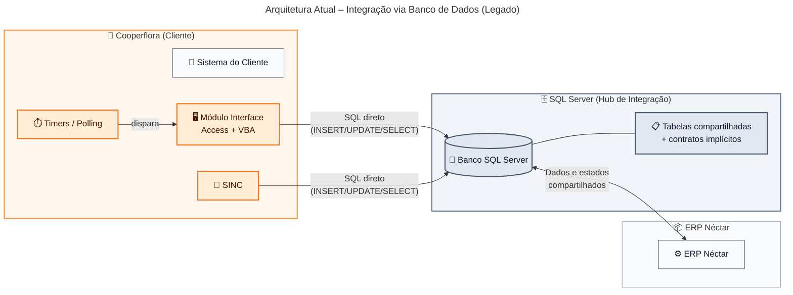
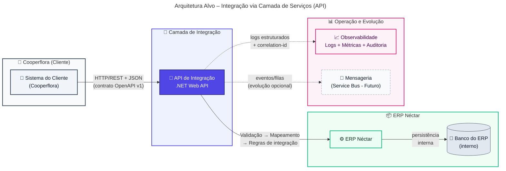
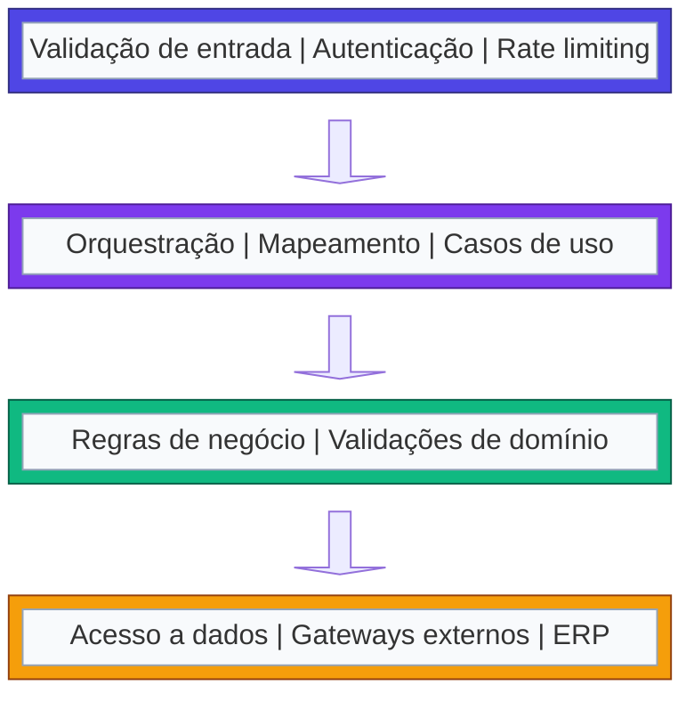
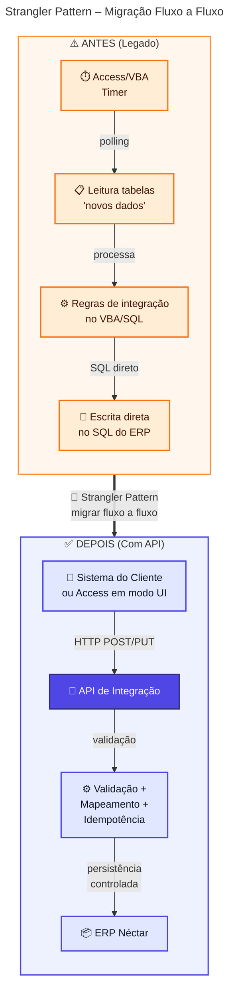
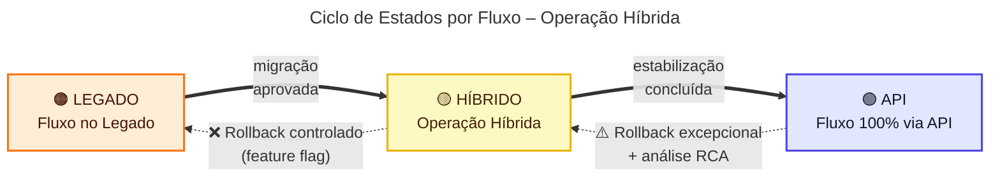
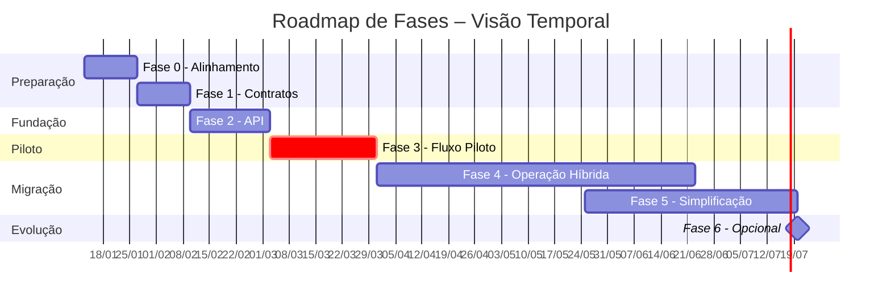
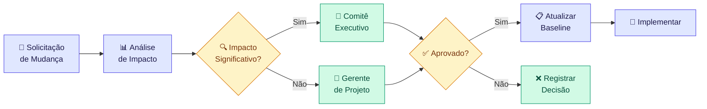
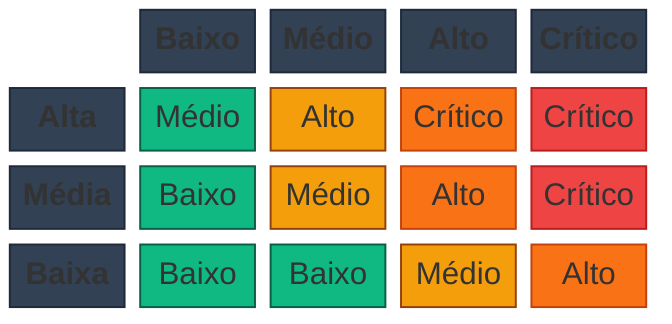

# Plano de Projeto – Modernização do Módulo Integrador do Sistema Néctar (Cooperflora)

> Data de referência: **13 de janeiro de 2026**

## Introdução

Este projeto visa modernizar o **Módulo Integrador/Interface (Access + VBA)** utilizado pela Cooperflora para integrar com o ERP Néctar, substituindo o modelo de **acesso direto ao SQL Server** por uma **camada de serviços (API)** com contratos explícitos, segurança e observabilidade. A modernização será conduzida de forma **incremental**, por fluxo, seguindo o **Strangler Pattern**, permitindo convivência controlada com o legado até estabilização e migração completa.

Ao final, espera-se uma integração com **contratos OpenAPI versionados**, **controle de acesso**, e **rastreabilidade de ponta a ponta** (logs estruturados, métricas e auditoria por transação). Para BDMs, isso significa menor risco operacional e maior agilidade; para TDMs, uma base técnica governável e preparada para cenários segregados ou em nuvem.

### Objetivo

Este documento consolida o **plano de projeto** para modernização do Módulo Integrador/Interface da Cooperflora, orientando a transição de uma integração baseada em **banco de dados como interface** para uma **camada de serviços (API)**. Ele estrutura o **porquê** (necessidade e urgência), o **o quê** (escopo e entregáveis) e o **como** (estratégia incremental, cronograma, governança e mitigação de riscos).

| Stakeholder                          | O que este documento oferece                                                                         |
| ------------------------------------ | ---------------------------------------------------------------------------------------------------- |
| **BDMs** (Business Decision Makers)  | Visão de valor, riscos de negócio, investimento, critérios de sucesso e impacto em operações         |
| **TDMs** (Technical Decision Makers) | Direcionadores técnicos, arquitetura, contratos, segurança, observabilidade e convivência com legado |

O documento serve como **referência de acompanhamento**, com critérios de aceite e pontos de controle para garantir previsibilidade durante a execução.

### Situação atual e motivação

A integração atual entre o sistema da Cooperflora e o ERP Néctar depende de **acesso direto ao SQL Server**, que opera como "hub" de integração. O módulo legado (Access + VBA) e rotinas SINC leem e escrevem diretamente em tabelas do ERP, criando contratos implícitos baseados em schema e convenções históricas — o que eleva risco operacional, custo de suporte e dificulta evolução.

O cenário futuro **não prevê banco compartilhado** nem acesso direto entre ambientes, tornando a abordagem atual um bloqueio para segregação de rede/credenciais e evolução para nuvem. A motivação central é migrar para uma **camada de serviços** com contratos explícitos e observabilidade, permitindo modernização **fluxo a fluxo** com risco controlado.

| Aspecto da Situação Atual (resumo executivo)                            | Descrição Detalhada                                                                                                                                                                                                                                                                                                                                                                               | Impacto (negócio)                                                                                                                                                                                | Objetivo (negócio e técnico)                                                                                                                                                                        |
| ----------------------------------------------------------------------- | ------------------------------------------------------------------------------------------------------------------------------------------------------------------------------------------------------------------------------------------------------------------------------------------------------------------------------------------------------------------------------------------------- | ------------------------------------------------------------------------------------------------------------------------------------------------------------------------------------------------ | --------------------------------------------------------------------------------------------------------------------------------------------------------------------------------------------------- |
| Integração acoplada ao banco do ERP (SQL Server como “hub”)             | A integração ocorre por **acesso direto às tabelas** do banco do ERP, com leituras/escritas que funcionam porque os sistemas estão no mesmo servidor e o SQL Server atua como camada de integração.<br><br>Na prática, o banco de dados vira um barramento: o módulo Access/VBA e/ou o SINC operam sobre tabelas compartilhadas e estados de processamento, sem uma camada explícita de serviços. | Aumenta risco de indisponibilidade e incidentes em mudanças (schema/infra), eleva custo de suporte e dificulta escalar/segregar ambientes; limita decisões de arquitetura e iniciativas futuras. | Substituir o “hub” no banco por uma camada de serviços (API) com controle de acesso e governança, reduzindo dependência de co-localização e viabilizando o cenário sem banco compartilhado.         |
| Contratos de integração implícitos (regras “de fato”, não formalizadas) | Dados e estados de integração são representados por tabelas e colunas cuja semântica é conhecida “por tradição” e por comportamento do código legado, não por contratos formais versionados.<br><br>O comportamento depende de detalhes de schema e de convenções de preenchimento, frequentemente sem documentação suficiente e com alto risco de regressões.                                    | Homologação mais lenta e imprevisível, maior chance de retrabalho e regressões, divergência de entendimento entre áreas e aumento de incidentes em mudanças.                                     | Formalizar contratos e padrões (ex.: OpenAPI, versionamento e erros), reduzindo ambiguidades e permitindo evolução controlada por versão/fluxo.                                                     |
| Orquestração por timers/polling                                         | O módulo Access/VBA executa rotinas por **timers**, que varrem dados “novos”, aplicam regras e persistem resultados, com janela de tempo como mecanismo de orquestração.<br><br>Esse padrão tende a gerar concorrência, duplicidades e dependência de intervalos de execução, além de dificultar rastreio de causa raiz.                                                                          | Gera atrasos variáveis, duplicidades e janelas operacionais difíceis de gerenciar; aumenta impacto de falhas silenciosas e dificulta cumprir SLAs por fluxo.                                     | Migrar gradualmente para integrações orientadas a transação/serviço, reduzindo polling e estabelecendo controles (idempotência, reprocessamento) com previsibilidade operacional.                   |
| Regras críticas no legado (VBA/rotinas de tela)                         | Parte relevante da lógica de integração e validações está implementada em eventos de formulários e rotinas VBA, misturando UI, regras e integração em um único lugar.<br><br>Isso cria um monólito difícil de testar e evoluir, com maior chance de efeitos colaterais e dependência de especialistas no legado.                                                                                  | Eleva custo e risco de mudanças, cria dependência de conhecimento específico, dificulta escalabilidade do time e aumenta probabilidade de regressões em produção.                                | Centralizar regras de integração em serviços testáveis e governáveis, reduzindo acoplamento com a UI e melhorando capacidade de evolução com segurança.                                             |
| Governança de dados pouco definida (source of truth)                    | Não há uma matriz formal de “quem é dono” (source of truth) de cada dado/domínio, o que dificulta decisões sobre direção do fluxo e tratamentos de conflito.<br><br>Na prática, as rotinas podem realizar dual-write ou assumir precedência baseada em convenções não documentadas.                                                                                                               | Aumenta inconsistências e conciliações manuais, gera conflitos entre sistemas e amplia risco operacional e de auditoria durante operação híbrida.                                                | Definir propriedade e direção do fluxo por domínio, com critérios claros de resolução de conflitos, suportando migração por fluxo com menor risco.                                                  |
| Baixa visibilidade operacional (observabilidade e rastreabilidade)      | Falhas podem ser percebidas tardiamente, e o rastreio depende de logs esparsos, estados em tabelas ou investigação manual no banco/Access.<br><br>A ausência de correlação de transações torna difícil identificar o que foi recebido, processado, rejeitado, reprocessado ou duplicado.                                                                                                          | Aumenta MTTR e impacto de incidentes, reduz transparência para gestão e suporte, dificulta governança e tomada de decisão baseada em dados.                                                      | Implementar observabilidade (logs estruturados, métricas, auditoria e correlação por transação), com dashboards/alertas por fluxo para operação e governança.                                       |
| Modelo limita evolução para ambientes segregados/nuvem                  | A arquitetura atual depende de proximidade física e acesso ao SQL Server; se houver isolamento de rede, segregação de credenciais ou nuvem, a integração pode simplesmente não funcionar.<br><br>Além disso, o legado tem limitações tecnológicas e custos crescentes de manutenção.                                                                                                              | Bloqueia iniciativas de modernização/segregação, aumenta risco de ruptura em mudanças de infraestrutura e reduz flexibilidade para novas integrações e expansão.                                 | Preparar a integração para operar com segurança em cenários segregados/nuvem, preservando continuidade do negócio e abrindo caminho para evoluções futuras (incl. mensageria quando fizer sentido). |

## Visão Geral da Arquitetura Atual e Alvo

### Arquitetura atual

A Cooperflora utiliza um **Módulo Integrador/Interface (Access + VBA)** com o componente **SINC**, operando por **acesso direto ao SQL Server** do ERP. A integração é implementada via leitura/escrita em tabelas compartilhadas, com timers/polling que varrem registros "novos" e persistem resultados — o banco assume papel de "barramento" através de flags/status e convenções históricas.

Essa topologia funciona por **co-localização** e credenciais permissivas ao SQL Server. Em cenários com segregação de rede ou evolução para nuvem, o padrão tende a falhar, elevando risco operacional e complexidade de manutenção.



### Arquitetura alvo

A arquitetura alvo introduz uma **API de Integração (.NET Web API)** como fronteira explícita entre Cooperflora e ERP Néctar, eliminando o banco como mecanismo de integração. O cliente passa a integrar por **HTTP/REST + JSON**, com a API concentrando validação, mapeamento, regras de integração e persistência interna — tudo com **contratos OpenAPI** versionados, idempotência e resiliência (timeouts/retries).

A arquitetura incorpora **observabilidade** (logs estruturados, métricas, correlation-id) e suporta operação híbrida por fluxo (feature flags), permitindo migração incremental com rollback. O princípio central: **a integração não depende de acesso direto ao banco do ERP** e pode operar em cenários segregados/nuvem.



### Visão geral comparativa

Esta tabela sintetiza as diferenças entre a arquitetura atual e a arquitetura alvo, destacando os benefícios esperados para cada dimensão.

> **Nota**: A coluna **Benefícios Esperados** está diretamente vinculada aos **Objetivos (negócio e técnico)** definidos na seção "Situação atual e motivação". Cada benefício endereça um ou mais objetivos estratégicos identificados na análise da situação atual.

| Dimensão                                    | Arquitetura Atual                                                                                                                     | Arquitetura Alvo                                                                                                                   | Benefícios Esperados (→ Objetivo)                                                                                                                           |
| ------------------------------------------- | ------------------------------------------------------------------------------------------------------------------------------------- | ---------------------------------------------------------------------------------------------------------------------------------- | ----------------------------------------------------------------------------------------------------------------------------------------------------------- |
| Fronteira de integração e acoplamento       | Banco como interface: dependência direta de schema/tabelas, co-localização e credenciais; mudanças de banco/infra afetam integrações. | API como fronteira: contratos e gateways definidos; banco do ERP permanece interno ao ERP (não é interface externa).               | Reduz acoplamento e risco de ruptura; substitui o "hub" no banco por camada de serviços; habilita operação em cenários segregados/nuvem.                    |
| Mecanismo de execução e orquestração        | Timers/polling no Access/VBA; varredura de "novos" registros; concorrência/duplicidade dependem de convenções e estados em tabelas.   | Integração transacional via REST/JSON; orquestração explícita na API; evolução opcional para assíncrono quando houver ganho claro. | Elimina polling/timers; melhora previsibilidade de execução; controle explícito de concorrência e reprocessamento.                                          |
| Contratos e versionamento                   | Contratos implícitos (colunas/flags/convenções); sem versionamento formal; alto risco de regressão em alterações.                     | OpenAPI como fonte de verdade; versionamento semântico (ex.: `/v1`); taxonomia de erros e validações padronizadas.                 | Elimina ambiguidades e "efeitos colaterais"; habilita testes de contrato automatizados e compatibilidade planejada entre versões.                           |
| Observabilidade e rastreabilidade           | Baixa: rastreio por investigação em Access/SQL, logs esparsos e estados em tabelas; correlação entre etapas é limitada.               | Logs estruturados, correlation-id ponta a ponta, métricas por endpoint/fluxo, dashboards/alertas e auditoria por transação.        | Reduz MTTR; diagnóstico end-to-end via correlation-id; governança operacional com métricas, alertas e trilha de auditoria.                                  |
| Resiliência, idempotência e reprocessamento | Tratamento de falhas "informal": retries manuais/rotinas; risco de duplicidade e inconsistência em reprocessos.                       | Timeouts/retries controlados, idempotência por chave, políticas de erro padronizadas e trilha de reprocessamento auditável.        | Elimina duplicidades e inconsistências; aumenta robustez frente a falhas de rede/ERP; reprocessamento seguro e auditável.                                   |
| Evolução e governança de mudança            | Evolução lenta e arriscada; dependência de especialistas no legado; mudanças no banco podem quebrar integrações sem sinalização.      | Migração incremental (strangler) por fluxo; feature flags e rollback; governança de contrato/escopo e padrões repetíveis.          | Acelera evolução com risco controlado; reduz dependência do legado; centraliza regras em serviços governáveis; viabiliza migração incremental com rollback. |

### Princípios arquiteturais

Os princípios a seguir, organizados conforme o modelo **BDAT** (Business, Data, Application, Technology), orientam todas as decisões técnicas deste projeto. Cada princípio endereça diretamente os problemas da situação atual e sua aderência é **obrigatória** em todas as fases, verificada nos gates de decisão.

Desvios requerem aprovação formal com justificativa documentada e análise de impacto. As tabelas apresentam cada princípio, descrição e justificativa técnica.

#### Princípios de Negócio (Business)

Os princípios de negócio garantem que a modernização preserve a **continuidade operacional** e entregue valor de forma incremental. Eles refletem o compromisso do projeto em minimizar riscos de transição, manter a previsibilidade para stakeholders e assegurar que mudanças sigam governança formal.

A abordagem incremental (Strangler Pattern) é o pilar central, permitindo que cada fluxo seja migrado de forma independente, com possibilidade de rollback e sem interrupção das operações. Isso traduz-se em menor risco para o negócio e entregas frequentes de valor.

| Princípio                    | Descrição                                                           | Justificativa Técnica                                             |
| ---------------------------- | ------------------------------------------------------------------- | ----------------------------------------------------------------- |
| **Continuidade operacional** | A integração deve funcionar sem interrupções durante a modernização | Operação híbrida por fluxo; rollback controlado via feature flags |
| **Evolução incremental**     | Migração fluxo a fluxo (Strangler Pattern), sem "big bang"          | Feature flags; convivência legado/API por fluxo                   |
| **Governança de mudanças**   | Mudanças seguem controle formal com critérios de aceite             | Versionamento de contratos; breaking changes controlados          |

#### Princípios de Dados (Data)

Os princípios de dados asseguram **governança clara** sobre quem é dono de cada informação (source of truth), eliminando ambiguidades que hoje causam conflitos e conciliações manuais. Com contratos explícitos e rastreabilidade por transação, o projeto habilita auditoria eficiente e diagnóstico rápido de problemas.

A formalização via OpenAPI e o uso de correlation-id ponta a ponta transformam a integração em um sistema observável e governável, reduzindo o tempo de homologação e o risco de regressões em produção.

| Princípio                          | Descrição                                                | Justificativa Técnica                             |
| ---------------------------------- | -------------------------------------------------------- | ------------------------------------------------- |
| **Source of truth definido**       | Cada domínio tem um dono claro (quem é fonte de verdade) | Direção de fluxo explícita; sem dual-write        |
| **Contratos explícitos (OpenAPI)** | Payloads, erros e versões documentados formalmente       | OpenAPI como fonte de verdade; testes de contrato |
| **Rastreabilidade por transação**  | Toda operação é rastreável ponta a ponta                 | Correlation-id propagado; logs estruturados       |

#### Princípios de Aplicação (Application)

Os princípios de aplicação definem a estrutura de **desacoplamento e separação de responsabilidades** que permite evoluir a integração de forma independente do ERP e do sistema do cliente. Com a API como fronteira, mudanças no schema do banco não propagam mais para os consumidores.

A idempotência como requisito obrigatório elimina problemas de duplicidade em reprocessamentos, enquanto a separação entre UI, regras de integração e domínio reduz a dependência de especialistas no legado e viabiliza testes automatizados.

| Princípio                                       | Descrição                                       | Justificativa Técnica                                                   |
| ----------------------------------------------- | ----------------------------------------------- | ----------------------------------------------------------------------- |
| **Desacoplamento (sem acesso direto ao banco)** | Sistema do cliente não depende do schema do ERP | API como fronteira; banco interno ao ERP                                |
| **Separação de responsabilidades**              | UI, regras de integração e domínio separados    | Lógica em serviços testáveis ou stored procedures; legado reduzido a UI |
| **Idempotência e resiliência**                  | Reprocessamentos não corrompem dados            | Chaves de idempotência; retries controlados                             |

#### Princípios de Tecnologia (Technology)

Os princípios de tecnologia garantem que a solução seja **observável, segura e preparável para cenários futuros** de segregação de ambientes ou evolução para nuvem. Observabilidade não é opcional: tudo que integra deve produzir métricas, logs estruturados e alertas acionáveis.

Segurança por design significa que autenticação, autorização e hardening são implementados desde a primeira linha de código, não como "camada adicional" posterior. A independência de co-localização de banco é requisito arquitetural para habilitar iniciativas futuras de modernização.

| Princípio                            | Descrição                                            | Justificativa Técnica                                                    |
| ------------------------------------ | ---------------------------------------------------- | ------------------------------------------------------------------------ |
| **Observabilidade como requisito**   | Tudo que integra deve ser monitorável e auditável    | Logs estruturados; métricas; dashboards/alertas                          |
| **Segurança por design**             | Autenticação, autorização e hardening desde o início | OAuth2/API Key + mTLS (quando aplicável); TLS obrigatório; rate limiting |
| **Preparação para nuvem/segregação** | Integração funciona sem co-localização de banco      | API REST/JSON; sem dependência de rede local                             |

### Padrões técnicos de integração

Esta subseção detalha os **padrões técnicos** que operacionalizam os princípios arquiteturais definidos acima. Enquanto os princípios orientam "o quê" e "por quê", os padrões definem "como" implementar. A aderência a esses padrões é verificada nos critérios de aceite de cada fase e nos code reviews.

Os padrões abrangem definição de contratos (OpenAPI), tratamento de erros, idempotpência, propriedade de dados e critérios para evolução event-driven. Cada padrão foi selecionado para endereçar riscos específicos identificados na situação atual e garantir consistência entre os fluxos migrados.

#### Padrão de API e contratos

| Aspecto           | Padrão Definido                                                                     |
| ----------------- | ----------------------------------------------------------------------------------- |
| **Estilo**        | REST/JSON como protocolo de integração                                              |
| **Contratos**     | OpenAPI/Swagger como fonte de verdade; especificação versionada por fluxo           |
| **Versionamento** | Versão no path (`/v1`, `/v2`); política de compatibilidade e deprecação documentada |
| **Geração**       | Clientes gerados a partir do contrato quando aplicável (SDK, tipos)                 |

#### Tratamento de erros

| Código HTTP | Categoria          | Uso                                                      |
| ----------- | ------------------ | -------------------------------------------------------- |
| 4xx         | Erros de validação | Payload inválido, campos obrigatórios, regras de negócio |
| 401         | Autenticação       | Token ausente ou inválido                                |
| 403         | Autorização        | Permissão negada para a operação                         |
| 409         | Conflito           | Violação de idempotência ou estado inconsistente         |
| 503         | Indisponibilidade  | ERP ou dependência fora do ar                            |

**Payload de erro padrão:**

```json
{
  "code": "VALIDATION_ERROR",
  "message": "Descrição legível do erro",
  "details": [{ "field": "campo", "issue": "descrição" }],
  "correlationId": "uuid-da-transacao"
}
```

#### Idempotência e reprocessamento

| Aspecto           | Padrão                                                                                |
| ----------------- | ------------------------------------------------------------------------------------- |
| **Chave**         | Header `Idempotency-Key` ou chave de negócio + origem (ex.: `pedido-123-cooperflora`) |
| **Comportamento** | Reenvio retorna mesmo resultado sem duplicar efeitos colaterais                       |
| **Auditoria**     | Resultado do reprocessamento registrado com correlation-id                            |
| **Janela**        | Idempotência garantida por período configurável (ex.: 24h)                            |

#### Propriedade de dados (source of truth)

| Domínio     | Source of Truth | Direção do Fluxo                       | Observação        |
| ----------- | --------------- | -------------------------------------- | ----------------- |
| Pessoas     | A definir       | Cooperflora → ERP ou ERP → Cooperflora | Validar na Fase 0 |
| Produtos    | A definir       | A definir                              | Validar na Fase 0 |
| Pedidos     | A definir       | A definir                              | Validar na Fase 0 |
| Faturamento | A definir       | A definir                              | Validar na Fase 0 |

> **Regra**: Evitar dual-write. Quando inevitável durante transição, exigir governança explícita e trilha de auditoria.

#### Evolução para event-driven

| Critério para adoção                        | Padrão                             |
| ------------------------------------------- | ---------------------------------- |
| Picos de carga que exigem desacoplamento    | Considerar fila (ex.: Service Bus) |
| Latência tolerável (não crítico tempo-real) | Candidato a assíncrono             |
| Múltiplos consumidores                      | Modelar como evento publicado      |

**Padrões obrigatórios para event-driven:**

- Dead Letter Queue (DLQ) para mensagens não processadas
- Retries com backoff exponencial
- Tratamento de poison messages
- Preservação de correlation-id entre eventos

### Diretrizes de arquitetura e desenvolvimento

#### Arquitetura em camadas

A arquitetura em camadas organiza a API de Integração em **quatro níveis de responsabilidade** distintos: API (Controllers), Aplicação (Services), Domínio (Entities) e Infraestrutura (Repositories). Essa separação garante que cada camada tenha uma única razão para mudar, facilitando manutenção, testes e evolução independente.

A camada de API é responsável por validação de entrada, autenticação e rate limiting. A camada de Aplicação orquestra os casos de uso e mapeamentos. O Domínio contém as regras de negócio puras. A Infraestrutura abstrai o acesso a dados e gateways externos, incluindo a integração com o ERP.



| Diretriz                       | Descrição                                          |
| ------------------------------ | -------------------------------------------------- |
| Validação na borda             | Validar entrada na camada API antes de propagar    |
| Regras de integração testáveis | Lógica em serviços com injeção de dependência      |
| Desacoplamento do ERP          | Acesso ao ERP via gateways/repositórios abstraídos |

#### Estratégia de testes

| Tipo           | Escopo                           | Ferramenta/Abordagem                    |
| -------------- | -------------------------------- | --------------------------------------- |
| **Unitário**   | Regras de validação e mapeamento | xUnit/NUnit + mocks                     |
| **Integração** | API ↔ ERP (ou mocks controlados) | TestServer + dados de referência        |
| **Contrato**   | Validação do OpenAPI             | Mock server / consumer-driven contracts |
| **E2E**        | Cenários por fluxo               | Auditoria de efeitos + correlation-id   |

#### DevOps e ambientes

| Ambiente | Propósito                          | Dados                                |
| -------- | ---------------------------------- | ------------------------------------ |
| **DEV**  | Desenvolvimento e testes unitários | Dados sintéticos ou anonimizados     |
| **HML**  | Homologação com stakeholders       | Dados representativos (anonimizados) |
| **PRD**  | Produção                           | Dados reais                          |

**Pipeline CI/CD:**

1. Build + lint
2. Testes unitários
3. Validação de contrato OpenAPI
4. Testes de integração
5. Deploy para ambiente alvo
6. Smoke test pós-deploy

### Escopo do Projeto

Esta seção define os **entregáveis e limites** do projeto de modernização do Módulo Integrador/Interface. A tabela a seguir apresenta o que será implementado: transição do modelo "banco como integração" para camada de serviços, contratos OpenAPI, segurança, observabilidade e operação híbrida por fluxo — tudo dentro das premissas de migração incremental e continuidade operacional.

**Regra de governança**: tudo que não estiver descrito nesta seção é automaticamente considerado fora de escopo. Qualquer necessidade nova deve seguir **controle de mudanças** (registrar solicitação, avaliar impacto, obter aprovação) antes de atualizar o baseline.

> **Nota**: A coluna **Benefícios Esperados** está diretamente vinculada aos **Objetivos (negócio e técnico)** definidos na seção "Situação atual e motivação". Cada benefício endereça um ou mais objetivos estratégicos identificados na análise da situação atual.

| Item de Escopo                                           | Descrição Detalhada                                                                                                                                                                                                                                                                                                                                                                                                                                                                                                                                     | Benefícios Esperados (→ Objetivo)                                                                                                         |
| -------------------------------------------------------- | ------------------------------------------------------------------------------------------------------------------------------------------------------------------------------------------------------------------------------------------------------------------------------------------------------------------------------------------------------------------------------------------------------------------------------------------------------------------------------------------------------------------------------------------------------- | ----------------------------------------------------------------------------------------------------------------------------------------- |
| API de Integração (.NET Web API) — fundação técnica      | Implementar a **camada intermediária** responsável por expor endpoints/consumers e centralizar a lógica de integração.<br><br>Inclui (mínimo): estrutura de solução e arquitetura (camadas/limites), validação de entrada, padronização de erros, resiliência (timeouts/retries controlados), health checks, logging estruturado e correlação por transação (correlation-id).<br><br>Integração com o ERP via componentes definidos (ex.: chamadas ao ERP e/ou acesso ao SQL Server do ERP quando aplicável), sem expor o banco como interface externa. | Reduz dependência de co-localização e do banco como “hub”, elevando governança e previsibilidade.                                         |
| Contratos OpenAPI — governança e versionamento           | Definir contratos por domínio/fluxo (ex.: pessoas, produtos, pedidos), com **OpenAPI/Swagger** como fonte de verdade.<br><br>Inclui: modelagem de payloads, validações, códigos de retorno, taxonomia de erros, regras de breaking change, estratégia de versionamento (ex.: `/v1`, `/v2`) e requisitos mínimos por fluxo (idempotência, limites e SLAs alvo quando aplicável).<br><br>Artefatos gerados: especificação OpenAPI versionada e checklist de conformidade por endpoint (DoD de contrato).                                                  | Reduz ambiguidades, acelera homologação e viabiliza evolução controlada por versão.                                                       |
| Fluxo piloto end-to-end — “Cadastro de Pessoas”          | Selecionar e implementar um fluxo piloto de alto valor e risco controlado, com execução completa via API.<br><br>Inclui: mapeamento do fluxo no legado (VBA/SQL/SINC), contrato OpenAPI, validações, idempotência, instrumentação (logs/métricas/auditoria), testes (unitário/integração/E2E quando aplicável), e plano de estabilização em produção (janela, métricas de sucesso, rollback).<br><br>Resultado esperado: blueprint repetível para os demais fluxos.                                                                                     | Entrega valor cedo com risco controlado, provando padrões e acelerando a migração por ondas.                                              |
| Operação híbrida por fluxo — roteamento e rollback       | Definir e implementar convivência **por fluxo** (Legado/Híbrido/API), com roteamento explícito e governado.<br><br>Inclui: feature flags por fluxo, critérios de cutover, procedimentos de fallback/rollback, trilha de decisão (quem aprova e quando), e observabilidade comparativa (legado vs API) para detectar desvios.<br><br>Premissa operacional: evitar dual-write e reduzir conflitos com regras claras de propriedade do dado por domínio.                                                                                                   | Mantém continuidade do negócio durante a transição e reduz custo de incidentes em mudanças.                                               |
| Descomissionamento de timers/polling e acessos diretos   | Reduzir progressivamente timers do Access/VBA e rotinas que leem/escrevem direto no SQL do ERP.<br><br>Inclui: inventário e classificação de timers, substituição por chamadas transacionais via API, definição de controles (idempotência/reprocessamento), e roadmap de desligamento com critérios de aceite por fluxo.<br><br>Durante transição, timers remanescentes devem ser tratados como temporários e monitorados (alertas/telemetria).                                                                                                        | Reduz atrasos variáveis, duplicidades e fragilidade por concorrência; aumenta previsibilidade operacional.                                |
| Observabilidade e auditoria por transação                | Implementar capacidade de operação e diagnóstico por fluxo: logs estruturados, métricas (latência, taxa de erro, volume), auditoria por transação e correlação ponta a ponta (correlation-id propagado).<br><br>Inclui: dashboards e alertas operacionais, trilha de reprocessamento e evidências para suporte/auditoria, com visão por ambiente e criticidade.<br><br>Objetivo técnico: reduzir investigação manual em banco/Access e tornar falhas detectáveis rapidamente.                                                                           | Reduz MTTR, melhora governança e dá transparência para gestão e operação.                                                                 |
| Segurança da API — autenticação, autorização e hardening | Definir e implementar autenticação/autorização para consumo da API e padrões de segurança operacional.<br><br>Inclui: mecanismo de auth (ex.: OAuth2, API Key, mTLS conforme restrição), segregação de ambientes/segredos, validação de payload, rate limiting e práticas de hardening de endpoints.<br><br>Também inclui padrões mínimos de acesso a dados internos (princípio do menor privilégio) para reduzir risco de exposição.                                                                                                                   | Reduz risco de exposição e substitui o “acesso ao banco” como mecanismo de integração; habilita cenários com rede/credenciais segregadas. |
| Preparação para evolução event-driven (opcional)         | Planejar (sem implantar obrigatoriamente) a evolução para assíncrono onde fizer sentido.<br><br>Inclui: modelagem de eventos por domínio, critérios para quando usar síncrono vs assíncrono, desenho de padrões (retry, DLQ, idempotência, ordenação), e requisitos para adoção futura de fila (ex.: Service Bus).<br><br>Entregável: guideline técnico e backlog priorizado para evolução, sem desviar do foco do MVP (API + fluxos críticos).                                                                                                         | Evita “becos sem saída” arquiteturais e preserva foco no essencial, mantendo caminho claro para evoluções futuras.                        |

#### Escopo por domínio de negócio

A tabela acima detalha os entregáveis técnicos. Abaixo, a mesma visão é organizada por **domínio de negócio**, facilitando o entendimento dos stakeholders sobre quais áreas serão impactadas e em qual sequência.

> **Nota**: A coluna **Objetivo** está diretamente vinculada aos **Objetivos (negócio e técnico)** definidos na seção "Situação atual e motivação". Cada objetivo de domínio contribui para a realização dos objetivos estratégicos do projeto.

| Domínio                     | Fluxos em Escopo                                                 | Objetivo (→ Situação Atual)                                                                                                 | Prioridade Sugerida    |
| --------------------------- | ---------------------------------------------------------------- | --------------------------------------------------------------------------------------------------------------------------- | ---------------------- |
| **Fundação de Plataforma**  | API de Integração, Contratos OpenAPI, Observabilidade, Segurança | Habilita todos os demais fluxos; sem fundação, não há migração                                                              | Alta (Fase 1–2)        |
| **Cadastros (Master Data)** | Pessoas (piloto), Produtos, Tabelas auxiliares                   | Aumenta previsibilidade e reduz incidentes cadastrais; ideal para validar padrões sem afetar transações de alta criticidade | Alta (Fase 3–4)        |
| **Comercial**               | Pedidos e movimentos                                             | Melhora rastreio operacional e reduz retrabalho; exige governança de consistência (correlation-id, auditoria)               | Média (Fase 4)         |
| **Fiscal/Faturamento**      | Faturamento, notas fiscais                                       | Reduz risco de falhas silenciosas; recomendado após consolidação do padrão nos cadastros                                    | Média-Baixa (Fase 4–5) |
| **Financeiro**              | Contas a pagar/receber, conciliação                              | Reduz inconsistências e conciliações manuais; requer auditoria rigorosa                                                     | Média-Baixa (Fase 4–5) |
| **Estoque**                 | Movimentações, inventário                                        | Melhora rastreabilidade e reduz divergências; integração com outros domínios                                                | Média-Baixa (Fase 5)   |
| **Operação e Governança**   | Runbooks, dashboards, alertas, gestão de mudanças                | Garante continuidade e capacidade de suporte durante operação híbrida                                                       | Contínuo               |

#### Fora do escopo

Delimitar explicitamente o que está **fora do escopo** é uma boa prática de gestão de projetos (PMBOK, Change Control). Isso evita "scope creep", mantém o projeto gerenciável e preserva foco na modernização incremental com entregas verificáveis.

**Regra de governança**: Tudo o que não estiver descrito na seção "Escopo do Projeto" é automaticamente considerado fora de escopo. Isso inclui qualquer iniciativa adicional não explicitada, mesmo que correlata ao tema. Qualquer necessidade nova deve seguir o **controle de mudanças**: registrar solicitação, avaliar impacto (prazo/custo/risco/arquitetura/operação), obter aprovação formal e, somente então, atualizar o baseline e planos associados.

| Item fora do escopo                                  | Justificativa                                                                                                         |
| ---------------------------------------------------- | --------------------------------------------------------------------------------------------------------------------- |
| Reescrita completa do ERP Néctar                     | Programa maior e não necessário para remover o acoplamento de integração                                              |
| Reescrita completa do sistema do cliente             | O projeto foca no integrador; mudanças no cliente serão restritas ao necessário para consumir a API                   |
| Migração completa para arquitetura event-driven      | A Fase 6 prevê evolução opcional; o objetivo principal é remover o banco como camada de integração                    |
| Projeto integral de migração para Nimbus             | O escopo contempla preparação arquitetural e roadmap, não a migração completa                                         |
| Mudanças funcionais profundas no processo de negócio | O foco é modernização técnica e redução de risco, mantendo comportamento funcional compatível                         |
| Novas integrações não listadas                       | Qualquer fluxo não explicitado na tabela de entregáveis deve passar por controle de mudanças antes de ser incorporado |

## Fases do Projeto e Cronograma Macro

Esta seção apresenta o **roadmap de execução** do projeto, organizado em 7 fases (Fase 0 a Fase 6), com cronograma estimado, marcos de decisão e critérios de aceite. A estrutura foi desenhada para dar visibilidade a **BDMs** (valor entregue, riscos de negócio, pontos de decisão) e **TDMs** (dependências técnicas, entregáveis, critérios de qualidade).

Cada fase possui **gates de decisão** que funcionam como checkpoints obrigatórios antes de avançar para a próxima etapa. O modelo incremental permite ajustes de rota com base em aprendizados, sem comprometer as entregas já estabilizadas. O cronograma é uma estimativa inicial que será refinada na Fase 0 com base no inventário técnico completo.

### Estratégia de modernização: Strangler Pattern

A abordagem adotada é o **Strangler Pattern**, com extração gradual da lógica de integração do legado e introdução de uma camada de serviço moderna. O processo é executado **fluxo a fluxo**, garantindo continuidade operacional e redução de risco. Cada fluxo migrado passa por um ciclo completo de validação antes de desativar a rotina equivalente no legado.

O padrão Strangler foi escolhido porque permite **evolução sem "big bang"**: não há necessidade de migrar tudo de uma vez, e o rollback é possível em qualquer etapa via feature flags. Isso reduz drasticamente o risco de indisponibilidade e permite que o negócio valide cada entrega antes de avançar.



**Mudança fundamental na direção da integração:**

| Modelo Atual (Legado)                                    | Modelo Alvo (API)                                      |
| -------------------------------------------------------- | ------------------------------------------------------ |
| Access **busca** os dados diretamente nas tabelas do ERP | Sistema do cliente **envia** os dados para a API       |
| Integração disparada por timers (polling)                | Integração transacional (request/response)             |
| Responsabilidade difusa entre sistemas                   | Responsabilidade clara: API é o ponto único de entrada |

> **Vantagem**: Sem timers, sem race conditions, responsabilidade clara.

**Ciclo de execução por fluxo:**

| Etapa | Ação                                  | Entregável                                      |
| ----- | ------------------------------------- | ----------------------------------------------- |
| 1     | Mapear fluxo e dependências no legado | Diagrama de fluxo + inventário de dependências  |
| 2     | Definir contrato OpenAPI              | Especificação versionada                        |
| 3     | Implementar fluxo na API              | Endpoint com validação, idempotência, auditoria |
| 4     | Roteamento híbrido (legado → API)     | Feature flag ativa + fallback configurado       |
| 5     | Estabilização e desativação do timer  | Métricas OK + timer desligado                   |
| 6     | Repetir para próximo fluxo            | Padrões consolidados                            |

### Operação híbrida e ciclo de estados

A convivência é gerenciada **por fluxo**, não por "sistema inteiro". Cada fluxo transita por três estados, com critérios de transição e possibilidade de rollback.



| Estado      | Descrição                                  | Critério de Transição                                 |
| ----------- | ------------------------------------------ | ----------------------------------------------------- |
| **Legado**  | Fluxo operando via timers/polling          | Contrato aprovado + API implementada                  |
| **Híbrido** | API ativa + legado funcional como fallback | Estabilização OK (≥2 semanas sem incidentes críticos) |
| **API**     | Fluxo 100% via API, timer desativado       | Aceite formal + evidência de desativação              |

**Estratégias de rollback:**

- Feature flags por fluxo com roteamento configurável
- Janela de estabilização (ex.: 2 semanas) com monitoramento reforçado
- Reprocessamento via mecanismos de reenvio/replay com idempotência
- Plano de comunicação com critérios de acionamento de rollback

---

### Visão executiva do roadmap

| Fase | Nome                    | Duração Estimada | Marco de Negócio (BDM)                                 | Marco Técnico (TDM)                                    |
| ---: | ----------------------- | :--------------: | ------------------------------------------------------ | ------------------------------------------------------ |
|    0 | Alinhamento e contenção |   1–2 semanas    | Acordo sobre escopo, riscos mapeados                   | Inventário técnico completo, backlog priorizado        |
|    1 | Definição de contratos  |   1–2 semanas    | Contratos aprovados, governança definida               | OpenAPI v1, padrões de integração documentados         |
|    2 | Fundação da API         |   2–3 semanas    | Infraestrutura pronta para piloto                      | API em DEV/HML, pipeline CI/CD, observabilidade básica |
|    3 | Fluxo piloto            |   2–4 semanas    | **Primeiro fluxo em produção**, valor demonstrado      | Piloto estável, padrões validados, lições aprendidas   |
|    4 | Migração por fluxo      |    1–3 meses     | Fluxos críticos migrados, redução de risco operacional | Timers desativados, operação híbrida governada         |
|    5 | Simplificação do legado |    1–2 meses     | Custo de manutenção reduzido, legado estável           | Rotinas de integração removidas, documentação final    |
|    6 | Evolução opcional       |     Contínuo     | Novas capacidades habilitadas (quando justificado)     | Mensageria, eventos, preparação para Nimbus            |

### Cronograma macro (referência por semanas)

> **Nota para BDMs**: O cronograma abaixo é uma estimativa baseada em premissas iniciais. Ajustes serão propostos conforme descobertas na Fase 0 e validados em governança antes de impactar prazos/investimento.

> **Nota para TDMs**: As dependências indicam sequência mínima. Algumas atividades podem ser paralelizadas (ex.: setup de infra durante Fase 1), desde que não comprometam qualidade ou criem débito técnico.



| Janela (semanas) | Fase   | Dependências  | Gate de Decisão                                                  |
| ---------------: | ------ | ------------- | ---------------------------------------------------------------- |
|              1–2 | Fase 0 | —             | **Go/No-Go**: escopo validado, riscos aceitáveis                 |
|              3–4 | Fase 1 | Fase 0        | **Aprovação**: contratos e governança de mudanças                |
|              5–7 | Fase 2 | Fase 1        | **Checkpoint**: infra pronta, smoke test OK                      |
|             8–11 | Fase 3 | Fase 2        | **Go-Live Piloto**: critérios de estabilização atingidos         |
|            12–24 | Fase 4 | Fase 3        | **Checkpoints por onda**: cada domínio migrado tem aceite formal |
|            20–28 | Fase 5 | Fase 4 (80%+) | **Aceite final**: legado simplificado, operação estável          |
|         Contínuo | Fase 6 | Fase 4/5      | **Por demanda**: aprovação de ROI/valor antes de cada iniciativa |

---

### Fase 0 – Alinhamento e contenção de riscos (1–2 semanas)

| Aspecto       | Descrição                                                                                        |
| ------------- | ------------------------------------------------------------------------------------------------ |
| **Objetivo**  | Criar base de governança, reduzir riscos imediatos e mapear integralmente dependências do legado |
| **Valor BDM** | Visibilidade de riscos e escopo; decisão informada sobre investimento e prioridades              |
| **Valor TDM** | Inventário técnico completo; base para estimativas e arquitetura                                 |

**Principais atividades**

| Atividade                                              | Responsável         | Entregável                        |
| ------------------------------------------------------ | ------------------- | --------------------------------- |
| Inventário técnico do módulo Access/VBA e rotinas SINC | TDM (Néctar)        | Documento de inventário           |
| Mapeamento de pontos de integração                     | TDM (Néctar)        | Diagrama de fluxos e dependências |
| Matriz de propriedade de dados (source of truth)       | BDM + TDM           | Matriz aprovada por domínio       |
| Requisitos não funcionais e restrições                 | TDM (Néctar + Coop) | Lista de requisitos e restrições  |
| Priorização de fluxos para migração                    | BDM (Cooperflora)   | Backlog priorizado                |

**Critérios de aceite (Exit Criteria)**

| Critério                                             | Validador            |
| ---------------------------------------------------- | -------------------- |
| Fluxos e dependências mapeados e validados           | Cooperflora + Néctar |
| Matriz de propriedade de dados aprovada              | BDM (Cooperflora)    |
| Backlog priorizado com critérios do piloto definidos | BDM + TDM            |
| Riscos documentados com plano de mitigação           | TDM (Néctar)         |

**Riscos e mitigação**

| Risco                                    | Probabilidade | Impacto | Mitigação                                              |
| ---------------------------------------- | ------------- | ------- | ------------------------------------------------------ |
| Dependências ocultas no VBA/SQL          | Alta          | Alto    | Sessões de engenharia reversa + validação com operação |
| Escopo difuso ou expansão não controlada | Média         | Alto    | Baseline de escopo formal + controle de mudanças       |

### Fase 1 – Definição dos contratos de integração (1–2 semanas)

| Aspecto       | Descrição                                                                         |
| ------------- | --------------------------------------------------------------------------------- |
| **Objetivo**  | Transformar integrações implícitas em contratos explícitos e governáveis          |
| **Valor BDM** | Redução de ambiguidades; homologação mais rápida; evolução controlada             |
| **Valor TDM** | Contratos como fonte de verdade; base para testes automatizados e compatibilidade |

**Principais atividades**

| Atividade                                     | Responsável         | Entregável                           |
| --------------------------------------------- | ------------------- | ------------------------------------ |
| Definir endpoints e modelos (DTOs) por fluxo  | TDM (Néctar)        | Especificação OpenAPI v1             |
| Padronizar erros (códigos, mensagens, campos) | TDM (Néctar)        | Taxonomia de erros documentada       |
| Definir estratégia de versionamento           | TDM (Néctar)        | Guideline de versionamento           |
| Definir idempotência por fluxo                | TDM (Néctar)        | Documento de padrões de idempotência |
| Definir autenticação/autorização              | TDM (Néctar + Coop) | Requisitos de segurança aprovados    |

**Critérios de aceite (Exit Criteria)**

| Critério                                  | Validador            |
| ----------------------------------------- | -------------------- |
| Contratos OpenAPI aprovados para o piloto | Cooperflora + Néctar |
| Padrões de integração documentados        | TDM (Néctar)         |
| Plano de testes de contrato definido      | TDM (Néctar)         |

**Riscos e mitigação**

| Risco                             | Probabilidade | Impacto | Mitigação                                          |
| --------------------------------- | ------------- | ------- | -------------------------------------------------- |
| Contratos mal definidos           | Média         | Alto    | Workshops com exemplos reais + validação com dados |
| Mudanças frequentes nos contratos | Média         | Médio   | Governança de breaking changes + compatibilidade   |

### Fase 2 – Fundação da API (2–3 semanas)

| Aspecto       | Descrição                                                                             |
| ------------- | ------------------------------------------------------------------------------------- |
| **Objetivo**  | Disponibilizar a infraestrutura e o esqueleto técnico da API com padrões operacionais |
| **Valor BDM** | Infraestrutura pronta para receber o piloto; redução de risco técnico                 |
| **Valor TDM** | Arquitetura estabelecida; padrões de qualidade definidos; pipeline automatizado       |

**Principais atividades**

| Atividade                                     | Responsável         | Entregável                                 |
| --------------------------------------------- | ------------------- | ------------------------------------------ |
| Estrutura de solução (camadas, DI, validação) | TDM (Néctar)        | Código-fonte da API base                   |
| Logging estruturado e correlação              | TDM (Néctar)        | Padrões de observabilidade implementados   |
| Health checks e métricas                      | TDM (Néctar)        | Endpoints de saúde + métricas expostas     |
| Conectividade segura com ERP                  | TDM (Néctar + Coop) | Conexão validada em DEV/HML                |
| Pipeline CI/CD                                | TDM (Néctar)        | Pipeline funcional com deploy automatizado |
| Configuração de ambientes (DEV/HML/PRD)       | TDM (Néctar + Coop) | Ambientes provisionados e documentados     |

**Critérios de aceite (Exit Criteria)**

| Critério                                 | Validador           |
| ---------------------------------------- | ------------------- |
| API em DEV/HML com documentação Swagger  | TDM (Néctar)        |
| Smoke test de ponta a ponta bem-sucedido | TDM (Néctar + Coop) |
| Pipeline CI/CD validado                  | TDM (Néctar)        |
| Dashboards básicos de observabilidade    | TDM (Néctar)        |

**Riscos e mitigação**

| Risco                                 | Probabilidade | Impacto | Mitigação                                         |
| ------------------------------------- | ------------- | ------- | ------------------------------------------------- |
| Atraso em provisão de ambientes/infra | Média         | Alto    | Iniciar setup em paralelo com Fase 1              |
| Falhas de conectividade com ERP       | Média         | Alto    | Testes antecipados + alinhamento de rede/firewall |

### Fase 3 – Fluxo Piloto (2–4 semanas)

| Aspecto       | Descrição                                                                                |
| ------------- | ---------------------------------------------------------------------------------------- |
| **Objetivo**  | Implementar o primeiro fluxo via API em produção, com governança, rollback e aprendizado |
| **Valor BDM** | **Primeiro valor em produção**; validação da abordagem; redução de risco para escala     |
| **Valor TDM** | Padrões validados em ambiente real; blueprint repetível para demais fluxos               |

> **Recomendação**: O fluxo **Cadastro de Pessoas** é ideal para piloto por ter alto valor, risco controlado e não afetar transações financeiras críticas.

**Principais atividades**

| Atividade                                   | Responsável         | Entregável                                    |
| ------------------------------------------- | ------------------- | --------------------------------------------- |
| Seleção e definição de critérios de sucesso | BDM + TDM           | Critérios de aceite do piloto                 |
| Implementação do fluxo na API               | TDM (Néctar)        | Endpoint funcional com validação/idempotência |
| Ajustes no legado para convivência          | TDM (Néctar)        | Legado adaptado (quando necessário)           |
| Testes de integração e E2E                  | TDM (Néctar + Coop) | Evidências de testes                          |
| Homologação com usuários                    | BDM (Cooperflora)   | Aceite de homologação                         |
| Go-live com janela de estabilização         | TDM + BDM           | Fluxo em produção                             |
| Elaboração de runbook e alertas             | TDM (Néctar)        | Runbook operacional + dashboards              |

**Critérios de aceite (Exit Criteria)**

| Critério                         | Validador    | Métrica                                |
| -------------------------------- | ------------ | -------------------------------------- |
| Fluxo piloto estável em produção | TDM + BDM    | ≥ 2 semanas sem incidentes críticos    |
| Indicadores dentro do aceitável  | TDM (Néctar) | Erro < 1%, latência p95 < SLA definido |
| Processo de rollback testado     | TDM (Néctar) | Rollback executado em HML com sucesso  |
| Lições aprendidas documentadas   | TDM (Néctar) | Relatório de lições aprendidas         |

**Riscos e mitigação**

| Risco                               | Probabilidade | Impacto | Mitigação                                             |
| ----------------------------------- | ------------- | ------- | ----------------------------------------------------- |
| Incidentes em produção              | Média         | Alto    | Rollout progressivo + feature flags + rollback rápido |
| Divergência de dados entre sistemas | Média         | Alto    | Auditoria por transação + reprocessamento idempotente |
| Resistência do usuário              | Baixa         | Médio   | Comunicação antecipada + acompanhamento pós-go-live   |

### Fase 4 – Migração por fluxo / Operação híbrida (1–3 meses)

| Aspecto       | Descrição                                                                                        |
| ------------- | ------------------------------------------------------------------------------------------------ |
| **Objetivo**  | Escalar migração fluxo a fluxo, mantendo operação contínua e reduzindo progressivamente o legado |
| **Valor BDM** | Fluxos críticos migrados; redução de risco operacional; menor dependência do legado              |
| **Valor TDM** | Timers desativados; operação híbrida governada; padrões consolidados                             |

**Ondas de migração sugeridas**

| Onda | Domínio                 | Fluxos                                 | Prioridade  | Critério de Conclusão                        |
| ---- | ----------------------- | -------------------------------------- | ----------- | -------------------------------------------- |
| 1    | Cadastros (Master Data) | Pessoas (piloto), Produtos, Auxiliares | Alta        | Todos os cadastros via API + timers inativos |
| 2    | Comercial               | Pedidos, Movimentos                    | Média       | Fluxos transacionais via API                 |
| 3    | Fiscal/Faturamento      | Notas, Faturamento                     | Média-Baixa | Compliance validado + auditoria              |
| 4    | Financeiro              | Contas a pagar/receber, Conciliação    | Média-Baixa | Fluxos financeiros via API + auditoria       |
| 5    | Estoque                 | Movimentações, Inventário              | Média-Baixa | Fluxos de estoque via API + timers inativos  |

**Principais atividades**

| Atividade                                 | Responsável  | Entregável                             |
| ----------------------------------------- | ------------ | -------------------------------------- |
| Migração por domínio (backlog priorizado) | TDM (Néctar) | Fluxos implementados por onda          |
| Desativação de timers por fluxo migrado   | TDM (Néctar) | Timers desligados + evidência          |
| Fortalecimento de observabilidade         | TDM (Néctar) | Dashboards e alertas por fluxo         |
| Gestão de mudanças e comunicação por onda | BDM + TDM    | Comunicados + aceite por onda          |
| Atualização da matriz de fluxos           | TDM (Néctar) | Matriz (legado/híbrido/API) atualizada |

**Critérios de aceite (Exit Criteria)**

| Critério                                        | Validador         |
| ----------------------------------------------- | ----------------- |
| Principais fluxos em API (≥80%)                 | TDM + BDM         |
| Timers de fluxos migrados desativados           | TDM (Néctar)      |
| Operação com suporte e governança estabelecidos | BDM (Cooperflora) |
| Matriz de fluxos atualizada e validada          | TDM + BDM         |

**Riscos e mitigação**

| Risco                                  | Probabilidade | Impacto | Mitigação                                            |
| -------------------------------------- | ------------- | ------- | ---------------------------------------------------- |
| Volume/complexidade maior que estimado | Média         | Médio   | Decomposição do backlog + buffers no cronograma      |
| Fadiga operacional                     | Média         | Médio   | Cadência de migração com janelas + comunicação clara |
| Regressões em fluxos já migrados       | Baixa         | Alto    | Testes de regressão + monitoramento contínuo         |

### Fase 5 – Simplificação do legado (1–2 meses)

| Aspecto       | Descrição                                                                                      |
| ------------- | ---------------------------------------------------------------------------------------------- |
| **Objetivo**  | Reduzir o módulo Access/VBA ao mínimo necessário, removendo responsabilidades de integração    |
| **Valor BDM** | Custo de manutenção reduzido; menor risco operacional; equipe liberada para outras iniciativas |
| **Valor TDM** | Código legado simplificado; documentação final; menor superfície de suporte                    |

**Responsabilidades do módulo legado após simplificação**

O módulo Access/VBA, após a modernização, **deve** se limitar a:

- Exibir informações ao usuário
- Executar código local (validações de UI)
- Invocar a API de integração quando necessário

O módulo **não deve** mais conter:

- Regras de negócio complexas em eventos de formulário
- Funções longas controlando integração
- Acesso direto ao SQL Server do ERP para integrações
- Timers/polling para sincronização de dados

> **Diretriz técnica**: Lógica complexa remanescente deve ser movida para stored procedures (quando necessário manter no banco) ou para a API de integração.

**Principais atividades**

| Atividade                                              | Responsável  | Entregável                      |
| ------------------------------------------------------ | ------------ | ------------------------------- |
| Remoção de formulários/rotinas de integração obsoletas | TDM (Néctar) | Legado sem código de integração |
| Refatoração do VBA remanescente                        | TDM (Néctar) | Código simplificado             |
| Documentação mínima do legado                          | TDM (Néctar) | Documentação operacional        |
| Ajustes finais de runbooks e alertas                   | TDM (Néctar) | Runbooks atualizados            |
| Treinamento de suporte (se necessário)                 | TDM (Néctar) | Equipe capacitada               |

**Critérios de aceite (Exit Criteria)**

| Critério                                        | Validador         |
| ----------------------------------------------- | ----------------- |
| Legado não executa integrações críticas         | TDM (Néctar)      |
| Suporte tem visibilidade e procedimentos claros | BDM (Cooperflora) |
| Documentação operacional entregue               | TDM + BDM         |

**Riscos e mitigação**

| Risco                                   | Probabilidade | Impacto | Mitigação                                      |
| --------------------------------------- | ------------- | ------- | ---------------------------------------------- |
| Dependências remanescentes não mapeadas | Baixa         | Alto    | Checklist por fluxo antes de remover rotinas   |
| Perda de conhecimento institucional     | Média         | Médio   | Documentação mínima + sessões de transferência |

### Fase 6 – Evolução opcional (contínuo)

| Aspecto       | Descrição                                                                                        |
| ------------- | ------------------------------------------------------------------------------------------------ |
| **Objetivo**  | Evoluir a integração para suportar novos requisitos e maior desacoplamento, conforme necessidade |
| **Valor BDM** | Novas capacidades de negócio habilitadas; preparação para iniciativas estratégicas (ex.: Nimbus) |
| **Valor TDM** | Arquitetura event-driven quando justificado; maior resiliência e escalabilidade                  |

> **Nota**: Esta fase é **opcional** e executada **por demanda**. Cada iniciativa deve ser justificada por ROI/valor de negócio e aprovada em governança antes da execução.

**Possíveis iniciativas**

| Iniciativa                       | Gatilho                                      | Benefício                                     |
| -------------------------------- | -------------------------------------------- | --------------------------------------------- |
| Mensageria (Service Bus)         | Picos de carga ou necessidade de assíncrono  | Desacoplamento; resiliência a falhas          |
| Modelagem de eventos por domínio | Necessidade de integração com novos sistemas | Extensibilidade; consistência eventual        |
| Preparação para Nimbus           | Decisão estratégica de migração              | Roadmap técnico; redução de risco de migração |

**Critérios de aceite (Exit Criteria)**

| Critério                                             | Validador         |
| ---------------------------------------------------- | ----------------- |
| ROI/valor justificado antes de cada iniciativa       | BDM (Cooperflora) |
| Iniciativa aprovada em governança                    | BDM + TDM         |
| Entrega validada com critérios de aceite específicos | TDM + BDM         |

## Gestão do Projeto (Governança, Stakeholders e Controle)

Esta seção define a estrutura de **governança, papéis, comunicação e controle** do projeto de modernização do Módulo Integrador. O modelo é **híbrido** — combina práticas formais (controle de mudanças, gestão de riscos, gates de decisão) com elementos ágeis (entregas incrementais, feedback contínuo) para garantir previsibilidade sem perder capacidade de adaptação.

### Stakeholders e Matriz RACI

A identificação clara dos stakeholders e seus papéis é fundamental para comunicação eficaz e tomada de decisão. A tabela abaixo apresenta os principais grupos de stakeholders e suas responsabilidades no projeto.

| Stakeholder              | Organização | Papel no Projeto                                          | Interesse Principal                                        |
| ------------------------ | ----------- | --------------------------------------------------------- | ---------------------------------------------------------- |
| **Sponsor Executivo**    | Cooperflora | Patrocinador; aprova investimento e decisões estratégicas | ROI, continuidade do negócio, redução de riscos            |
| **Gerente de Projeto**   | Néctar      | Coordena execução, reporta progresso, gerencia riscos     | Entregas no prazo, qualidade, satisfação do cliente        |
| **Product Owner (PO)**   | Cooperflora | Define prioridades, aceita entregas, representa o negócio | Valor entregue, aderência às necessidades operacionais     |
| **Arquiteto de Solução** | Néctar      | Define padrões técnicos, valida decisões de arquitetura   | Qualidade técnica, aderência aos princípios arquiteturais  |
| **Tech Lead / Dev Team** | Néctar      | Implementa, testa, documenta e entrega os componentes     | Viabilidade técnica, qualidade de código, sustentabilidade |
| **Operação/Suporte**     | Néctar      | Monitora, opera e suporta a solução em produção           | Estabilidade, observabilidade, capacidade de diagnóstico   |
| **TI Cooperflora**       | Cooperflora | Infraestrutura, acessos, integrações do lado cliente      | Segurança, conformidade, impacto mínimo em outros sistemas |
| **Áreas de Negócio**     | Cooperflora | Cadastro, Comercial, Fiscal/Financeiro — usuários finais  | Continuidade operacional, usabilidade, correção funcional  |

#### Matriz RACI por Entregável

A matriz abaixo define as responsabilidades (**R**esponsável, **A**provador, **C**onsultado, **I**nformado) para cada entregável do projeto.

| Entregável / Decisão                 | Sponsor | Gerente Projeto | PO  | Arquiteto | Dev Team | Operação | TI Cooperflora |
| ------------------------------------ | :-----: | :-------------: | :-: | :-------: | :------: | :------: | :------------: |
| Aprovação de escopo e baseline       |    A    |        R        |  C  |     C     |    I     |    I     |       C        |
| Definição de contratos OpenAPI       |    I    |        C        |  A  |     R     |    C     |    I     |       C        |
| Implementação de fluxos              |    I    |        C        |  A  |     C     |    R     |    I     |       I        |
| Decisões de arquitetura              |    I    |        C        |  C  |     A     |    R     |    C     |       I        |
| Aprovação de go-live por fluxo       |    A    |        R        |  A  |     C     |    C     |    C     |       C        |
| Gestão de mudanças (change requests) |    A    |        R        |  C  |     C     |    I     |    I     |       C        |
| Monitoramento e alertas              |    I    |        I        |  I  |     C     |    C     |    R     |       C        |
| Rollback e gestão de incidentes      |    I    |        C        |  A  |     C     |    C     |    R     |       C        |

### Estrutura de Governança e Fóruns de Decisão

A governança do projeto é organizada em três níveis, cada um com responsabilidades, participantes e frequência definidos.

#### Nível Estratégico: Comitê Executivo (Steering Committee)

| Aspecto           | Definição                                                                                              |
| ----------------- | ------------------------------------------------------------------------------------------------------ |
| **Objetivo**      | Decisões estratégicas, aprovação de mudanças de escopo/prazo/custo, resolução de impedimentos críticos |
| **Participantes** | Sponsor Executivo, Gerente de Projeto, PO, Arquiteto (quando necessário)                               |
| **Frequência**    | Mensal ou sob demanda para decisões urgentes                                                           |
| **Artefatos**     | Ata de reunião, registro de decisões, atualização de riscos estratégicos                               |

#### Nível Tático: Comitê de Projeto

| Aspecto           | Definição                                                                                        |
| ----------------- | ------------------------------------------------------------------------------------------------ |
| **Objetivo**      | Acompanhamento de progresso, gestão de riscos, priorização de backlog, coordenação entre equipes |
| **Participantes** | Gerente de Projeto, PO, Arquiteto, Tech Lead, representante de Operação                          |
| **Frequência**    | Semanal                                                                                          |
| **Artefatos**     | Status report, burndown/burnup, registro de riscos e issues, backlog atualizado                  |

#### Nível Operacional: Cerimônias Ágeis

| Cerimônia           | Objetivo                                            | Participantes              | Frequência       |
| ------------------- | --------------------------------------------------- | -------------------------- | ---------------- |
| **Daily Standup**   | Sincronização da equipe, identificação de bloqueios | Dev Team, Tech Lead        | Diária (15 min)  |
| **Sprint Planning** | Planejamento da iteração, compromisso de entrega    | PO, Dev Team, Arquiteto    | Início de sprint |
| **Sprint Review**   | Demonstração de entregas, feedback do PO            | PO, Dev Team, Stakeholders | Fim de sprint    |
| **Retrospectiva**   | Melhoria contínua do processo                       | Dev Team, Tech Lead        | Fim de sprint    |

### Gestão de Mudanças (Change Control)

Todo projeto está sujeito a mudanças. O processo de controle de mudanças garante que alterações sejam avaliadas, aprovadas e implementadas de forma controlada, sem comprometer a baseline do projeto.

#### Processo de Change Request



| Etapa                   | Responsável                    | Prazo Alvo                | Artefato                                        |
| ----------------------- | ------------------------------ | ------------------------- | ----------------------------------------------- |
| Registro da solicitação | Qualquer stakeholder           | Imediato                  | Formulário de Change Request                    |
| Análise de impacto      | Gerente de Projeto + Arquiteto | 2-5 dias úteis            | Documento de impacto (escopo/prazo/custo/risco) |
| Decisão                 | Comitê apropriado              | Próxima reunião ou ad-hoc | Ata com decisão documentada                     |
| Atualização de baseline | Gerente de Projeto             | 2 dias úteis              | Plano de projeto atualizado                     |
| Comunicação             | Gerente de Projeto             | Imediato                  | Comunicado aos stakeholders afetados            |

#### Critérios para Escalação ao Comitê Executivo

- Impacto em prazo superior a **2 semanas**
- Impacto em custo superior a **10% do orçamento** da fase
- Mudança em **princípios arquiteturais** ou decisões estratégicas
- Adição de **novos fluxos** não previstos no escopo original
- Conflitos entre stakeholders que não podem ser resolvidos no nível tático

### Plano de Comunicação

A comunicação eficaz é crítica para o sucesso do projeto. O plano abaixo define os canais, frequência e responsáveis por cada tipo de comunicação.

| Comunicação                       | Público-Alvo                 | Canal               | Frequência        | Responsável        |
| --------------------------------- | ---------------------------- | ------------------- | ----------------- | ------------------ |
| **Status Report Executivo**       | Sponsor, Gestão Cooperflora  | E-mail + Reunião    | Mensal            | Gerente de Projeto |
| **Status Report Semanal**         | Comitê de Projeto            | E-mail + Teams/Meet | Semanal           | Gerente de Projeto |
| **Comunicado de Release**         | Todos os stakeholders        | E-mail              | Por release       | Gerente de Projeto |
| **Alerta de Risco/Issue Crítico** | Sponsor, PO, Gerente         | E-mail + Telefone   | Imediato (ad-hoc) | Gerente de Projeto |
| **Documentação Técnica**          | Dev Team, Arquitetura, TI    | Wiki/Repositório    | Contínuo          | Tech Lead          |
| **Ata de Reunião**                | Participantes da reunião     | E-mail              | Após cada reunião | Organizador        |
| **Relatório de Incidentes**       | PO, Operação, TI Cooperflora | E-mail + Ticket     | Por incidente     | Operação           |

### Premissas e Restrições do Projeto

#### Premissas

As premissas são condições assumidas como verdadeiras para fins de planejamento. Se alguma premissa se mostrar falsa, deve ser tratada como risco materializado.

|  ID | Premissa                                                                    | Impacto se Falsa                                    |
| --: | --------------------------------------------------------------------------- | --------------------------------------------------- |
|  P1 | Cooperflora disponibilizará recursos para homologação nas janelas definidas | Atraso em validação e go-live                       |
|  P2 | O legado (Access/VBA) permanecerá estável durante a migração                | Retrabalho em mapeamento e testes                   |
|  P3 | Não haverá mudanças estruturais no ERP Néctar durante o projeto             | Impacto em contratos e integrações já desenvolvidas |
|  P4 | Acessos e credenciais necessários serão providos em tempo hábil             | Bloqueio de desenvolvimento e testes                |
|  P5 | O escopo aprovado será respeitado, com mudanças via controle formal         | Scope creep, atraso e estouro de orçamento          |

#### Restrições

As restrições são limitações conhecidas que moldam as decisões do projeto.

|  ID | Restrição                                                              | Implicação                                                        |
| --: | ---------------------------------------------------------------------- | ----------------------------------------------------------------- |
|  R1 | A operação não pode ser interrompida durante a migração                | Obriga operação híbrida e rollback por fluxo                      |
|  R2 | O sistema legado (Access) não será descontinuado até migração completa | Necessário manter convivência e sincronização                     |
|  R3 | Orçamento e equipe são fixos para o escopo definido                    | Mudanças de escopo exigem trade-off ou aprovação adicional        |
|  R4 | Dependência de janelas de homologação da Cooperflora                   | Cronograma deve prever buffers para disponibilidade               |
|  R5 | Não devem ser criadas novas regras de negócio complexas em VBA         | Novas lógicas devem ser implementadas na API ou stored procedures |

### Critérios de Sucesso do Projeto

Os critérios abaixo definem como o sucesso do projeto será medido ao final de cada fase e ao término do projeto.

| Critério                             | Meta                                             | Medição                                     |
| ------------------------------------ | ------------------------------------------------ | ------------------------------------------- |
| **Fluxos migrados para API**         | 100% dos fluxos críticos em escopo               | Contagem de fluxos em estado "API" vs total |
| **Disponibilidade da integração**    | ≥ 99,5% no horário comercial                     | Monitoramento de uptime                     |
| **Taxa de erro em produção**         | < 1% por fluxo após estabilização                | Métricas de erro por endpoint               |
| **Tempo de resposta (p95)**          | < 2 segundos para operações síncronas            | APM / métricas de latência                  |
| **Incidentes críticos pós-migração** | Zero incidentes P1 causados pela nova integração | Registro de incidentes                      |
| **Satisfação do cliente (PO)**       | Aceite formal de todas as entregas               | Termo de aceite por fase                    |
| **Aderência ao cronograma**          | Desvio máximo de 15% em relação ao baseline      | Comparativo planejado vs realizado          |
| **Aderência ao orçamento**           | Desvio máximo de 10% em relação ao baseline      | Comparativo planejado vs realizado          |

## Riscos (RAID) e Mitigações

O gerenciamento de riscos é contínuo ao longo do projeto. Esta seção apresenta o registro inicial de **Riscos, Ações, Issues e Decisões (RAID)**, que será atualizado nas reuniões semanais do Comitê de Projeto. Cada risco é classificado por probabilidade e impacto, com responsável e plano de mitigação definidos.

A matriz de riscos segue a escala: **Probabilidade** (Baixa/Média/Alta) × **Impacto** (Baixo/Médio/Alto/Crítico), gerando uma classificação de severidade que orienta a priorização das ações de mitigação.

### Registro de Riscos

|  ID | Risco                                                         | Probabilidade | Impacto | Severidade  | Mitigação                                                                            | Responsável        | Status |
| --: | ------------------------------------------------------------- | :-----------: | :-----: | :---------: | ------------------------------------------------------------------------------------ | ------------------ | :----: |
| R01 | Dependências ocultas no legado (VBA/SQL) não documentadas     |     Alta      |  Alto   | **Crítico** | Inventário e engenharia reversa na Fase 0; validação com operação                    | Arquiteto          | Aberto |
| R02 | Inconsistência de dados durante operação híbrida              |     Média     |  Alto   |  **Alto**   | Definir source of truth por domínio; idempotência obrigatória; auditoria comparativa | Tech Lead          | Aberto |
| R03 | Atrasos em homologação por indisponibilidade do negócio       |     Alta      |  Médio  |  **Alto**   | Cronograma com buffers; janelas pré-acordadas; escalação ao Sponsor se necessário    | Gerente de Projeto | Aberto |
| R04 | Scope creep e priorização instável                            |     Média     |  Alto   |  **Alto**   | Baseline de escopo; processo de change control; governança formal                    | Gerente de Projeto | Aberto |
| R05 | Comportamento do legado diverge do esperado em produção       |     Média     |  Alto   |  **Alto**   | Testes E2E extensivos; piloto com monitoramento intensivo; rollback preparado        | Tech Lead          | Aberto |
| R06 | Indisponibilidade de ambiente ou acessos                      |     Média     |  Médio  |  **Médio**  | Solicitar acessos antecipadamente; ambientes de DEV/HML independentes                | TI Cooperflora     | Aberto |
| R07 | Falhas de comunicação entre equipes                           |     Baixa     |  Médio  |  **Médio**  | Plano de comunicação; cerimônias regulares; canais definidos                         | Gerente de Projeto | Aberto |
| R08 | Resistência à mudança por parte dos usuários                  |     Média     |  Médio  |  **Médio**  | Envolvimento do PO; demonstrações frequentes; treinamento antes do go-live           | PO                 | Aberto |
| R09 | Performance da API inferior ao legado em cenários específicos |     Baixa     |  Alto   |  **Médio**  | Testes de carga; otimização; cache quando aplicável; métricas de baseline            | Arquiteto          | Aberto |
| R10 | Mudanças no ERP Néctar durante o projeto                      |     Baixa     | Crítico |  **Alto**   | Comunicação prévia obrigatória; versionamento de contratos; testes de regressão      | Arquiteto          | Aberto |

### Matriz de Severidade



### Plano de Contingência para Riscos Críticos

| Risco | Gatilho de Ativação                               | Plano de Contingência                                                 |
| ----- | ------------------------------------------------- | --------------------------------------------------------------------- |
| R01   | Descoberta de dependência não mapeada em produção | Rollback imediato do fluxo; análise RCA; replanejar migração          |
| R02   | Divergência de dados detectada entre sistemas     | Pausar migração do fluxo; reconciliação manual; correção e re-teste   |
| R05   | Falha crítica em produção pós-migração            | Ativar rollback via feature flag; restaurar fluxo legado; análise RCA |
| R10   | Mudança no ERP quebra contrato existente          | Versionar contrato; manter versão anterior; migração gradual          |

### KPIs de Monitoramento do Projeto

Além dos critérios de sucesso, os seguintes KPIs serão monitorados continuamente para detecção precoce de problemas:

| KPI                               | Meta                       | Frequência de Medição | Responsável        |
| --------------------------------- | -------------------------- | --------------------- | ------------------ |
| Percentual de fluxos migrados     | Conforme roadmap por fase  | Semanal               | Gerente de Projeto |
| Taxa de erro por fluxo e ambiente | < 1% após estabilização    | Diária                | Operação           |
| Latência p95 por endpoint         | < 2s (síncrono)            | Contínua (APM)        | Operação           |
| Taxa de timeout                   | < 0,1%                     | Contínua              | Operação           |
| Incidentes por mês (P1/P2/P3)     | 0 P1, < 2 P2               | Mensal                | Operação           |
| MTTR (tempo médio de recuperação) | < 1h para P1, < 4h para P2 | Por incidente         | Operação           |
| Burndown/Burnup do sprint         | Tendência estável          | Semanal               | Tech Lead          |
| Desvio de cronograma              | < 15% do baseline          | Semanal               | Gerente de Projeto |

## Operação, Implantação e Suporte

### Estratégia de implantação

| Aspecto               | Descrição                                                            |
| --------------------- | -------------------------------------------------------------------- |
| **Ambientes**         | DEV → HML → PRD (progressão controlada)                              |
| **CI/CD**             | Pipeline automatizado com build, testes e deploy                     |
| **Versionamento API** | Versão no path (`/v1`, `/v2`) com política de deprecação documentada |
| **Feature Flags**     | Roteamento por fluxo (Legado/Híbrido/API) com rollback configurável  |
| **Validação**         | Smoke tests e dashboards pós-deploy obrigatórios                     |

### Operação híbrida

| Elemento                  | Descrição                                                             |
| ------------------------- | --------------------------------------------------------------------- |
| Mapa de fluxos migrados   | Matriz atualizada indicando estado de cada fluxo (Legado/Híbrido/API) |
| Alertas separados         | Monitoramento distinto para API e legado durante convivência          |
| Procedimentos de rollback | Documentados por fluxo, com critérios de acionamento                  |
| Janela de estabilização   | 2 semanas por fluxo com monitoramento reforçado                       |

### Runbooks e suporte

- **Runbooks por fluxo**: o que monitorar, como reprocessar, quando escalar
- **Revisão pós-incidente (RCA)**: obrigatória para P1/P2, com ações documentadas
- **Melhoria contínua**: ajustes em runbooks e alertas conforme aprendizados
- **Matriz de escalação**: definida por severidade e horário (comercial vs. plantão)

### Treinamento

| Público      | Conteúdo                                                   | Momento               |
| ------------ | ---------------------------------------------------------- | --------------------- |
| **Técnicos** | API, logs estruturados, suporte L2/L3                      | Antes do piloto       |
| **Operação** | Dashboards, runbooks, procedimentos de escalação           | Antes de cada go-live |
| **Negócio**  | Mudanças de comportamento, novos fluxos, pontos de atenção | Por onda de migração  |

## Próximos Passos e Evolução Futura

### Ações imediatas (Fase 0)

1. Validar com Cooperflora: **fluxo piloto**, matriz de propriedade de dados e restrições de rede/segurança.
2. Confirmar governança e calendário de homologação.
3. Iniciar Fase 0 com inventário técnico e backlog priorizado.
4. Realizar congelamento de tabelas e VBA relevantes para integração.

### Migração futura ao Nimbus

- APIs já preparadas como contratos formais (OpenAPI versionado).
- Modelo de integração moderno e desacoplado.
- Planejamento de módulos candidatos à migração conforme roadmap estratégico.

### Arquitetura orientada a eventos (evolução opcional)

- Introdução de Service Bus quando justificado por picos de carga ou desacoplamento.
- Modelagem de eventos por domínio (ex.: `PedidoCriado`, `NotaFiscalEmitida`).
- Transformação de integrações síncronas em assíncronas quando houver ganho claro.
