# 📄 Plano de Projeto – Modernização do Módulo Integrador do Sistema Néctar (Cooperflora)

> 📅 **Data de referência:** 13 de janeiro de 2026

---

## 📑 Sumário e Guia de Navegação

Este documento está organizado em **três partes** para atender às necessidades de diferentes stakeholders. Utilize este guia para navegar diretamente às seções mais relevantes para sua função.

| Parte                          | Seções                                             | Público Principal | Tempo de Leitura |
| ------------------------------ | -------------------------------------------------- | ----------------- | :--------------: |
| **I – VISÃO EXECUTIVA**        | Introdução, Escopo, Cronograma, Governança, Riscos | BDMs              |   ~20 minutos    |
| **II – EXECUÇÃO DO PROJETO**   | Fases detalhadas, Premissas/Restrições, Operação   | BDMs + TDMs       |   ~30 minutos    |
| **III – FUNDAMENTOS TÉCNICOS** | Arquitetura, Padrões técnicos, Evolução futura     | TDMs              |   ~25 minutos    |

### 🎯 Acesso Rápido por Interesse

| Se você precisa de...                    | Vá para a seção...                                     |
| ---------------------------------------- | ------------------------------------------------------ |
| Entender o problema e a solução proposta | [Introdução](#-introdução)                             |
| Saber o que será entregue                | [Escopo do Projeto](#-escopo-do-projeto)               |
| Ver prazos e marcos                      | [Cronograma Macro](#-cronograma-macro)                 |
| Entender quem decide o quê               | [Governança](#-gestão-do-projeto)                      |
| Avaliar riscos do projeto                | [Riscos e Mitigações](#️-riscos-raid-e-mitigações)     |
| Detalhes de cada fase                    | [Fases do Projeto](#-fases-do-projeto)                 |
| Premissas e dependências                 | [Premissas e Restrições](#-premissas-e-restrições)     |
| Como será a operação pós-implantação     | [Operação e Suporte](#-operação-implantação-e-suporte) |
| Arquitetura técnica detalhada            | [Arquitetura](#️-arquitetura-e-padrões-técnicos)       |
| Roadmap de evolução futura               | [Evolução Futura](#-evolução-futura)                   |

---

# PARTE I – VISÃO EXECUTIVA

> 🎯 **Para BDMs**: Esta parte contém tudo o que você precisa para entender o projeto, aprovar escopo e acompanhar a execução. Tempo estimado: 20 minutos.

---

## 🎯 Introdução

Este projeto visa modernizar o **Módulo Integrador/Interface (Access + VBA)** utilizado pela Cooperflora para integrar com o ERP Néctar, substituindo o modelo de **acesso direto ao SQL Server** por uma **camada de serviços (API)** com contratos explícitos, segurança e observabilidade. A modernização será conduzida de forma **incremental**, por fluxo, seguindo o **Strangler Pattern**, permitindo convivência controlada com o legado até estabilização e migração completa.

Ao final, espera-se uma integração com **contratos OpenAPI versionados**, **controle de acesso**, e **rastreabilidade de ponta a ponta** (logs estruturados, métricas e auditoria por transação). Para BDMs, isso significa menor risco operacional e maior agilidade; para TDMs, uma base técnica governável e preparada para cenários segregados ou em nuvem.

### 🎯 Objetivo do Documento

Este documento consolida o **plano de projeto** para modernização do Módulo Integrador/Interface da Cooperflora, orientando a transição de uma integração baseada em **banco de dados como interface** para uma **camada de serviços (API)**. Ele estrutura o **porquê** (necessidade e urgência), o **o quê** (escopo e entregáveis) e o **como** (estratégia incremental, cronograma, governança e mitigação de riscos).

| Stakeholder                          | O que este documento oferece                                                                         |
| ------------------------------------ | ---------------------------------------------------------------------------------------------------- |
| **BDMs** (Business Decision Makers)  | Visão de valor, riscos de negócio, investimento, critérios de sucesso e impacto em operações         |
| **TDMs** (Technical Decision Makers) | Direcionadores técnicos, arquitetura, contratos, segurança, observabilidade e convivência com legado |

O documento serve como **referência de acompanhamento**, com critérios de aceite e pontos de controle para garantir previsibilidade durante a execução.

### ⚠️ Situação atual e motivação

A integração atual entre o sistema da Cooperflora e o ERP Néctar depende de **acesso direto ao SQL Server**, que opera como "hub" de integração. O módulo legado (Access + VBA) e rotinas SINC leem e escrevem diretamente em tabelas do ERP, criando contratos implícitos baseados em schema e convenções históricas — o que eleva risco operacional, custo de suporte e dificulta evolução.

O cenário futuro **não prevê banco compartilhado** nem acesso direto entre ambientes, tornando a abordagem atual um bloqueio para segregação de rede/credenciais e evolução para nuvem. A motivação central é migrar para uma **camada de serviços** com contratos explícitos e observabilidade, permitindo modernização **fluxo a fluxo** com risco controlado.

| Aspecto da Situação Atual (resumo executivo)                            | Descrição Detalhada                                                                                                                                                                                                                                                                                                                                                                               | Impacto (negócio)                                                                                                                                                                                | Objetivo (negócio e técnico)                                                                                                                                                                        |
| ----------------------------------------------------------------------- | ------------------------------------------------------------------------------------------------------------------------------------------------------------------------------------------------------------------------------------------------------------------------------------------------------------------------------------------------------------------------------------------------- | ------------------------------------------------------------------------------------------------------------------------------------------------------------------------------------------------ | --------------------------------------------------------------------------------------------------------------------------------------------------------------------------------------------------- |
| Integração acoplada ao banco do ERP (SQL Server como “hub”)             | A integração ocorre por **acesso direto às tabelas** do banco do ERP, com leituras/escritas que funcionam porque os sistemas estão no mesmo servidor e o SQL Server atua como camada de integração.<br><br>Na prática, o banco de dados vira um barramento: o módulo Access/VBA e/ou o SINC operam sobre tabelas compartilhadas e estados de processamento, sem uma camada explícita de serviços. | Aumenta risco de indisponibilidade e incidentes em mudanças (schema/infra), eleva custo de suporte e dificulta escalar/segregar ambientes; limita decisões de arquitetura e iniciativas futuras. | Substituir o “hub” no banco por uma camada de serviços (API) com controle de acesso e governança, reduzindo dependência de co-localização e viabilizando o cenário sem banco compartilhado.         |
| Contratos de integração implícitos (regras “de fato”, não formalizadas) | Dados e estados de integração são representados por tabelas e colunas cuja semântica é conhecida “por tradição” e por comportamento do código legado, não por contratos formais versionados.<br><br>O comportamento depende de detalhes de schema e de convenções de preenchimento, frequentemente sem documentação suficiente e com alto risco de regressões.                                    | Homologação mais lenta e imprevisível, maior chance de retrabalho e regressões, divergência de entendimento entre áreas e aumento de incidentes em mudanças.                                     | Formalizar contratos e padrões (ex.: OpenAPI, versionamento e erros), reduzindo ambiguidades e permitindo evolução controlada por versão/fluxo.                                                     |
| Orquestração por timers/polling                                         | O módulo Access/VBA executa rotinas por **timers**, que varrem dados “novos”, aplicam regras e persistem resultados, com janela de tempo como mecanismo de orquestração.<br><br>Esse padrão tende a gerar concorrência, duplicidades e dependência de intervalos de execução, além de dificultar rastreio de causa raiz.                                                                          | Gera atrasos variáveis, duplicidades e janelas operacionais difíceis de gerenciar; aumenta impacto de falhas silenciosas e dificulta cumprir SLAs por fluxo.                                     | Migrar gradualmente para integrações orientadas a transação/serviço, reduzindo polling e estabelecendo controles (idempotência, reprocessamento) com previsibilidade operacional.                   |
| Regras críticas no legado (VBA/rotinas de tela)                         | Parte relevante da lógica de integração e validações está implementada em eventos de formulários e rotinas VBA, misturando UI, regras e integração em um único lugar.<br><br>Isso cria um monólito difícil de testar e evoluir, com maior chance de efeitos colaterais e dependência de especialistas no legado.                                                                                  | Eleva custo e risco de mudanças, cria dependência de conhecimento específico, dificulta escalabilidade do time e aumenta probabilidade de regressões em produção.                                | Centralizar regras de integração em serviços testáveis e governáveis, reduzindo acoplamento com a UI e melhorando capacidade de evolução com segurança.                                             |
| Governança de dados pouco definida (source of truth)                    | Não há uma matriz formal de “quem é dono” (source of truth) de cada dado/domínio, o que dificulta decisões sobre direção do fluxo e tratamentos de conflito.<br><br>Na prática, as rotinas podem realizar dual-write ou assumir precedência baseada em convenções não documentadas.                                                                                                               | Aumenta inconsistências e conciliações manuais, gera conflitos entre sistemas e amplia risco operacional e de auditoria durante operação híbrida.                                                | Definir propriedade e direção do fluxo por domínio, com critérios claros de resolução de conflitos, suportando migração por fluxo com menor risco.                                                  |
| Baixa visibilidade operacional (observabilidade e rastreabilidade)      | Falhas podem ser percebidas tardiamente, e o rastreio depende de logs esparsos, estados em tabelas ou investigação manual no banco/Access.<br><br>A ausência de correlação de transações torna difícil identificar o que foi recebido, processado, rejeitado, reprocessado ou duplicado.                                                                                                          | Aumenta MTTR e impacto de incidentes, reduz transparência para gestão e suporte, dificulta governança e tomada de decisão baseada em dados.                                                      | Implementar observabilidade (logs estruturados, métricas, auditoria e correlação por transação), com dashboards/alertas por fluxo para operação e governança.                                       |
| Modelo limita evolução para ambientes segregados/nuvem                  | A arquitetura atual depende de proximidade física e acesso ao SQL Server; se houver isolamento de rede, segregação de credenciais ou nuvem, a integração pode simplesmente não funcionar.<br><br>Além disso, o legado tem limitações tecnológicas e custos crescentes de manutenção.                                                                                                              | Bloqueia iniciativas de modernização/segregação, aumenta risco de ruptura em mudanças de infraestrutura e reduz flexibilidade para novas integrações e expansão.                                 | Preparar a integração para operar com segurança em cenários segregados/nuvem, preservando continuidade do negócio e abrindo caminho para evoluções futuras (incl. mensageria quando fizer sentido). |

> 📘 **Para detalhes técnicos da arquitetura atual e alvo**, consulte a [Parte III – Fundamentos Técnicos](#parte-iii--fundamentos-técnicos).

---

## 🎯 Escopo do Projeto

Esta seção define os **entregáveis e limites** do projeto de modernização do Módulo Integrador/Interface. A tabela a seguir apresenta o que será implementado: transição do modelo "banco como integração" para camada de serviços, contratos OpenAPI, segurança, observabilidade e operação híbrida por fluxo — tudo dentro das premissas de migração incremental e continuidade operacional.

> **Nota**: A coluna **Benefícios Esperados** está diretamente vinculada aos **Objetivos (negócio e técnico)** definidos na seção "Situação atual e motivação". Cada benefício endereça um ou mais objetivos estratégicos identificados na análise da situação atual.

| Item de Escopo                           | Descrição Resumida                                                                                    | Benefícios Esperados                                                    |
| ---------------------------------------- | ----------------------------------------------------------------------------------------------------- | ----------------------------------------------------------------------- |
| **API de Integração (.NET Web API)**     | Camada intermediária com endpoints, validação, resiliência, health checks, logging e correlation-id   | Reduz dependência de co-localização e do banco como "hub"               |
| **Contratos OpenAPI**                    | Contratos formais por domínio/fluxo com versionamento, taxonomia de erros e checklist de conformidade | Reduz ambiguidades, acelera homologação e viabiliza evolução controlada |
| **Fluxo piloto (Cadastro de Pessoas)**   | Primeiro fluxo completo via API com validações, idempotência, auditoria e plano de estabilização      | Entrega valor cedo, prova padrões e acelera migração por ondas          |
| **Operação híbrida por fluxo**           | Feature flags, critérios de cutover, rollback e observabilidade comparativa                           | Mantém continuidade durante transição e reduz custo de incidentes       |
| **Descomissionamento de timers/polling** | Inventário de timers, substituição por chamadas transacionais e roadmap de desligamento               | Reduz duplicidades e fragilidade por concorrência                       |
| **Observabilidade e auditoria**          | Logs estruturados, métricas, dashboards e correlation-id ponta a ponta                                | Reduz MTTR e dá transparência para gestão                               |
| **Segurança da API**                     | Autenticação/autorização, rate limiting e hardening de endpoints                                      | Reduz risco de exposição e habilita cenários segregados                 |
| **Preparação event-driven (opcional)**   | Modelagem de eventos e guideline para evolução assíncrona                                             | Evita "becos sem saída" arquiteturais                                   |

> 📘 **Para detalhes completos de cada item de escopo**, consulte a seção [Detalhamento do Escopo](#-detalhamento-do-escopo) na Parte II.

### 🎯 Escopo por Domínio de Negócio

| Domínio                     | Fluxos em Escopo                                                 | Prioridade        |
| --------------------------- | ---------------------------------------------------------------- | ----------------- |
| **Fundação de Plataforma**  | API de Integração, Contratos OpenAPI, Observabilidade, Segurança | Alta (Fase 1–2)   |
| **Cadastros (Master Data)** | Pessoas (piloto), Produtos, Tabelas auxiliares                   | Alta (Fase 3–4)   |
| **Comercial**               | Pedidos e movimentos                                             | Média (Fase 4)    |
| **Fiscal/Faturamento**      | Faturamento, notas fiscais                                       | Média-Baixa (4–5) |
| **Financeiro**              | Contas a pagar/receber, conciliação                              | Média-Baixa (4–5) |
| **Estoque**                 | Movimentações, inventário                                        | Média-Baixa (5)   |

### 🚫 Fora do Escopo

| Item fora do escopo                                  | Justificativa                                                                                       |
| ---------------------------------------------------- | --------------------------------------------------------------------------------------------------- |
| Reescrita completa do ERP Néctar                     | Programa maior e não necessário para remover o acoplamento de integração                            |
| Reescrita completa do sistema do cliente             | O projeto foca no integrador; mudanças no cliente serão restritas ao necessário para consumir a API |
| Migração completa para arquitetura event-driven      | A Fase 6 prevê evolução opcional; o objetivo principal é remover o banco como camada de integração  |
| Projeto integral de migração para Nimbus             | O escopo contempla preparação arquitetural e roadmap, não a migração completa                       |
| Mudanças funcionais profundas no processo de negócio | O foco é modernização técnica e redução de risco, mantendo comportamento funcional compatível       |
| Novas integrações não listadas                       | Qualquer fluxo não explicitado deve passar por controle de mudanças antes de ser incorporado        |

---

## 📅 Cronograma Macro

### 🗺️ Visão Executiva do Roadmap

| Fase | Nome                    | Duração Estimada | Marco de Negócio (BDM)                                 | Marco Técnico (TDM)                                    |
| ---: | ----------------------- | :--------------: | ------------------------------------------------------ | ------------------------------------------------------ |
|    0 | Alinhamento e contenção |   1–2 semanas    | Acordo sobre escopo, riscos mapeados                   | Inventário técnico completo, backlog priorizado        |
|    1 | Definição de contratos  |   1–2 semanas    | Contratos aprovados, governança definida               | OpenAPI v1, padrões de integração documentados         |
|    2 | Fundação da API         |   2–3 semanas    | Infraestrutura pronta para piloto                      | API em DEV/HML, pipeline CI/CD, observabilidade básica |
|    3 | Fluxo piloto            |   2–4 semanas    | **Primeiro fluxo em produção**, valor demonstrado      | Piloto estável, padrões validados, lições aprendidas   |
|    4 | Migração por fluxo      |    1–3 meses     | Fluxos críticos migrados, redução de risco operacional | Timers desativados, operação híbrida governada         |
|    5 | Simplificação do legado |    1–2 meses     | Custo de manutenção reduzido, legado estável           | Rotinas de integração removidas, documentação final    |
|    6 | Evolução opcional       |     Contínuo     | Novas capacidades habilitadas (quando justificado)     | Mensageria, eventos, preparação para Nimbus            |

### 📆 Cronograma por Semanas

| Janela (semanas) | Fase   | Dependências  | Gate de Decisão                                                  |
| ---------------: | ------ | ------------- | ---------------------------------------------------------------- |
|              1–2 | Fase 0 | —             | **Go/No-Go**: escopo validado, riscos aceitáveis                 |
|              3–4 | Fase 1 | Fase 0        | **Aprovação**: contratos e governança de mudanças                |
|              5–7 | Fase 2 | Fase 1        | **Checkpoint**: infra pronta, smoke test OK                      |
|             8–11 | Fase 3 | Fase 2        | **Go-Live Piloto**: critérios de estabilização atingidos         |
|            12–24 | Fase 4 | Fase 3        | **Checkpoints por onda**: cada domínio migrado tem aceite formal |
|            20–28 | Fase 5 | Fase 4 (80%+) | **Aceite final**: legado simplificado, operação estável          |
|         Contínuo | Fase 6 | Fase 4/5      | **Por demanda**: aprovação de ROI/valor antes de cada iniciativa |



> 📘 **Para detalhamento de cada fase**, consulte a seção [Fases do Projeto](#-fases-do-projeto) na Parte II.

---

## 👥 Governança e Tomada de Decisão

### 💼 Stakeholders Principais

| Stakeholder              | Organização | Papel no Projeto                                          | Interesse Principal                                       |
| ------------------------ | ----------- | --------------------------------------------------------- | --------------------------------------------------------- |
| **Sponsor Executivo**    | Cooperflora | Patrocinador; aprova investimento e decisões estratégicas | ROI, continuidade do negócio, redução de riscos           |
| **Gerente de Projeto**   | Néctar      | Coordena execução, reporta progresso, gerencia riscos     | Entregas no prazo, qualidade, satisfação do cliente       |
| **Product Owner (PO)**   | Cooperflora | Define prioridades, aceita entregas, representa o negócio | Valor entregue, aderência às necessidades operacionais    |
| **Arquiteto de Solução** | Néctar      | Define padrões técnicos, valida decisões de arquitetura   | Qualidade técnica, aderência aos princípios arquiteturais |

### 📋 Matriz RACI Simplificada

| Entregável / Decisão           | Sponsor | Ger. Projeto | PO  | Arquiteto |
| ------------------------------ | :-----: | :----------: | :-: | :-------: |
| Aprovação de escopo e baseline |    A    |      R       |  C  |     C     |
| Validação de EMVs (2 dias)     |    I    |      R       |  A  |     C     |
| Definição de contratos OpenAPI |    I    |      C       |  A  |     R     |
| Aprovação de go-live por fluxo |    A    |      R       |  A  |     C     |
| Gestão de mudanças             |    A    |      R       |  C  |     C     |

> **Legenda**: R = Responsável | A = Aprovador | C = Consultado | I = Informado

### 🏛️ Fóruns de Decisão

| Fórum                 | Participantes                          | Frequência | Propósito                                       |
| --------------------- | -------------------------------------- | ---------- | ----------------------------------------------- |
| **Comitê Executivo**  | Sponsor, Ger. Projeto, PO              | Mensal     | Decisões estratégicas, mudanças de escopo/custo |
| **Comitê de Projeto** | Ger. Projeto, PO, Arquiteto, Tech Lead | Semanal    | Progresso, riscos, priorização                  |
| **Daily Standup**     | Dev Team, Tech Lead                    | Diária     | Sincronização, bloqueios                        |

> 📘 **Para detalhes completos de governança**, consulte a seção [Gestão do Projeto](#-gestão-do-projeto-governança-stakeholders-e-controle) na Parte II.

---

## ⚠️ Riscos Principais e Critérios de Sucesso

### 📝 Top 5 Riscos

| Risco                                                   | Prob. | Impacto |   Severidade   | Mitigação Principal                                   |
| ------------------------------------------------------- | :---: | :-----: | :------------: | ----------------------------------------------------- |
| Dependências ocultas no legado (VBA/SQL)                | Alta  |  Alto   | 🔴 **Crítico** | Inventário e engenharia reversa na Fase 0             |
| Inconsistência de dados durante operação híbrida        | Média |  Alto   |  🟠 **Alto**   | Source of truth por domínio; idempotência obrigatória |
| Atrasos em homologação por indisponibilidade do negócio | Alta  |  Médio  |  🟠 **Alto**   | Cronograma com buffers; janelas pré-acordadas         |
| Scope creep e priorização instável                      | Média |  Alto   |  🟠 **Alto**   | Baseline de escopo; processo de change control        |
| Comportamento do legado diverge do esperado             | Média |  Alto   |  🟠 **Alto**   | Testes E2E extensivos; rollback preparado             |

> 📘 **Para registro completo de riscos**, consulte a seção [Riscos e Mitigações](#️-riscos-raid-e-mitigações) na Parte II.

### 🏆 Critérios de Sucesso

| Critério                             | Meta                                             | Medição                                     |
| ------------------------------------ | ------------------------------------------------ | ------------------------------------------- |
| **Fluxos migrados para API**         | 100% dos fluxos críticos em escopo               | Contagem de fluxos em estado "API" vs total |
| **Disponibilidade da integração**    | ≥ 99,5% no horário comercial                     | Monitoramento de uptime                     |
| **Taxa de erro em produção**         | < 1% por fluxo após estabilização                | Métricas de erro por endpoint               |
| **Tempo de resposta (p95)**          | < 2 segundos para operações síncronas            | APM / métricas de latência                  |
| **Incidentes críticos pós-migração** | Zero incidentes P1 causados pela nova integração | Registro de incidentes                      |
| **Aderência ao cronograma**          | Desvio máximo de 15% em relação ao baseline      | Comparativo planejado vs realizado          |

---

# PARTE II – EXECUÇÃO DO PROJETO

> 🎯 **Para BDMs e TDMs**: Esta parte detalha as fases de execução, premissas, operação e suporte. Tempo estimado: 30 minutos.

---

## 📋 Detalhamento do Escopo

### 📦 Entregáveis Mínimos Validáveis (EMV)

Para cada item de escopo, a Néctar produzirá um **Entregável Mínimo Validável (EMV)** que permite à Cooperflora validar e aprovar o item de forma objetiva e imediata. Este modelo garante transparência, acelera feedback e reduz risco de retrabalho.

> **⚠️ Regra de Aprovação Tácita**
>
> A Cooperflora terá **2 (dois) dias úteis** para validar e aprovar cada EMV a partir da data de entrega formal. Após esse prazo:
>
> - O EMV será considerado **automaticamente aprovado** (aprovação tácita)
> - Qualquer solicitação de ajuste posterior será tratada como **mudança de escopo**
> - Mudanças de escopo impactarão **custos e prazos** conforme processo de Change Control

| Item de Escopo                           | Entregável Mínimo Validável (EMV)                                                                 | Critério de Aceite do EMV                                                                     | Fase |
| ---------------------------------------- | ------------------------------------------------------------------------------------------------- | --------------------------------------------------------------------------------------------- | :--: |
| **API de Integração (.NET Web API)**     | Endpoint `/health` funcional em DEV com Swagger, arquitetura em camadas, logging e correlation-id | Health check = 200 OK; Swagger UI acessível; logs com correlation-id; arquitetura documentada |  2   |
| **Contratos OpenAPI**                    | Especificação OpenAPI v1 do fluxo piloto (Pessoas) com payloads, erros e exemplos                 | Especificação válida; payloads documentados; taxonomia de erros; exemplos incluídos           |  1   |
| **Fluxo piloto (Cadastro de Pessoas)**   | Endpoint de cadastro funcional em HML com validação, idempotência, auditoria e testes             | Cadastro cria registro no ERP; reenvio não duplica; auditoria; testes ≥90%                    |  3   |
| **Operação híbrida por fluxo**           | Feature flag do piloto com roteamento Legado/API e rollback testado em HML                        | Flag alterna fluxo; rollback OK em HML; procedimento documentado                              |  3   |
| **Descomissionamento de timers/polling** | Inventário de timers com criticidade e roadmap de desligamento                                    | Lista com descrição, frequência, criticidade; dependências; roadmap com datas                 |  0   |
| **Observabilidade e auditoria**          | Dashboard operacional básico + logs com correlation-id para o piloto                              | Dashboard com métricas; logs por correlation-id; alertas configurados                         |  3   |
| **Segurança da API**                     | Autenticação (API Key/OAuth2) + rate limiting para o piloto                                       | Sem credencial = 401; rate limiting funcional; credenciais segregadas                         |  2   |
| **Preparação event-driven (opcional)**   | Guideline técnico com critérios de adoção, padrões DLQ/retry e backlog de candidatos              | Documento com critérios; padrões definidos; ≥3 candidatos priorizados                         |  4   |

---

### 🔄 Estratégia de Modernização: Strangler Pattern

Esta seção apresenta o **roadmap de execução** do projeto, organizado em 7 fases (Fase 0 a Fase 6), com cronograma estimado, marcos de decisão e critérios de aceite. A estrutura foi desenhada para dar visibilidade a **BDMs** (valor entregue, riscos de negócio, pontos de decisão) e **TDMs** (dependências técnicas, entregáveis, critérios de qualidade).

Cada fase possui **gates de decisão** que funcionam como checkpoints obrigatórios antes de avançar para a próxima etapa. O modelo incremental permite ajustes de rota com base em aprendizados, sem comprometer as entregas já estabilizadas.

A abordagem adotada é o **Strangler Pattern**, com extração gradual da lógica de integração do legado e introdução de uma camada de serviço moderna. O processo é executado **fluxo a fluxo**, garantindo continuidade operacional e redução de risco.



| Modelo Atual (Legado)                     | Modelo Alvo (API)                          |
| ----------------------------------------- | ------------------------------------------ |
| Access **busca** dados nas tabelas do ERP | Cliente **envia** dados para a API         |
| Integração por timers (polling)           | Integração transacional (request/response) |
| Responsabilidade difusa                   | API é ponto único de entrada               |

### ⚖️ Operação Híbrida

A convivência é gerenciada **por fluxo**. Cada fluxo transita por três estados:

| Estado      | Descrição                            | Critério de Transição                    |
| ----------- | ------------------------------------ | ---------------------------------------- |
| **Legado**  | Fluxo via timers/polling             | Contrato aprovado + API implementada     |
| **Híbrido** | API ativa + legado como fallback     | ≥2 semanas sem incidentes críticos       |
| **API**     | Fluxo 100% via API, timer desativado | Aceite formal + evidência de desativação |

> 📘 **Para detalhes completos da arquitetura e diagramas**, consulte a [Parte III – Fundamentos Técnicos](#parte-iii--fundamentos-técnicos).

subgraph Cooperflora ["🏢 Cooperflora (Cliente)"]
direction TB
CLIENTE["📱 Sistema do Cliente"]
ACCESS["🖥️ Módulo Interface<br>Access + VBA"]
TIMER["⏱️ Timers / Polling"]
SINC["🔄 SINC"]
TIMER -->|"dispara"| ACCESS
end

subgraph SQL ["🗄️ SQL Server (Hub de Integração)"]
direction TB
DB[("💾 Banco SQL Server")]
TSHARED["📋 Tabelas compartilhadas<br>+ contratos implícitos"]
DB --- TSHARED
end

subgraph Nectar ["📦 ERP Néctar"]
ERP["⚙️ ERP Néctar"]
end

%% Fluxos de dados (acesso direto ao banco)
ACCESS -->|"SQL direto<br>(INSERT/UPDATE/SELECT)"| DB
SINC -->|"SQL direto<br>(INSERT/UPDATE/SELECT)"| DB
DB <-->|"Dados e estados<br>compartilhados"| ERP

%% ═══════════════════════════════════════════════════════════════
%% FLUXO SIMPLIFICADO
%% 1. Timers disparam periodicamente o Access/VBA
%% 2. Access e SINC leem/escrevem diretamente no SQL Server
%% 3. ERP Néctar compartilha o mesmo banco como "hub"
%% ➡️ Problema: acoplamento forte via schema/tabelas
%% ═══════════════════════════════════════════════════════════════

%% ═══════════════════════════════════════════════════════════════
%% LEGENDA DE CORES
%% - Laranja: Componentes legado/integração atual
%% - Cinza: Armazenamento de dados
%% - Neutro: Sistemas externos
%% ═══════════════════════════════════════════════════════════════
classDef legacy fill:#FFEDD5,stroke:#F97316,color:#431407,stroke-width:2px;
classDef datastore fill:#E2E8F0,stroke:#475569,color:#0F172A,stroke-width:2px;
classDef system fill:#F8FAFC,stroke:#334155,color:#0F172A,stroke-width:1px;

class ACCESS,TIMER,SINC legacy
class DB,TSHARED datastore
class CLIENTE,ERP system

style Cooperflora fill:#FFF7ED,stroke:#FB923C,stroke-width:2px
style SQL fill:#F1F5F9,stroke:#64748B,stroke-width:2px
style Nectar fill:#F8FAFC,stroke:#94A3B8,stroke-width:1px

````

### 🟢 Arquitetura alvo

A arquitetura alvo introduz uma **API de Integração (.NET Web API)** como fronteira explícita entre Cooperflora e ERP Néctar, eliminando o banco como mecanismo de integração. O cliente passa a integrar por **HTTP/REST + JSON**, com a API concentrando validação, mapeamento, regras de integração e persistência interna — tudo com **contratos OpenAPI** versionados, idempotência e resiliência (timeouts/retries).

A arquitetura incorpora **observabilidade** (logs estruturados, métricas, correlation-id) e suporta operação híbrida por fluxo (feature flags), permitindo migração incremental com rollback. O princípio central: **a integração não depende de acesso direto ao banco do ERP** e pode operar em cenários segregados/nuvem.

```mermaid
---
title: "Arquitetura Alvo – Integração via Camada de Serviços (API)"
---
flowchart LR
  %% ═══════════════════════════════════════════════════════════════
  %% DIAGRAMA: Arquitetura alvo (TO-BE)
  %% PROPÓSITO: Documentar o modelo moderno de integração baseado em
  %%            API REST com contratos OpenAPI, observabilidade e
  %%            preparação para evolução event-driven
  %% ═══════════════════════════════════════════════════════════════

  subgraph Cooperflora ["🏢 Cooperflora (Cliente)"]
    CLIENTE["📱 Sistema do Cliente<br>(Cooperflora)"]
  end

  subgraph Integracao ["🔗 Camada de Integração"]
    API["🚀 API de Integração<br>.NET Web API"]
  end

  subgraph Nectar ["📦 ERP Néctar"]
    ERP["⚙️ ERP Néctar"]
    DBERP[("💾 Banco do ERP<br>(interno)")]
    ERP -->|"persistência<br>interna"| DBERP
  end

  subgraph Plataforma ["📊 Operação e Evolução"]
    OBS["📈 Observabilidade<br>Logs + Métricas + Auditoria"]
    FUTURO["📨 Mensageria<br>(Service Bus - Futuro)"]
  end

  %% Fluxo principal (síncrono)
  CLIENTE -->|"HTTP/REST + JSON<br>(contrato OpenAPI v1)"| API
  API -->|"Validação → Mapeamento<br>→ Regras de integração"| ERP

  %% Fluxos auxiliares (observabilidade e evolução)
  API -.->|"logs estruturados<br>+ correlation-id"| OBS
  API -.->|"eventos/filas<br>(evolução opcional)"| FUTURO

  %% ═══════════════════════════════════════════════════════════════
  %% FLUXO SIMPLIFICADO
  %% 1. Cliente envia requisição HTTP/REST para a API
  %% 2. API valida, mapeia e aplica regras de integração
  %% 3. API persiste no ERP (banco interno, não exposto)
  %% 4. Observabilidade captura logs e métricas
  %% ✅ Benefício: desacoplamento total do banco
  %% ═══════════════════════════════════════════════════════════════

  %% ═══════════════════════════════════════════════════════════════
  %% LEGENDA DE CORES (Paleta Moderna)
  %% - Indigo (#4F46E5): API / Camada de integração (destaque)
  %% - Emerald (#10B981): ERP / Sistema de destino
  %% - Pink (#DB2777): Observabilidade / Operação
  %% - Tracejado: Componentes opcionais/futuros
  %% ═══════════════════════════════════════════════════════════════
  classDef client fill:#F1F5F9,stroke:#334155,color:#0F172A,stroke-width:2px;
  classDef api fill:#4F46E5,stroke:#312E81,color:#FFFFFF,stroke-width:2px;
  classDef erp fill:#ECFDF5,stroke:#10B981,color:#052E16,stroke-width:2px;
  classDef datastore fill:#E2E8F0,stroke:#475569,color:#0F172A,stroke-width:1px;
  classDef obs fill:#FDF2F8,stroke:#DB2777,color:#4A044E,stroke-width:2px;
  classDef optional fill:#F8FAFC,stroke:#94A3B8,color:#0F172A,stroke-width:1px,stroke-dasharray: 5 3;

  class CLIENTE client
  class API api
  class ERP erp
  class DBERP datastore
  class OBS obs
  class FUTURO optional

  style Cooperflora fill:#F8FAFC,stroke:#334155,stroke-width:2px
  style Integracao fill:#EEF2FF,stroke:#4F46E5,stroke-width:2px
  style Nectar fill:#F0FDF4,stroke:#10B981,stroke-width:2px
  style Plataforma fill:#FDF2F8,stroke:#DB2777,stroke-width:2px
````

### 🔄 Visão geral comparativa

Esta tabela sintetiza as diferenças entre a arquitetura atual e a arquitetura alvo, destacando os benefícios esperados para cada dimensão.

> **Nota**: A coluna **Benefícios Esperados** está diretamente vinculada aos **Objetivos (negócio e técnico)** definidos na seção "Situação atual e motivação". Cada benefício endereça um ou mais objetivos estratégicos identificados na análise da situação atual.

| Dimensão                                    | Arquitetura Atual                                                                                                                     | Arquitetura Alvo                                                                                                                   | Benefícios Esperados (→ Objetivo)                                                                                                                           |
| ------------------------------------------- | ------------------------------------------------------------------------------------------------------------------------------------- | ---------------------------------------------------------------------------------------------------------------------------------- | ----------------------------------------------------------------------------------------------------------------------------------------------------------- |
| Fronteira de integração e acoplamento       | Banco como interface: dependência direta de schema/tabelas, co-localização e credenciais; mudanças de banco/infra afetam integrações. | API como fronteira: contratos e gateways definidos; banco do ERP permanece interno ao ERP (não é interface externa).               | Reduz acoplamento e risco de ruptura; substitui o "hub" no banco por camada de serviços; habilita operação em cenários segregados/nuvem.                    |
| Mecanismo de execução e orquestração        | Timers/polling no Access/VBA; varredura de "novos" registros; concorrência/duplicidade dependem de convenções e estados em tabelas.   | Integração transacional via REST/JSON; orquestração explícita na API; evolução opcional para assíncrono quando houver ganho claro. | Elimina polling/timers; melhora previsibilidade de execução; controle explícito de concorrência e reprocessamento.                                          |
| Contratos e versionamento                   | Contratos implícitos (colunas/flags/convenções); sem versionamento formal; alto risco de regressão em alterações.                     | OpenAPI como fonte de verdade; versionamento semântico (ex.: `/v1`); taxonomia de erros e validações padronizadas.                 | Elimina ambiguidades e "efeitos colaterais"; habilita testes de contrato automatizados e compatibilidade planejada entre versões.                           |
| Observabilidade e rastreabilidade           | Baixa: rastreio por investigação em Access/SQL, logs esparsos e estados em tabelas; correlação entre etapas é limitada.               | Logs estruturados, correlation-id ponta a ponta, métricas por endpoint/fluxo, dashboards/alertas e auditoria por transação.        | Reduz MTTR; diagnóstico end-to-end via correlation-id; governança operacional com métricas, alertas e trilha de auditoria.                                  |
| Resiliência, idempotência e reprocessamento | Tratamento de falhas "informal": retries manuais/rotinas; risco de duplicidade e inconsistência em reprocessos.                       | Timeouts/retries controlados, idempotência por chave, políticas de erro padronizadas e trilha de reprocessamento auditável.        | Elimina duplicidades e inconsistências; aumenta robustez frente a falhas de rede/ERP; reprocessamento seguro e auditável.                                   |
| Evolução e governança de mudança            | Evolução lenta e arriscada; dependência de especialistas no legado; mudanças no banco podem quebrar integrações sem sinalização.      | Migração incremental (strangler) por fluxo; feature flags e rollback; governança de contrato/escopo e padrões repetíveis.          | Acelera evolução com risco controlado; reduz dependência do legado; centraliza regras em serviços governáveis; viabiliza migração incremental com rollback. |

### 📜 Princípios arquiteturais

Os princípios a seguir, organizados conforme o modelo **BDAT** (Business, Data, Application, Technology), orientam todas as decisões técnicas deste projeto. Cada princípio endereça diretamente os problemas da situação atual e sua aderência é **obrigatória** em todas as fases, verificada nos gates de decisão.

Desvios requerem aprovação formal com justificativa documentada e análise de impacto. As tabelas apresentam cada princípio, descrição e justificativa técnica.

#### 💼 Princípios de Negócio (Business)

Os princípios de negócio garantem que a modernização preserve a **continuidade operacional** e entregue valor de forma incremental. Eles refletem o compromisso do projeto em minimizar riscos de transição, manter a previsibilidade para stakeholders e assegurar que mudanças sigam governança formal.

A abordagem incremental (Strangler Pattern) é o pilar central, permitindo que cada fluxo seja migrado de forma independente, com possibilidade de rollback e sem interrupção das operações. Isso traduz-se em menor risco para o negócio e entregas frequentes de valor.

| Princípio                    | Descrição                                                           | Justificativa Técnica                                             |
| ---------------------------- | ------------------------------------------------------------------- | ----------------------------------------------------------------- |
| **Continuidade operacional** | A integração deve funcionar sem interrupções durante a modernização | Operação híbrida por fluxo; rollback controlado via feature flags |
| **Evolução incremental**     | Migração fluxo a fluxo (Strangler Pattern), sem "big bang"          | Feature flags; convivência legado/API por fluxo                   |
| **Governança de mudanças**   | Mudanças seguem controle formal com critérios de aceite             | Versionamento de contratos; breaking changes controlados          |

#### 🗃️ Princípios de Dados (Data)

Os princípios de dados asseguram **governança clara** sobre quem é dono de cada informação (source of truth), eliminando ambiguidades que hoje causam conflitos e conciliações manuais. Com contratos explícitos e rastreabilidade por transação, o projeto habilita auditoria eficiente e diagnóstico rápido de problemas.

A formalização via OpenAPI e o uso de correlation-id ponta a ponta transformam a integração em um sistema observável e governável, reduzindo o tempo de homologação e o risco de regressões em produção.

| Princípio                          | Descrição                                                | Justificativa Técnica                             |
| ---------------------------------- | -------------------------------------------------------- | ------------------------------------------------- |
| **Source of truth definido**       | Cada domínio tem um dono claro (quem é fonte de verdade) | Direção de fluxo explícita; sem dual-write        |
| **Contratos explícitos (OpenAPI)** | Payloads, erros e versões documentados formalmente       | OpenAPI como fonte de verdade; testes de contrato |
| **Rastreabilidade por transação**  | Toda operação é rastreável ponta a ponta                 | Correlation-id propagado; logs estruturados       |

#### ⚙️ Princípios de Aplicação (Application)

Os princípios de aplicação definem a estrutura de **desacoplamento e separação de responsabilidades** que permite evoluir a integração de forma independente do ERP e do sistema do cliente. Com a API como fronteira, mudanças no schema do banco não propagam mais para os consumidores.

A idempotência como requisito obrigatório elimina problemas de duplicidade em reprocessamentos, enquanto a separação entre UI, regras de integração e domínio reduz a dependência de especialistas no legado e viabiliza testes automatizados.

| Princípio                                       | Descrição                                       | Justificativa Técnica                                                   |
| ----------------------------------------------- | ----------------------------------------------- | ----------------------------------------------------------------------- |
| **Desacoplamento (sem acesso direto ao banco)** | Sistema do cliente não depende do schema do ERP | API como fronteira; banco interno ao ERP                                |
| **Separação de responsabilidades**              | UI, regras de integração e domínio separados    | Lógica em serviços testáveis ou stored procedures; legado reduzido a UI |
| **Idempotência e resiliência**                  | Reprocessamentos não corrompem dados            | Chaves de idempotência; retries controlados                             |

#### 💻 Princípios de Tecnologia (Technology)

Os princípios de tecnologia garantem que a solução seja **observável, segura e preparável para cenários futuros** de segregação de ambientes ou evolução para nuvem. Observabilidade não é opcional: tudo que integra deve produzir métricas, logs estruturados e alertas acionáveis.

Segurança por design significa que autenticação, autorização e hardening são implementados desde a primeira linha de código, não como "camada adicional" posterior. A independência de co-localização de banco é requisito arquitetural para habilitar iniciativas futuras de modernização.

| Princípio                            | Descrição                                            | Justificativa Técnica                                                    |
| ------------------------------------ | ---------------------------------------------------- | ------------------------------------------------------------------------ |
| **Observabilidade como requisito**   | Tudo que integra deve ser monitorável e auditável    | Logs estruturados; métricas; dashboards/alertas                          |
| **Segurança por design**             | Autenticação, autorização e hardening desde o início | OAuth2/API Key + mTLS (quando aplicável); TLS obrigatório; rate limiting |
| **Preparação para nuvem/segregação** | Integração funciona sem co-localização de banco      | API REST/JSON; sem dependência de rede local                             |

### 🛠️ Padrões técnicos de integração

Esta subseção detalha os **padrões técnicos** que operacionalizam os princípios arquiteturais definidos acima. Enquanto os princípios orientam "o quê" e "por quê", os padrões definem "como" implementar. A aderência a esses padrões é verificada nos critérios de aceite de cada fase e nos code reviews.

Os padrões abrangem definição de contratos (OpenAPI), tratamento de erros, idempotpência, propriedade de dados e critérios para evolução event-driven. Cada padrão foi selecionado para endereçar riscos específicos identificados na situação atual e garantir consistência entre os fluxos migrados.

#### 📝 Padrão de API e contratos

| Aspecto           | Padrão Definido                                                                     |
| ----------------- | ----------------------------------------------------------------------------------- |
| **Estilo**        | REST/JSON como protocolo de integração                                              |
| **Contratos**     | OpenAPI/Swagger como fonte de verdade; especificação versionada por fluxo           |
| **Versionamento** | Versão no path (`/v1`, `/v2`); política de compatibilidade e deprecação documentada |
| **Geração**       | Clientes gerados a partir do contrato quando aplicável (SDK, tipos)                 |

#### ⚠️ Tratamento de erros

| Código HTTP | Categoria          | Uso                                                      |
| :---------: | ------------------ | -------------------------------------------------------- |
|     4xx     | Erros de validação | Payload inválido, campos obrigatórios, regras de negócio |
|     401     | Autenticação       | Token ausente ou inválido                                |
|     403     | Autorização        | Permissão negada para a operação                         |
|     409     | Conflito           | Violação de idempotência ou estado inconsistente         |
|     503     | Indisponibilidade  | ERP ou dependência fora do ar                            |

**Payload de erro padrão:**

```json
{
  "code": "VALIDATION_ERROR",
  "message": "Descrição legível do erro",
  "details": [{ "field": "campo", "issue": "descrição" }],
  "correlationId": "uuid-da-transacao"
}
```

#### 🔄 Idempotência e reprocessamento

| Aspecto           | Padrão                                                                                |
| ----------------- | ------------------------------------------------------------------------------------- |
| **Chave**         | Header `Idempotency-Key` ou chave de negócio + origem (ex.: `pedido-123-cooperflora`) |
| **Comportamento** | Reenvio retorna mesmo resultado sem duplicar efeitos colaterais                       |
| **Auditoria**     | Resultado do reprocessamento registrado com correlation-id                            |
| **Janela**        | Idempotência garantida por período configurável (ex.: 24h)                            |

#### 🗂️ Propriedade de dados (source of truth)

| Domínio     | Source of Truth | Direção do Fluxo                       | Observação        |
| ----------- | --------------- | -------------------------------------- | ----------------- |
| Pessoas     | A definir       | Cooperflora → ERP ou ERP → Cooperflora | Validar na Fase 0 |
| Produtos    | A definir       | A definir                              | Validar na Fase 0 |
| Pedidos     | A definir       | A definir                              | Validar na Fase 0 |
| Faturamento | A definir       | A definir                              | Validar na Fase 0 |

> **Regra**: Evitar dual-write. Quando inevitável durante transição, exigir governança explícita e trilha de auditoria.

#### 📡 Evolução para event-driven

| Critério para adoção                        | Padrão                             |
| ------------------------------------------- | ---------------------------------- |
| Picos de carga que exigem desacoplamento    | Considerar fila (ex.: Service Bus) |
| Latência tolerável (não crítico tempo-real) | Candidato a assíncrono             |
| Múltiplos consumidores                      | Modelar como evento publicado      |

**Padrões obrigatórios para event-driven:**

- Dead Letter Queue (DLQ) para mensagens não processadas
- Retries com backoff exponencial
- Tratamento de poison messages
- Preservação de correlation-id entre eventos

### 📐 Diretrizes de arquitetura e desenvolvimento

#### 🏛️ Arquitetura em camadas

A arquitetura em camadas organiza a API de Integração em **quatro níveis de responsabilidade** distintos: API (Controllers), Aplicação (Services), Domínio (Entities) e Infraestrutura (Repositories). Essa separação garante que cada camada tenha uma única razão para mudar, facilitando manutenção, testes e evolução independente.

A camada de API é responsável por validação de entrada, autenticação e rate limiting. A camada de Aplicação orquestra os casos de uso e mapeamentos. O Domínio contém as regras de negócio puras. A Infraestrutura abstrai o acesso a dados e gateways externos, incluindo a integração com o ERP.

```mermaid
---
title: "Arquitetura em Camadas – API de Integração"
---
block-beta
  %% â•â•â•â•â•â•â•â•â•â•â•â•â•â•â•â•â•â•â•â•â•â•â•â•â•â•â•â•â•â•â•â•â•â•â•â•â•â•â•â•â•â•â•â•â•â•â•â•â•â•â•â•â•â•â•â•â•â•â•â•â•â•â•
  %% DIAGRAMA: Arquitetura em Camadas (Clean Architecture)
  %% PROPÓSITO: Documentar a estrutura de responsabilidades da API,
  %%            separando validação, orquestração, regras e dados
  %% PADRÃO: Clean Architecture / Ports & Adapters
  %% â•â•â•â•â•â•â•â•â•â•â•â•â•â•â•â•â•â•â•â•â•â•â•â•â•â•â•â•â•â•â•â•â•â•â•â•â•â•â•â•â•â•â•â•â•â•â•â•â•â•â•â•â•â•â•â•â•â•â•â•â•â•â•

  columns 1

  %% ───────────────────────────────────────────────────────────────
  %% CAMADA 1: API (Controllers) - Ponto de entrada
  %% ───────────────────────────────────────────────────────────────
  block:api["🌠API (Controllers)"]
    api_desc["Validação de entrada | Autenticação | Rate limiting"]
  end

  space

  %% ───────────────────────────────────────────────────────────────
  %% CAMADA 2: Aplicação (Services) - Orquestração
  %% ───────────────────────────────────────────────────────────────
  block:app["âš™ï¸ Aplicação (Services)"]
    app_desc["Orquestração | Mapeamento | Casos de uso"]
  end

  space

  %% ───────────────────────────────────────────────────────────────
  %% CAMADA 3: Domínio (Entities) - Regras de negócio
  %% ───────────────────────────────────────────────────────────────
  block:domain["📦 Domínio (Entities)"]
    domain_desc["Regras de negócio | Validações de domínio"]
  end

  space

  %% ───────────────────────────────────────────────────────────────
  %% CAMADA 4: Infraestrutura (Repositories) - Acesso externo
  %% ───────────────────────────────────────────────────────────────
  block:infra["ğŸ—„ï¸ Infraestrutura (Repositories)"]
    infra_desc["Acesso a dados | Gateways externos | ERP"]
  end

  %% ───────────────────────────────────────────────────────────────
  %% CONEXÕES: Fluxo de dependência entre camadas
  %% ───────────────────────────────────────────────────────────────
  api --> app
  app --> domain
  domain --> infra

  %% â•â•â•â•â•â•â•â•â•â•â•â•â•â•â•â•â•â•â•â•â•â•â•â•â•â•â•â•â•â•â•â•â•â•â•â•â•â•â•â•â•â•â•â•â•â•â•â•â•â•â•â•â•â•â•â•â•â•â•â•â•â•â•
  %% ESTILOS: Paleta de cores por responsabilidade
  %% - Indigo (#4F46E5): API/Controllers (entrada)
  %% - Violet (#7C3AED): Application/Services (orquestração)
  %% - Emerald (#10B981): Domain/Entities (negócio)
  %% - Amber (#F59E0B): Infrastructure/Repositories (dados)
  %% â•â•â•â•â•â•â•â•â•â•â•â•â•â•â•â•â•â•â•â•â•â•â•â•â•â•â•â•â•â•â•â•â•â•â•â•â•â•â•â•â•â•â•â•â•â•â•â•â•â•â•â•â•â•â•â•â•â•â•â•â•â•â•
  classDef apiStyle fill:#4F46E5,stroke:#312E81,color:#FFFFFF,stroke-width:2px
  classDef appStyle fill:#7C3AED,stroke:#4C1D95,color:#FFFFFF,stroke-width:2px
  classDef domainStyle fill:#10B981,stroke:#065F46,color:#FFFFFF,stroke-width:2px
  classDef infraStyle fill:#F59E0B,stroke:#92400E,color:#FFFFFF,stroke-width:2px
  classDef descStyle fill:#F8FAFC,stroke:#CBD5E1,color:#334155,stroke-width:1px

  class api apiStyle
  class app appStyle
  class domain domainStyle
  class infra infraStyle
  class api_desc,app_desc,domain_desc,infra_desc descStyle
```



| Diretriz                       | Descrição                                          |
| ------------------------------ | -------------------------------------------------- |
| Validação na borda             | Validar entrada na camada API antes de propagar    |
| Regras de integração testáveis | Lógica em serviços com injeção de dependência      |
| Desacoplamento do ERP          | Acesso ao ERP via gateways/repositórios abstraídos |

#### 🧪 Estratégia de testes

| Tipo           | Escopo                           | Ferramenta/Abordagem                    |
| -------------- | -------------------------------- | --------------------------------------- |
| **Unitário**   | Regras de validação e mapeamento | xUnit/NUnit + mocks                     |
| **Integração** | API ↔ ERP (ou mocks controlados) | TestServer + dados de referência        |
| **Contrato**   | Validação do OpenAPI             | Mock server / consumer-driven contracts |
| **E2E**        | Cenários por fluxo               | Auditoria de efeitos + correlation-id   |

#### 🚀 DevOps e ambientes

| Ambiente | Propósito                          | Dados                                |
| -------- | ---------------------------------- | ------------------------------------ |
| **DEV**  | Desenvolvimento e testes unitários | Dados sintéticos ou anonimizados     |
| **HML**  | Homologação com stakeholders       | Dados representativos (anonimizados) |
| **PRD**  | Produção                           | Dados reais                          |

**Pipeline CI/CD:**

1. Build + lint
2. Testes unitários
3. Validação de contrato OpenAPI
4. Testes de integração
5. Deploy para ambiente alvo
6. Smoke test pós-deploy

---

# PARTE II – EXECUÇÃO DO PROJETO

> 🎯 **Para BDMs e TDMs**: Esta parte detalha a execução, com fases, premissas e operação. Tempo estimado: 30 minutos.

---

## 📋 Fases do Projeto

Esta seção define os **entregáveis e limites** do projeto de modernização do Módulo Integrador/Interface. A tabela a seguir apresenta o que será implementado: transição do modelo "banco como integração" para camada de serviços, contratos OpenAPI, segurança, observabilidade e operação híbrida por fluxo — tudo dentro das premissas de migração incremental e continuidade operacional.

> **Nota**: A coluna **Benefícios Esperados** está diretamente vinculada aos **Objetivos (negócio e técnico)** definidos na seção "Situação atual e motivação". Cada benefício endereça um ou mais objetivos estratégicos identificados na análise da situação atual.

| Item de Escopo                                           | Descrição Detalhada                                                                                                                                                                                                                                                                                                                                                                                                                                                                                                                                     | Benefícios Esperados (→ Objetivo)                                                                                                         |
| -------------------------------------------------------- | ------------------------------------------------------------------------------------------------------------------------------------------------------------------------------------------------------------------------------------------------------------------------------------------------------------------------------------------------------------------------------------------------------------------------------------------------------------------------------------------------------------------------------------------------------- | ----------------------------------------------------------------------------------------------------------------------------------------- |
| API de Integração (.NET Web API) — fundação técnica      | Implementar a **camada intermediária** responsável por expor endpoints/consumers e centralizar a lógica de integração.<br><br>Inclui (mínimo): estrutura de solução e arquitetura (camadas/limites), validação de entrada, padronização de erros, resiliência (timeouts/retries controlados), health checks, logging estruturado e correlação por transação (correlation-id).<br><br>Integração com o ERP via componentes definidos (ex.: chamadas ao ERP e/ou acesso ao SQL Server do ERP quando aplicável), sem expor o banco como interface externa. | Reduz dependência de co-localização e do banco como “hub”, elevando governança e previsibilidade.                                         |
| Contratos OpenAPI — governança e versionamento           | Definir contratos por domínio/fluxo (ex.: pessoas, produtos, pedidos), com **OpenAPI/Swagger** como fonte de verdade.<br><br>Inclui: modelagem de payloads, validações, códigos de retorno, taxonomia de erros, regras de breaking change, estratégia de versionamento (ex.: `/v1`, `/v2`) e requisitos mínimos por fluxo (idempotência, limites e SLAs alvo quando aplicável).<br><br>Artefatos gerados: especificação OpenAPI versionada e checklist de conformidade por endpoint (DoD de contrato).                                                  | Reduz ambiguidades, acelera homologação e viabiliza evolução controlada por versão.                                                       |
| Fluxo piloto end-to-end — “Cadastro de Pessoas”          | Selecionar e implementar um fluxo piloto de alto valor e risco controlado, com execução completa via API.<br><br>Inclui: mapeamento do fluxo no legado (VBA/SQL/SINC), contrato OpenAPI, validações, idempotência, instrumentação (logs/métricas/auditoria), testes (unitário/integração/E2E quando aplicável), e plano de estabilização em produção (janela, métricas de sucesso, rollback).<br><br>Resultado esperado: blueprint repetível para os demais fluxos.                                                                                     | Entrega valor cedo com risco controlado, provando padrões e acelerando a migração por ondas.                                              |
| Operação híbrida por fluxo — roteamento e rollback       | Definir e implementar convivência **por fluxo** (Legado/Híbrido/API), com roteamento explícito e governado.<br><br>Inclui: feature flags por fluxo, critérios de cutover, procedimentos de fallback/rollback, trilha de decisão (quem aprova e quando), e observabilidade comparativa (legado vs API) para detectar desvios.<br><br>Premissa operacional: evitar dual-write e reduzir conflitos com regras claras de propriedade do dado por domínio.                                                                                                   | Mantém continuidade do negócio durante a transição e reduz custo de incidentes em mudanças.                                               |
| Descomissionamento de timers/polling e acessos diretos   | Reduzir progressivamente timers do Access/VBA e rotinas que leem/escrevem direto no SQL do ERP.<br><br>Inclui: inventário e classificação de timers, substituição por chamadas transacionais via API, definição de controles (idempotência/reprocessamento), e roadmap de desligamento com critérios de aceite por fluxo.<br><br>Durante transição, timers remanescentes devem ser tratados como temporários e monitorados (alertas/telemetria).                                                                                                        | Reduz atrasos variáveis, duplicidades e fragilidade por concorrência; aumenta previsibilidade operacional.                                |
| Observabilidade e auditoria por transação                | Implementar capacidade de operação e diagnóstico por fluxo: logs estruturados, métricas (latência, taxa de erro, volume), auditoria por transação e correlação ponta a ponta (correlation-id propagado).<br><br>Inclui: dashboards e alertas operacionais, trilha de reprocessamento e evidências para suporte/auditoria, com visão por ambiente e criticidade.<br><br>Objetivo técnico: reduzir investigação manual em banco/Access e tornar falhas detectáveis rapidamente.                                                                           | Reduz MTTR, melhora governança e dá transparência para gestão e operação.                                                                 |
| Segurança da API — autenticação, autorização e hardening | Definir e implementar autenticação/autorização para consumo da API e padrões de segurança operacional.<br><br>Inclui: mecanismo de auth (ex.: OAuth2, API Key, mTLS conforme restrição), segregação de ambientes/segredos, validação de payload, rate limiting e práticas de hardening de endpoints.<br><br>Também inclui padrões mínimos de acesso a dados internos (princípio do menor privilégio) para reduzir risco de exposição.                                                                                                                   | Reduz risco de exposição e substitui o “acesso ao banco” como mecanismo de integração; habilita cenários com rede/credenciais segregadas. |
| Preparação para evolução event-driven (opcional)         | Planejar (sem implantar obrigatoriamente) a evolução para assíncrono onde fizer sentido.<br><br>Inclui: modelagem de eventos por domínio, critérios para quando usar síncrono vs assíncrono, desenho de padrões (retry, DLQ, idempotência, ordenação), e requisitos para adoção futura de fila (ex.: Service Bus).<br><br>Entregável: guideline técnico e backlog priorizado para evolução, sem desviar do foco do MVP (API + fluxos críticos).                                                                                                         | Evita “becos sem saída” arquiteturais e preserva foco no essencial, mantendo caminho claro para evoluções futuras.                        |

#### 📦 Entregáveis Mínimos Validáveis (EMV)

Para cada item de escopo, a Néctar produzirá um **Entregável Mínimo Validável (EMV)** que permite à Cooperflora validar e aprovar o item de forma objetiva e imediata. Este modelo garante transparência, acelera feedback e reduz risco de retrabalho.

> **⚠️ Regra de Aprovação Tácita**
>
> A Cooperflora terá **2 (dois) dias úteis** para validar e aprovar cada EMV a partir da data de entrega formal. Após esse prazo:
>
> - O EMV será considerado **automaticamente aprovado** (aprovação tácita)
> - Qualquer solicitação de ajuste posterior será tratada como **mudança de escopo**
> - Mudanças de escopo impactarão **custos e prazos** conforme processo de Change Control
>
> **Justificativa**: Esta regra evita bloqueios no cronograma por atrasos de validação e garante cadência previsível de entregas. O prazo de 2 dias é suficiente para revisão técnica e de negócio, mantendo o projeto em ritmo saudável.

| Item de Escopo                           | Entregável Mínimo Validável (EMV)                                                                 | Critério de Aceite do EMV                                                                     | Fase |
| ---------------------------------------- | ------------------------------------------------------------------------------------------------- | --------------------------------------------------------------------------------------------- | :--: |
| **API de Integração (.NET Web API)**     | Endpoint `/health` funcional em DEV com Swagger, arquitetura em camadas, logging e correlation-id | Health check = 200 OK; Swagger UI acessível; logs com correlation-id; arquitetura documentada |  2   |
| **Contratos OpenAPI**                    | Especificação OpenAPI v1 do fluxo piloto (Pessoas) com payloads, erros e exemplos                 | Especificação válida; payloads documentados; taxonomia de erros; exemplos incluídos           |  1   |
| **Fluxo piloto (Cadastro de Pessoas)**   | Endpoint de cadastro funcional em HML com validação, idempotência, auditoria e testes             | Cadastro cria registro no ERP; reenvio não duplica; auditoria; testes ≥90%                    |  3   |
| **Operação híbrida por fluxo**           | Feature flag do piloto com roteamento Legado/API e rollback testado em HML                        | Flag alterna fluxo; rollback OK em HML; procedimento documentado                              |  3   |
| **Descomissionamento de timers/polling** | Inventário de timers com criticidade e roadmap de desligamento                                    | Lista com descrição, frequência, criticidade; dependências; roadmap com datas                 |  0   |
| **Observabilidade e auditoria**          | Dashboard operacional básico + logs com correlation-id para o piloto                              | Dashboard com métricas; logs por correlation-id; alertas configurados                         |  3   |
| **Segurança da API**                     | Autenticação (API Key/OAuth2) + rate limiting para o piloto                                       | Sem credencial = 401; rate limiting funcional; credenciais segregadas                         |  2   |
| **Preparação event-driven (opcional)**   | Guideline técnico com critérios de adoção, padrões DLQ/retry e backlog de candidatos              | Documento com critérios; padrões definidos; ≥3 candidatos priorizados                         |  4   |

**Fluxo de Validação dos EMVs:**

```mermaid
---
title: "Fluxo de Validação dos EMVs (Entregáveis Mínimos Validáveis)"
---
flowchart LR
    %% â•â•â•â•â•â•â•â•â•â•â•â•â•â•â•â•â•â•â•â•â•â•â•â•â•â•â•â•â•â•â•â•â•â•â•â•â•â•â•â•â•â•â•â•â•â•â•â•â•â•â•â•â•â•â•â•â•â•â•â•â•â•â•
    %% FLUXO DE VALIDAÇÃO DOS EMVs
    %% PROPÓSITO: Documentar o processo de entrega, validação e
    %%            aprovação dos Entregáveis Mínimos Validáveis
    %% REGRA: 2 dias úteis para validação; após prazo = aprovação tácita
    %% â•â•â•â•â•â•â•â•â•â•â•â•â•â•â•â•â•â•â•â•â•â•â•â•â•â•â•â•â•â•â•â•â•â•â•â•â•â•â•â•â•â•â•â•â•â•â•â•â•â•â•â•â•â•â•â•â•â•â•â•â•â•â•

    %% ───────────────────────────────────────────────────────────────
    %% FASE 1: Entrega (Néctar → Cooperflora)
    %% ───────────────────────────────────────────────────────────────
    subgraph entrega ["📤 Entrega"]
        direction LR
        A["📦 Néctar entrega<br>EMV"]
        B["📧 Notificação<br>formal ao cliente"]
        A --> B
    end

    %% ───────────────────────────────────────────────────────────────
    %% FASE 2: Validação (Cooperflora - prazo de 2 dias úteis)
    %% ───────────────────────────────────────────────────────────────
    subgraph validacao ["â±ï¸ Validação (2 dias úteis)"]
        direction LR
        C{"â±ï¸ Validação em<br>2 dias úteis?"}
        D["📠Feedback<br>recebido"]
        E["✅ Aprovação<br>Tácita"]
        C -->|"✅ Sim"| D
        C -->|"⌠Não"| E
    end

    %% ───────────────────────────────────────────────────────────────
    %% FASE 3: Decisão e Resultado
    %% ───────────────────────────────────────────────────────────────
    subgraph resultado ["📋 Resultado"]
        direction LR
        F{"🔠Aprovado?"}
        G["✅ EMV<br>Aprovado"]
        H["📋 Ajustes<br>dentro do escopo"]
        I["â¡ï¸ Próxima<br>etapa"]
        F -->|"✅ Sim"| G
        F -->|"⌠Não"| H
        G --> I
    end

    %% ───────────────────────────────────────────────────────────────
    %% CONEXÕES ENTRE FASES
    %% ───────────────────────────────────────────────────────────────
    entrega --> validacao
    D --> F
    E --> G
    H --> A

    %% â•â•â•â•â•â•â•â•â•â•â•â•â•â•â•â•â•â•â•â•â•â•â•â•â•â•â•â•â•â•â•â•â•â•â•â•â•â•â•â•â•â•â•â•â•â•â•â•â•â•â•â•â•â•â•â•â•â•â•â•â•â•â•
    %% ESTILOS: Paleta de cores por tipo de elemento
    %% - Indigo (#4F46E5): Ações de entrega
    %% - Amber (#FEF3C7): Pontos de decisão
    %% - Emerald (#10B981): Aprovação/Sucesso
    %% - Indigo claro (#E0E7FF): Processos intermediários
    %% â•â•â•â•â•â•â•â•â•â•â•â•â•â•â•â•â•â•â•â•â•â•â•â•â•â•â•â•â•â•â•â•â•â•â•â•â•â•â•â•â•â•â•â•â•â•â•â•â•â•â•â•â•â•â•â•â•â•â•â•â•â•â•
    classDef delivery fill:#4F46E5,stroke:#312E81,color:#FFFFFF,stroke-width:2px
    classDef decision fill:#FEF3C7,stroke:#D97706,color:#78350F,stroke-width:2px
    classDef approved fill:#10B981,stroke:#065F46,color:#FFFFFF,stroke-width:2px
    classDef process fill:#E0E7FF,stroke:#4F46E5,color:#1E1B4B,stroke-width:1px

    class A,B delivery
    class C,F decision
    class E,G approved
    class D,H,I process

    %% Estilo dos subgraphs
    style entrega fill:#EEF2FF,stroke:#4F46E5,stroke-width:2px
    style validacao fill:#FFFBEB,stroke:#D97706,stroke-width:2px
    style resultado fill:#F0FDF4,stroke:#10B981,stroke-width:2px
```



> **Nota**: Os EMVs são **marcos de validação intermediários** — não substituem os critérios de aceite completos de cada fase. Servem para garantir alinhamento contínuo e detectar desvios cedo, reduzindo risco de retrabalho ao final das fases.

#### 📦 Premissas Específicas por Item de Escopo

As premissas abaixo são **específicas para cada item de escopo** e complementam as premissas gerais do projeto. Cada premissa está diretamente vinculada a um entregável e define condições técnicas ou operacionais que devem ser verdadeiras para o sucesso do item.

> **🎯 Legenda de Severidade** — Consulte a seção [Premissas e Restrições do Projeto](#-premissas-e-restrições-do-projeto) para definição completa dos níveis.

##### API de Integração (.NET Web API)

|  ID  | Premissa                                                                                              | Responsável | Impacto se Falsa                                                 |  Severidade  | Impacto em Custos (Cooperflora)                                              |
| :--: | ----------------------------------------------------------------------------------------------------- | ----------- | ---------------------------------------------------------------- | :----------: | ---------------------------------------------------------------------------- |
| PE01 | Arquitetura de referência (.NET Web API com camadas) será aprovada antes do início do desenvolvimento | Néctar      | Retrabalho estrutural; débito técnico acumulado                  | 🟠 **Alto**  | —                                                                            |
| PE02 | Componentes de integração com ERP (SDK/bibliotecas) estarão disponíveis e documentados                | Néctar      | Atraso no desenvolvimento; necessidade de engenharia reversa     | 🟠 **Alto**  | —                                                                            |
| PE03 | Padrões de resiliência (circuit breaker, retry, timeout) serão definidos na Fase 1                    | Néctar      | Falhas em cascata; comportamento inconsistente sob carga         | 🟠 **Alto**  | —                                                                            |
| PE04 | Ambiente de execução suportará .NET 6+ (ou versão acordada)                                           | Cooperflora | Limitações de runtime; impossibilidade de usar recursos modernos | 🟡 **Médio** | **Custo de adequação de infraestrutura** se ambiente legado for incompatível |

##### Contratos OpenAPI

|  ID  | Premissa                                                                                   | Responsável          | Impacto se Falsa                                                     |   Severidade   | Impacto em Custos (Cooperflora)                                             |
| :--: | ------------------------------------------------------------------------------------------ | -------------------- | -------------------------------------------------------------------- | :------------: | --------------------------------------------------------------------------- |
| PE05 | Regras de negócio de cada fluxo serão documentadas pelo PO antes da modelagem do contrato  | Cooperflora          | Contratos incompletos ou incorretos; retrabalho em fases posteriores | 🔴 **Crítico** | **Retrabalho de workshops**: custo de reagendamento e mobilização de equipe |
| PE06 | Taxonomia de erros será padronizada e aprovada antes da implementação do primeiro endpoint | Néctar + Cooperflora | Inconsistência de mensagens de erro; dificuldade de diagnóstico      |  🟡 **Médio**  | —                                                                           |
| PE07 | Política de versionamento e breaking changes será acordada antes do piloto                 | Néctar + Cooperflora | Contratos quebrados sem governança; impacto em consumidores          |  🟠 **Alto**   | —                                                                           |
| PE08 | SLAs de latência e disponibilidade serão definidos por fluxo antes da implementação        | Cooperflora          | Expectativas desalinhadas; discussões pós-implantação                |  🟡 **Médio**  | **Renegociação de SLA**: possível custo de ajustes contratuais              |

##### Fluxo Piloto (Cadastro de Pessoas)

|  ID  | Premissa                                                                                             | Responsável          | Impacto se Falsa                                             |   Severidade   | Impacto em Custos (Cooperflora)                                      |
| :--: | ---------------------------------------------------------------------------------------------------- | -------------------- | ------------------------------------------------------------ | :------------: | -------------------------------------------------------------------- |
| PE09 | Fluxo de cadastro de pessoas no legado será congelado durante a migração (sem novas funcionalidades) | Cooperflora          | Divergência entre legado e API; necessidade de reconciliação | 🔴 **Crítico** | **Retrabalho de sincronização**: custo de análise e ajuste de regras |
| PE10 | Dados de teste representativos (anonimizados) estarão disponíveis para validação do piloto           | Cooperflora          | Testes não representam cenários reais; defeitos em produção  |  🟠 **Alto**   | **Correções emergenciais**: custo premium de suporte fora do horário |
| PE11 | Critérios de rollback e janela de estabilização serão definidos antes do go-live do piloto           | Néctar + Cooperflora | Rollback desorganizado; tempo de recuperação elevado         |  🟠 **Alto**   | —                                                                    |
| PE12 | Métricas de baseline do legado (volume, latência, erros) serão coletadas antes da migração           | Néctar               | Impossibilidade de comparar performance; falta de baseline   |  🟡 **Médio**  | —                                                                    |

##### Operação Híbrida

|  ID  | Premissa                                                                                       | Responsável | Impacto se Falsa                                       |   Severidade   | Impacto em Custos (Cooperflora)                                          |
| :--: | ---------------------------------------------------------------------------------------------- | ----------- | ------------------------------------------------------ | :------------: | ------------------------------------------------------------------------ |
| PE13 | Feature flags por fluxo serão implementadas com capacidade de rollback em tempo real           | Néctar      | Rollback lento ou manual; aumento de MTTR              |  🟠 **Alto**   | —                                                                        |
| PE14 | Matriz de propriedade de dados (source of truth) será validada antes de cada migração de fluxo | Cooperflora | Conflitos de dados; dual-write não governado           | 🔴 **Crítico** | **Reconciliação manual**: custo de análise e correção de inconsistências |
| PE15 | Procedimentos de cutover e fallback serão documentados e testados em HML antes de PRD          | Néctar      | Incidentes em produção por procedimentos não validados |  🟠 **Alto**   | —                                                                        |
| PE16 | Comunicação de mudança de fluxo será feita aos usuários com antecedência mínima de 1 semana    | Cooperflora | Resistência à mudança; erros por desconhecimento       |  🟡 **Médio**  | —                                                                        |

##### Descomissionamento de Timers/Polling

|  ID  | Premissa                                                                                         | Responsável          | Impacto se Falsa                                               |   Severidade   | Impacto em Custos (Cooperflora)                             |
| :--: | ------------------------------------------------------------------------------------------------ | -------------------- | -------------------------------------------------------------- | :------------: | ----------------------------------------------------------- |
| PE17 | Inventário completo de timers e rotinas de polling será entregue na Fase 0                       | Néctar               | Timers não mapeados causam efeitos colaterais durante migração | 🔴 **Crítico** | —                                                           |
| PE18 | Cada timer desativado terá critérios de aceite definidos (volume processado via API, zero erros) | Néctar + Cooperflora | Desativação prematura; falhas silenciosas                      |  🟠 **Alto**   | **Reativação emergencial**: custo de diagnóstico e rollback |
| PE19 | Timers remanescentes durante transição serão monitorados com alertas específicos                 | Néctar               | Falhas em timers não detectadas; impacto em dados              |  🟡 **Médio**  | —                                                           |

##### Observabilidade e Auditoria

|  ID  | Premissa                                                                                 | Responsável          | Impacto se Falsa                                  |  Severidade  | Impacto em Custos (Cooperflora)                                      |
| :--: | ---------------------------------------------------------------------------------------- | -------------------- | ------------------------------------------------- | :----------: | -------------------------------------------------------------------- |
| PE20 | Ferramenta de APM/logging será definida e provisionada antes da Fase 2                   | Néctar + Cooperflora | Logs não estruturados; dificuldade de diagnóstico | 🟠 **Alto**  | **Licenciamento de ferramentas**: possível custo de aquisição de APM |
| PE21 | Padrão de correlation-id será implementado em todas as camadas desde o primeiro endpoint | Néctar               | Rastreabilidade comprometida; investigação manual | 🟠 **Alto**  | —                                                                    |
| PE22 | Dashboards operacionais serão entregues junto com cada fluxo migrado                     | Néctar               | Operação sem visibilidade; aumento de MTTR        | 🟡 **Médio** | —                                                                    |

##### Segurança da API

|  ID  | Premissa                                                                                | Responsável          | Impacto se Falsa                                         |   Severidade   | Impacto em Custos (Cooperflora)                                        |
| :--: | --------------------------------------------------------------------------------------- | -------------------- | -------------------------------------------------------- | :------------: | ---------------------------------------------------------------------- |
| PE23 | Mecanismo de autenticação (OAuth2/API Key/mTLS) será definido e aprovado na Fase 1      | Cooperflora + Néctar | Bloqueio de implementação; decisões tardias de segurança | 🔴 **Crítico** | **Custo de adequação**: possível investimento em infraestrutura de IdP |
| PE24 | Políticas de rate limiting e throttling serão definidas por fluxo/consumidor            | Néctar               | Sobrecarga não controlada; degradação de performance     |  🟡 **Médio**  | —                                                                      |
| PE25 | Segregação de segredos (API keys, connection strings) será implementada por ambiente    | Néctar + Cooperflora | Vazamento de credenciais; risco de segurança             | 🔴 **Crítico** | —                                                                      |
| PE26 | Hardening de endpoints seguirá checklist de segurança (OWASP) validado antes do go-live | Néctar               | Vulnerabilidades expostas; risco de ataques              |  🟠 **Alto**   | —                                                                      |

##### Preparação para Event-Driven (Opcional)

|  ID  | Premissa                                                                                       | Responsável          | Impacto se Falsa                                              |  Severidade  | Impacto em Custos (Cooperflora) |
| :--: | ---------------------------------------------------------------------------------------------- | -------------------- | ------------------------------------------------------------- | :----------: | ------------------------------- |
| PE27 | Critérios para adoção de mensageria serão definidos antes de qualquer implementação assíncrona | Néctar + Cooperflora | Adoção prematura ou injustificada; complexidade desnecessária | 🟡 **Médio** | —                               |
| PE28 | Padrões de DLQ, retry e idempotência para eventos serão documentados como guideline            | Néctar               | Inconsistência em implementações futuras; poison messages     | 🟡 **Médio** | —                               |
| PE29 | ROI de cada iniciativa event-driven será justificado antes da aprovação de escopo              | Cooperflora          | Investimento sem retorno mensurável                           | 🟢 **Baixo** | —                               |

> **Resumo das Premissas Específicas por Área**
>
> | Área de Escopo            | Premissas | 🔴 Crítico | 🟠 Alto | 🟡 Médio | 🟢 Baixo | Responsável Principal | Fase(s) Crítica(s) |
> | ------------------------- | :-------: | :--------: | :-----: | :------: | :------: | --------------------- | ------------------ |
> | API de Integração         |     4     |     0      |    3    |    1     |    0     | Néctar                | Fases 1–2          |
> | Contratos OpenAPI         |     4     |     1      |    1    |    2     |    0     | Néctar + Cooperflora  | Fase 1             |
> | Fluxo Piloto              |     4     |     1      |    2    |    1     |    0     | Cooperflora           | Fase 3             |
> | Operação Híbrida          |     4     |     1      |    2    |    1     |    0     | Cooperflora           | Fases 3–4          |
> | Descomissionamento Timers |     3     |     1      |    1    |    1     |    0     | Néctar                | Fases 0, 4         |
> | Observabilidade           |     3     |     0      |    2    |    1     |    0     | Néctar                | Fases 2–4          |
> | Segurança                 |     4     |     2      |    1    |    1     |    0     | Cooperflora + Néctar  | Fases 1–2          |
> | Event-Driven (Opcional)   |     3     |     0      |    0    |    2     |    1     | Cooperflora           | Fase 6             |
> | **TOTAL**                 |  **29**   |   **6**    | **12**  |  **10**  |  **1**   | —                     | —                  |
>
> **Total**: 29 premissas específicas de escopo (PE01–PE29), complementando as 28 premissas gerais do projeto (P01–P28).
>
> **Distribuição de Severidade**: 🔴 6 Críticas (21%) | 🟠 12 Altas (41%) | 🟡 10 Médias (34%) | 🟢 1 Baixa (3%)

#### 🎯 Escopo por domínio de negócio

A tabela acima detalha os entregáveis técnicos. Abaixo, a mesma visão é organizada por **domínio de negócio**, facilitando o entendimento dos stakeholders sobre quais áreas serão impactadas e em qual sequência.

> **Nota**: A coluna **Objetivo** está diretamente vinculada aos **Objetivos (negócio e técnico)** definidos na seção "Situação atual e motivação". Cada objetivo de domínio contribui para a realização dos objetivos estratégicos do projeto.

| Domínio                     | Fluxos em Escopo                                                 | Objetivo (→ Situação Atual)                                                                                                 | Prioridade Sugerida    |
| --------------------------- | ---------------------------------------------------------------- | --------------------------------------------------------------------------------------------------------------------------- | ---------------------- |
| **Fundação de Plataforma**  | API de Integração, Contratos OpenAPI, Observabilidade, Segurança | Habilita todos os demais fluxos; sem fundação, não há migração                                                              | Alta (Fase 1–2)        |
| **Cadastros (Master Data)** | Pessoas (piloto), Produtos, Tabelas auxiliares                   | Aumenta previsibilidade e reduz incidentes cadastrais; ideal para validar padrões sem afetar transações de alta criticidade | Alta (Fase 3–4)        |
| **Comercial**               | Pedidos e movimentos                                             | Melhora rastreio operacional e reduz retrabalho; exige governança de consistência (correlation-id, auditoria)               | Média (Fase 4)         |
| **Fiscal/Faturamento**      | Faturamento, notas fiscais                                       | Reduz risco de falhas silenciosas; recomendado após consolidação do padrão nos cadastros                                    | Média-Baixa (Fase 4–5) |
| **Financeiro**              | Contas a pagar/receber, conciliação                              | Reduz inconsistências e conciliações manuais; requer auditoria rigorosa                                                     | Média-Baixa (Fase 4–5) |
| **Estoque**                 | Movimentações, inventário                                        | Melhora rastreabilidade e reduz divergências; integração com outros domínios                                                | Média-Baixa (Fase 5)   |
| **Operação e Governança**   | Runbooks, dashboards, alertas, gestão de mudanças                | Garante continuidade e capacidade de suporte durante operação híbrida                                                       | Contínuo               |

#### 🚫 Fora do escopo

Delimitar explicitamente o que está **fora do escopo** é uma boa prática de gestão de projetos (PMBOK, Change Control). Isso evita "scope creep", mantém o projeto gerenciável e preserva foco na modernização incremental com entregas verificáveis.

**Regra de governança**: Tudo o que não estiver descrito na seção "Escopo do Projeto" é automaticamente considerado fora de escopo. Isso inclui qualquer iniciativa adicional não explicitada, mesmo que correlata ao tema. Qualquer necessidade nova deve seguir o **controle de mudanças**: registrar solicitação, avaliar impacto (prazo/custo/risco/arquitetura/operação), obter aprovação formal e, somente então, atualizar o baseline e planos associados.

| Item fora do escopo                                  | Justificativa                                                                                                         |
| ---------------------------------------------------- | --------------------------------------------------------------------------------------------------------------------- |
| Reescrita completa do ERP Néctar                     | Programa maior e não necessário para remover o acoplamento de integração                                              |
| Reescrita completa do sistema do cliente             | O projeto foca no integrador; mudanças no cliente serão restritas ao necessário para consumir a API                   |
| Migração completa para arquitetura event-driven      | A Fase 6 prevê evolução opcional; o objetivo principal é remover o banco como camada de integração                    |
| Projeto integral de migração para Nimbus             | O escopo contempla preparação arquitetural e roadmap, não a migração completa                                         |
| Mudanças funcionais profundas no processo de negócio | O foco é modernização técnica e redução de risco, mantendo comportamento funcional compatível                         |
| Novas integrações não listadas                       | Qualquer fluxo não explicitado na tabela de entregáveis deve passar por controle de mudanças antes de ser incorporado |

## 📅 Fases do Projeto e Cronograma Macro

Esta seção apresenta o **roadmap de execução** do projeto, organizado em 7 fases (Fase 0 a Fase 6), com cronograma estimado, marcos de decisão e critérios de aceite. A estrutura foi desenhada para dar visibilidade a **BDMs** (valor entregue, riscos de negócio, pontos de decisão) e **TDMs** (dependências técnicas, entregáveis, critérios de qualidade).

Cada fase possui **gates de decisão** que funcionam como checkpoints obrigatórios antes de avançar para a próxima etapa. O modelo incremental permite ajustes de rota com base em aprendizados, sem comprometer as entregas já estabilizadas. O cronograma é uma estimativa inicial que será refinada na Fase 0 com base no inventário técnico completo.

### 🔄 Estratégia de modernização: Strangler Pattern

A abordagem adotada é o **Strangler Pattern**, com extração gradual da lógica de integração do legado e introdução de uma camada de serviço moderna. O processo é executado **fluxo a fluxo**, garantindo continuidade operacional e redução de risco. Cada fluxo migrado passa por um ciclo completo de validação antes de desativar a rotina equivalente no legado.

O padrão Strangler foi escolhido porque permite **evolução sem "big bang"**: não há necessidade de migrar tudo de uma vez, e o rollback é possível em qualquer etapa via feature flags. Isso reduz drasticamente o risco de indisponibilidade e permite que o negócio valide cada entrega antes de avançar.



**Mudança fundamental na direção da integração:**

| Modelo Atual (Legado)                                    | Modelo Alvo (API)                                      |
| -------------------------------------------------------- | ------------------------------------------------------ |
| Access **busca** os dados diretamente nas tabelas do ERP | Sistema do cliente **envia** os dados para a API       |
| Integração disparada por timers (polling)                | Integração transacional (request/response)             |
| Responsabilidade difusa entre sistemas                   | Responsabilidade clara: API é o ponto único de entrada |

> **Vantagem**: Sem timers, sem race conditions, responsabilidade clara.

**Ciclo de execução por fluxo:**

| Etapa | Ação                                  | Entregável                                      |
| :---: | ------------------------------------- | ----------------------------------------------- |
|   1   | Mapear fluxo e dependências no legado | Diagrama de fluxo + inventário de dependências  |
|   2   | Definir contrato OpenAPI              | Especificação versionada                        |
|   3   | Implementar fluxo na API              | Endpoint com validação, idempotência, auditoria |
|   4   | Roteamento híbrido (legado → API)     | Feature flag ativa + fallback configurado       |
|   5   | Estabilização e desativação do timer  | Métricas OK + timer desligado                   |
|   6   | Repetir para próximo fluxo            | Padrões consolidados                            |

### ⚖️ Operação híbrida e ciclo de estados

A convivência é gerenciada **por fluxo**, não por "sistema inteiro". Cada fluxo transita por três estados, com critérios de transição e possibilidade de rollback.

```mermaid
---
title: "Ciclo de Estados por Fluxo – Operação Híbrida"
---
stateDiagram-v2
    %% â•â•â•â•â•â•â•â•â•â•â•â•â•â•â•â•â•â•â•â•â•â•â•â•â•â•â•â•â•â•â•â•â•â•â•â•â•â•â•â•â•â•â•â•â•â•â•â•â•â•â•â•â•â•â•â•â•â•â•â•â•â•â•
    %% DIAGRAMA DE ESTADOS: Ciclo de migração por fluxo
    %% PROPÓSITO: Documentar os estados de cada fluxo durante a
    %%            migração e as transições permitidas entre eles
    %% PADRÃO: Strangler Pattern (migração incremental)
    %% â•â•â•â•â•â•â•â•â•â•â•â•â•â•â•â•â•â•â•â•â•â•â•â•â•â•â•â•â•â•â•â•â•â•â•â•â•â•â•â•â•â•â•â•â•â•â•â•â•â•â•â•â•â•â•â•â•â•â•â•â•â•â•

    %% ───────────────────────────────────────────────────────────────
    %% DEFINIÇÃO DOS ESTADOS
    %% ───────────────────────────────────────────────────────────────
    [*] --> Legado: Início

    state "🟠 LEGADO" as Legado {
        [*] --> timer_ativo
        timer_ativo: Timers/polling ativos
        timer_ativo --> processando
        processando: Processamento via VBA/SQL
        processando --> [*]
    }

    state "🟡 HÃBRIDO" as Hibrido {
        [*] --> api_ativa
        api_ativa: API ativa (feature flag ON)
        api_ativa --> fallback_disponivel
        fallback_disponivel: Legado como fallback
        fallback_disponivel --> monitoramento
        monitoramento: Monitoramento reforçado
        monitoramento --> [*]
    }

    state "🟢 API" as API {
        [*] --> api_exclusiva
        api_exclusiva: Fluxo 100% via API
        api_exclusiva --> timer_desativado
        timer_desativado: Timer legado desativado
        timer_desativado --> [*]
    }

    %% ───────────────────────────────────────────────────────────────
    %% TRANSIÇÕES DE AVANÇO (caminho feliz)
    %% ───────────────────────────────────────────────────────────────
    Legado --> Hibrido: Migração aprovada<br>(contrato + API implementada)
    Hibrido --> API: Estabilização concluída<br>(≥2 semanas sem incidentes P1)

    %% ───────────────────────────────────────────────────────────────
    %% TRANSIÇÕES DE ROLLBACK (caminho de contingência)
    %% ───────────────────────────────────────────────────────────────
    Hibrido --> Legado: ⌠Rollback controlado<br>(feature flag OFF)
    API --> Hibrido: âš ï¸ Rollback excepcional<br>(+ análise RCA obrigatória)

    %% ───────────────────────────────────────────────────────────────
    %% ESTADO FINAL (migração completa)
    %% ───────────────────────────────────────────────────────────────
    API --> [*]: Fluxo migrado<br>(aceite formal)

    %% ───────────────────────────────────────────────────────────────
    %% NOTAS EXPLICATIVAS
    %% ───────────────────────────────────────────────────────────────
    note right of Legado
        Operação atual via timers/polling
        Acesso direto ao SQL Server
        Contratos implícitos
    end note

    note right of Hibrido
        Período de estabilização: 2 semanas
        Feature flags habilitam rollback instantâneo
        Monitoramento comparativo (legado vs API)
    end note

    note right of API
        Fluxo completamente migrado
        Timer legado desativado
        Observabilidade completa
    end note
```



| Estado      | Descrição                                  | Critério de Transição                                 |
| ----------- | ------------------------------------------ | ----------------------------------------------------- |
| **Legado**  | Fluxo operando via timers/polling          | Contrato aprovado + API implementada                  |
| **Híbrido** | API ativa + legado funcional como fallback | Estabilização OK (≥2 semanas sem incidentes críticos) |
| **API**     | Fluxo 100% via API, timer desativado       | Aceite formal + evidência de desativação              |

**Estratégias de rollback:**

- Feature flags por fluxo com roteamento configurável
- Janela de estabilização (ex.: 2 semanas) com monitoramento reforçado
- Reprocessamento via mecanismos de reenvio/replay com idempotência
- Plano de comunicação com critérios de acionamento de rollback

---

### 🗺️ Visão executiva do roadmap

| Fase | Nome                    | Duração Estimada | Marco de Negócio (BDM)                                 | Marco Técnico (TDM)                                    |
| ---: | ----------------------- | :--------------: | ------------------------------------------------------ | ------------------------------------------------------ |
|    0 | Alinhamento e contenção |   1–2 semanas    | Acordo sobre escopo, riscos mapeados                   | Inventário técnico completo, backlog priorizado        |
|    1 | Definição de contratos  |   1–2 semanas    | Contratos aprovados, governança definida               | OpenAPI v1, padrões de integração documentados         |
|    2 | Fundação da API         |   2–3 semanas    | Infraestrutura pronta para piloto                      | API em DEV/HML, pipeline CI/CD, observabilidade básica |
|    3 | Fluxo piloto            |   2–4 semanas    | **Primeiro fluxo em produção**, valor demonstrado      | Piloto estável, padrões validados, lições aprendidas   |
|    4 | Migração por fluxo      |    1–3 meses     | Fluxos críticos migrados, redução de risco operacional | Timers desativados, operação híbrida governada         |
|    5 | Simplificação do legado |    1–2 meses     | Custo de manutenção reduzido, legado estável           | Rotinas de integração removidas, documentação final    |
|    6 | Evolução opcional       |     Contínuo     | Novas capacidades habilitadas (quando justificado)     | Mensageria, eventos, preparação para Nimbus            |

### 📆 Cronograma macro (referência por semanas)

> **Nota para BDMs**: O cronograma abaixo é uma estimativa baseada em premissas iniciais. Ajustes serão propostos conforme descobertas na Fase 0 e validados em governança antes de impactar prazos/investimento.

> **Nota para TDMs**: As dependências indicam sequência mínima. Algumas atividades podem ser paralelizadas (ex.: setup de infra durante Fase 1), desde que não comprometam qualidade ou criem débito técnico.

```mermaid
---
title: "Roadmap de Fases – Visão Temporal"
---
gantt
    %% â•â•â•â•â•â•â•â•â•â•â•â•â•â•â•â•â•â•â•â•â•â•â•â•â•â•â•â•â•â•â•â•â•â•â•â•â•â•â•â•â•â•â•â•â•â•â•â•â•â•â•â•â•â•â•â•â•â•â•â•â•â•â•
    %% DIAGRAMA: Roadmap de Fases do Projeto de Modernização
    %% PROPÓSITO: Visualizar a linha do tempo das fases do projeto,
    %%            dependências entre atividades e marcos de decisão
    %% PADRÃO: Strangler Pattern (migração incremental por fluxo)
    %% â•â•â•â•â•â•â•â•â•â•â•â•â•â•â•â•â•â•â•â•â•â•â•â•â•â•â•â•â•â•â•â•â•â•â•â•â•â•â•â•â•â•â•â•â•â•â•â•â•â•â•â•â•â•â•â•â•â•â•â•â•â•â•

    %% ───────────────────────────────────────────────────────────────
    %% CONFIGURAÇÃO DO GRÃFICO
    %% - dateFormat: formato de entrada das datas (YYYY-MM-DD)
    %% - axisFormat: formato de exibição no eixo (dia/mês)
    %% - tickInterval: intervalo entre marcações (1 semana)
    %% - todayMarker: linha indicando a data atual
    %% ───────────────────────────────────────────────────────────────
    dateFormat YYYY-MM-DD
    axisFormat %d/%m
    tickInterval 1week
    todayMarker stroke-width:2px,stroke:#4F46E5,opacity:0.7

    %% ───────────────────────────────────────────────────────────────
    %% SEÇÃO: PREPARAÇÃO
    %% Objetivo: Estabelecer base de governança e contratos
    %% - Fase 0: Alinhamento, inventário técnico, backlog
    %% - Fase 1: Definição de contratos OpenAPI e padrões
    %% ───────────────────────────────────────────────────────────────
    section 📋 Preparação
    Fase 0 - Alinhamento e Riscos    :active, f0, 2026-01-13, 2w
    Gate Go/No-Go                    :milestone, m0, after f0, 0d
    Fase 1 - Contratos OpenAPI       :f1, after f0, 2w
    Gate Aprovação Contratos         :milestone, m1, after f1, 0d

    %% ───────────────────────────────────────────────────────────────
    %% SEÇÃO: FUNDAÇÃO
    %% Objetivo: Construir infraestrutura base da API
    %% - Fase 2: API scaffold, CI/CD, observabilidade básica
    %% ───────────────────────────────────────────────────────────────
    section ğŸ—ï¸ Fundação
    Fase 2 - API e Infraestrutura    :f2, after f1, 3w
    Checkpoint Infra OK              :milestone, m2, after f2, 0d

    %% ───────────────────────────────────────────────────────────────
    %% SEÇÃO: PILOTO
    %% Objetivo: Validar padrões com primeiro fluxo em produção
    %% - Fase 3: Fluxo piloto (Cadastro de Pessoas) - CRÃTICO
    %% ───────────────────────────────────────────────────────────────
    section 🚀 Piloto
    Fase 3 - Fluxo Piloto (Pessoas)  :crit, f3, after f2, 4w
    Go-Live Piloto                   :milestone, crit, m3, after f3, 0d

    %% ───────────────────────────────────────────────────────────────
    %% SEÇÃO: MIGRAÇÃO
    %% Objetivo: Escalar migração fluxo a fluxo
    %% - Fase 4: Operação híbrida (legado + API coexistem)
    %% - Fase 5: Simplificação do legado (remoção de timers)
    %% ───────────────────────────────────────────────────────────────
    section 🔄 Migração
    Fase 4 - Operação Híbrida        :f4, after f3, 12w
    Fase 5 - Simplificação Legado    :f5, 2026-05-25, 8w
    Aceite Final                     :milestone, m5, after f5, 0d

    %% ───────────────────────────────────────────────────────────────
    %% SEÇÃO: EVOLUÇÃO
    %% Objetivo: Evoluções opcionais por demanda
    %% - Fase 6: Mensageria, eventos, preparação Nimbus (sob ROI)
    %% ───────────────────────────────────────────────────────────────
    section ✨ Evolução
    Fase 6 - Evolução Opcional       :milestone, f6, after f5, 0d
```


| Janela (semanas) | Fase   | Dependências  | Gate de Decisão                                                  |
| ---------------: | ------ | ------------- | ---------------------------------------------------------------- |
|              1–2 | Fase 0 | —             | **Go/No-Go**: escopo validado, riscos aceitáveis                 |
|              3–4 | Fase 1 | Fase 0        | **Aprovação**: contratos e governança de mudanças                |
|              5–7 | Fase 2 | Fase 1        | **Checkpoint**: infra pronta, smoke test OK                      |
|             8–11 | Fase 3 | Fase 2        | **Go-Live Piloto**: critérios de estabilização atingidos         |
|            12–24 | Fase 4 | Fase 3        | **Checkpoints por onda**: cada domínio migrado tem aceite formal |
|            20–28 | Fase 5 | Fase 4 (80%+) | **Aceite final**: legado simplificado, operação estável          |
|         Contínuo | Fase 6 | Fase 4/5      | **Por demanda**: aprovação de ROI/valor antes de cada iniciativa |

---

### 0️⃣ Fase 0 – Alinhamento e contenção de riscos (1–2 semanas)

| Aspecto       | Descrição                                                                                        |
| ------------- | ------------------------------------------------------------------------------------------------ |
| **Objetivo**  | Criar base de governança, reduzir riscos imediatos e mapear integralmente dependências do legado |
| **Valor BDM** | Visibilidade de riscos e escopo; decisão informada sobre investimento e prioridades              |
| **Valor TDM** | Inventário técnico completo; base para estimativas e arquitetura                                 |

**Principais atividades**

| Atividade                                              | Responsável         | Entregável                        |
| ------------------------------------------------------ | ------------------- | --------------------------------- |
| Inventário técnico do módulo Access/VBA e rotinas SINC | TDM (Néctar)        | Documento de inventário           |
| Mapeamento de pontos de integração                     | TDM (Néctar)        | Diagrama de fluxos e dependências |
| Matriz de propriedade de dados (source of truth)       | BDM + TDM           | Matriz aprovada por domínio       |
| Requisitos não funcionais e restrições                 | TDM (Néctar + Coop) | Lista de requisitos e restrições  |
| Priorização de fluxos para migração                    | BDM (Cooperflora)   | Backlog priorizado                |

**Critérios de aceite (Exit Criteria)**

| Critério                                              | Validador            |
| ----------------------------------------------------- | -------------------- |
| Fluxos e dependências mapeados e validados            | Cooperflora + Néctar |
| Matriz de propriedade de dados aprovada               | BDM (Cooperflora)    |
| Backlog priorizado com critérios do piloto definidos  | BDM + TDM            |
| Riscos documentados com plano de mitigação            | TDM (Néctar)         |
| **EMV: Inventário de timers aprovado (2 dias úteis)** | BDM (Cooperflora)    |

**Riscos e mitigação**

| Risco                                    | Probabilidade | Impacto |   Severidade   | Mitigação                                              |
| ---------------------------------------- | :-----------: | :-----: | :------------: | ------------------------------------------------------ |
| Dependências ocultas no VBA/SQL          |     Alta      |  Alto   | 🔴 **Crítico** | Sessões de engenharia reversa + validação com operação |
| Escopo difuso ou expansão não controlada |     Média     |  Alto   |  🟠 **Alto**   | Baseline de escopo formal + controle de mudanças       |

### 1️⃣ Fase 1 – Definição dos contratos de integração (1–2 semanas)

| Aspecto       | Descrição                                                                         |
| ------------- | --------------------------------------------------------------------------------- |
| **Objetivo**  | Transformar integrações implícitas em contratos explícitos e governáveis          |
| **Valor BDM** | Redução de ambiguidades; homologação mais rápida; evolução controlada             |
| **Valor TDM** | Contratos como fonte de verdade; base para testes automatizados e compatibilidade |

**Principais atividades**

| Atividade                                     | Responsável         | Entregável                           |
| --------------------------------------------- | ------------------- | ------------------------------------ |
| Definir endpoints e modelos (DTOs) por fluxo  | TDM (Néctar)        | Especificação OpenAPI v1             |
| Padronizar erros (códigos, mensagens, campos) | TDM (Néctar)        | Taxonomia de erros documentada       |
| Definir estratégia de versionamento           | TDM (Néctar)        | Guideline de versionamento           |
| Definir idempotência por fluxo                | TDM (Néctar)        | Documento de padrões de idempotência |
| Definir autenticação/autorização              | TDM (Néctar + Coop) | Requisitos de segurança aprovados    |

**Critérios de aceite (Exit Criteria)**

| Critério                                                  | Validador            |
| --------------------------------------------------------- | -------------------- |
| Contratos OpenAPI aprovados para o piloto                 | Cooperflora + Néctar |
| Padrões de integração documentados                        | TDM (Néctar)         |
| Plano de testes de contrato definido                      | TDM (Néctar)         |
| **EMV: Especificação OpenAPI v1 aprovada (2 dias úteis)** | BDM (Cooperflora)    |

**Riscos e mitigação**

| Risco                             | Probabilidade | Impacto |  Severidade  | Mitigação                                          |
| --------------------------------- | :-----------: | :-----: | :----------: | -------------------------------------------------- |
| Contratos mal definidos           |     Média     |  Alto   | 🟠 **Alto**  | Workshops com exemplos reais + validação com dados |
| Mudanças frequentes nos contratos |     Média     |  Médio  | 🟡 **Médio** | Governança de breaking changes + compatibilidade   |

### 2️⃣ Fase 2 – Fundação da API (2–3 semanas)

| Aspecto       | Descrição                                                                             |
| ------------- | ------------------------------------------------------------------------------------- |
| **Objetivo**  | Disponibilizar a infraestrutura e o esqueleto técnico da API com padrões operacionais |
| **Valor BDM** | Infraestrutura pronta para receber o piloto; redução de risco técnico                 |
| **Valor TDM** | Arquitetura estabelecida; padrões de qualidade definidos; pipeline automatizado       |

**Principais atividades**

| Atividade                                     | Responsável         | Entregável                                 |
| --------------------------------------------- | ------------------- | ------------------------------------------ |
| Estrutura de solução (camadas, DI, validação) | TDM (Néctar)        | Código-fonte da API base                   |
| Logging estruturado e correlação              | TDM (Néctar)        | Padrões de observabilidade implementados   |
| Health checks e métricas                      | TDM (Néctar)        | Endpoints de saúde + métricas expostas     |
| Conectividade segura com ERP                  | TDM (Néctar + Coop) | Conexão validada em DEV/HML                |
| Pipeline CI/CD                                | TDM (Néctar)        | Pipeline funcional com deploy automatizado |
| Configuração de ambientes (DEV/HML/PRD)       | TDM (Néctar + Coop) | Ambientes provisionados e documentados     |

**Critérios de aceite (Exit Criteria)**

| Critério                                                        | Validador           |
| --------------------------------------------------------------- | ------------------- |
| API em DEV/HML com documentação Swagger                         | TDM (Néctar)        |
| Smoke test de ponta a ponta bem-sucedido                        | TDM (Néctar + Coop) |
| Pipeline CI/CD validado                                         | TDM (Néctar)        |
| Dashboards básicos de observabilidade                           | TDM (Néctar)        |
| **EMV: Health check + Swagger + Auth aprovados (2 dias úteis)** | BDM (Cooperflora)   |

**Riscos e mitigação**

| Risco                                 | Probabilidade | Impacto | Severidade  | Mitigação                                         |
| ------------------------------------- | :-----------: | :-----: | :---------: | ------------------------------------------------- |
| Atraso em provisão de ambientes/infra |     Média     |  Alto   | 🟠 **Alto** | Iniciar setup em paralelo com Fase 1              |
| Falhas de conectividade com ERP       |     Média     |  Alto   | 🟠 **Alto** | Testes antecipados + alinhamento de rede/firewall |

### 3️⃣ Fase 3 – Fluxo Piloto (2–4 semanas)

| Aspecto       | Descrição                                                                                |
| ------------- | ---------------------------------------------------------------------------------------- |
| **Objetivo**  | Implementar o primeiro fluxo via API em produção, com governança, rollback e aprendizado |
| **Valor BDM** | **Primeiro valor em produção**; validação da abordagem; redução de risco para escala     |
| **Valor TDM** | Padrões validados em ambiente real; blueprint repetível para demais fluxos               |

> **Recomendação**: O fluxo **Cadastro de Pessoas** é ideal para piloto por ter alto valor, risco controlado e não afetar transações financeiras críticas.

**Principais atividades**

| Atividade                                   | Responsável         | Entregável                                    |
| ------------------------------------------- | ------------------- | --------------------------------------------- |
| Seleção e definição de critérios de sucesso | BDM + TDM           | Critérios de aceite do piloto                 |
| Implementação do fluxo na API               | TDM (Néctar)        | Endpoint funcional com validação/idempotência |
| Ajustes no legado para convivência          | TDM (Néctar)        | Legado adaptado (quando necessário)           |
| Testes de integração e E2E                  | TDM (Néctar + Coop) | Evidências de testes                          |
| Homologação com usuários                    | BDM (Cooperflora)   | Aceite de homologação                         |
| Go-live com janela de estabilização         | TDM + BDM           | Fluxo em produção                             |
| Elaboração de runbook e alertas             | TDM (Néctar)        | Runbook operacional + dashboards              |

**Critérios de aceite (Exit Criteria)**

| Critério                                                            | Validador         | Métrica                                |
| ------------------------------------------------------------------- | ----------------- | -------------------------------------- |
| Fluxo piloto estável em produção                                    | TDM + BDM         | ≥ 2 semanas sem incidentes críticos    |
| Indicadores dentro do aceitável                                     | TDM (Néctar)      | Erro < 1%, latência p95 < SLA definido |
| Processo de rollback testado                                        | TDM (Néctar)      | Rollback executado em HML com sucesso  |
| Lições aprendidas documentadas                                      | TDM (Néctar)      | Relatório de lições aprendidas         |
| **EMV: Piloto + Feature Flag + Dashboard aprovados (2 dias úteis)** | BDM (Cooperflora) | —                                      |

**Riscos e mitigação**

| Risco                               | Probabilidade | Impacto |  Severidade  | Mitigação                                             |
| ----------------------------------- | :-----------: | :-----: | :----------: | ----------------------------------------------------- |
| Incidentes em produção              |     Média     |  Alto   | 🟠 **Alto**  | Rollout progressivo + feature flags + rollback rápido |
| Divergência de dados entre sistemas |     Média     |  Alto   | 🟠 **Alto**  | Auditoria por transação + reprocessamento idempotente |
| Resistência do usuário              |     Baixa     |  Médio  | 🟢 **Baixo** | Comunicação antecipada + acompanhamento pós-go-live   |

### 4️⃣ Fase 4 – Migração por fluxo / Operação híbrida (1–3 meses)

| Aspecto       | Descrição                                                                                        |
| ------------- | ------------------------------------------------------------------------------------------------ |
| **Objetivo**  | Escalar migração fluxo a fluxo, mantendo operação contínua e reduzindo progressivamente o legado |
| **Valor BDM** | Fluxos críticos migrados; redução de risco operacional; menor dependência do legado              |
| **Valor TDM** | Timers desativados; operação híbrida governada; padrões consolidados                             |

**Ondas de migração sugeridas**

| Onda | Domínio                 | Fluxos                                 | Prioridade  | Critério de Conclusão                        |
| :--: | ----------------------- | -------------------------------------- | ----------- | -------------------------------------------- |
|  1   | Cadastros (Master Data) | Pessoas (piloto), Produtos, Auxiliares | Alta        | Todos os cadastros via API + timers inativos |
|  2   | Comercial               | Pedidos, Movimentos                    | Média       | Fluxos transacionais via API                 |
|  3   | Fiscal/Faturamento      | Notas, Faturamento                     | Média-Baixa | Compliance validado + auditoria              |
|  4   | Financeiro              | Contas a pagar/receber, Conciliação    | Média-Baixa | Fluxos financeiros via API + auditoria       |
|  5   | Estoque                 | Movimentações, Inventário              | Média-Baixa | Fluxos de estoque via API + timers inativos  |

**Principais atividades**

| Atividade                                 | Responsável  | Entregável                             |
| ----------------------------------------- | ------------ | -------------------------------------- |
| Migração por domínio (backlog priorizado) | TDM (Néctar) | Fluxos implementados por onda          |
| Desativação de timers por fluxo migrado   | TDM (Néctar) | Timers desligados + evidência          |
| Fortalecimento de observabilidade         | TDM (Néctar) | Dashboards e alertas por fluxo         |
| Gestão de mudanças e comunicação por onda | BDM + TDM    | Comunicados + aceite por onda          |
| Atualização da matriz de fluxos           | TDM (Néctar) | Matriz (legado/híbrido/API) atualizada |

**Critérios de aceite (Exit Criteria)**

| Critério                                               | Validador         |
| ------------------------------------------------------ | ----------------- |
| Principais fluxos em API (≥80%)                        | TDM + BDM         |
| Timers de fluxos migrados desativados                  | TDM (Néctar)      |
| Operação com suporte e governança estabelecidos        | BDM (Cooperflora) |
| Matriz de fluxos atualizada e validada                 | TDM + BDM         |
| **EMVs de cada onda aprovados (2 dias úteis por EMV)** | BDM (Cooperflora) |

**Riscos e mitigação**

| Risco                                  | Probabilidade | Impacto |  Severidade  | Mitigação                                            |
| -------------------------------------- | :-----------: | :-----: | :----------: | ---------------------------------------------------- |
| Volume/complexidade maior que estimado |     Média     |  Médio  | 🟡 **Médio** | Decomposição do backlog + buffers no cronograma      |
| Fadiga operacional                     |     Média     |  Médio  | 🟡 **Médio** | Cadência de migração com janelas + comunicação clara |
| Regressões em fluxos já migrados       |     Baixa     |  Alto   | 🟡 **Médio** | Testes de regressão + monitoramento contínuo         |

### 5️⃣ Fase 5 – Simplificação do legado (1–2 meses)

| Aspecto       | Descrição                                                                                      |
| ------------- | ---------------------------------------------------------------------------------------------- |
| **Objetivo**  | Reduzir o módulo Access/VBA ao mínimo necessário, removendo responsabilidades de integração    |
| **Valor BDM** | Custo de manutenção reduzido; menor risco operacional; equipe liberada para outras iniciativas |
| **Valor TDM** | Código legado simplificado; documentação final; menor superfície de suporte                    |

**Responsabilidades do módulo legado após simplificação**

O módulo Access/VBA, após a modernização, **deve** se limitar a:

- Exibir informações ao usuário
- Executar código local (validações de UI)
- Invocar a API de integração quando necessário

O módulo **não deve** mais conter:

- Regras de negócio complexas em eventos de formulário
- Funções longas controlando integração
- Acesso direto ao SQL Server do ERP para integrações
- Timers/polling para sincronização de dados

> **Diretriz técnica**: Lógica complexa remanescente deve ser movida para stored procedures (quando necessário manter no banco) ou para a API de integração.

**Principais atividades**

| Atividade                                              | Responsável  | Entregável                      |
| ------------------------------------------------------ | ------------ | ------------------------------- |
| Remoção de formulários/rotinas de integração obsoletas | TDM (Néctar) | Legado sem código de integração |
| Refatoração do VBA remanescente                        | TDM (Néctar) | Código simplificado             |
| Documentação mínima do legado                          | TDM (Néctar) | Documentação operacional        |
| Ajustes finais de runbooks e alertas                   | TDM (Néctar) | Runbooks atualizados            |
| Treinamento de suporte (se necessário)                 | TDM (Néctar) | Equipe capacitada               |

**Critérios de aceite (Exit Criteria)**

| Critério                                        | Validador         |
| ----------------------------------------------- | ----------------- |
| Legado não executa integrações críticas         | TDM (Néctar)      |
| Suporte tem visibilidade e procedimentos claros | BDM (Cooperflora) |
| Documentação operacional entregue               | TDM + BDM         |

**Riscos e mitigação**

| Risco                                   | Probabilidade | Impacto |  Severidade  | Mitigação                                      |
| --------------------------------------- | :-----------: | :-----: | :----------: | ---------------------------------------------- |
| Dependências remanescentes não mapeadas |     Baixa     |  Alto   | 🟡 **Médio** | Checklist por fluxo antes de remover rotinas   |
| Perda de conhecimento institucional     |     Média     |  Médio  | 🟡 **Médio** | Documentação mínima + sessões de transferência |

### 6️⃣ Fase 6 – Evolução opcional (contínuo)

| Aspecto       | Descrição                                                                                        |
| ------------- | ------------------------------------------------------------------------------------------------ |
| **Objetivo**  | Evoluir a integração para suportar novos requisitos e maior desacoplamento, conforme necessidade |
| **Valor BDM** | Novas capacidades de negócio habilitadas; preparação para iniciativas estratégicas (ex.: Nimbus) |
| **Valor TDM** | Arquitetura event-driven quando justificado; maior resiliência e escalabilidade                  |

> **Nota**: Esta fase é **opcional** e executada **por demanda**. Cada iniciativa deve ser justificada por ROI/valor de negócio e aprovada em governança antes da execução.

**Possíveis iniciativas**

| Iniciativa                       | Gatilho                                      | Benefício                                     |
| -------------------------------- | -------------------------------------------- | --------------------------------------------- |
| Mensageria (Service Bus)         | Picos de carga ou necessidade de assíncrono  | Desacoplamento; resiliência a falhas          |
| Modelagem de eventos por domínio | Necessidade de integração com novos sistemas | Extensibilidade; consistência eventual        |
| Preparação para Nimbus           | Decisão estratégica de migração              | Roadmap técnico; redução de risco de migração |

**Critérios de aceite (Exit Criteria)**

| Critério                                             | Validador         |
| ---------------------------------------------------- | ----------------- |
| ROI/valor justificado antes de cada iniciativa       | BDM (Cooperflora) |
| Iniciativa aprovada em governança                    | BDM + TDM         |
| Entrega validada com critérios de aceite específicos | TDM + BDM         |

## 👥 Gestão do Projeto (Governança, Stakeholders e Controle)

Esta seção define a estrutura de **governança, papéis, comunicação e controle** do projeto de modernização do Módulo Integrador. O modelo é **híbrido** — combina práticas formais (controle de mudanças, gestão de riscos, gates de decisão) com elementos ágeis (entregas incrementais, feedback contínuo) para garantir previsibilidade sem perder capacidade de adaptação.

### 💼 Stakeholders e Matriz RACI

A identificação clara dos stakeholders e seus papéis é fundamental para comunicação eficaz e tomada de decisão. A tabela abaixo apresenta os principais grupos de stakeholders e suas responsabilidades no projeto.

| Stakeholder              | Organização | Papel no Projeto                                          | Interesse Principal                                        |
| ------------------------ | ----------- | --------------------------------------------------------- | ---------------------------------------------------------- |
| **Sponsor Executivo**    | Cooperflora | Patrocinador; aprova investimento e decisões estratégicas | ROI, continuidade do negócio, redução de riscos            |
| **Gerente de Projeto**   | Néctar      | Coordena execução, reporta progresso, gerencia riscos     | Entregas no prazo, qualidade, satisfação do cliente        |
| **Product Owner (PO)**   | Cooperflora | Define prioridades, aceita entregas, representa o negócio | Valor entregue, aderência às necessidades operacionais     |
| **Arquiteto de Solução** | Néctar      | Define padrões técnicos, valida decisões de arquitetura   | Qualidade técnica, aderência aos princípios arquiteturais  |
| **Tech Lead / Dev Team** | Néctar      | Implementa, testa, documenta e entrega os componentes     | Viabilidade técnica, qualidade de código, sustentabilidade |
| **Operação/Suporte**     | Néctar      | Monitora, opera e suporta a solução em produção           | Estabilidade, observabilidade, capacidade de diagnóstico   |
| **TI Cooperflora**       | Cooperflora | Infraestrutura, acessos, integrações do lado cliente      | Segurança, conformidade, impacto mínimo em outros sistemas |
| **Áreas de Negócio**     | Cooperflora | Cadastro, Comercial, Fiscal/Financeiro — usuários finais  | Continuidade operacional, usabilidade, correção funcional  |

#### 📋 Matriz RACI por Entregável

A matriz abaixo define as responsabilidades (**R**esponsável, **A**provador, **C**onsultado, **I**nformado) para cada entregável do projeto.

| Entregável / Decisão                 | Sponsor | Gerente Projeto | PO  | Arquiteto | Dev Team | Operação | TI Cooperflora |
| ------------------------------------ | :-----: | :-------------: | :-: | :-------: | :------: | :------: | :------------: |
| Aprovação de escopo e baseline       |    A    |        R        |  C  |     C     |    I     |    I     |       C        |
| **Validação de EMVs (2 dias úteis)** |    I    |        R        |  A  |     C     |    I     |    I     |       C        |
| Definição de contratos OpenAPI       |    I    |        C        |  A  |     R     |    C     |    I     |       C        |
| Implementação de fluxos              |    I    |        C        |  A  |     C     |    R     |    I     |       I        |
| Decisões de arquitetura              |    I    |        C        |  C  |     A     |    R     |    C     |       I        |
| Aprovação de go-live por fluxo       |    A    |        R        |  A  |     C     |    C     |    C     |       C        |
| Gestão de mudanças (change requests) |    A    |        R        |  C  |     C     |    I     |    I     |       C        |
| Monitoramento e alertas              |    I    |        I        |  I  |     C     |    C     |    R     |       C        |
| Rollback e gestão de incidentes      |    I    |        C        |  A  |     C     |    C     |    R     |       C        |

### 🏛️ Estrutura de Governança e Fóruns de Decisão

A governança do projeto é organizada em três níveis, cada um com responsabilidades, participantes e frequência definidos.

#### 🏛️ Nível Estratégico: Comitê Executivo (Steering Committee)

| Aspecto           | Definição                                                                                              |
| ----------------- | ------------------------------------------------------------------------------------------------------ |
| **Objetivo**      | Decisões estratégicas, aprovação de mudanças de escopo/prazo/custo, resolução de impedimentos críticos |
| **Participantes** | Sponsor Executivo, Gerente de Projeto, PO, Arquiteto (quando necessário)                               |
| **Frequência**    | Mensal ou sob demanda para decisões urgentes                                                           |
| **Artefatos**     | Ata de reunião, registro de decisões, atualização de riscos estratégicos                               |

#### ⚙️ Nível Tático: Comitê de Projeto

| Aspecto           | Definição                                                                                        |
| ----------------- | ------------------------------------------------------------------------------------------------ |
| **Objetivo**      | Acompanhamento de progresso, gestão de riscos, priorização de backlog, coordenação entre equipes |
| **Participantes** | Gerente de Projeto, PO, Arquiteto, Tech Lead, representante de Operação                          |
| **Frequência**    | Semanal                                                                                          |
| **Artefatos**     | Status report, burndown/burnup, registro de riscos e issues, backlog atualizado                  |

#### 🎹 Nível Operacional: Cerimônias Ágeis

| Cerimônia           | Objetivo                                            | Participantes              | Frequência       |
| ------------------- | --------------------------------------------------- | -------------------------- | ---------------- |
| **Daily Standup**   | Sincronização da equipe, identificação de bloqueios | Dev Team, Tech Lead        | Diária (15 min)  |
| **Sprint Planning** | Planejamento da iteração, compromisso de entrega    | PO, Dev Team, Arquiteto    | Início de sprint |
| **Sprint Review**   | Demonstração de entregas, feedback do PO            | PO, Dev Team, Stakeholders | Fim de sprint    |
| **Retrospectiva**   | Melhoria contínua do processo                       | Dev Team, Tech Lead        | Fim de sprint    |

### 🔄 Gestão de Mudanças (Change Control)

Todo projeto está sujeito a mudanças. O processo de controle de mudanças garante que alterações sejam avaliadas, aprovadas e implementadas de forma controlada, sem comprometer a baseline do projeto.

#### 📝 Processo de Change Request



```mermaid
---
title: "Processo de Change Request (Controle de Mudanças)"
---
flowchart LR
    %% â•â•â•â•â•â•â•â•â•â•â•â•â•â•â•â•â•â•â•â•â•â•â•â•â•â•â•â•â•â•â•â•â•â•â•â•â•â•â•â•â•â•â•â•â•â•â•â•â•â•â•â•â•â•â•â•â•â•â•â•â•â•â•
    %% PROCESSO DE CHANGE REQUEST
    %% PROPÓSITO: Documentar o fluxo de avaliação, aprovação e
    %%            implementação de mudanças no projeto
    %% GOVERNANÇA: Mudanças seguem controle formal com critérios
    %% â•â•â•â•â•â•â•â•â•â•â•â•â•â•â•â•â•â•â•â•â•â•â•â•â•â•â•â•â•â•â•â•â•â•â•â•â•â•â•â•â•â•â•â•â•â•â•â•â•â•â•â•â•â•â•â•â•â•â•â•â•â•â•

    %% ───────────────────────────────────────────────────────────────
    %% FASE 1: Solicitação e Análise
    %% ───────────────────────────────────────────────────────────────
    subgraph solicitacao ["📥 Solicitação"]
        direction LR
        A["📠Solicitação<br>de Mudança"]
        B["📊 Análise<br>de Impacto"]
        A --> B
    end

    %% ───────────────────────────────────────────────────────────────
    %% FASE 2: Triagem e Roteamento
    %% ───────────────────────────────────────────────────────────────
    subgraph triagem ["🔀 Triagem"]
        direction LR
        C{"🔠Impacto<br>Significativo?"}
        D["👥 Comitê<br>Executivo"]
        E["👤 Gerente<br>de Projeto"]
        C -->|"✅ Sim<br>(>2 sem ou >10%)"| D
        C -->|"⌠Não<br>(menor impacto)"| E
    end

    %% ───────────────────────────────────────────────────────────────
    %% FASE 3: Decisão
    %% ───────────────────────────────────────────────────────────────
    subgraph decisao ["âš–ï¸ Decisão"]
        direction LR
        F{"✅ Aprovado?"}
        H["⌠Registrar<br>Decisão"]
        F -->|"⌠Não"| H
    end

    %% ───────────────────────────────────────────────────────────────
    %% FASE 4: Execução
    %% ───────────────────────────────────────────────────────────────
    subgraph execucao ["🚀 Execução"]
        direction LR
        G["📋 Atualizar<br>Baseline"]
        I["🚀 Implementar"]
        G --> I
    end

    %% ───────────────────────────────────────────────────────────────
    %% CONEXÕES ENTRE FASES
    %% ───────────────────────────────────────────────────────────────
    solicitacao --> triagem
    D --> F
    E --> F
    F -->|"✅ Sim"| execucao

    %% â•â•â•â•â•â•â•â•â•â•â•â•â•â•â•â•â•â•â•â•â•â•â•â•â•â•â•â•â•â•â•â•â•â•â•â•â•â•â•â•â•â•â•â•â•â•â•â•â•â•â•â•â•â•â•â•â•â•â•â•â•â•â•
    %% ESTILOS: Paleta de cores por tipo de elemento
    %% - Indigo (#E0E7FF): Processos/Ações
    %% - Amber (#FEF3C7): Pontos de decisão
    %% - Emerald (#D1FAE5): Ações de resultado
    %% â•â•â•â•â•â•â•â•â•â•â•â•â•â•â•â•â•â•â•â•â•â•â•â•â•â•â•â•â•â•â•â•â•â•â•â•â•â•â•â•â•â•â•â•â•â•â•â•â•â•â•â•â•â•â•â•â•â•â•â•â•â•â•
    classDef process fill:#E0E7FF,stroke:#4F46E5,color:#1E1B4B,stroke-width:2px
    classDef decision fill:#FEF3C7,stroke:#D97706,color:#78350F,stroke-width:2px
    classDef action fill:#D1FAE5,stroke:#059669,color:#064E3B,stroke-width:2px
    classDef rejected fill:#FEE2E2,stroke:#DC2626,color:#7F1D1D,stroke-width:2px

    class A,B,G,I process
    class C,F decision
    class D,E action
    class H rejected

    %% Estilo dos subgraphs
    style solicitacao fill:#EEF2FF,stroke:#4F46E5,stroke-width:2px
    style triagem fill:#FEF9C3,stroke:#D97706,stroke-width:2px
    style decisao fill:#FFFBEB,stroke:#F59E0B,stroke-width:2px
    style execucao fill:#ECFDF5,stroke:#10B981,stroke-width:2px
```

| Etapa                   | Responsável                    | Prazo Alvo                | Artefato                                        |
| ----------------------- | ------------------------------ | ------------------------- | ----------------------------------------------- |
| Registro da solicitação | Qualquer stakeholder           | Imediato                  | Formulário de Change Request                    |
| Análise de impacto      | Gerente de Projeto + Arquiteto | 2-5 dias úteis            | Documento de impacto (escopo/prazo/custo/risco) |
| Decisão                 | Comitê apropriado              | Próxima reunião ou ad-hoc | Ata com decisão documentada                     |
| Atualização de baseline | Gerente de Projeto             | 2 dias úteis              | Plano de projeto atualizado                     |
| Comunicação             | Gerente de Projeto             | Imediato                  | Comunicado aos stakeholders afetados            |

#### 🚨 Critérios para Escalação ao Comitê Executivo

- Impacto em prazo superior a **2 semanas**
- Impacto em custo superior a **10% do orçamento** da fase
- Mudança em **princípios arquiteturais** ou decisões estratégicas
- Adição de **novos fluxos** não previstos no escopo original
- Conflitos entre stakeholders que não podem ser resolvidos no nível tático

### 📣 Plano de Comunicação

A comunicação eficaz é crítica para o sucesso do projeto. O plano abaixo define os canais, frequência e responsáveis por cada tipo de comunicação.

| Comunicação                           | Público-Alvo                 | Canal               | Frequência        | Responsável        |
| ------------------------------------- | ---------------------------- | ------------------- | ----------------- | ------------------ |
| **Status Report Executivo**           | Sponsor, Gestão Cooperflora  | E-mail + Reunião    | Mensal            | Gerente de Projeto |
| **Status Report Semanal**             | Comitê de Projeto            | E-mail + Teams/Meet | Semanal           | Gerente de Projeto |
| **Comunicado de Release**             | Todos os stakeholders        | E-mail              | Por release       | Gerente de Projeto |
| **Entrega de EMV (aprovação tácita)** | PO, TI Cooperflora           | E-mail formal       | Por EMV           | Gerente de Projeto |
| **Alerta de Risco/Issue Crítico**     | Sponsor, PO, Gerente         | E-mail + Telefone   | Imediato (ad-hoc) | Gerente de Projeto |
| **Documentação Técnica**              | Dev Team, Arquitetura, TI    | Wiki/Repositório    | Contínuo          | Tech Lead          |
| **Ata de Reunião**                    | Participantes da reunião     | E-mail              | Após cada reunião | Organizador        |
| **Relatório de Incidentes**           | PO, Operação, TI Cooperflora | E-mail + Ticket     | Por incidente     | Operação           |

### 📋 Premissas e Restrições do Projeto

#### ✅ Premissas

As premissas são condições assumidas como verdadeiras para fins de planejamento. Se alguma premissa se mostrar falsa, deve ser tratada como **risco materializado** e seguir o processo de gestão de riscos. As premissas estão organizadas por **fase do ciclo de vida** do projeto e **responsável**, com destaque para impactos financeiros quando aplicável.

> **🎯 Legenda de Severidade** (Probabilidade de Falha × Impacto no Projeto)
>
> |   Severidade   | Descrição                                                          | Ação Requerida                                                     |
> | :------------: | ------------------------------------------------------------------ | ------------------------------------------------------------------ |
> | 🔴 **Crítico** | Alta probabilidade de falha com impacto severo no cronograma/custo | Monitoramento semanal no Comitê; plano de contingência obrigatório |
> |  🟠 **Alto**   | Probabilidade média-alta com impacto significativo                 | Acompanhamento quinzenal; mitigação documentada                    |
> |  🟡 **Médio**  | Probabilidade média com impacto moderado                           | Monitoramento mensal; tratamento quando materializado              |
> |  🟢 **Baixo**  | Baixa probabilidade ou impacto controlável                         | Revisão periódica; sem ação imediata necessária                    |

##### Fase 0 – Alinhamento e Contenção de Riscos

|  ID | Premissa                                                                                        | Responsável          | Impacto se Falsa                                      |   Severidade   | Impacto em Custos (Cooperflora)                                                                                     |
| --: | ----------------------------------------------------------------------------------------------- | -------------------- | ----------------------------------------------------- | :------------: | ------------------------------------------------------------------------------------------------------------------- |
| P01 | Cooperflora designará interlocutores técnicos e de negócio com autonomia para tomada de decisão | Cooperflora          | Atraso em validações e aprovações; bloqueio de Fase 0 | 🔴 **Crítico** | **Ociosidade da equipe Néctar**: custo de espera estimado em X h/dia por profissional alocado aguardando definições |
| P02 | Cooperflora proverá acesso ao ambiente de produção/homologação para mapeamento do legado        | Cooperflora          | Inventário técnico incompleto; riscos não mapeados    |  🟠 **Alto**   | **Retrabalho**: custo adicional de 20-40% nas fases seguintes por descobertas tardias                               |
| P03 | O legado (Access/VBA) permanecerá estável durante a fase de mapeamento                          | Néctar + Cooperflora | Retrabalho em mapeamento; documentação desatualizada  |  🟡 **Médio**  | —                                                                                                                   |
| P04 | Documentação existente do legado será disponibilizada (se houver)                               | Cooperflora          | Maior esforço de engenharia reversa                   |  🟡 **Médio**  | **Horas adicionais de análise**: 30-50% a mais de esforço na Fase 0                                                 |

##### Fase 1 – Definição dos Contratos de Integração

|  ID | Premissa                                                                             | Responsável | Impacto se Falsa                                         |   Severidade   | Impacto em Custos (Cooperflora)                                                                          |
| --: | ------------------------------------------------------------------------------------ | ----------- | -------------------------------------------------------- | :------------: | -------------------------------------------------------------------------------------------------------- |
| P05 | Cooperflora participará ativamente dos workshops de definição de contratos           | Cooperflora | Contratos mal definidos; retrabalho em fases posteriores |  🟠 **Alto**   | **Reagendamento de workshops**: custo de mobilização de equipe técnica Néctar (especialistas/arquitetos) |
| P06 | Requisitos de negócio para cada fluxo serão validados pelo PO dentro de 5 dias úteis | Cooperflora | Atraso na aprovação de contratos OpenAPI                 | 🔴 **Crítico** | **Ociosidade**: equipe técnica aguardando validação; custo de alocação sem produtividade                 |
| P07 | Requisitos de segurança e autenticação serão definidos pela TI Cooperflora           | Cooperflora | Bloqueio na definição de padrões de API                  |  🟠 **Alto**   | **Atraso cascateado**: impacto em Fase 2 e 3                                                             |

##### Fase 2 – Fundação da API

|  ID | Premissa                                                                                         | Responsável          | Impacto se Falsa                         |   Severidade   | Impacto em Custos (Cooperflora)                                                     |
| --: | ------------------------------------------------------------------------------------------------ | -------------------- | ---------------------------------------- | :------------: | ----------------------------------------------------------------------------------- |
| P08 | Acessos e credenciais para ambientes DEV/HML serão providos em até 5 dias úteis após solicitação | Cooperflora          | Bloqueio de desenvolvimento e testes     | 🔴 **Crítico** | **Ociosidade de desenvolvedores**: custo diário da equipe de desenvolvimento parada |
| P09 | Infraestrutura de rede/firewall será configurada para comunicação API ↔ ERP                      | Cooperflora          | Impossibilidade de validar conectividade |  🟠 **Alto**   | **Atraso em smoke tests**: reprogramação de atividades e possível extensão de fase  |
| P10 | Não haverá mudanças estruturais no ERP Néctar durante a fundação                                 | Néctar               | Impacto em conectividade e contratos     |  🟡 **Médio**  | —                                                                                   |
| P11 | Ambiente de HML representará adequadamente o ambiente de produção                                | Néctar + Cooperflora | Defeitos descobertos apenas em PRD       |  🟠 **Alto**   | —                                                                                   |

##### Fase 3 – Fluxo Piloto

|  ID | Premissa                                                                                     | Responsável | Impacto se Falsa                           |   Severidade   | Impacto em Custos (Cooperflora)                                                               |
| --: | -------------------------------------------------------------------------------------------- | ----------- | ------------------------------------------ | :------------: | --------------------------------------------------------------------------------------------- |
| P12 | Cooperflora disponibilizará recursos para homologação nas janelas definidas (mín. 4h/semana) | Cooperflora | Atraso em validação e go-live do piloto    | 🔴 **Crítico** | **Extensão de fase**: custo de equipe Néctar alocada além do previsto; possível remobilização |
| P13 | Dados de teste representativos serão fornecidos ou autorizados para uso                      | Cooperflora | Testes não representam cenários reais      |  🟠 **Alto**   | **Retrabalho pós-produção**: correções emergenciais com custo premium                         |
| P14 | Usuários-chave estarão disponíveis para validação funcional                                  | Cooperflora | Homologação incompleta; riscos em produção |  🟠 **Alto**   | **Atraso de go-live**: custo de sustentação do piloto em HML por período estendido            |
| P15 | Critérios de aceite serão definidos e aprovados antes do início da homologação               | Cooperflora | Divergências sobre conclusão da fase       |  🟡 **Médio**  | —                                                                                             |

##### Fase 4 – Migração por Fluxo / Operação Híbrida

|  ID | Premissa                                                                    | Responsável | Impacto se Falsa                                    |   Severidade   | Impacto em Custos (Cooperflora)                                                            |
| --: | --------------------------------------------------------------------------- | ----------- | --------------------------------------------------- | :------------: | ------------------------------------------------------------------------------------------ |
| P16 | Janelas de homologação serão respeitadas conforme calendário acordado       | Cooperflora | Atraso em ondas de migração                         | 🔴 **Crítico** | **Extensão de projeto**: custo mensal adicional de equipe alocada; renegociação contratual |
| P17 | Comunicação de mudanças será feita aos usuários finais pela Cooperflora     | Cooperflora | Resistência à mudança; incidentes por uso incorreto |  🟡 **Médio**  | —                                                                                          |
| P18 | O legado permanecerá estável (sem novas funcionalidades de integração)      | Cooperflora | Divergência entre legado e API; retrabalho          |  🟠 **Alto**   | **Retrabalho de mapeamento**: custo de análise e ajuste de contratos já definidos          |
| P19 | Incidentes em produção terão resposta da operação Cooperflora dentro do SLA | Cooperflora | Aumento de MTTR; impacto em estabilização           |  🟠 **Alto**   | —                                                                                          |

##### Fase 5 – Simplificação do Legado

|  ID | Premissa                                                                       | Responsável | Impacto se Falsa                                     |  Severidade  | Impacto em Custos (Cooperflora)                                         |
| --: | ------------------------------------------------------------------------------ | ----------- | ---------------------------------------------------- | :----------: | ----------------------------------------------------------------------- |
| P20 | Cooperflora autorizará a remoção de rotinas de integração obsoletas            | Cooperflora | Legado não simplificado; custo de manutenção mantido | 🟡 **Médio** | —                                                                       |
| P21 | Conhecimento do legado será transferido para documentação antes da remoção     | Néctar      | Perda de conhecimento institucional                  | 🟡 **Médio** | —                                                                       |
| P22 | Treinamento de suporte será realizado com participação da operação Cooperflora | Cooperflora | Operação não preparada para novo modelo              | 🟠 **Alto**  | **Incidentes evitáveis**: custo de suporte reativo ao invés de proativo |

##### Fase 6 – Evolução Opcional

|  ID | Premissa                                                                        | Responsável | Impacto se Falsa                    |  Severidade  | Impacto em Custos (Cooperflora) |
| --: | ------------------------------------------------------------------------------- | ----------- | ----------------------------------- | :----------: | ------------------------------- |
| P23 | Iniciativas de evolução serão aprovadas com justificativa de ROI                | Cooperflora | Investimento sem retorno mensurável | 🟡 **Médio** | —                               |
| P24 | Decisões estratégicas (ex.: migração Nimbus) serão comunicadas com antecedência | Cooperflora | Falta de preparação arquitetural    | 🟡 **Médio** | —                               |

##### Premissas Transversais (Aplicáveis a Todas as Fases)

|  ID | Premissa                                                               | Responsável          | Impacto se Falsa                                      |   Severidade   | Impacto em Custos (Cooperflora)                                        |
| --: | ---------------------------------------------------------------------- | -------------------- | ----------------------------------------------------- | :------------: | ---------------------------------------------------------------------- |
| P25 | O escopo aprovado será respeitado, com mudanças via controle formal    | Néctar + Cooperflora | Scope creep, atraso e estouro de orçamento            | 🔴 **Crítico** | **Renegociação contratual**: custos adicionais para mudanças de escopo |
| P26 | Reuniões de governança terão quórum mínimo para tomada de decisão      | Néctar + Cooperflora | Decisões postergadas; atrasos em aprovações           |  🟠 **Alto**   | —                                                                      |
| P27 | Comunicação entre equipes seguirá canais e SLAs definidos              | Néctar + Cooperflora | Falhas de comunicação; retrabalho                     |  🟡 **Médio**  | —                                                                      |
| P28 | EMVs serão validados em **2 dias úteis**; após prazo, aprovação tácita | Cooperflora          | Aprovação automática; ajustes viram mudança de escopo | 🔴 **Crítico** | **Custos adicionais**: solicitações pós-aprovação impactam prazo/custo |

> **⚠️ Impacto Financeiro para Premissas Não Cumpridas pela Cooperflora**
>
> O não cumprimento de premissas sob responsabilidade da Cooperflora pode gerar os seguintes impactos financeiros:
>
> | Tipo de Impacto               | Descrição                                                         | Estimativa de Custo                                           |
> | ----------------------------- | ----------------------------------------------------------------- | ------------------------------------------------------------- |
> | **Ociosidade de equipe**      | Profissionais Néctar alocados aguardando insumos/aprovações       | Custo/hora × horas de espera × número de profissionais        |
> | **Extensão de fase**          | Fases estendidas além do planejado por atrasos do cliente         | Custo mensal da equipe × meses adicionais                     |
> | **Retrabalho**                | Refazer atividades por mudanças tardias ou informações incorretas | 20-50% do esforço original da atividade                       |
> | **Remobilização**             | Desmobilizar e remobilizar equipe por pausas não planejadas       | Custo de transição + perda de contexto (estimado 1-2 semanas) |
> | **Suporte emergencial**       | Correções urgentes fora do horário comercial                      | Custo premium (1,5x a 2x do valor hora normal)                |
> | **Ajustes pós-aprovação EMV** | Solicitações após prazo de 2 dias ou aprovação tácita             | Tratado como mudança de escopo (custo + prazo adicional)      |
>
> **📊 Distribuição de Severidade (P01–P28)**: 🔴 6 Críticas (21%) | 🟠 8 Altas (29%) | 🟡 14 Médias (50%)
>
> **⚠️ Premissas Críticas (🔴)**: P01, P06, P08, P12, P16, P25 e P28 — requerem acompanhamento **semanal** no Comitê de Projeto.

#### ⛔ Restrições

As restrições são limitações conhecidas que moldam as decisões do projeto. Diferente das premissas, restrições são fatos aceitos que não podem ser alterados.

|  ID | Restrição                                                              | Origem                 | Implicação                                                        | Fase(s) Afetada(s) |
| --: | ---------------------------------------------------------------------- | ---------------------- | ----------------------------------------------------------------- | ------------------ |
|  R1 | A operação não pode ser interrompida durante a migração                | Cooperflora (Negócio)  | Obriga operação híbrida e rollback por fluxo                      | Fases 3, 4, 5      |
|  R2 | O sistema legado (Access) não será descontinuado até migração completa | Cooperflora (Negócio)  | Necessário manter convivência e sincronização                     | Fases 3, 4, 5      |
|  R3 | Orçamento e equipe são fixos para o escopo definido                    | Néctar + Cooperflora   | Mudanças de escopo exigem trade-off ou aprovação adicional        | Todas              |
|  R4 | Janelas de homologação limitadas à disponibilidade da Cooperflora      | Cooperflora (Operação) | Cronograma deve prever buffers para disponibilidade               | Fases 3, 4         |
|  R5 | Não devem ser criadas novas regras de negócio complexas em VBA         | Néctar (Arquitetura)   | Novas lógicas devem ser implementadas na API ou stored procedures | Fases 2, 3, 4      |
|  R6 | Acesso ao banco do ERP será restrito/eliminado após migração           | Néctar (Arquitetura)   | API deve ser autossuficiente para todas as integrações            | Fases 2, 3, 4, 5   |
|  R7 | Políticas de segurança da Cooperflora devem ser respeitadas            | Cooperflora (TI)       | Autenticação e hardening conforme padrões do cliente              | Fases 1, 2         |

### 🏆 Critérios de Sucesso do Projeto

Os critérios abaixo definem como o sucesso do projeto será medido ao final de cada fase e ao término do projeto.

| Critério                             | Meta                                             | Medição                                      |
| ------------------------------------ | ------------------------------------------------ | -------------------------------------------- |
| **Fluxos migrados para API**         | 100% dos fluxos críticos em escopo               | Contagem de fluxos em estado "API" vs total  |
| **Disponibilidade da integração**    | ≥ 99,5% no horário comercial                     | Monitoramento de uptime                      |
| **Taxa de erro em produção**         | < 1% por fluxo após estabilização                | Métricas de erro por endpoint                |
| **Tempo de resposta (p95)**          | < 2 segundos para operações síncronas            | APM / métricas de latência                   |
| **Incidentes críticos pós-migração** | Zero incidentes P1 causados pela nova integração | Registro de incidentes                       |
| **Satisfação do cliente (PO)**       | Aceite formal de todas as entregas               | Termo de aceite por fase                     |
| **EMVs aprovados no prazo**          | ≥ 80% dos EMVs validados em 2 dias úteis         | Contagem de aprovações vs aprovações tácitas |
| **Aderência ao cronograma**          | Desvio máximo de 15% em relação ao baseline      | Comparativo planejado vs realizado           |
| **Aderência ao orçamento**           | Desvio máximo de 10% em relação ao baseline      | Comparativo planejado vs realizado           |

## ⚠️ Riscos (RAID) e Mitigações

O gerenciamento de riscos é contínuo ao longo do projeto. Esta seção apresenta o registro inicial de **Riscos, Ações, Issues e Decisões (RAID)**, que será atualizado nas reuniões semanais do Comitê de Projeto. Cada risco é classificado por probabilidade e impacto, com responsável e plano de mitigação definidos.

A matriz de riscos segue a escala: **Probabilidade** (Baixa/Média/Alta) × **Impacto** (Baixo/Médio/Alto/Crítico), gerando uma classificação de severidade que orienta a priorização das ações de mitigação.

> **🎯 Legenda de Severidade** (Probabilidade × Impacto)
>
> |   Severidade   | Descrição                                        | Ação Requerida                                           |
> | :------------: | ------------------------------------------------ | -------------------------------------------------------- |
> | 🔴 **Crítico** | Alta probabilidade × Impacto alto/crítico        | Monitoramento semanal; plano de contingência obrigatório |
> |  🟠 **Alto**   | Probabilidade média-alta × Impacto significativo | Acompanhamento quinzenal; mitigação ativa                |
> |  🟡 **Médio**  | Probabilidade média × Impacto moderado           | Monitoramento mensal; tratamento quando materializado    |
> |  🟢 **Baixo**  | Baixa probabilidade ou impacto controlável       | Revisão periódica; sem ação imediata                     |

### 📝 Registro de Riscos

|  ID | Risco                                                         | Probabilidade | Impacto |   Severidade   | Mitigação                                                                            | Responsável        | Status |
| --: | ------------------------------------------------------------- | :-----------: | :-----: | :------------: | ------------------------------------------------------------------------------------ | ------------------ | :----: |
| R01 | Dependências ocultas no legado (VBA/SQL) não documentadas     |     Alta      |  Alto   | 🔴 **Crítico** | Inventário e engenharia reversa na Fase 0; validação com operação                    | Arquiteto          | Aberto |
| R02 | Inconsistência de dados durante operação híbrida              |     Média     |  Alto   |  🟠 **Alto**   | Definir source of truth por domínio; idempotência obrigatória; auditoria comparativa | Tech Lead          | Aberto |
| R03 | Atrasos em homologação por indisponibilidade do negócio       |     Alta      |  Médio  |  🟠 **Alto**   | Cronograma com buffers; janelas pré-acordadas; escalação ao Sponsor se necessário    | Gerente de Projeto | Aberto |
| R04 | Scope creep e priorização instável                            |     Média     |  Alto   |  🟠 **Alto**   | Baseline de escopo; processo de change control; governança formal                    | Gerente de Projeto | Aberto |
| R05 | Comportamento do legado diverge do esperado em produção       |     Média     |  Alto   |  🟠 **Alto**   | Testes E2E extensivos; piloto com monitoramento intensivo; rollback preparado        | Tech Lead          | Aberto |
| R06 | Indisponibilidade de ambiente ou acessos                      |     Média     |  Médio  |  🟡 **Médio**  | Solicitar acessos antecipadamente; ambientes de DEV/HML independentes                | TI Cooperflora     | Aberto |
| R07 | Falhas de comunicação entre equipes                           |     Baixa     |  Médio  |  🟢 **Baixo**  | Plano de comunicação; cerimônias regulares; canais definidos                         | Gerente de Projeto | Aberto |
| R08 | Resistência à mudança por parte dos usuários                  |     Média     |  Médio  |  🟡 **Médio**  | Envolvimento do PO; demonstrações frequentes; treinamento antes do go-live           | PO                 | Aberto |
| R09 | Performance da API inferior ao legado em cenários específicos |     Baixa     |  Alto   |  🟡 **Médio**  | Testes de carga; otimização; cache quando aplicável; métricas de baseline            | Arquiteto          | Aberto |
| R10 | Mudanças no ERP Néctar durante o projeto                      |     Baixa     | Crítico |  🟠 **Alto**   | Comunicação prévia obrigatória; versionamento de contratos; testes de regressão      | Arquiteto          | Aberto |

> **📊 Distribuição de Severidade (R01–R10)**: 🔴 1 Crítico (10%) | 🟠 5 Altos (50%) | 🟡 3 Médios (30%) | 🟢 1 Baixo (10%)

### 🎯 Matriz de Severidade

A matriz abaixo ilustra como a combinação de **Probabilidade** (eixo vertical) e **Impacto** (eixo horizontal) determina a **Severidade** de cada risco ou premissa. Esta classificação é utilizada consistentemente em todo o documento para priorizar ações de mitigação e monitoramento.

```mermaid
---
title: "Matriz de Severidade (Probabilidade × Impacto)"
---
block-beta
  %% â•â•â•â•â•â•â•â•â•â•â•â•â•â•â•â•â•â•â•â•â•â•â•â•â•â•â•â•â•â•â•â•â•â•â•â•â•â•â•â•â•â•â•â•â•â•â•â•â•â•â•â•â•â•â•â•â•â•â•â•â•â•â•
  %% DIAGRAMA: Matriz de Severidade (Probabilidade × Impacto)
  %% PROPÓSITO: Ilustrar como a combinação de probabilidade e impacto
  %%            determina a severidade de riscos e premissas
  %% USO: Classificar e priorizar ações de mitigação/monitoramento
  %% â•â•â•â•â•â•â•â•â•â•â•â•â•â•â•â•â•â•â•â•â•â•â•â•â•â•â•â•â•â•â•â•â•â•â•â•â•â•â•â•â•â•â•â•â•â•â•â•â•â•â•â•â•â•â•â•â•â•â•â•â•â•â•

  columns 5

  %% ───────────────────────────────────────────────────────────────
  %% LINHA DE CABEÇALHO: Labels dos eixos e níveis de Impacto
  %% ───────────────────────────────────────────────────────────────
  EIXOS["Prob. ↓ / Imp. →"]:1 B["Baixo"]:1 M["Médio"]:1 A["Alto"]:1 C["Crítico"]:1

  %% ───────────────────────────────────────────────────────────────
  %% LINHA 1: Probabilidade ALTA
  %% - Baixo impacto → Médio (🟡)
  %% - Médio impacto → Alto (🟠)
  %% - Alto/Crítico impacto → Crítico (🔴)
  %% ───────────────────────────────────────────────────────────────
  PA["Alta"]:1 PA_B["🟡 Médio"]:1 PA_M["🟠 Alto"]:1 PA_A["🔴 Crítico"]:1 PA_C["🔴 Crítico"]:1

  %% ───────────────────────────────────────────────────────────────
  %% LINHA 2: Probabilidade MÉDIA
  %% - Baixo impacto → Baixo (🟢)
  %% - Médio impacto → Médio (🟡)
  %% - Alto impacto → Alto (🟠)
  %% - Crítico impacto → Crítico (🔴)
  %% ───────────────────────────────────────────────────────────────
  PM["Média"]:1 PM_B["🟢 Baixo"]:1 PM_M["🟡 Médio"]:1 PM_A["🟠 Alto"]:1 PM_C["🔴 Crítico"]:1

  %% ───────────────────────────────────────────────────────────────
  %% LINHA 3: Probabilidade BAIXA
  %% - Baixo/Médio impacto → Baixo (🟢)
  %% - Alto impacto → Médio (🟡)
  %% - Crítico impacto → Alto (🟠)
  %% ───────────────────────────────────────────────────────────────
  PB["Baixa"]:1 PB_B["🟢 Baixo"]:1 PB_M["🟢 Baixo"]:1 PB_A["🟡 Médio"]:1 PB_C["🟠 Alto"]:1

  %% â•â•â•â•â•â•â•â•â•â•â•â•â•â•â•â•â•â•â•â•â•â•â•â•â•â•â•â•â•â•â•â•â•â•â•â•â•â•â•â•â•â•â•â•â•â•â•â•â•â•â•â•â•â•â•â•â•â•â•â•â•â•â•
  %% DEFINIÇÃO DE ESTILOS
  %% â•â•â•â•â•â•â•â•â•â•â•â•â•â•â•â•â•â•â•â•â•â•â•â•â•â•â•â•â•â•â•â•â•â•â•â•â•â•â•â•â•â•â•â•â•â•â•â•â•â•â•â•â•â•â•â•â•â•â•â•â•â•â•

  %% Estilo do cabeçalho (cinza escuro)
  classDef header fill:#334155,stroke:#1E293B,color:#FFFFFF,font-weight:bold

  %% Estilo do label dos eixos (Indigo)
  classDef eixo fill:#4F46E5,stroke:#3730A3,color:#FFFFFF,font-weight:bold

  %% Paleta de cores por severidade:
  %% - Baixo (🟢): Emerald #10B981
  %% - Médio (🟡): Amber #F59E0B
  %% - Alto (🟠): Orange #F97316
  %% - Crítico (🔴): Red #EF4444
  classDef baixo fill:#10B981,stroke:#065F46,color:#FFFFFF
  classDef medio fill:#F59E0B,stroke:#92400E,color:#FFFFFF
  classDef alto fill:#F97316,stroke:#C2410C,color:#FFFFFF
  classDef critico fill:#EF4444,stroke:#B91C1C,color:#FFFFFF

  %% Aplicação das classes
  class B,M,A,C,PA,PM,PB header
  class EIXOS eixo
  class PM_B,PB_B,PB_M baixo
  class PA_B,PM_M,PB_A medio
  class PA_M,PM_A,PB_C alto
  class PA_A,PA_C,PM_C critico
```



> **📋 Resumo Visual de Severidade**
>
> | Severidade  | Emoji |    Cor    | Probabilidade × Impacto                       | Ação Requerida                                           |
> | :---------: | :---: | :-------: | :-------------------------------------------- | :------------------------------------------------------- |
> | **Crítico** |  🔴   | `#EF4444` | Alta × Alto/Crítico ou Média × Crítico        | Monitoramento semanal; plano de contingência obrigatório |
> |  **Alto**   |  🟠   | `#F97316` | Alta × Médio, Média × Alto ou Baixa × Crítico | Acompanhamento quinzenal; mitigação ativa                |
> |  **Médio**  |  🟡   | `#F59E0B` | Alta × Baixo, Média × Médio ou Baixa × Alto   | Monitoramento mensal; tratamento quando materializado    |
> |  **Baixo**  |  🟢   | `#10B981` | Média × Baixo ou Baixa × Baixo/Médio          | Revisão periódica; sem ação imediata                     |

### 🚨 Plano de Contingência para Riscos Críticos

| Risco | Gatilho de Ativação                               | Plano de Contingência                                                 |
| ----- | ------------------------------------------------- | --------------------------------------------------------------------- |
| R01   | Descoberta de dependência não mapeada em produção | Rollback imediato do fluxo; análise RCA; replanejar migração          |
| R02   | Divergência de dados detectada entre sistemas     | Pausar migração do fluxo; reconciliação manual; correção e re-teste   |
| R05   | Falha crítica em produção pós-migração            | Ativar rollback via feature flag; restaurar fluxo legado; análise RCA |
| R10   | Mudança no ERP quebra contrato existente          | Versionar contrato; manter versão anterior; migração gradual          |

### 📊 KPIs de Monitoramento do Projeto

Além dos critérios de sucesso, os seguintes KPIs serão monitorados continuamente para detecção precoce de problemas:

| KPI                               | Meta                       | Frequência de Medição | Responsável        |
| --------------------------------- | -------------------------- | --------------------- | ------------------ |
| Percentual de fluxos migrados     | Conforme roadmap por fase  | Semanal               | Gerente de Projeto |
| Taxa de erro por fluxo e ambiente | < 1% após estabilização    | Diária                | Operação           |
| Latência p95 por endpoint         | < 2s (síncrono)            | Contínua (APM)        | Operação           |
| Taxa de timeout                   | < 0,1%                     | Contínua              | Operação           |
| Incidentes por mês (P1/P2/P3)     | 0 P1, < 2 P2               | Mensal                | Operação           |
| MTTR (tempo médio de recuperação) | < 1h para P1, < 4h para P2 | Por incidente         | Operação           |
| Burndown/Burnup do sprint         | Tendência estável          | Semanal               | Tech Lead          |
| Desvio de cronograma              | < 15% do baseline          | Semanal               | Gerente de Projeto |
| EMVs com aprovação tácita         | < 20% do total de EMVs     | Por fase              | Gerente de Projeto |

## 🚀 Operação, Implantação e Suporte

### 🛸 Estratégia de implantação

| Aspecto               | Descrição                                                            |
| --------------------- | -------------------------------------------------------------------- |
| **Ambientes**         | DEV → HML → PRD (progressão controlada)                              |
| **CI/CD**             | Pipeline automatizado com build, testes e deploy                     |
| **Versionamento API** | Versão no path (`/v1`, `/v2`) com política de deprecação documentada |
| **Feature Flags**     | Roteamento por fluxo (Legado/Híbrido/API) com rollback configurável  |
| **Validação**         | Smoke tests e dashboards pós-deploy obrigatórios                     |

### ⚖️ Operação híbrida

| Elemento                  | Descrição                                                             |
| ------------------------- | --------------------------------------------------------------------- |
| Mapa de fluxos migrados   | Matriz atualizada indicando estado de cada fluxo (Legado/Híbrido/API) |
| Alertas separados         | Monitoramento distinto para API e legado durante convivência          |
| Procedimentos de rollback | Documentados por fluxo, com critérios de acionamento                  |
| Janela de estabilização   | 2 semanas por fluxo com monitoramento reforçado                       |

### 📖 Runbooks e suporte

- **Runbooks por fluxo**: o que monitorar, como reprocessar, quando escalar
- **Revisão pós-incidente (RCA)**: obrigatória para P1/P2, com ações documentadas
- **Melhoria contínua**: ajustes em runbooks e alertas conforme aprendizados
- **Matriz de escalação**: definida por severidade e horário (comercial vs. plantão)

### 🎓 Treinamento

| Público      | Conteúdo                                                   | Momento               |
| ------------ | ---------------------------------------------------------- | --------------------- |
| **Técnicos** | API, logs estruturados, suporte L2/L3                      | Antes do piloto       |
| **Operação** | Dashboards, runbooks, procedimentos de escalação           | Antes de cada go-live |
| **Negócio**  | Mudanças de comportamento, novos fluxos, pontos de atenção | Por onda de migração  |

## 🔮 Próximos Passos e Evolução Futura

### 🎯 Ações imediatas (Fase 0)

1. Validar com Cooperflora: **fluxo piloto**, matriz de propriedade de dados e restrições de rede/segurança.
2. Confirmar governança e calendário de homologação.
3. Iniciar Fase 0 com inventário técnico e backlog priorizado.
4. Realizar congelamento de tabelas e VBA relevantes para integração.

### ☁️ Migração futura ao Nimbus

- APIs já preparadas como contratos formais (OpenAPI versionado).
- Modelo de integração moderno e desacoplado.
- Planejamento de módulos candidatos à migração conforme roadmap estratégico.

### 📡 Arquitetura orientada a eventos (evolução opcional)

- Introdução de Service Bus quando justificado por picos de carga ou desacoplamento.
- Modelagem de eventos por domínio (ex.: `PedidoCriado`, `NotaFiscalEmitida`).
- Transformação de integrações síncronas em assíncronas quando houver ganho claro.
