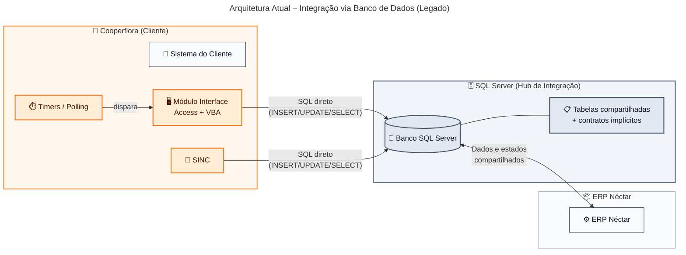
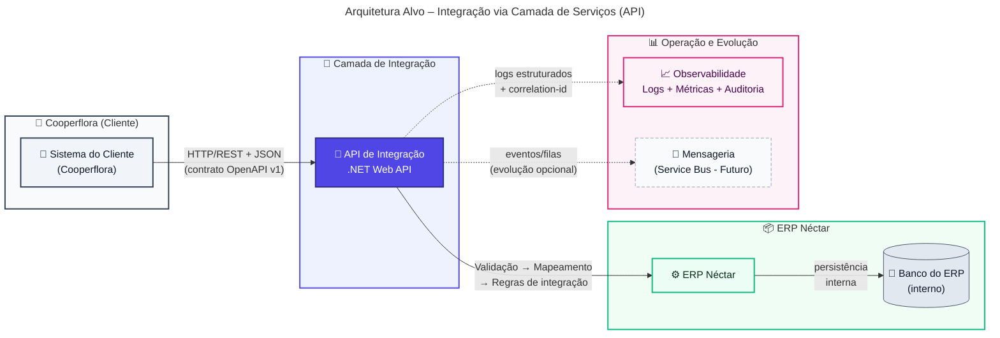
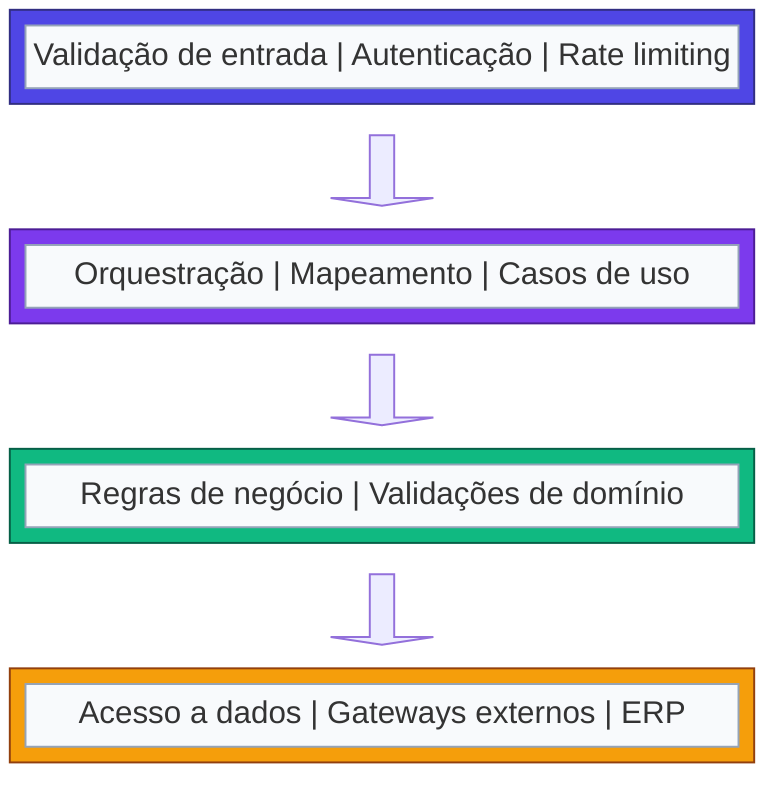
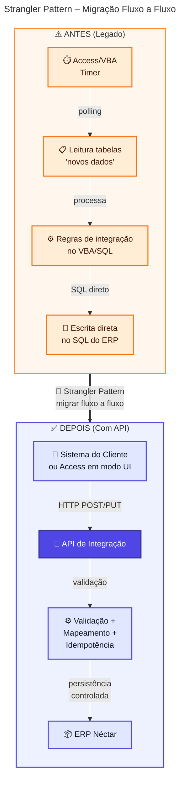
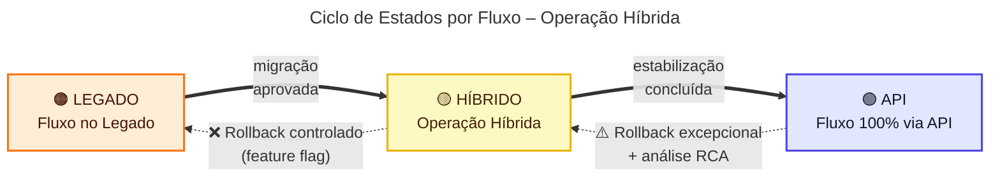
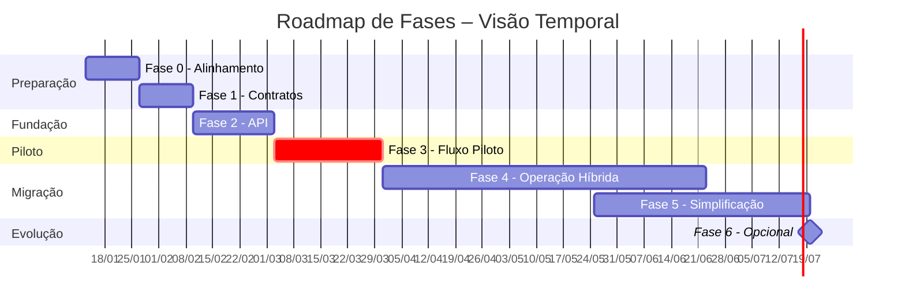

# Plano de Projeto – Modernização do Módulo Integrador do Sistema Néctar (Cooperflora)

> Data de referência: **13 de janeiro de 2026**

## Introdução

Este projeto visa modernizar o **Módulo Integrador/Interface (Access + VBA)** utilizado pela Cooperflora para integrar com o ERP Néctar, reduzindo a dependência de **acesso direto ao SQL Server** (banco como “hub” de integração). O objetivo é assegurar **continuidade operacional** e **previsibilidade** para o negócio, ao mesmo tempo em que se prepara a integração para cenários em que **não haverá banco compartilhado** e onde podem existir **restrições de rede/credenciais** e evolução para nuvem.

A modernização será conduzida de forma **incremental**, por fluxo, seguindo o **Strangler Pattern**: seleciona-se um fluxo piloto, implementa-se via API com contratos e observabilidade, e mantém-se convivência controlada com o legado até estabilização. Essa estratégia reduz risco de transição, melhora governança (definição de dono do dado, versionamento e critérios de aceite) e aumenta a capacidade de resposta a mudanças sem impacto desproporcional em operação e suporte.

Ao final, espera-se uma integração com **contratos explícitos** (OpenAPI), **segurança e controle de acesso**, e **rastreabilidade de ponta a ponta** (logs estruturados, métricas e auditoria por transação). Para BDMs, isso se traduz em menor risco operacional, menor custo de incidentes e maior agilidade para habilitar novos fluxos e evoluções; para TDMs, em uma base técnica governável e sustentável para evolução contínua.

### Objetivo

Este documento consolida o **plano de projeto** para modernização do Módulo Integrador/Interface da Cooperflora, orientando a transição de uma integração baseada em **banco de dados como interface** para uma **camada de serviços (API)**. Ele estrutura o **porquê** (necessidade e urgência), o **o quê** (escopo e entregáveis) e o **como** (estratégia incremental, cronograma, governança e mitigação de riscos).

| Stakeholder                          | O que este documento oferece                                                                         |
| ------------------------------------ | ---------------------------------------------------------------------------------------------------- |
| **BDMs** (Business Decision Makers)  | Visão de valor, riscos de negócio, investimento, critérios de sucesso e impacto em operações         |
| **TDMs** (Technical Decision Makers) | Direcionadores técnicos, arquitetura, contratos, segurança, observabilidade e convivência com legado |

O documento serve como **referência de acompanhamento**, com critérios de aceite e pontos de controle para garantir previsibilidade durante a execução.

### Situação atual e motivação

Hoje, a integração entre o sistema da Cooperflora e o ERP Néctar depende de **co-localização** e de **acesso direto ao SQL Server**, que acaba operando como “hub” de integração. O módulo legado (Access + VBA) e rotinas auxiliares (SINC) leem e escrevem diretamente em tabelas do ERP, usando estados e convenções para orquestrar fluxos.

Embora viável no cenário atual, esse modelo cria dependências difíceis de governar: o banco vira a “interface” e os contratos passam a ser definidos pelo schema e por comportamento histórico. Para o negócio, isso se traduz em **maior risco operacional** (incidentes quando há mudanças de estrutura/infra), **custo de suporte elevado** e **baixa previsibilidade** em homologação e evolução, pois faltam contratos versionados e rastreabilidade por transação.

Além disso, o cenário futuro **não prevê banco compartilhado** nem acesso direto entre ambientes, o que torna a abordagem atual um bloqueio para evolução (segregação de rede/credenciais e eventual nuvem). A motivação central é migrar para uma **camada de serviços** com contratos explícitos, controle de acesso e observabilidade, permitindo modernização **fluxo a fluxo** com risco controlado e operação contínua.

| Aspecto da Situação Atual (resumo executivo)                            | Descrição Detalhada                                                                                                                                                                                                                                                                                                                                                                               | Impacto (negócio)                                                                                                                                                                                | Objetivo (negócio e técnico)                                                                                                                                                                        |
| ----------------------------------------------------------------------- | ------------------------------------------------------------------------------------------------------------------------------------------------------------------------------------------------------------------------------------------------------------------------------------------------------------------------------------------------------------------------------------------------- | ------------------------------------------------------------------------------------------------------------------------------------------------------------------------------------------------ | --------------------------------------------------------------------------------------------------------------------------------------------------------------------------------------------------- |
| Integração acoplada ao banco do ERP (SQL Server como “hub”)             | A integração ocorre por **acesso direto às tabelas** do banco do ERP, com leituras/escritas que funcionam porque os sistemas estão no mesmo servidor e o SQL Server atua como camada de integração.<br><br>Na prática, o banco de dados vira um barramento: o módulo Access/VBA e/ou o SINC operam sobre tabelas compartilhadas e estados de processamento, sem uma camada explícita de serviços. | Aumenta risco de indisponibilidade e incidentes em mudanças (schema/infra), eleva custo de suporte e dificulta escalar/segregar ambientes; limita decisões de arquitetura e iniciativas futuras. | Substituir o “hub” no banco por uma camada de serviços (API) com controle de acesso e governança, reduzindo dependência de co-localização e viabilizando o cenário sem banco compartilhado.         |
| Contratos de integração implícitos (regras “de fato”, não formalizadas) | Dados e estados de integração são representados por tabelas e colunas cuja semântica é conhecida “por tradição” e por comportamento do código legado, não por contratos formais versionados.<br><br>O comportamento depende de detalhes de schema e de convenções de preenchimento, frequentemente sem documentação suficiente e com alto risco de regressões.                                    | Homologação mais lenta e imprevisível, maior chance de retrabalho e regressões, divergência de entendimento entre áreas e aumento de incidentes em mudanças.                                     | Formalizar contratos e padrões (ex.: OpenAPI, versionamento e erros), reduzindo ambiguidades e permitindo evolução controlada por versão/fluxo.                                                     |
| Orquestração por timers/polling                                         | O módulo Access/VBA executa rotinas por **timers**, que varrem dados “novos”, aplicam regras e persistem resultados, com janela de tempo como mecanismo de orquestração.<br><br>Esse padrão tende a gerar concorrência, duplicidades e dependência de intervalos de execução, além de dificultar rastreio de causa raiz.                                                                          | Gera atrasos variáveis, duplicidades e janelas operacionais difíceis de gerenciar; aumenta impacto de falhas silenciosas e dificulta cumprir SLAs por fluxo.                                     | Migrar gradualmente para integrações orientadas a transação/serviço, reduzindo polling e estabelecendo controles (idempotência, reprocessamento) com previsibilidade operacional.                   |
| Regras críticas no legado (VBA/rotinas de tela)                         | Parte relevante da lógica de integração e validações está implementada em eventos de formulários e rotinas VBA, misturando UI, regras e integração em um único lugar.<br><br>Isso cria um monólito difícil de testar e evoluir, com maior chance de efeitos colaterais e dependência de especialistas no legado.                                                                                  | Eleva custo e risco de mudanças, cria dependência de conhecimento específico, dificulta escalabilidade do time e aumenta probabilidade de regressões em produção.                                | Centralizar regras de integração em serviços testáveis e governáveis, reduzindo acoplamento com a UI e melhorando capacidade de evolução com segurança.                                             |
| Governança de dados pouco definida (source of truth)                    | Não há uma matriz formal de “quem é dono” (source of truth) de cada dado/domínio, o que dificulta decisões sobre direção do fluxo e tratamentos de conflito.<br><br>Na prática, as rotinas podem realizar dual-write ou assumir precedência baseada em convenções não documentadas.                                                                                                               | Aumenta inconsistências e conciliações manuais, gera conflitos entre sistemas e amplia risco operacional e de auditoria durante operação híbrida.                                                | Definir propriedade e direção do fluxo por domínio, com critérios claros de resolução de conflitos, suportando migração por fluxo com menor risco.                                                  |
| Baixa visibilidade operacional (observabilidade e rastreabilidade)      | Falhas podem ser percebidas tardiamente, e o rastreio depende de logs esparsos, estados em tabelas ou investigação manual no banco/Access.<br><br>A ausência de correlação de transações torna difícil identificar o que foi recebido, processado, rejeitado, reprocessado ou duplicado.                                                                                                          | Aumenta MTTR e impacto de incidentes, reduz transparência para gestão e suporte, dificulta governança e tomada de decisão baseada em dados.                                                      | Implementar observabilidade (logs estruturados, métricas, auditoria e correlação por transação), com dashboards/alertas por fluxo para operação e governança.                                       |
| Modelo limita evolução para ambientes segregados/nuvem                  | A arquitetura atual depende de proximidade física e acesso ao SQL Server; se houver isolamento de rede, segregação de credenciais ou nuvem, a integração pode simplesmente não funcionar.<br><br>Além disso, o legado tem limitações tecnológicas e custos crescentes de manutenção.                                                                                                              | Bloqueia iniciativas de modernização/segregação, aumenta risco de ruptura em mudanças de infraestrutura e reduz flexibilidade para novas integrações e expansão.                                 | Preparar a integração para operar com segurança em cenários segregados/nuvem, preservando continuidade do negócio e abrindo caminho para evoluções futuras (incl. mensageria quando fizer sentido). |

### Escopo do Projeto

Esta seção define a **Declaração de Escopo** do projeto (referência PMBOK): descreve o que será entregue, os limites do trabalho e o que será considerado sucesso. Ela funciona como **baseline** para planejamento e controle — orienta cronograma, custos, governança e critérios de aceite, e reduz ambiguidades durante a execução.

Os itens listados na tabela a seguir representam os **entregáveis e capacidades em escopo** para modernização do Módulo Integrador/Interface, incluindo a transição do modelo “banco como integração” para uma camada de serviços, com contratos, segurança, observabilidade e operação híbrida. Em outras palavras: o que está descrito aqui é aquilo que o projeto se compromete a implementar, dentro das premissas e restrições do contexto (legado em produção, migração incremental por fluxo e continuidade operacional).

Regra de governança do escopo: **tudo o que não estiver descrito nesta seção é automaticamente considerado fora de escopo**. Isso inclui, por padrão, qualquer iniciativa adicional não explicitada (ex.: reimplementar o ERP, substituir o sistema do cliente, mudanças amplas de infraestrutura não necessárias ao integrador, ou novos fluxos/funcionalidades não listados), mesmo que correlata ao tema. Essa regra evita "scope creep" e preserva previsibilidade de prazo e investimento.

Qualquer necessidade nova ou ajuste relevante deve seguir **controle de mudanças**: registrar a solicitação, avaliar impacto (prazo/custo/risco/arquitetura/operação), obter aprovação e, somente então, atualizar esta seção (baseline) e os planos associados.

| Item de Escopo                                           | Descrição Detalhada                                                                                                                                                                                                                                                                                                                                                                                                                                                                                                                                     | Benefícios Esperados                                                                                                                      |
| -------------------------------------------------------- | ------------------------------------------------------------------------------------------------------------------------------------------------------------------------------------------------------------------------------------------------------------------------------------------------------------------------------------------------------------------------------------------------------------------------------------------------------------------------------------------------------------------------------------------------------- | ----------------------------------------------------------------------------------------------------------------------------------------- |
| API de Integração (.NET Web API) — fundação técnica      | Implementar a **camada intermediária** responsável por expor endpoints/consumers e centralizar a lógica de integração.<br><br>Inclui (mínimo): estrutura de solução e arquitetura (camadas/limites), validação de entrada, padronização de erros, resiliência (timeouts/retries controlados), health checks, logging estruturado e correlação por transação (correlation-id).<br><br>Integração com o ERP via componentes definidos (ex.: chamadas ao ERP e/ou acesso ao SQL Server do ERP quando aplicável), sem expor o banco como interface externa. | Reduz dependência de co-localização e do banco como “hub”, elevando governança e previsibilidade.                                         |
| Contratos OpenAPI — governança e versionamento           | Definir contratos por domínio/fluxo (ex.: pessoas, produtos, pedidos), com **OpenAPI/Swagger** como fonte de verdade.<br><br>Inclui: modelagem de payloads, validações, códigos de retorno, taxonomia de erros, regras de breaking change, estratégia de versionamento (ex.: `/v1`, `/v2`) e requisitos mínimos por fluxo (idempotência, limites e SLAs alvo quando aplicável).<br><br>Artefatos gerados: especificação OpenAPI versionada e checklist de conformidade por endpoint (DoD de contrato).                                                  | Reduz ambiguidades, acelera homologação e viabiliza evolução controlada por versão.                                                       |
| Fluxo piloto end-to-end — “Cadastro de Pessoas”          | Selecionar e implementar um fluxo piloto de alto valor e risco controlado, com execução completa via API.<br><br>Inclui: mapeamento do fluxo no legado (VBA/SQL/SINC), contrato OpenAPI, validações, idempotência, instrumentação (logs/métricas/auditoria), testes (unitário/integração/E2E quando aplicável), e plano de estabilização em produção (janela, métricas de sucesso, rollback).<br><br>Resultado esperado: blueprint repetível para os demais fluxos.                                                                                     | Entrega valor cedo com risco controlado, provando padrões e acelerando a migração por ondas.                                              |
| Operação híbrida por fluxo — roteamento e rollback       | Definir e implementar convivência **por fluxo** (Legado/Híbrido/API), com roteamento explícito e governado.<br><br>Inclui: feature flags por fluxo, critérios de cutover, procedimentos de fallback/rollback, trilha de decisão (quem aprova e quando), e observabilidade comparativa (legado vs API) para detectar desvios.<br><br>Premissa operacional: evitar dual-write e reduzir conflitos com regras claras de propriedade do dado por domínio.                                                                                                   | Mantém continuidade do negócio durante a transição e reduz custo de incidentes em mudanças.                                               |
| Descomissionamento de timers/polling e acessos diretos   | Reduzir progressivamente timers do Access/VBA e rotinas que leem/escrevem direto no SQL do ERP.<br><br>Inclui: inventário e classificação de timers, substituição por chamadas transacionais via API, definição de controles (idempotência/reprocessamento), e roadmap de desligamento com critérios de aceite por fluxo.<br><br>Durante transição, timers remanescentes devem ser tratados como temporários e monitorados (alertas/telemetria).                                                                                                        | Reduz atrasos variáveis, duplicidades e fragilidade por concorrência; aumenta previsibilidade operacional.                                |
| Observabilidade e auditoria por transação                | Implementar capacidade de operação e diagnóstico por fluxo: logs estruturados, métricas (latência, taxa de erro, volume), auditoria por transação e correlação ponta a ponta (correlation-id propagado).<br><br>Inclui: dashboards e alertas operacionais, trilha de reprocessamento e evidências para suporte/auditoria, com visão por ambiente e criticidade.<br><br>Objetivo técnico: reduzir investigação manual em banco/Access e tornar falhas detectáveis rapidamente.                                                                           | Reduz MTTR, melhora governança e dá transparência para gestão e operação.                                                                 |
| Segurança da API — autenticação, autorização e hardening | Definir e implementar autenticação/autorização para consumo da API e padrões de segurança operacional.<br><br>Inclui: mecanismo de auth (ex.: OAuth2, API Key, mTLS conforme restrição), segregação de ambientes/segredos, validação de payload, rate limiting e práticas de hardening de endpoints.<br><br>Também inclui padrões mínimos de acesso a dados internos (princípio do menor privilégio) para reduzir risco de exposição.                                                                                                                   | Reduz risco de exposição e substitui o “acesso ao banco” como mecanismo de integração; habilita cenários com rede/credenciais segregadas. |
| Preparação para evolução event-driven (opcional)         | Planejar (sem implantar obrigatoriamente) a evolução para assíncrono onde fizer sentido.<br><br>Inclui: modelagem de eventos por domínio, critérios para quando usar síncrono vs assíncrono, desenho de padrões (retry, DLQ, idempotência, ordenação), e requisitos para adoção futura de fila (ex.: Service Bus).<br><br>Entregável: guideline técnico e backlog priorizado para evolução, sem desviar do foco do MVP (API + fluxos críticos).                                                                                                         | Evita “becos sem saída” arquiteturais e preserva foco no essencial, mantendo caminho claro para evoluções futuras.                        |

#### Escopo por domínio de negócio

A tabela acima detalha os entregáveis técnicos. Abaixo, a mesma visão é organizada por **domínio de negócio**, facilitando o entendimento dos stakeholders sobre quais áreas serão impactadas e em qual sequência.

| Domínio                     | Fluxos em Escopo                                                 | Valor de Negócio                                                                                                            | Prioridade Sugerida    |
| --------------------------- | ---------------------------------------------------------------- | --------------------------------------------------------------------------------------------------------------------------- | ---------------------- |
| **Fundação de Plataforma**  | API de Integração, Contratos OpenAPI, Observabilidade, Segurança | Habilita todos os demais fluxos; sem fundação, não há migração                                                              | Alta (Fase 1–2)        |
| **Cadastros (Master Data)** | Pessoas (piloto), Produtos, Tabelas auxiliares                   | Aumenta previsibilidade e reduz incidentes cadastrais; ideal para validar padrões sem afetar transações de alta criticidade | Alta (Fase 3–4)        |
| **Comercial**               | Pedidos e movimentos                                             | Melhora rastreio operacional e reduz retrabalho; exige governança de consistência (correlation-id, auditoria)               | Média (Fase 4)         |
| **Fiscal/Faturamento**      | Faturamento, notas fiscais                                       | Reduz risco de falhas silenciosas; recomendado após consolidação do padrão nos cadastros                                    | Média-Baixa (Fase 4–5) |
| **Operação e Governança**   | Runbooks, dashboards, alertas, gestão de mudanças                | Garante continuidade e capacidade de suporte durante operação híbrida                                                       | Contínuo               |

#### Fora do escopo

Delimitar explicitamente o que está **fora do escopo** é uma boa prática de gestão de projetos (PMBOK, Change Control). Isso evita "scope creep", mantém o projeto gerenciável e preserva foco na modernização incremental com entregas verificáveis.

| Item fora do escopo                                  | Justificativa                                                                                                         |
| ---------------------------------------------------- | --------------------------------------------------------------------------------------------------------------------- |
| Reescrita completa do ERP Néctar                     | Programa maior e não necessário para remover o acoplamento de integração                                              |
| Reescrita completa do sistema do cliente             | O projeto foca no integrador; mudanças no cliente serão restritas ao necessário para consumir a API                   |
| Migração completa para arquitetura event-driven      | A Fase 6 prevê evolução opcional; o objetivo principal é remover o banco como camada de integração                    |
| Projeto integral de migração para Nimbus             | O escopo contempla preparação arquitetural e roadmap, não a migração completa                                         |
| Mudanças funcionais profundas no processo de negócio | O foco é modernização técnica e redução de risco, mantendo comportamento funcional compatível                         |
| Novas integrações não listadas                       | Qualquer fluxo não explicitado na tabela de entregáveis deve passar por controle de mudanças antes de ser incorporado |

## Visão Geral da Arquitetura Atual e Alvo

### Arquitetura atual

A Cooperflora utiliza um **Módulo Integrador/Interface (Access + VBA)**, com apoio do componente **SINC**, operando com forte dependência do **SQL Server** do ERP como ambiente de integração. Na prática, a integração é implementada como **acesso direto a tabelas** (leitura e escrita), com o banco assumindo o papel de “barramento” através de tabelas compartilhadas, flags/status e convenções que representam estados do processo.

O modelo é sustentado por **timers/polling**: rotinas periódicas varrem registros “novos”, aplicam validações/regras e persistem resultados no banco do ERP, em geral sem uma fronteira de serviço explícita. Do ponto de vista técnico, isso aumenta o acoplamento ao schema e cria dependência de comportamentos históricos (contratos implícitos), além de dificultar isolamento de responsabilidades entre UI/legado, regras de integração e persistência.

Essa topologia funciona sobretudo por **co-localização** (mesmo servidor ou rede com acesso amplo) e por credenciais/acessos permissivos ao SQL Server. Em cenários com segregação de rede, credenciais e ambientes (ou evolução para nuvem), o padrão tende a falhar ou exigir exceções arquiteturais, elevando risco operacional e complexidade de manutenção.


```mermaid
---
title: "Arquitetura Atual – Integração via Banco de Dados (Legado)"
---
flowchart LR
  %% ═══════════════════════════════════════════════════════════════
  %% DIAGRAMA: Arquitetura atual (AS-IS)
  %% PROPÓSITO: Documentar o modelo de integração legado baseado em
  %%            acesso direto ao SQL Server como hub de integração
  %% ═══════════════════════════════════════════════════════════════

  subgraph Cooperflora ["🏢 Cooperflora (Cliente)"]
    direction TB
    CLIENTE["📱 Sistema do Cliente"]
    ACCESS["🖥️ Módulo Interface\nAccess + VBA"]
    TIMER["⏱️ Timers / Polling"]
    SINC["🔄 SINC"]
    TIMER -->|"dispara"| ACCESS
  end

  subgraph SQL ["🗄️ SQL Server (Hub de Integração)"]
    direction TB
    DB[("💾 Banco SQL Server")]
    TSHARED["📋 Tabelas compartilhadas\n+ contratos implícitos"]
    DB --- TSHARED
  end

  subgraph Nectar ["📦 ERP Néctar"]
    ERP["⚙️ ERP Néctar"]
  end

  %% Fluxos de dados (acesso direto ao banco)
  ACCESS -->|"SQL direto\n(INSERT/UPDATE/SELECT)"| DB
  SINC -->|"SQL direto\n(INSERT/UPDATE/SELECT)"| DB
  DB <-->|"Dados e estados\ncompartilhados"| ERP

  %% ═══════════════════════════════════════════════════════════════
  %% FLUXO SIMPLIFICADO
  %% 1. Timers disparam periodicamente o Access/VBA
  %% 2. Access e SINC leem/escrevem diretamente no SQL Server
  %% 3. ERP Néctar compartilha o mesmo banco como "hub"
  %% ➡️ Problema: acoplamento forte via schema/tabelas
  %% ═══════════════════════════════════════════════════════════════

  %% ═══════════════════════════════════════════════════════════════
  %% LEGENDA DE CORES
  %% - Laranja: Componentes legado/integração atual
  %% - Cinza: Armazenamento de dados
  %% - Neutro: Sistemas externos
  %% ═══════════════════════════════════════════════════════════════
  classDef legacy fill:#FFEDD5,stroke:#F97316,color:#431407,stroke-width:2px;
  classDef datastore fill:#E2E8F0,stroke:#475569,color:#0F172A,stroke-width:2px;
  classDef system fill:#F8FAFC,stroke:#334155,color:#0F172A,stroke-width:1px;

  class ACCESS,TIMER,SINC legacy
  class DB,TSHARED datastore
  class CLIENTE,ERP system

  style Cooperflora fill:#FFF7ED,stroke:#FB923C,stroke-width:2px
  style SQL fill:#F1F5F9,stroke:#64748B,stroke-width:2px
  style Nectar fill:#F8FAFC,stroke:#94A3B8,stroke-width:1px
```

### Visão geral comparativa

| Dimensão                                    | Arquitetura Atual                                                                                                                     | Arquitetura Alvo                                                                                                                   | Benefícios esperados                                                                                                                                        |
| ------------------------------------------- | ------------------------------------------------------------------------------------------------------------------------------------- | ---------------------------------------------------------------------------------------------------------------------------------- | ----------------------------------------------------------------------------------------------------------------------------------------------------------- |
| Fronteira de integração e acoplamento       | Banco como interface: dependência direta de schema/tabelas, co-localização e credenciais; mudanças de banco/infra afetam integrações. | API como fronteira: contratos e gateways definidos; banco do ERP permanece interno ao ERP (não é interface externa).               | Reduz acoplamento e risco de ruptura; substitui o "hub" no banco por camada de serviços; habilita operação em cenários segregados/nuvem.                    |
| Mecanismo de execução e orquestração        | Timers/polling no Access/VBA; varredura de "novos" registros; concorrência/duplicidade dependem de convenções e estados em tabelas.   | Integração transacional via REST/JSON; orquestração explícita na API; evolução opcional para assíncrono quando houver ganho claro. | Elimina polling/timers; melhora previsibilidade de execução; controle explícito de concorrência e reprocessamento.                                          |
| Contratos e versionamento                   | Contratos implícitos (colunas/flags/convenções); sem versionamento formal; alto risco de regressão em alterações.                     | OpenAPI como fonte de verdade; versionamento semântico (ex.: `/v1`); taxonomia de erros e validações padronizadas.                 | Elimina ambiguidades e "efeitos colaterais"; habilita testes de contrato automatizados e compatibilidade planejada entre versões.                           |
| Observabilidade e rastreabilidade           | Baixa: rastreio por investigação em Access/SQL, logs esparsos e estados em tabelas; correlação entre etapas é limitada.               | Logs estruturados, correlation-id ponta a ponta, métricas por endpoint/fluxo, dashboards/alertas e auditoria por transação.        | Reduz MTTR; diagnóstico end-to-end via correlation-id; governança operacional com métricas, alertas e trilha de auditoria.                                  |
| Resiliência, idempotência e reprocessamento | Tratamento de falhas "informal": retries manuais/rotinas; risco de duplicidade e inconsistência em reprocessos.                       | Timeouts/retries controlados, idempotência por chave, políticas de erro padronizadas e trilha de reprocessamento auditável.        | Elimina duplicidades e inconsistências; aumenta robustez frente a falhas de rede/ERP; reprocessamento seguro e auditável.                                   |
| Evolução e governança de mudança            | Evolução lenta e arriscada; dependência de especialistas no legado; mudanças no banco podem quebrar integrações sem sinalização.      | Migração incremental (strangler) por fluxo; feature flags e rollback; governança de contrato/escopo e padrões repetíveis.          | Acelera evolução com risco controlado; reduz dependência do legado; centraliza regras em serviços governáveis; viabiliza migração incremental com rollback. |

### Arquitetura alvo

A arquitetura alvo introduz uma **API de Integração (.NET Web API)** como fronteira explícita entre o sistema da Cooperflora e o ERP Néctar, eliminando o banco como mecanismo de integração. O cliente passa a integrar por **HTTP/REST + JSON**, e a API concentra responsabilidades de integração: validação, normalização/mapeamento, aplicação de regras de integração, orquestração e persistência através de mecanismos internos (ex.: chamadas ao ERP e/ou acesso ao SQL do ERP quando aplicável), sem expor o banco como interface.

Do ponto de vista de engenharia, a API estabelece padrões essenciais: **contratos OpenAPI** versionados, taxonomia de erros, idempotência por chave, e controles de resiliência (timeouts/retries), reduzindo duplicidades e inconsistências em reprocessamentos. A convivência com o legado é suportada por operação híbrida por fluxo (feature flags/roteamento), permitindo migração incremental com rollback controlado.

Como requisito operacional, a arquitetura alvo incorpora **observabilidade** (logs estruturados, métricas, auditoria e correlation-id) e prepara o caminho para evolução assíncrona (ex.: fila/eventos) onde houver ganho claro, mantendo o princípio central: **a integração não depende de acesso direto ao banco do ERP** e pode operar em cenários segregados/nuvem.


```mermaid
---
title: "Arquitetura Alvo – Integração via Camada de Serviços (API)"
---
flowchart LR
  %% ═══════════════════════════════════════════════════════════════
  %% DIAGRAMA: Arquitetura alvo (TO-BE)
  %% PROPÓSITO: Documentar o modelo moderno de integração baseado em
  %%            API REST com contratos OpenAPI, observabilidade e
  %%            preparação para evolução event-driven
  %% ═══════════════════════════════════════════════════════════════

  subgraph Cooperflora ["🏢 Cooperflora (Cliente)"]
    CLIENTE["📱 Sistema do Cliente\n(Cooperflora)"]
  end

  subgraph Integracao ["🔗 Camada de Integração"]
    API["🚀 API de Integração\n.NET Web API"]
  end

  subgraph Nectar ["📦 ERP Néctar"]
    ERP["⚙️ ERP Néctar"]
    DBERP[("💾 Banco do ERP\n(interno)")]
    ERP -->|"persistência\ninterna"| DBERP
  end

  subgraph Plataforma ["📊 Operação e Evolução"]
    OBS["📈 Observabilidade\nLogs + Métricas + Auditoria"]
    FUTURO["📨 Mensageria\n(Service Bus - Futuro)"]
  end

  %% Fluxo principal (síncrono)
  CLIENTE -->|"HTTP/REST + JSON\n(contrato OpenAPI v1)"| API
  API -->|"Validação → Mapeamento\n→ Regras de integração"| ERP

  %% Fluxos auxiliares (observabilidade e evolução)
  API -.->|"logs estruturados\n+ correlation-id"| OBS
  API -.->|"eventos/filas\n(evolução opcional)"| FUTURO

  %% ═══════════════════════════════════════════════════════════════
  %% FLUXO SIMPLIFICADO
  %% 1. Cliente envia requisição HTTP/REST para a API
  %% 2. API valida, mapeia e aplica regras de integração
  %% 3. API persiste no ERP (banco interno, não exposto)
  %% 4. Observabilidade captura logs e métricas
  %% ✅ Benefício: desacoplamento total do banco
  %% ═══════════════════════════════════════════════════════════════

  %% ═══════════════════════════════════════════════════════════════
  %% LEGENDA DE CORES (Paleta Moderna)
  %% - Indigo (#4F46E5): API / Camada de integração (destaque)
  %% - Emerald (#10B981): ERP / Sistema de destino
  %% - Pink (#DB2777): Observabilidade / Operação
  %% - Tracejado: Componentes opcionais/futuros
  %% ═══════════════════════════════════════════════════════════════
  classDef client fill:#F1F5F9,stroke:#334155,color:#0F172A,stroke-width:2px;
  classDef api fill:#4F46E5,stroke:#312E81,color:#FFFFFF,stroke-width:2px;
  classDef erp fill:#ECFDF5,stroke:#10B981,color:#052E16,stroke-width:2px;
  classDef datastore fill:#E2E8F0,stroke:#475569,color:#0F172A,stroke-width:1px;
  classDef obs fill:#FDF2F8,stroke:#DB2777,color:#4A044E,stroke-width:2px;
  classDef optional fill:#F8FAFC,stroke:#94A3B8,color:#0F172A,stroke-width:1px,stroke-dasharray: 5 3;

  class CLIENTE client
  class API api
  class ERP erp
  class DBERP datastore
  class OBS obs
  class FUTURO optional

  style Cooperflora fill:#F8FAFC,stroke:#334155,stroke-width:2px
  style Integracao fill:#EEF2FF,stroke:#4F46E5,stroke-width:2px
  style Nectar fill:#F0FDF4,stroke:#10B981,stroke-width:2px
  style Plataforma fill:#FDF2F8,stroke:#DB2777,stroke-width:2px
```

### Princípios arquiteturais

Os princípios abaixo orientam as decisões técnicas do projeto, organizados conforme o modelo **BDAT** (Business, Data, Application, Technology) do framework TOGAF. Cada princípio inclui a razão de negócio (BDM) e as implicações técnicas (TDM).

#### Princípios de Negócio (Business)

| Princípio                    | Descrição                                                           | Implicação para BDMs                                    | Implicação para TDMs                                     |
| ---------------------------- | ------------------------------------------------------------------- | ------------------------------------------------------- | -------------------------------------------------------- |
| **Continuidade operacional** | A integração deve funcionar sem interrupções durante a modernização | Operações não param; risco de transição mitigado        | Operação híbrida por fluxo; rollback controlado          |
| **Evolução incremental**     | Migração fluxo a fluxo (Strangler Pattern), sem "big bang"          | Entregas frequentes; valor demonstrado progressivamente | Feature flags; convivência legado/API por fluxo          |
| **Governança de mudanças**   | Mudanças seguem controle formal com critérios de aceite             | Previsibilidade de prazo/custo; escopo protegido        | Versionamento de contratos; breaking changes controlados |

#### Princípios de Dados (Data)

| Princípio                          | Descrição                                                | Implicação para BDMs                        | Implicação para TDMs                              |
| ---------------------------------- | -------------------------------------------------------- | ------------------------------------------- | ------------------------------------------------- |
| **Source of truth definido**       | Cada domínio tem um dono claro (quem é fonte de verdade) | Reduz conflitos e conciliações manuais      | Direção de fluxo explícita; sem dual-write        |
| **Contratos explícitos (OpenAPI)** | Payloads, erros e versões documentados formalmente       | Homologação mais rápida; menos ambiguidades | OpenAPI como fonte de verdade; testes de contrato |
| **Rastreabilidade por transação**  | Toda operação é rastreável ponta a ponta                 | Auditoria facilitada; diagnóstico rápido    | Correlation-id propagado; logs estruturados       |

#### Princípios de Aplicação (Application)

| Princípio                                       | Descrição                                       | Implicação para BDMs                         | Implicação para TDMs                               |
| ----------------------------------------------- | ----------------------------------------------- | -------------------------------------------- | -------------------------------------------------- |
| **Desacoplamento (sem acesso direto ao banco)** | Sistema do cliente não depende do schema do ERP | Mudanças no ERP não quebram integrações      | API como fronteira; banco interno ao ERP           |
| **Separação de responsabilidades**              | UI, regras de integração e domínio separados    | Menor dependência de especialistas no legado | Lógica em serviços testáveis; legado reduzido a UI |
| **Idempotência e resiliência**                  | Reprocessamentos não corrompem dados            | Menos incidentes por duplicidade             | Chaves de idempotência; retries controlados        |

#### Princípios de Tecnologia (Technology)

| Princípio                            | Descrição                                            | Implicação para BDMs                         | Implicação para TDMs                            |
| ------------------------------------ | ---------------------------------------------------- | -------------------------------------------- | ----------------------------------------------- |
| **Observabilidade como requisito**   | Tudo que integra deve ser monitorável e auditável    | Visibilidade operacional; MTTR reduzido      | Logs estruturados; métricas; dashboards/alertas |
| **Segurança por design**             | Autenticação, autorização e hardening desde o início | Redução de risco de exposição                | OAuth2/API Key/mTLS; TLS; rate limiting         |
| **Preparação para nuvem/segregação** | Integração funciona sem co-localização de banco      | Habilita iniciativas futuras de modernização | API REST/JSON; sem dependência de rede local    |

### Padrões técnicos de integração

Esta subseção detalha os **padrões técnicos** que operacionalizam os princípios arquiteturais definidos acima. Enquanto os princípios orientam "o quê" e "por quê", os padrões definem "como" implementar.

#### Padrão de API e contratos

| Aspecto           | Padrão Definido                                                                     |
| ----------------- | ----------------------------------------------------------------------------------- |
| **Estilo**        | REST/JSON como protocolo de integração                                              |
| **Contratos**     | OpenAPI/Swagger como fonte de verdade; especificação versionada por fluxo           |
| **Versionamento** | Versão no path (`/v1`, `/v2`); política de compatibilidade e deprecação documentada |
| **Geração**       | Clientes gerados a partir do contrato quando aplicável (SDK, tipos)                 |

#### Tratamento de erros

| Código HTTP | Categoria          | Uso                                                      |
| ----------- | ------------------ | -------------------------------------------------------- |
| 4xx         | Erros de validação | Payload inválido, campos obrigatórios, regras de negócio |
| 401         | Autenticação       | Token ausente ou inválido                                |
| 403         | Autorização        | Permissão negada para a operação                         |
| 409         | Conflito           | Violação de idempotência ou estado inconsistente         |
| 503         | Indisponibilidade  | ERP ou dependência fora do ar                            |

**Payload de erro padrão:**

```json
{
  "code": "VALIDATION_ERROR",
  "message": "Descrição legível do erro",
  "details": [{ "field": "campo", "issue": "descrição" }],
  "correlationId": "uuid-da-transacao"
}
```

#### Idempotência e reprocessamento

| Aspecto           | Padrão                                                                                |
| ----------------- | ------------------------------------------------------------------------------------- |
| **Chave**         | Header `Idempotency-Key` ou chave de negócio + origem (ex.: `pedido-123-cooperflora`) |
| **Comportamento** | Reenvio retorna mesmo resultado sem duplicar efeitos colaterais                       |
| **Auditoria**     | Resultado do reprocessamento registrado com correlation-id                            |
| **Janela**        | Idempotência garantida por período configurável (ex.: 24h)                            |

#### Propriedade de dados (source of truth)

| Domínio     | Source of Truth | Direção do Fluxo                       | Observação        |
| ----------- | --------------- | -------------------------------------- | ----------------- |
| Pessoas     | A definir       | Cooperflora → ERP ou ERP → Cooperflora | Validar na Fase 0 |
| Produtos    | A definir       | A definir                              | Validar na Fase 0 |
| Pedidos     | A definir       | A definir                              | Validar na Fase 0 |
| Faturamento | A definir       | A definir                              | Validar na Fase 0 |

> **Regra**: Evitar dual-write. Quando inevitável durante transição, exigir governança explícita e trilha de auditoria.

#### Evolução para event-driven

| Critério para adoção                        | Padrão                             |
| ------------------------------------------- | ---------------------------------- |
| Picos de carga que exigem desacoplamento    | Considerar fila (ex.: Service Bus) |
| Latência tolerável (não crítico tempo-real) | Candidato a assíncrono             |
| Múltiplos consumidores                      | Modelar como evento publicado      |

**Padrões obrigatórios para event-driven:**

- Dead Letter Queue (DLQ) para mensagens não processadas
- Retries com backoff exponencial
- Tratamento de poison messages
- Preservação de correlation-id entre eventos

### Diretrizes de arquitetura e desenvolvimento

#### Arquitetura em camadas


```mermaid
---
title: "Arquitetura em Camadas – API de Integração"
---
block-beta
  columns 1

  block:api["🌐 API (Controllers)"]:1
    columns 1
    api_desc["Validação de entrada | Autenticação | Rate limiting"]
  end

  down1<["&nbsp;"]>(down)

  block:app["⚙️ Aplicação (Services)"]:1
    columns 1
    app_desc["Orquestração | Mapeamento | Casos de uso"]
  end

  down2<["&nbsp;"]>(down)

  block:domain["📦 Domínio (Entities)"]:1
    columns 1
    domain_desc["Regras de negócio | Validações de domínio"]
  end

  down3<["&nbsp;"]>(down)

  block:infra["🗄️ Infraestrutura (Repositories)"]:1
    columns 1
    infra_desc["Acesso a dados | Gateways externos | ERP"]
  end

  classDef apiStyle fill:#4F46E5,stroke:#312E81,color:#FFFFFF
  classDef appStyle fill:#7C3AED,stroke:#4C1D95,color:#FFFFFF
  classDef domainStyle fill:#10B981,stroke:#065F46,color:#FFFFFF
  classDef infraStyle fill:#F59E0B,stroke:#92400E,color:#FFFFFF
  classDef descStyle fill:#F8FAFC,stroke:#94A3B8,color:#334155

  class api apiStyle
  class app appStyle
  class domain domainStyle
  class infra infraStyle
  class api_desc,app_desc,domain_desc,infra_desc descStyle
```

| Diretriz                       | Descrição                                          |
| ------------------------------ | -------------------------------------------------- |
| Validação na borda             | Validar entrada na camada API antes de propagar    |
| Regras de integração testáveis | Lógica em serviços com injeção de dependência      |
| Desacoplamento do ERP          | Acesso ao ERP via gateways/repositórios abstraídos |

#### Estratégia de testes

| Tipo           | Escopo                           | Ferramenta/Abordagem                    |
| -------------- | -------------------------------- | --------------------------------------- |
| **Unitário**   | Regras de validação e mapeamento | xUnit/NUnit + mocks                     |
| **Integração** | API ↔ ERP (ou mocks controlados) | TestServer + dados de referência        |
| **Contrato**   | Validação do OpenAPI             | Mock server / consumer-driven contracts |
| **E2E**        | Cenários por fluxo               | Auditoria de efeitos + correlation-id   |

#### DevOps e ambientes

| Ambiente | Propósito                          | Dados                                |
| -------- | ---------------------------------- | ------------------------------------ |
| **DEV**  | Desenvolvimento e testes unitários | Dados sintéticos ou anonimizados     |
| **HML**  | Homologação com stakeholders       | Dados representativos (anonimizados) |
| **PRD**  | Produção                           | Dados reais                          |

**Pipeline CI/CD:**

1. Build + lint
2. Testes unitários
3. Validação de contrato OpenAPI
4. Testes de integração
5. Deploy para ambiente alvo
6. Smoke test pós-deploy

## Fases do Projeto e Cronograma Macro

Esta seção apresenta o **roadmap de execução** do projeto, organizado em 7 fases (Fase 0 a Fase 6), com cronograma estimado, marcos de decisão e critérios de aceite. A estrutura foi desenhada para dar visibilidade a **BDMs** (valor entregue, riscos de negócio, pontos de decisão) e **TDMs** (dependências técnicas, entregáveis, critérios de qualidade).

### Estratégia de modernização: Strangler Pattern

A abordagem adotada é o **Strangler Pattern**, com extração gradual da lógica de integração do legado e introdução de uma camada de serviço moderna. O processo é executado **fluxo a fluxo**, garantindo continuidade operacional e redução de risco.


```mermaid
---
title: "Strangler Pattern – Migração Fluxo a Fluxo"
---
flowchart TB
  subgraph Antes ["⚠️ ANTES (Legado)"]
    direction TB
    A1["⏱️ Access/VBA\nTimer"] -->|"polling"| A2["📋 Leitura tabelas\n'novos dados'"]
    A2 -->|"processa"| A3["⚙️ Regras de integração\nno VBA/SQL"]
    A3 -->|"SQL direto"| A4["💾 Escrita direta\nno SQL do ERP"]
  end

  subgraph Depois ["✅ DEPOIS (Com API)"]
    direction TB
    B1["📱 Sistema do Cliente\nou Access em modo UI"] -->|"HTTP POST/PUT"| B2["🚀 API de Integração"]
    B2 -->|"validação"| B3["⚙️ Validação +\nMapeamento +\nIdempotência"]
    B3 -->|"persistência\ncontrolada"| B4["📦 ERP Néctar"]
  end

  Antes ==>|"🔄 Strangler Pattern\nmigrar fluxo a fluxo"| Depois

  classDef legacy fill:#FFEDD5,stroke:#F97316,color:#431407,stroke-width:2px;
  classDef modern fill:#E0E7FF,stroke:#4F46E5,color:#111827,stroke-width:2px;
  classDef api fill:#4F46E5,stroke:#312E81,color:#FFFFFF,stroke-width:2px;

  class A1,A2,A3,A4 legacy
  class B1,B3,B4 modern
  class B2 api

  style Antes fill:#FFF7ED,stroke:#FB923C,stroke-width:2px
  style Depois fill:#EEF2FF,stroke:#4F46E5,stroke-width:2px
```

**Ciclo de execução por fluxo:**

| Etapa | Ação                                  | Entregável                                      |
| ----- | ------------------------------------- | ----------------------------------------------- |
| 1     | Mapear fluxo e dependências no legado | Diagrama de fluxo + inventário de dependências  |
| 2     | Definir contrato OpenAPI              | Especificação versionada                        |
| 3     | Implementar fluxo na API              | Endpoint com validação, idempotência, auditoria |
| 4     | Roteamento híbrido (legado → API)     | Feature flag ativa + fallback configurado       |
| 5     | Estabilização e desativação do timer  | Métricas OK + timer desligado                   |
| 6     | Repetir para próximo fluxo            | Padrões consolidados                            |

### Operação híbrida e ciclo de estados

A convivência é gerenciada **por fluxo**, não por "sistema inteiro". Cada fluxo transita por três estados, com critérios de transição e possibilidade de rollback.


```mermaid
---
title: "Ciclo de Estados por Fluxo – Operação Híbrida"
---
flowchart LR
  L["🟠 LEGADO\nFluxo no Legado"] ==>|"migração\naprovada"| H["🟡 HÍBRIDO\nOperação Híbrida"]
  H ==>|"estabilização\nconcluída"| N["🟢 API\nFluxo 100% via API"]

  H -.->|"❌ Rollback controlado\n(feature flag)"| L
  N -.->|"⚠️ Rollback excepcional\n+ análise RCA"| H

  classDef legacy fill:#FFEDD5,stroke:#F97316,color:#431407,stroke-width:2px;
  classDef hybrid fill:#FEF9C3,stroke:#EAB308,color:#422006,stroke-width:2px;
  classDef modern fill:#E0E7FF,stroke:#4F46E5,color:#111827,stroke-width:2px;

  class L legacy
  class H hybrid
  class N modern
```

| Estado      | Descrição                                  | Critério de Transição                                 |
| ----------- | ------------------------------------------ | ----------------------------------------------------- |
| **Legado**  | Fluxo operando via timers/polling          | Contrato aprovado + API implementada                  |
| **Híbrido** | API ativa + legado funcional como fallback | Estabilização OK (≥2 semanas sem incidentes críticos) |
| **API**     | Fluxo 100% via API, timer desativado       | Aceite formal + evidência de desativação              |

**Estratégias de rollback:**

- Feature flags por fluxo com roteamento configurável
- Janela de estabilização (ex.: 2 semanas) com monitoramento reforçado
- Reprocessamento via mecanismos de reenvio/replay com idempotência
- Plano de comunicação com critérios de acionamento de rollback

---

### Visão executiva do roadmap

| Fase | Nome                    | Duração Estimada | Marco de Negócio (BDM)                                 | Marco Técnico (TDM)                                    |
| ---- | ----------------------- | ---------------- | ------------------------------------------------------ | ------------------------------------------------------ |
| 0    | Alinhamento e contenção | 1–2 semanas      | Acordo sobre escopo, riscos mapeados                   | Inventário técnico completo, backlog priorizado        |
| 1    | Definição de contratos  | 1–2 semanas      | Contratos aprovados, governança definida               | OpenAPI v1, padrões de integração documentados         |
| 2    | Fundação da API         | 2–3 semanas      | Infraestrutura pronta para piloto                      | API em DEV/HML, pipeline CI/CD, observabilidade básica |
| 3    | Fluxo piloto            | 2–4 semanas      | **Primeiro fluxo em produção**, valor demonstrado      | Piloto estável, padrões validados, lições aprendidas   |
| 4    | Migração por fluxo      | 1–3 meses        | Fluxos críticos migrados, redução de risco operacional | Timers desativados, operação híbrida governada         |
| 5    | Simplificação do legado | 1–2 meses        | Custo de manutenção reduzido, legado estável           | Rotinas de integração removidas, documentação final    |
| 6    | Evolução opcional       | Contínuo         | Novas capacidades habilitadas (quando justificado)     | Mensageria, eventos, preparação para Nimbus            |

### Cronograma macro (referência por semanas)

> **Nota para BDMs**: O cronograma abaixo é uma estimativa baseada em premissas iniciais. Ajustes serão propostos conforme descobertas na Fase 0 e validados em governança antes de impactar prazos/investimento.

> **Nota para TDMs**: As dependências indicam sequência mínima. Algumas atividades podem ser paralelizadas (ex.: setup de infra durante Fase 1), desde que não comprometam qualidade ou criem débito técnico.


```mermaid
---
title: "Roadmap de Fases – Visão Temporal"
---
gantt
    dateFormat YYYY-MM-DD
    axisFormat %d/%m
    tickInterval 1week

    section Preparação
    Fase 0 - Alinhamento          :f0, 2026-01-13, 2w
    Fase 1 - Contratos            :f1, after f0, 2w

    section Fundação
    Fase 2 - API                  :f2, after f1, 3w

    section Piloto
    Fase 3 - Fluxo Piloto         :crit, f3, after f2, 4w

    section Migração
    Fase 4 - Operação Híbrida     :f4, after f3, 12w
    Fase 5 - Simplificação        :f5, 2026-05-25, 8w

    section Evolução
    Fase 6 - Opcional             :milestone, f6, after f5, 0d
```

| Janela (semanas) | Fase   | Dependências  | Gate de Decisão                                                  |
| ---------------: | ------ | ------------- | ---------------------------------------------------------------- |
|              1–2 | Fase 0 | —             | **Go/No-Go**: escopo validado, riscos aceitáveis                 |
|              3–4 | Fase 1 | Fase 0        | **Aprovação**: contratos e governança de mudanças                |
|              5–7 | Fase 2 | Fase 1        | **Checkpoint**: infra pronta, smoke test OK                      |
|             8–11 | Fase 3 | Fase 2        | **Go-Live Piloto**: critérios de estabilização atingidos         |
|            12–24 | Fase 4 | Fase 3        | **Checkpoints por onda**: cada domínio migrado tem aceite formal |
|            20–28 | Fase 5 | Fase 4 (80%+) | **Aceite final**: legado simplificado, operação estável          |
|         Contínuo | Fase 6 | Fase 4/5      | **Por demanda**: aprovação de ROI/valor antes de cada iniciativa |

---

### Fase 0 – Alinhamento e contenção de riscos (1–2 semanas)

| Aspecto       | Descrição                                                                                        |
| ------------- | ------------------------------------------------------------------------------------------------ |
| **Objetivo**  | Criar base de governança, reduzir riscos imediatos e mapear integralmente dependências do legado |
| **Valor BDM** | Visibilidade de riscos e escopo; decisão informada sobre investimento e prioridades              |
| **Valor TDM** | Inventário técnico completo; base para estimativas e arquitetura                                 |

**Principais atividades**

| Atividade                                              | Responsável         | Entregável                        |
| ------------------------------------------------------ | ------------------- | --------------------------------- |
| Inventário técnico do módulo Access/VBA e rotinas SINC | TDM (Néctar)        | Documento de inventário           |
| Mapeamento de pontos de integração                     | TDM (Néctar)        | Diagrama de fluxos e dependências |
| Matriz de propriedade de dados (source of truth)       | BDM + TDM           | Matriz aprovada por domínio       |
| Requisitos não funcionais e restrições                 | TDM (Néctar + Coop) | Lista de requisitos e restrições  |
| Priorização de fluxos para migração                    | BDM (Cooperflora)   | Backlog priorizado                |

**Critérios de aceite (Exit Criteria)**

| Critério                                             | Validador            |
| ---------------------------------------------------- | -------------------- |
| Fluxos e dependências mapeados e validados           | Cooperflora + Néctar |
| Matriz de propriedade de dados aprovada              | BDM (Cooperflora)    |
| Backlog priorizado com critérios do piloto definidos | BDM + TDM            |
| Riscos documentados com plano de mitigação           | TDM (Néctar)         |

**Riscos e mitigação**

| Risco                                    | Probabilidade | Impacto | Mitigação                                              |
| ---------------------------------------- | ------------- | ------- | ------------------------------------------------------ |
| Dependências ocultas no VBA/SQL          | Alta          | Alto    | Sessões de engenharia reversa + validação com operação |
| Escopo difuso ou expansão não controlada | Média         | Alto    | Baseline de escopo formal + controle de mudanças       |

### Fase 1 – Definição dos contratos de integração (1–2 semanas)

| Aspecto       | Descrição                                                                         |
| ------------- | --------------------------------------------------------------------------------- |
| **Objetivo**  | Transformar integrações implícitas em contratos explícitos e governáveis          |
| **Valor BDM** | Redução de ambiguidades; homologação mais rápida; evolução controlada             |
| **Valor TDM** | Contratos como fonte de verdade; base para testes automatizados e compatibilidade |

**Principais atividades**

| Atividade                                     | Responsável         | Entregável                           |
| --------------------------------------------- | ------------------- | ------------------------------------ |
| Definir endpoints e modelos (DTOs) por fluxo  | TDM (Néctar)        | Especificação OpenAPI v1             |
| Padronizar erros (códigos, mensagens, campos) | TDM (Néctar)        | Taxonomia de erros documentada       |
| Definir estratégia de versionamento           | TDM (Néctar)        | Guideline de versionamento           |
| Definir idempotência por fluxo                | TDM (Néctar)        | Documento de padrões de idempotência |
| Definir autenticação/autorização              | TDM (Néctar + Coop) | Requisitos de segurança aprovados    |

**Critérios de aceite (Exit Criteria)**

| Critério                                  | Validador            |
| ----------------------------------------- | -------------------- |
| Contratos OpenAPI aprovados para o piloto | Cooperflora + Néctar |
| Padrões de integração documentados        | TDM (Néctar)         |
| Plano de testes de contrato definido      | TDM (Néctar)         |

**Riscos e mitigação**

| Risco                             | Probabilidade | Impacto | Mitigação                                          |
| --------------------------------- | ------------- | ------- | -------------------------------------------------- |
| Contratos mal definidos           | Média         | Alto    | Workshops com exemplos reais + validação com dados |
| Mudanças frequentes nos contratos | Média         | Médio   | Governança de breaking changes + compatibilidade   |

### Fase 2 – Fundação da API (2–3 semanas)

| Aspecto       | Descrição                                                                             |
| ------------- | ------------------------------------------------------------------------------------- |
| **Objetivo**  | Disponibilizar a infraestrutura e o esqueleto técnico da API com padrões operacionais |
| **Valor BDM** | Infraestrutura pronta para receber o piloto; redução de risco técnico                 |
| **Valor TDM** | Arquitetura estabelecida; padrões de qualidade definidos; pipeline automatizado       |

**Principais atividades**

| Atividade                                     | Responsável         | Entregável                                 |
| --------------------------------------------- | ------------------- | ------------------------------------------ |
| Estrutura de solução (camadas, DI, validação) | TDM (Néctar)        | Código-fonte da API base                   |
| Logging estruturado e correlação              | TDM (Néctar)        | Padrões de observabilidade implementados   |
| Health checks e métricas                      | TDM (Néctar)        | Endpoints de saúde + métricas expostas     |
| Conectividade segura com ERP                  | TDM (Néctar + Coop) | Conexão validada em DEV/HML                |
| Pipeline CI/CD                                | TDM (Néctar)        | Pipeline funcional com deploy automatizado |
| Configuração de ambientes (DEV/HML/PRD)       | TDM (Néctar + Coop) | Ambientes provisionados e documentados     |

**Critérios de aceite (Exit Criteria)**

| Critério                                 | Validador           |
| ---------------------------------------- | ------------------- |
| API em DEV/HML com documentação Swagger  | TDM (Néctar)        |
| Smoke test de ponta a ponta bem-sucedido | TDM (Néctar + Coop) |
| Pipeline CI/CD validado                  | TDM (Néctar)        |
| Dashboards básicos de observabilidade    | TDM (Néctar)        |

**Riscos e mitigação**

| Risco                                 | Probabilidade | Impacto | Mitigação                                         |
| ------------------------------------- | ------------- | ------- | ------------------------------------------------- |
| Atraso em provisão de ambientes/infra | Média         | Alto    | Iniciar setup em paralelo com Fase 1              |
| Falhas de conectividade com ERP       | Média         | Alto    | Testes antecipados + alinhamento de rede/firewall |

### Fase 3 – Fluxo Piloto (2–4 semanas)

| Aspecto       | Descrição                                                                                |
| ------------- | ---------------------------------------------------------------------------------------- |
| **Objetivo**  | Implementar o primeiro fluxo via API em produção, com governança, rollback e aprendizado |
| **Valor BDM** | **Primeiro valor em produção**; validação da abordagem; redução de risco para escala     |
| **Valor TDM** | Padrões validados em ambiente real; blueprint repetível para demais fluxos               |

> **Recomendação**: O fluxo **Cadastro de Pessoas** é ideal para piloto por ter alto valor, risco controlado e não afetar transações financeiras críticas.

**Principais atividades**

| Atividade                                   | Responsável         | Entregável                                    |
| ------------------------------------------- | ------------------- | --------------------------------------------- |
| Seleção e definição de critérios de sucesso | BDM + TDM           | Critérios de aceite do piloto                 |
| Implementação do fluxo na API               | TDM (Néctar)        | Endpoint funcional com validação/idempotência |
| Ajustes no legado para convivência          | TDM (Néctar)        | Legado adaptado (quando necessário)           |
| Testes de integração e E2E                  | TDM (Néctar + Coop) | Evidências de testes                          |
| Homologação com usuários                    | BDM (Cooperflora)   | Aceite de homologação                         |
| Go-live com janela de estabilização         | TDM + BDM           | Fluxo em produção                             |
| Elaboração de runbook e alertas             | TDM (Néctar)        | Runbook operacional + dashboards              |

**Critérios de aceite (Exit Criteria)**

| Critério                         | Validador    | Métrica                                |
| -------------------------------- | ------------ | -------------------------------------- |
| Fluxo piloto estável em produção | TDM + BDM    | ≥ 2 semanas sem incidentes críticos    |
| Indicadores dentro do aceitável  | TDM (Néctar) | Erro < 1%, latência p95 < SLA definido |
| Processo de rollback testado     | TDM (Néctar) | Rollback executado em HML com sucesso  |
| Lições aprendidas documentadas   | TDM (Néctar) | Relatório de lições aprendidas         |

**Riscos e mitigação**

| Risco                               | Probabilidade | Impacto | Mitigação                                             |
| ----------------------------------- | ------------- | ------- | ----------------------------------------------------- |
| Incidentes em produção              | Média         | Alto    | Rollout progressivo + feature flags + rollback rápido |
| Divergência de dados entre sistemas | Média         | Alto    | Auditoria por transação + reprocessamento idempotente |
| Resistência do usuário              | Baixa         | Médio   | Comunicação antecipada + acompanhamento pós-go-live   |

### Fase 4 – Migração por fluxo / Operação híbrida (1–3 meses)

| Aspecto       | Descrição                                                                                        |
| ------------- | ------------------------------------------------------------------------------------------------ |
| **Objetivo**  | Escalar migração fluxo a fluxo, mantendo operação contínua e reduzindo progressivamente o legado |
| **Valor BDM** | Fluxos críticos migrados; redução de risco operacional; menor dependência do legado              |
| **Valor TDM** | Timers desativados; operação híbrida governada; padrões consolidados                             |

**Ondas de migração sugeridas**

| Onda | Domínio                 | Fluxos                                 | Prioridade  | Critério de Conclusão                        |
| ---- | ----------------------- | -------------------------------------- | ----------- | -------------------------------------------- |
| 1    | Cadastros (Master Data) | Pessoas (piloto), Produtos, Auxiliares | Alta        | Todos os cadastros via API + timers inativos |
| 2    | Comercial               | Pedidos, Movimentos                    | Média       | Fluxos transacionais via API                 |
| 3    | Fiscal/Faturamento      | Notas, Faturamento                     | Média-Baixa | Compliance validado + auditoria              |

**Principais atividades**

| Atividade                                 | Responsável  | Entregável                             |
| ----------------------------------------- | ------------ | -------------------------------------- |
| Migração por domínio (backlog priorizado) | TDM (Néctar) | Fluxos implementados por onda          |
| Desativação de timers por fluxo migrado   | TDM (Néctar) | Timers desligados + evidência          |
| Fortalecimento de observabilidade         | TDM (Néctar) | Dashboards e alertas por fluxo         |
| Gestão de mudanças e comunicação por onda | BDM + TDM    | Comunicados + aceite por onda          |
| Atualização da matriz de fluxos           | TDM (Néctar) | Matriz (legado/híbrido/API) atualizada |

**Critérios de aceite (Exit Criteria)**

| Critério                                        | Validador         |
| ----------------------------------------------- | ----------------- |
| Principais fluxos em API (≥80%)                 | TDM + BDM         |
| Timers de fluxos migrados desativados           | TDM (Néctar)      |
| Operação com suporte e governança estabelecidos | BDM (Cooperflora) |
| Matriz de fluxos atualizada e validada          | TDM + BDM         |

**Riscos e mitigação**

| Risco                                  | Probabilidade | Impacto | Mitigação                                            |
| -------------------------------------- | ------------- | ------- | ---------------------------------------------------- |
| Volume/complexidade maior que estimado | Média         | Médio   | Decomposição do backlog + buffers no cronograma      |
| Fadiga operacional                     | Média         | Médio   | Cadência de migração com janelas + comunicação clara |
| Regressões em fluxos já migrados       | Baixa         | Alto    | Testes de regressão + monitoramento contínuo         |

### Fase 5 – Simplificação do legado (1–2 meses)

| Aspecto       | Descrição                                                                                      |
| ------------- | ---------------------------------------------------------------------------------------------- |
| **Objetivo**  | Reduzir o módulo Access/VBA ao mínimo necessário, removendo responsabilidades de integração    |
| **Valor BDM** | Custo de manutenção reduzido; menor risco operacional; equipe liberada para outras iniciativas |
| **Valor TDM** | Código legado simplificado; documentação final; menor superfície de suporte                    |

**Principais atividades**

| Atividade                                              | Responsável  | Entregável                      |
| ------------------------------------------------------ | ------------ | ------------------------------- |
| Remoção de formulários/rotinas de integração obsoletas | TDM (Néctar) | Legado sem código de integração |
| Refatoração do VBA remanescente                        | TDM (Néctar) | Código simplificado             |
| Documentação mínima do legado                          | TDM (Néctar) | Documentação operacional        |
| Ajustes finais de runbooks e alertas                   | TDM (Néctar) | Runbooks atualizados            |
| Treinamento de suporte (se necessário)                 | TDM (Néctar) | Equipe capacitada               |

**Critérios de aceite (Exit Criteria)**

| Critério                                        | Validador         |
| ----------------------------------------------- | ----------------- |
| Legado não executa integrações críticas         | TDM (Néctar)      |
| Suporte tem visibilidade e procedimentos claros | BDM (Cooperflora) |
| Documentação operacional entregue               | TDM + BDM         |

**Riscos e mitigação**

| Risco                                   | Probabilidade | Impacto | Mitigação                                      |
| --------------------------------------- | ------------- | ------- | ---------------------------------------------- |
| Dependências remanescentes não mapeadas | Baixa         | Alto    | Checklist por fluxo antes de remover rotinas   |
| Perda de conhecimento institucional     | Média         | Médio   | Documentação mínima + sessões de transferência |

### Fase 6 – Evolução opcional (contínuo)

| Aspecto       | Descrição                                                                                        |
| ------------- | ------------------------------------------------------------------------------------------------ |
| **Objetivo**  | Evoluir a integração para suportar novos requisitos e maior desacoplamento, conforme necessidade |
| **Valor BDM** | Novas capacidades de negócio habilitadas; preparação para iniciativas estratégicas (ex.: Nimbus) |
| **Valor TDM** | Arquitetura event-driven quando justificado; maior resiliência e escalabilidade                  |

> **Nota**: Esta fase é **opcional** e executada **por demanda**. Cada iniciativa deve ser justificada por ROI/valor de negócio e aprovada em governança antes da execução.

**Possíveis iniciativas**

| Iniciativa                       | Gatilho                                      | Benefício                                     |
| -------------------------------- | -------------------------------------------- | --------------------------------------------- |
| Mensageria (Service Bus)         | Picos de carga ou necessidade de assíncrono  | Desacoplamento; resiliência a falhas          |
| Modelagem de eventos por domínio | Necessidade de integração com novos sistemas | Extensibilidade; consistência eventual        |
| Preparação para Nimbus           | Decisão estratégica de migração              | Roadmap técnico; redução de risco de migração |

**Critérios de aceite (Exit Criteria)**

| Critério                                             | Validador         |
| ---------------------------------------------------- | ----------------- |
| ROI/valor justificado antes de cada iniciativa       | BDM (Cooperflora) |
| Iniciativa aprovada em governança                    | BDM + TDM         |
| Entrega validada com critérios de aceite específicos | TDM + BDM         |

## Gestão do Projeto (Governança, Stakeholders e Controle)

### Stakeholders

- **Néctar**: Produto, Arquitetura, Desenvolvimento, Suporte/Operação.
- **Cooperflora**: TI, Operação, Áreas de negócio impactadas (cadastro, comercial, fiscal/financeiro).

### Governança e ritos

- Kickoff do projeto.
- Cerimônias semanais/quinzenais (modelo híbrido: agile para entrega + governança para riscos).
- Comitê executivo (steering) mensal para decisões e prioridades.
- Comitês técnicos de arquitetura (quando necessário) para decisões de padrão.

### Gestão de mudanças (Change Control)

- Mudanças em contratos e escopo passam por avaliação de impacto (custo, risco, cronograma).
- Backlog priorizado e aprovado em governança.

## Riscos (RAID) e Mitigações

### Principais riscos

- Dependências ocultas no legado (VBA/SQL) e comportamento não documentado.
- Inconsistência de dados durante operação híbrida.
- Atrasos em homologação por disponibilidade do negócio.
- Escopo mutável e priorização instável.

### Mitigações

- Inventário e engenharia reversa no início (Fase 0) + validação com operação.
- Definir propriedade de dados e idempotência por fluxo.
- Cronograma com buffers e janelas de estabilização.
- Governança de mudanças e baseline de escopo.

### KPIs sugeridos

- Percentual de fluxos migrados (legado → híbrido → API).
- Taxa de erro por fluxo e por ambiente.
- Latência p95 por endpoint e taxa de timeout.
- Incidentes por mês e tempo médio de recuperação (MTTR).

## Operação, Implantação e Suporte

### Estratégia de implantação

- Deploy progressivo por fluxo (feature flags).
- Validação pós-deploy (smoke tests e dashboards).
- Plano de rollback por fluxo e comunicação.

### Runbooks e suporte

- Runbooks por fluxo (o que monitorar, como reprocessar, quando escalar).
- Rotina de revisão pós-incidente (RCA) e melhoria contínua.

## Próximos Passos

1. Validar com Cooperflora: **fluxo piloto**, matriz de propriedade de dados e restrições de rede/segurança.
2. Confirmar governança e calendário de homologação.
3. Iniciar Fase 0 com inventário técnico e backlog priorizado.
