# 🔄 GitHub Actions Workflows

> 📚 **Summary**: This documentation covers all GitHub Actions workflows used for continuous integration and deployment in the Azure-LogicApps-Monitoring project.

---

## 📋 Table of Contents

- [Overview](#overview)
- [Workflow Architecture](#workflow-architecture)
- [Available Workflows](#available-workflows)
- [Quick Reference](#quick-reference)
- [See Also](#see-also)

---

## Overview

This project implements a modern CI/CD pipeline using GitHub Actions with the following key features:

| Feature | Description |
|---------|-------------|
| **Cross-Platform CI** | Build and test on Ubuntu, Windows, and macOS |
| **Reusable Workflows** | Modular workflow design for maintainability |
| **Security Scanning** | CodeQL analysis for vulnerability detection |
| **OIDC Authentication** | Secure Azure deployment with federated credentials |
| **Automated Deployment** | Azure Developer CLI (azd) integration |

---

## Workflow Architecture

```mermaid
%%{init: {'theme': 'base', 'themeVariables': { 'primaryColor': '#1976D2', 'primaryTextColor': '#FFFFFF', 'primaryBorderColor': '#0D47A1', 'lineColor': '#616161', 'clusterBkg': '#E3F2FD', 'clusterBorder': '#1976D2'}}}%%
flowchart LR
    subgraph CI ["ci-dotnet.yml"]
        direction TB
        ci-trigger["🎯 Triggers"]
        ci-call["📞 Calls Reusable"]
        ci-trigger --> ci-call
    end

    subgraph REUSABLE ["ci-dotnet-reusable.yml"]
        direction TB
        build["🔨 Build\n3x OS Matrix"]
        test["🧪 Test\n3x OS Matrix"]
        analyze["🎨 Analyze"]
        codeql["🛡️ CodeQL"]
        ci-summary["📊 Summary"]
        
        build --> test
        build --> analyze
        build --> codeql
        test --> ci-summary
        analyze --> ci-summary
        codeql --> ci-summary
    end

    subgraph CD ["azure-dev.yml"]
        direction TB
        cd-ci["🔄 CI Job\n(optional)"]
        deploy["🚀 Deploy Dev\n7 Phases"]
        cd-summary["📊 Summary"]
        
        cd-ci --> deploy --> cd-summary
    end

    ci-call -.-> REUSABLE
    cd-ci -.-> REUSABLE

    style ci-trigger fill:#FF9800,stroke:#E65100,color:#fff
    style ci-call fill:#9C27B0,stroke:#6A1B9A,color:#fff
    style build fill:#4CAF50,stroke:#2E7D32,color:#fff
    style test fill:#2196F3,stroke:#1565C0,color:#fff
    style analyze fill:#00BCD4,stroke:#00838F,color:#fff
    style codeql fill:#00BCD4,stroke:#00838F,color:#fff
    style ci-summary fill:#607D8B,stroke:#455A64,color:#fff
    style cd-ci fill:#9C27B0,stroke:#6A1B9A,color:#fff
    style deploy fill:#4CAF50,stroke:#2E7D32,color:#fff
    style cd-summary fill:#607D8B,stroke:#455A64,color:#fff
```



---

## Available Workflows

| Workflow | File | Description | Triggers |
|----------|------|-------------|----------|
| **CI - .NET Build and Test** | [ci-dotnet.yml](ci-dotnet.md) | Main CI orchestrator | Push, PR, Manual |
| **CI - .NET Reusable** | [ci-dotnet-reusable.yml](ci-dotnet-reusable.md) | Reusable CI workflow with cross-platform matrix | Called by ci-dotnet.yml |
| **CD - Azure Deployment** | [azure-dev.yml](azure-dev.md) | Continuous deployment to Azure | Push, Manual |

---

## Quick Reference

### Running Workflows Manually

```bash
# Run CI workflow
gh workflow run "CI - .NET Build and Test"

# Run CD workflow (skip CI)
gh workflow run "CD - Azure Deployment" -f skip-ci=true

# Run CD workflow with CI
gh workflow run "CD - Azure Deployment"
```

### Viewing Workflow Status

```bash
# List recent workflow runs
gh run list

# View specific run details
gh run view <run-id>

# Watch a running workflow
gh run watch <run-id>
```

---

## See Also

- [ci-dotnet.md](ci-dotnet.md) - CI orchestrator workflow documentation
- [ci-dotnet-reusable.md](ci-dotnet-reusable.md) - Reusable CI workflow documentation
- [azure-dev.md](azure-dev.md) - Azure deployment workflow documentation
- [GitHub Actions Documentation](https://docs.github.com/en/actions)
- [Azure Developer CLI Documentation](https://learn.microsoft.com/en-us/azure/developer/azure-developer-cli/)

---

[⬆️ Back to Top](#-github-actions-workflows)
