# GitHub Actions Workflows Documentation

This directory contains comprehensive documentation for all GitHub Actions workflows in this repository.

---

## Workflow Overview

```mermaid
%%{init: {'theme': 'base', 'themeVariables': {'fontSize': '14px', 'primaryColor': '#1976D2', 'lineColor': '#78909C', 'textColor': '#37474F'}}}%%
flowchart LR
    subgraph workflows["🔄 GitHub Actions Workflows"]
        direction TB
        style workflows fill:#263238,stroke:#455A64,stroke-width:3px,color:#ECEFF1
        
        subgraph ci-workflows["🔨 CI Workflows"]
            direction TB
            style ci-workflows fill:#37474F,stroke:#42A5F5,stroke-width:2px,color:#90CAF9
            ci["CI - .NET Build and Test"]:::node-build
            ci-reusable["CI - .NET Reusable"]:::node-build
        end
        
        subgraph cd-workflows["🚀 CD Workflows"]
            direction TB
            style cd-workflows fill:#37474F,stroke:#66BB6A,stroke-width:2px,color:#A5D6A7
            cd["CD - Azure Deployment"]:::node-production
        end
    end
    
    ci -->|"calls"| ci-reusable
    ci-reusable -->|"feeds"| cd
    
    classDef node-build fill:#1976D2,stroke:#42A5F5,stroke-width:2px,color:#FFFFFF
    classDef node-production fill:#2E7D32,stroke:#66BB6A,stroke-width:2px,color:#FFFFFF,font-weight:bold
    
    linkStyle default stroke:#78909C,stroke-width:2px
```



---

## Workflows Index

| Workflow | File | Type | Description |
|----------|------|------|-------------|
| [**CI - .NET Build and Test**](ci-dotnet.md) | `ci-dotnet.yml` | Entry Point | Triggers CI pipeline on push/PR |
| [**CI - .NET Reusable**](ci-dotnet-reusable.md) | `ci-dotnet-reusable.yml` | Reusable | Cross-platform build, test, analyze, CodeQL |
| [**CD - Azure Deployment**](azure-dev.md) | `azure-dev.yml` | Deployment | Azure infrastructure provisioning and app deployment |

---

## Workflow Details

### 🔨 CI - .NET Build and Test

[](../../.github/workflows/ci-dotnet.yml)
[](ci-dotnet.md)

**Purpose:** Entry point workflow that handles triggers and delegates to the reusable CI workflow.

| Property | Value |
|----------|-------|
| **Triggers** | `push`, `pull_request`, `workflow_dispatch` |
| **Branches** | `main`, `feature/**`, `bugfix/**`, `hotfix/**`, `release/**`, `chore/**`, `docs/**`, `refactor/**`, `test/**` |
| **Path Filters** | `src/**`, `app.*/**`, `*.sln`, `global.json` |

---

### 🔨 CI - .NET Reusable Workflow

[](../../.github/workflows/ci-dotnet-reusable.yml)
[](ci-dotnet-reusable.md)

**Purpose:** Comprehensive reusable CI workflow providing cross-platform build, test, analysis, and security scanning.

| Property | Value |
|----------|-------|
| **Type** | Reusable (`workflow_call`) |
| **Platforms** | Ubuntu, Windows, macOS |
| **Features** | Build, Test, Code Analysis, CodeQL Security Scan |

#### Jobs Executed

| Job | Description |
|-----|-------------|
| 🔨 Build | Cross-platform compilation (matrix) |
| 🧪 Test | Cross-platform testing with coverage (matrix) |
| 🔍 Analyze | Code formatting verification |
| 🛡️ CodeQL | Security vulnerability scanning |
| 📊 Summary | Aggregated results report |

---

### 🚀 CD - Azure Deployment

[](../../.github/workflows/azure-dev.yml)
[](azure-dev.md)

**Purpose:** Provisions Azure infrastructure and deploys the .NET application using Azure Developer CLI with OIDC authentication.

| Property | Value |
|----------|-------|
| **Triggers** | `push`, `workflow_dispatch` |
| **Environment** | `dev` |
| **Authentication** | OIDC Federated Credentials |

#### Deployment Phases

| Phase | Description |
|-------|-------------|
| 1. Setup | Install prerequisites (go-sqlcmd, .NET, azd) |
| 2. Auth | OIDC authentication with Azure |
| 3. Provision | Infrastructure provisioning via `azd provision` |
| 4. SQL Config | Create managed identity user in SQL database |
| 5. Deploy | Application deployment via `azd deploy` |
| 6. Summary | Generate deployment report |

---

## Pipeline Architecture

```mermaid
%%{init: {'theme': 'base', 'themeVariables': {'fontSize': '14px', 'primaryColor': '#1976D2', 'lineColor': '#78909C', 'textColor': '#37474F'}}}%%
flowchart TB
    subgraph pipeline["🔄 Complete CI/CD Pipeline"]
        direction TB
        style pipeline fill:#263238,stroke:#455A64,stroke-width:3px,color:#ECEFF1
        
        subgraph triggers["⚡ Triggers"]
            direction LR
            style triggers fill:#37474F,stroke:#66BB6A,stroke-width:2px,color:#A5D6A7
            push(["🔔 Push"]):::node-trigger
            pr(["🔔 Pull Request"]):::node-trigger
            manual(["🔔 Manual"]):::node-trigger
        end
        
        subgraph ci["🔨 CI Stage"]
            direction TB
            style ci fill:#37474F,stroke:#42A5F5,stroke-width:2px,color:#90CAF9
            subgraph build-matrix["🔨 Build Matrix"]
                direction LR
                style build-matrix fill:#455A64,stroke:#4FC3F7,stroke-width:1px,color:#B3E5FC
                build-ubuntu["🐧 Ubuntu"]:::node-ubuntu
                build-windows["🪟 Windows"]:::node-windows
                build-macos["🍎 macOS"]:::node-macos
            end
            subgraph test-matrix["🧪 Test Matrix"]
                direction LR
                style test-matrix fill:#455A64,stroke:#AB47BC,stroke-width:1px,color:#CE93D8
                test-ubuntu["🐧 Ubuntu"]:::node-ubuntu
                test-windows["🪟 Windows"]:::node-windows
                test-macos["🍎 macOS"]:::node-macos
            end
            subgraph analysis["🔍 Analysis"]
                direction LR
                style analysis fill:#455A64,stroke:#BA68C8,stroke-width:1px,color:#E1BEE7
                analyze["📝 Analyze"]:::node-lint
                codeql["🛡️ CodeQL"]:::node-security
            end
        end
        
        subgraph cd["🚀 CD Stage"]
            direction LR
            style cd fill:#37474F,stroke:#66BB6A,stroke-width:2px,color:#A5D6A7
            subgraph deployment["Deployment"]
                direction LR
                style deployment fill:#455A64,stroke:#66BB6A,stroke-width:1px,color:#C8E6C9
                provision["🏗️ Provision"]:::node-build
                sql["🔑 SQL Config"]:::node-staging
                deploy["🚀 Deploy"]:::node-production
            end
        end
    end
    
    %% Trigger connections
    push & pr & manual --> build-ubuntu & build-windows & build-macos
    
    %% Build to Test (OS-specific)
    build-ubuntu --> test-ubuntu
    build-windows --> test-windows
    build-macos --> test-macos
    
    %% Build to Analysis
    build-ubuntu & build-windows & build-macos --> analyze & codeql
    
    %% CI to CD
    test-ubuntu & test-windows & test-macos --> provision
    analyze & codeql --> provision
    
    %% CD flow
    provision --> sql --> deploy
    
    %% Material Design Node Classes
    classDef node-trigger fill:#43A047,stroke:#66BB6A,stroke-width:2px,color:#FFFFFF,font-weight:bold
    classDef node-build fill:#1976D2,stroke:#42A5F5,stroke-width:2px,color:#FFFFFF
    classDef node-lint fill:#8E24AA,stroke:#BA68C8,stroke-width:2px,color:#FFFFFF
    classDef node-security fill:#C62828,stroke:#EF5350,stroke-width:2px,color:#FFFFFF
    classDef node-staging fill:#EF6C00,stroke:#FFA726,stroke-width:2px,color:#FFFFFF
    classDef node-production fill:#2E7D32,stroke:#66BB6A,stroke-width:2px,color:#FFFFFF,font-weight:bold
    
    %% OS-Specific Node Classes (Material Design)
    classDef node-ubuntu fill:#E65100,stroke:#FF9800,stroke-width:2px,color:#FFFFFF,font-weight:bold
    classDef node-windows fill:#0277BD,stroke:#03A9F4,stroke-width:2px,color:#FFFFFF,font-weight:bold
    classDef node-macos fill:#455A64,stroke:#78909C,stroke-width:2px,color:#FFFFFF,font-weight:bold
    
    linkStyle default stroke:#78909C,stroke-width:2px
```



---

## Artifacts Summary

All workflows produce the following artifacts:

### CI Artifacts

| Artifact | Description | Retention |
|----------|-------------|-----------|
| `build-artifacts-{os}` | Compiled binaries per platform | 30 days |
| `test-results-{os}` | Test results (.trx) per platform | 30 days |
| `code-coverage-{os}` | Coverage reports (Cobertura) per platform | 30 days |
| `codeql-sarif-results` | Security scan results (SARIF) | 30 days |

### CD Outputs

| Output | Description |
|--------|-------------|
| `webapp-url` | Deployed application URL |
| `resource-group` | Azure resource group name |

---

## Required Permissions

### CI Workflows

| Permission | Level | Purpose |
|------------|-------|---------|
| `contents` | `read` | Repository checkout |
| `checks` | `write` | Test result check runs |
| `pull-requests` | `write` | PR comments |
| `security-events` | `write` | CodeQL SARIF upload |

### CD Workflows

| Permission | Level | Purpose |
|------------|-------|---------|
| `id-token` | `write` | OIDC authentication |
| `contents` | `read` | Repository checkout |
| `checks` | `write` | Test result check runs |
| `pull-requests` | `write` | PR comments |
| `security-events` | `write` | CodeQL SARIF upload |

---

## Required Repository Configuration

### Variables

| Variable | Required | Description |
|----------|----------|-------------|
| `AZURE_CLIENT_ID` | Yes | Azure Service Principal Client ID |
| `AZURE_TENANT_ID` | Yes | Azure AD Tenant ID |
| `AZURE_SUBSCRIPTION_ID` | Yes | Azure Subscription ID |
| `AZURE_ENV_NAME` | No | Environment name (default: `dev`) |
| `AZURE_LOCATION` | No | Azure region (default: `eastus2`) |

### Environments

| Environment | Purpose | Protection Rules |
|-------------|---------|------------------|
| `dev` | Development deployment | Optional |

---

## Quick Reference

### Manual Workflow Triggers

```bash
# Run CI workflow
gh workflow run ci-dotnet.yml

# Run CI with Debug configuration
gh workflow run ci-dotnet.yml -f configuration=Debug

# Run CD workflow
gh workflow run azure-dev.yml

# Run CD skipping CI
gh workflow run azure-dev.yml -f skip-ci=true
```

### View Workflow Status

```bash
# List recent workflow runs
gh run list

# View specific run
gh run view <run-id>

# Watch running workflow
gh run watch <run-id>
```

---

## External Dependencies

### Actions Used

| Action | Version | Purpose |
|--------|---------|---------|
| `actions/checkout` | v6.0.2 | Repository checkout |
| `actions/setup-dotnet` | v5.1.0 | .NET SDK setup |
| `actions/upload-artifact` | v6.0.0 | Artifact upload |
| `dorny/test-reporter` | v2.5.0 | Test result publishing |
| `github/codeql-action/*` | v3.28.0 | Security scanning |
| `Azure/setup-azd` | v2.2.1 | Azure Developer CLI |
| `azure/login` | v2.4.0 | Azure CLI authentication |

---

## Related Resources

- [GitHub Actions Documentation](https://docs.github.com/en/actions)
- [Azure Developer CLI](https://learn.microsoft.com/en-us/azure/developer/azure-developer-cli/)
- [.NET CLI Reference](https://learn.microsoft.com/en-us/dotnet/core/tools/)
- [CodeQL Documentation](https://docs.github.com/en/code-security/code-scanning)
