# GitHub Actions Workflows

> Index of all workflow documentation for the Azure-LogicApps-Monitoring project.

---

## Table of Contents

- [Overview](#overview)
- [Workflow Architecture](#workflow-architecture)
- [Workflow Files](#workflow-files)
- [Quick Reference](#quick-reference)
  - [Manual Triggers](#manual-triggers)
  - [View Workflow Status](#view-workflow-status)
- [See Also](#see-also)

---

## Overview

| Property            | Value                            |
|:--------------------|:---------------------------------|
| **Location**        | `.github/workflows/`             |
| **Total Workflows** | 3                                |
| **CI Type**         | Reusable workflow pattern        |
| **CD Target**       | Azure (via Azure Developer CLI)  |

---

## Workflow Architecture

The following diagram illustrates the CI/CD pipeline architecture and the relationships between workflow files.

```mermaid
%%{init: {'theme': 'base', 'themeVariables': {'fontSize': '14px', 'primaryColor': '#E3F2FD', 'lineColor': '#90A4AE', 'textColor': '#37474F', 'clusterBkg': '#FAFAFA'}}}%%
flowchart TB
    subgraph wf["🔄 Workflow: CI/CD Architecture"]
        direction TB
        style wf fill:#FAFAFA,stroke:#90A4AE,stroke-width:2px,color:#37474F
        
        subgraph triggers-stage["⚡ Stage: Triggers"]
            direction LR
            style triggers-stage fill:#E8F5E9,stroke:#66BB6A,stroke-width:2px,color:#2E7D32
            subgraph trigger-events["Events"]
                direction LR
                style trigger-events fill:#FFFFFF,stroke:#A5D6A7,stroke-width:1px,color:#2E7D32
                push-trigger(["🔔 push"]):::node-trigger
                pr-trigger(["🔔 pull_request"]):::node-trigger
                dispatch-trigger(["🔔 workflow_dispatch"]):::node-trigger
            end
        end
        
        subgraph ci-stage["🔨 Stage: CI Pipeline"]
            direction TB
            style ci-stage fill:#E3F2FD,stroke:#42A5F5,stroke-width:2px,color:#1565C0
            subgraph ci-orchestrator["CI Orchestrator"]
                direction LR
                style ci-orchestrator fill:#FFFFFF,stroke:#90CAF9,stroke-width:1px,color:#1565C0
                ci-dotnet[["📞 ci-dotnet.yml"]]:::node-build
            end
            subgraph ci-reusable["Reusable CI"]
                direction LR
                style ci-reusable fill:#FFFFFF,stroke:#90CAF9,stroke-width:1px,color:#1565C0
                ci-reusable-wf[["📞 ci-dotnet-reusable.yml"]]:::node-build
            end
        end
        
        subgraph cd-stage["🚀 Stage: CD Pipeline"]
            direction TB
            style cd-stage fill:#FFF3E0,stroke:#FFA726,stroke-width:2px,color:#E65100
            subgraph cd-deploy["Azure Deployment"]
                direction LR
                style cd-deploy fill:#FFFFFF,stroke:#FFCC80,stroke-width:1px,color:#E65100
                azure-dev[["📞 azure-dev.yml"]]:::node-staging
            end
        end
    end
    
    push-trigger --> ci-dotnet
    pr-trigger --> ci-dotnet
    dispatch-trigger --> ci-dotnet
    dispatch-trigger --> azure-dev
    ci-dotnet -->|"calls"| ci-reusable-wf
    ci-reusable-wf -->|"on success"| azure-dev
    
    classDef node-trigger fill:#E8F5E9,stroke:#66BB6A,stroke-width:2px,color:#2E7D32,font-weight:bold
    classDef node-build fill:#E3F2FD,stroke:#42A5F5,stroke-width:2px,color:#1565C0
    classDef node-staging fill:#FFF3E0,stroke:#FFA726,stroke-width:2px,color:#E65100
```



---

## Workflow Files

The table below lists all workflow files with their types and purposes.

| Workflow                                                  | File                       | Type         | Description                                              |
|:----------------------------------------------------------|:---------------------------|:-------------|:---------------------------------------------------------|
| [CI - .NET Build and Test](ci-dotnet.md)                  | `ci-dotnet.yml`            | Orchestrator | Main CI entry point, calls reusable workflow             |
| [CI - .NET Reusable Workflow](ci-dotnet-reusable.md)      | `ci-dotnet-reusable.yml`   | Reusable     | Cross-platform build, test, analyze, security scan       |
| [CD - Azure Deployment](azure-dev.md)                     | `azure-dev.yml`            | Deployment   | Azure infrastructure provisioning and app deployment     |

---

## Quick Reference

### Manual Triggers

Use the GitHub CLI to manually trigger workflows from your terminal.

```bash
# Run CI workflow
gh workflow run "CI - .NET Build and Test"

# Run CD workflow (with CI)
gh workflow run "CD - Azure Deployment"

# Run CD workflow (skip CI)
gh workflow run "CD - Azure Deployment" -f skip-ci=true
```

### View Workflow Status

Monitor workflow execution status using these commands.

```bash
# List recent runs
gh run list

# View specific run
gh run view <run-id>

# Watch running workflow
gh run watch <run-id>
```

> 💡 **Tip**: Replace `<run-id>` with the actual workflow run ID obtained from `gh run list`.

---

## See Also

- [CI - .NET Build and Test](ci-dotnet.md) — CI orchestrator documentation
- [CI - .NET Reusable Workflow](ci-dotnet-reusable.md) — Reusable CI workflow documentation
- [CD - Azure Deployment](azure-dev.md) — Azure deployment workflow documentation
