# Workflow: CD - Azure Deployment

> This workflow handles continuous deployment to Azure using the Azure Developer CLI (azd).

---

## Table of Contents

- [Overview](#overview)
- [Workflow Diagram](#workflow-diagram)
- [Jobs](#jobs)
  - [Job: ci](#job-ci)
  - [Job: deploy-dev](#job-deploy-dev)
  - [Job: summary](#job-summary)
  - [Job: on-failure](#job-on-failure)
- [Inputs and Secrets](#inputs-and-secrets)
  - [Inputs](#inputs)
  - [Secrets](#secrets)
- [Permissions](#permissions)
- [Artifacts and Outputs](#artifacts-and-outputs)
  - [Artifacts](#artifacts)
  - [Outputs](#outputs)
- [Dependencies](#dependencies)
  - [External Actions](#external-actions)
  - [Azure Developer CLI](#azure-developer-cli)
  - [Reusable Workflows](#reusable-workflows)
- [Environments](#environments)
- [Usage Examples](#usage-examples)
- [See Also](#see-also)

---

## Overview

| Property     | Value                                      |
|:-------------|:-------------------------------------------|
| **File**     | `.github/workflows/azure-dev.yml`          |
| **Name**     | `CD - Azure Deployment`                    |
| **Triggers** | `workflow_dispatch`, `push`                |

This workflow optionally runs the CI pipeline first, then deploys to the development environment using Azure Developer CLI (azd).

---

## Workflow Diagram

The following diagram shows the workflow stages and job dependencies.

```mermaid
%%{init: {'theme': 'base', 'themeVariables': {'fontSize': '14px', 'primaryColor': '#E3F2FD', 'lineColor': '#90A4AE', 'textColor': '#37474F', 'clusterBkg': '#FAFAFA'}}}%%
flowchart TB
    subgraph wf["🔄 Workflow: CD - Azure Deployment"]
        direction TB
        style wf fill:#FAFAFA,stroke:#90A4AE,stroke-width:2px,color:#37474F
        
        subgraph triggers-stage["⚡ Stage: Triggers"]
            direction LR
            style triggers-stage fill:#E8F5E9,stroke:#66BB6A,stroke-width:2px,color:#2E7D32
            subgraph trigger-events["Events"]
                direction LR
                style trigger-events fill:#FFFFFF,stroke:#A5D6A7,stroke-width:1px,color:#2E7D32
                dispatch(["🔔 workflow_dispatch"]):::node-trigger
                push-trigger(["🔔 push: docs987678"]):::node-trigger
            end
        end
        
        subgraph ci-stage["🔨 Stage: CI Validation"]
            direction TB
            style ci-stage fill:#E3F2FD,stroke:#42A5F5,stroke-width:2px,color:#1565C0
            subgraph ci-job-group["Continuous Integration"]
                direction LR
                style ci-job-group fill:#FFFFFF,stroke:#90CAF9,stroke-width:1px,color:#1565C0
                skip-check{"⚡ skip-ci != true?"}:::node-condition
                ci-job[["🚀 ci: uses ci-dotnet-reusable.yml"]]:::node-build
            end
        end
        
        subgraph deploy-stage["🚀 Stage: Deployment"]
            direction TB
            style deploy-stage fill:#E8F5E9,stroke:#66BB6A,stroke-width:2px,color:#2E7D32
            subgraph deploy-group["Azure Deployment"]
                direction TB
                style deploy-group fill:#FFFFFF,stroke:#A5D6A7,stroke-width:1px,color:#2E7D32
                deploy-dev["🐧 deploy-dev: ubuntu-latest"]:::node-ubuntu
            end
        end
        
        subgraph reporting-stage["📊 Stage: Reporting"]
            direction TB
            style reporting-stage fill:#FFF3E0,stroke:#FFA726,stroke-width:2px,color:#E65100
            subgraph summary-group["Summary"]
                direction LR
                style summary-group fill:#FFFFFF,stroke:#FFCC80,stroke-width:1px,color:#E65100
                summary-job["📊 summary"]:::node-artifact
            end
            subgraph failure-group["Failure Handling"]
                direction LR
                style failure-group fill:#FFFFFF,stroke:#FFCC80,stroke-width:1px,color:#E65100
                on-failure["❌ on-failure"]:::node-error
            end
        end
    end
    
    dispatch --> skip-check
    push-trigger --> skip-check
    skip-check -->|"yes"| ci-job
    skip-check -->|"no"| deploy-dev
    ci-job --> deploy-dev
    deploy-dev --> summary-job
    summary-job -.->|"if: failure()"| on-failure
    
    classDef node-trigger fill:#E8F5E9,stroke:#66BB6A,stroke-width:2px,color:#2E7D32,font-weight:bold
    classDef node-build fill:#E3F2FD,stroke:#42A5F5,stroke-width:2px,color:#1565C0
    classDef node-condition fill:#FFF9C4,stroke:#FBC02D,stroke-width:2px,color:#F57F17
    classDef node-artifact fill:#ECEFF1,stroke:#90A4AE,stroke-width:2px,color:#546E7A
    classDef node-error fill:#FFEBEE,stroke:#EF5350,stroke-width:2px,color:#C62828
    classDef node-ubuntu fill:#FFF3E0,stroke:#FF9800,stroke-width:2px,color:#E65100,font-weight:bold
```



---

## Jobs

### Job: ci

| Property       | Value                                               |
|:---------------|:----------------------------------------------------|
| **Runs on**    | N/A (reusable workflow call)                        |
| **Depends on** | None                                                |
| **Condition**  | `inputs.skip-ci != 'true'`                          |

#### Configuration

```yaml
ci:
  name: 🚀 CI
  if: ${{ inputs.skip-ci != 'true' }}
  uses: ./.github/workflows/ci-dotnet-reusable.yml
  with:
    configuration: ${{ inputs.configuration || 'Release' }}
    dotnet-version: "10.0.x"
    solution-file: "app.sln"
    test-results-artifact-name: "test-results"
    build-artifacts-name: "build-artifacts"
    coverage-artifact-name: "code-coverage"
    artifact-retention-days: 30
    runs-on: "ubuntu-latest"
    enable-code-analysis: true
    fail-on-format-issues: true
  secrets: inherit
```

---

### Job: deploy-dev

| Property        | Value                   |
|:----------------|:------------------------|
| **Runs on**     | `ubuntu-latest`         |
| **Depends on**  | `ci`                    |
| **Environment** | `dev`                   |

#### Steps

1. 📥 Checkout code
2. 🔧 Install Azure Developer CLI (azd)
3. 🔐 Login to Azure (federated credentials)
4. 📦 Package application
5. 🚀 Provision infrastructure (`azd provision`)
6. 🚀 Deploy application (`azd deploy`)
7. 📊 Output deployment URLs

#### Environment Variables

| Variable                  | Description                          |
|:--------------------------|:-------------------------------------|
| `AZURE_CLIENT_ID`         | Azure service principal client ID    |
| `AZURE_TENANT_ID`         | Azure AD tenant ID                   |
| `AZURE_SUBSCRIPTION_ID`   | Target Azure subscription            |
| `AZURE_ENV_NAME`          | Azure environment name               |
| `AZURE_LOCATION`          | Azure region                         |

---

### Job: summary

| Property       | Value                     |
|:---------------|:--------------------------|
| **Runs on**    | `ubuntu-latest`           |
| **Depends on** | `ci`, `deploy-dev`        |
| **Condition**  | `always()`                |

#### Steps

1. 📥 Download deployment logs
2. 📊 Generate deployment summary
3. 💬 Post PR comment (if applicable)
4. 📤 Upload summary artifacts

---

### Job: on-failure

| Property       | Value                     |
|:---------------|:--------------------------|
| **Runs on**    | `ubuntu-latest`           |
| **Depends on** | `ci`, `deploy-dev`        |
| **Condition**  | `failure()`               |

#### Steps

1. 📥 Collect failure logs
2. 🔍 Analyze failure cause
3. 📧 Send failure notification
4. 🗑️ Cleanup failed resources

---

## Inputs and Secrets

### Inputs

| Name       | Required | Default | Description                               |
|:-----------|:--------:|:--------|:------------------------------------------|
| `skip-ci`  |    No    | `false` | Skip CI validation and deploy directly    |

### Secrets

| Name                    | Required | Description                                    |
|:------------------------|:--------:|:-----------------------------------------------|
| `AZURE_CLIENT_ID`       |   Yes    | Azure service principal client ID              |
| `AZURE_TENANT_ID`       |   Yes    | Azure AD tenant ID                             |
| `AZURE_SUBSCRIPTION_ID` |   Yes    | Azure subscription ID                          |
| `AZURE_CREDENTIALS`     |    No    | Azure credentials JSON (alternative auth)      |

> 🔒 **Security**: Store all secrets in GitHub repository settings under **Settings > Secrets and variables > Actions**.

---

## Permissions

```yaml
permissions:
  id-token: write       # Required for OIDC authentication
  contents: read        # Required for checkout
  pull-requests: write  # Required for PR comments
  checks: write         # Required for status checks
  security-events: write # Required for security alerts
```

> ⚠️ **Warning**: The `id-token: write` permission enables OpenID Connect (OIDC) authentication with Azure. Ensure your Azure service principal is configured for federated credentials.

---

## Artifacts and Outputs

### Artifacts

| Name                  | Description                             | Retention |
|:----------------------|:----------------------------------------|----------:|
| `deployment-logs`     | Azure deployment logs                   |   30 days |
| `deployment-outputs`  | Infrastructure outputs (URLs, etc.)     |   30 days |

### Outputs

| Name             | Description                       |
|:-----------------|:----------------------------------|
| `webapp-url`     | Deployed web application URL      |
| `api-url`        | Deployed API endpoint URL         |
| `resource-group` | Created resource group name       |

---

## Dependencies

### External Actions

| Action              | Version | Purpose                 |
|:--------------------|:-------:|:------------------------|
| `actions/checkout`  |  `v4`   | Checkout repository     |
| `Azure/login`       |  `v2`   | Azure OIDC login        |
| `azure/arm-deploy`  |  `v2`   | ARM template deployment |

### Azure Developer CLI

This workflow uses Azure Developer CLI for deployment.

```bash
# Provision infrastructure
azd provision --no-prompt

# Deploy application
azd deploy --no-prompt
```

> ℹ️ **Note**: The `--no-prompt` flag enables non-interactive execution in CI/CD pipelines.

### Reusable Workflows

| Workflow                      | Path                                       |
|:------------------------------|:-------------------------------------------|
| CI - .NET Reusable Workflow   | `.github/workflows/ci-dotnet-reusable.yml` |

---

## Environments

### dev

This workflow deploys to the `dev` environment with the following protection rules:

| Setting                | Value                    |
|:-----------------------|:-------------------------|
| **Reviewers**          | None required            |
| **Wait timer**         | None                     |
| **Deployment branches**| All branches allowed     |

---

## Usage Examples

### Manual Deployment with CI

```bash
gh workflow run "CD - Azure Deployment"
```

### Manual Deployment Skipping CI

```bash
gh workflow run "CD - Azure Deployment" -f skip-ci=true
```

> 💡 **Tip**: Skip CI only when you have already verified the build passes and need a quick redeployment.

### Triggered by Push

Automatically triggered on push to the `docs987678` branch.

---

## See Also

- [CI - .NET Build and Test](ci-dotnet.md) — CI workflow documentation
- [CI - .NET Reusable Workflow](ci-dotnet-reusable.md) — Reusable CI workflow documentation
- [Workflow Index](README.md) — Complete workflow listing

---

[↑ Back to Top](#table-of-contents)
