# 🚀 CD - Azure Deployment

> 📚 **Summary**: This workflow provides continuous deployment to Azure using Azure Developer CLI (azd) with secure OIDC federated credentials authentication.

---

## 📋 Table of Contents

- [Overview](#overview)
- [Workflow Diagram](#workflow-diagram)
- [Triggers](#triggers)
- [Environment Variables](#environment-variables)
- [Job Details](#job-details)
- [Deployment Phases](#deployment-phases)
- [Security Configuration](#security-configuration)
- [Troubleshooting](#troubleshooting)
- [See Also](#see-also)

---

## Overview

| Property | Value |
|----------|-------|
| **Workflow Name** | `CD - Azure Deployment` |
| **File Location** | `.github/workflows/azure-dev.yml` |
| **Type** | Deployment |
| **Target Environment** | `dev` |
| **Authentication** | OIDC Federated Credentials |

### Key Features

- ✅ **OIDC Authentication** - Secure passwordless Azure authentication
- ✅ **CI Integration** - Optionally runs CI before deployment
- ✅ **SQL Managed Identity** - Automatic database user provisioning
- ✅ **Retry Logic** - Handles transient Azure API failures
- ✅ **Rich Summaries** - Detailed deployment status reporting

---

## Workflow Diagram

This workflow contains **4 jobs**:

```mermaid
%%{init: {'theme': 'base', 'themeVariables': { 'primaryColor': '#1976D2', 'primaryTextColor': '#FFFFFF', 'lineColor': '#616161', 'clusterBkg': '#E3F2FD', 'clusterBorder': '#1976D2'}}}%%
flowchart TB
    subgraph TRIGGERS ["Triggers"]
        dispatch["🖱️ workflow_dispatch\nskip-ci option"]
        push["📤 push\nsrc/**, infra/**"]
    end

    subgraph JOB1 ["ci job"]
        ci-call["🔄 Calls ci-dotnet-reusable.yml\nif: skip-ci != true"]
    end

    subgraph JOB2 ["deploy-dev job"]
        direction TB
        p1["📥 Phase 1: Setup\nInstall go-sqlcmd, azd, .NET"]
        p2["🔐 Phase 2: Auth\nazd auth + az login (OIDC)"]
        p3["🏗️ Phase 3: Provision\nazd provision --no-prompt"]
        p4a["🔐 Phase 4a: Re-auth\nRefresh tokens before SQL"]
        p4b["🔑 Phase 4b: SQL Config\nCreate managed identity user"]
        p5["🔐 Phase 5: Re-auth\nRefresh tokens after SQL"]
        p6["🚀 Phase 6: Deploy\nazd deploy --no-prompt"]
        p7["📊 Phase 7: Summary\nGenerate deployment report"]
        
        p1 --> p2 --> p3 --> p4a --> p4b --> p5 --> p6 --> p7
    end

    subgraph JOB3 ["summary job"]
        summary["📊 Workflow Summary\nif: always()"]
    end

    subgraph JOB4 ["on-failure job"]
        onfailure["❌ Failure Handler\nif: failure()"]
    end

    TRIGGERS --> JOB1
    JOB1 -->|needs: ci\nif: success OR skipped| JOB2
    JOB2 -->|needs: ci, deploy-dev| JOB3
    JOB2 -.->|if: failure()| JOB4

    style dispatch fill:#FF9800,stroke:#E65100,color:#fff
    style push fill:#FF9800,stroke:#E65100,color:#fff
    style ci-call fill:#9C27B0,stroke:#6A1B9A,color:#fff
    style p1 fill:#2196F3,stroke:#1565C0,color:#fff
    style p2 fill:#00BCD4,stroke:#00838F,color:#fff
    style p3 fill:#FF5722,stroke:#E64A19,color:#fff
    style p4a fill:#00BCD4,stroke:#00838F,color:#fff
    style p4b fill:#795548,stroke:#5D4037,color:#fff
    style p5 fill:#00BCD4,stroke:#00838F,color:#fff
    style p6 fill:#4CAF50,stroke:#2E7D32,color:#fff
    style p7 fill:#607D8B,stroke:#455A64,color:#fff
    style summary fill:#607D8B,stroke:#455A64,color:#fff
    style onfailure fill:#F44336,stroke:#C62828,color:#fff
```

### Job Dependencies

| Job | Depends On | Condition |
|-----|------------|----------|
| `ci` | - | `if: inputs.skip-ci != 'true'` |
| `deploy-dev` | `ci` | `if: ci.result == 'success' OR 'skipped'` |
| `summary` | `ci`, `deploy-dev` | `if: always()` |
| `on-failure` | `ci`, `deploy-dev` | `if: failure()` |

---

## Triggers

### Push Events

```yaml
on:
  push:
    branches:
      - docs987678  # Specific deployment branch
    paths:
      - "src/**"
      - "app.**/**"
      - "infra/**"
      - "azure.yaml"
```

### Manual Dispatch

```yaml
on:
  workflow_dispatch:
    inputs:
      skip-ci:
        description: "Skip CI and deploy directly"
        type: boolean
        default: false
```

---

## Environment Variables

### Azure Configuration

| Variable | Source | Description |
|----------|--------|-------------|
| `AZURE_CLIENT_ID` | `vars.AZURE_CLIENT_ID` | Service principal client ID |
| `AZURE_TENANT_ID` | `vars.AZURE_TENANT_ID` | Azure AD tenant ID |
| `AZURE_SUBSCRIPTION_ID` | `vars.AZURE_SUBSCRIPTION_ID` | Target subscription ID |
| `AZURE_ENV_NAME` | `vars.AZURE_ENV_NAME` | azd environment name (default: `dev`) |
| `AZURE_LOCATION` | `vars.AZURE_LOCATION` | Azure region (default: `eastus2`) |
| `DEPLOYER_PRINCIPAL_TYPE` | `vars.DEPLOYER_PRINCIPAL_TYPE` | Principal type (default: `ServicePrincipal`) |
| `DEPLOY_HEALTH_MODEL` | `vars.DEPLOY_HEALTH_MODEL` | Health model deployment flag |

### Build Configuration

| Variable | Value | Description |
|----------|-------|-------------|
| `DOTNET_VERSION` | `10.0.x` | .NET SDK version |
| `DOTNET_SKIP_FIRST_TIME_EXPERIENCE` | `true` | Skip .NET welcome experience |
| `DOTNET_NOLOGO` | `true` | Suppress .NET logo |
| `DOTNET_CLI_TELEMETRY_OPTOUT` | `true` | Disable telemetry |

---

## Job Details

### 🔄 CI Job

**Purpose**: Run CI pipeline before deployment (optional)

| Property | Value |
|----------|-------|
| **Name** | `🔄 CI` |
| **Condition** | `${{ github.event.inputs.skip-ci != 'true' }}` |
| **Calls** | `ci-dotnet-reusable.yml` |

```yaml
ci:
  name: 🔄 CI
  if: ${{ github.event.inputs.skip-ci != 'true' }}
  uses: ./.github/workflows/ci-dotnet-reusable.yml
  with:
    configuration: "Release"
    dotnet-version: "10.0.x"
    solution-file: "app.sln"
    enable-code-analysis: true
    fail-on-format-issues: false
  secrets: inherit
```

---

### 🚀 Deploy Dev Job

**Purpose**: Deploy application to Azure dev environment

| Property | Value |
|----------|-------|
| **Name** | `🚀 Deploy Dev` |
| **Runner** | `ubuntu-latest` |
| **Timeout** | 30 minutes |
| **Needs** | `ci` |
| **Condition** | CI succeeded or skipped |
| **Environment** | `dev` |

#### Outputs

| Output | Description |
|--------|-------------|
| `webapp-url` | Deployed application URL |
| `resource-group` | Azure resource group name |

---

### 📊 Summary Job

**Purpose**: Generate comprehensive workflow summary

| Property | Value |
|----------|-------|
| **Name** | `📊 Summary` |
| **Runner** | `ubuntu-latest` |
| **Timeout** | 5 minutes |
| **Needs** | `ci`, `deploy-dev` |
| **Condition** | `always()` |

---

### ❌ On Failure Job

**Purpose**: Handle and report failures

| Property | Value |
|----------|-------|
| **Name** | `❌ Handle Failure` |
| **Runner** | `ubuntu-latest` |
| **Timeout** | 5 minutes |
| **Needs** | `ci`, `deploy-dev` |
| **Condition** | `failure()` |

---

## Deployment Phases

```mermaid
%%{init: {'theme': 'base', 'themeVariables': { 'primaryColor': '#1976D2', 'primaryTextColor': '#FFFFFF', 'primaryBorderColor': '#0D47A1', 'lineColor': '#424242'}}}%%
flowchart LR
    subgraph phases ["🚀 Deployment Phases"]
        direction LR
        
        phase1["📥 Phase 1<br/>Setup<br/>───────────<br/>• Checkout<br/>• Prerequisites<br/>• Azure CLI<br/>• .NET SDK"]
        
        phase2["🔐 Phase 2<br/>Auth<br/>───────────<br/>• azd login<br/>• az login<br/>• OIDC tokens"]
        
        phase3["🏗️ Phase 3<br/>Provision<br/>───────────<br/>• azd provision<br/>• Bicep deploy<br/>• Retry logic"]
        
        phase4["🔑 Phase 4<br/>SQL Config<br/>───────────<br/>• Refresh auth<br/>• Create user<br/>• Grant roles"]
        
        phase5["🚀 Phase 5<br/>Deploy<br/>───────────<br/>• Refresh auth<br/>• azd deploy<br/>• Retry logic"]
        
        phase6["📊 Phase 6<br/>Summary<br/>───────────<br/>• Status badge<br/>• Environment<br/>• Rollback info"]
    end

    phase1 --> phase2 --> phase3 --> phase4 --> phase5 --> phase6

    classDef setup fill:#2196F3,stroke:#1565C0,color:#FFFFFF
    classDef auth fill:#00BCD4,stroke:#00838F,color:#FFFFFF
    classDef provision fill:#FF5722,stroke:#E64A19,color:#FFFFFF
    classDef sql fill:#795548,stroke:#5D4037,color:#FFFFFF
    classDef deploy fill:#4CAF50,stroke:#2E7D32,color:#FFFFFF
    classDef summary fill:#607D8B,stroke:#37474F,color:#FFFFFF

    class phase1 setup
    class phase2 auth
    class phase3 provision
    class phase4 sql
    class phase5 deploy
    class phase6 summary
```



### Phase Details

#### Phase 1: Setup

- **Checkout**: Clone repository with full history
- **Prerequisites**: Install jq, dos2unix, go-sqlcmd
- **Azure Developer CLI**: Install latest azd version
- **.NET SDK**: Setup specified .NET version

#### Phase 2: Authentication

- **azd auth login**: OIDC federated credentials
- **az login**: Azure CLI OIDC authentication
- **Token Management**: Both CLIs share OIDC tokens

#### Phase 3: Provision Infrastructure

- **azd provision**: Deploy Bicep templates
- **Retry Logic**: 3 attempts with exponential backoff
- **Error Handling**: Detailed logging on failure

#### Phase 4: SQL Managed Identity Configuration

- **Token Refresh**: Required due to 5-minute OIDC token lifetime
- **go-sqlcmd**: Modern sqlcmd with Azure AD support
- **SID-based Creation**: Uses Client ID for user SID
- **Role Assignment**: Adds user to db_owner role

#### Phase 5: Deploy Application

- **Token Refresh**: Re-authenticate before deployment
- **azd deploy**: Deploy application code
- **Retry Logic**: 3 attempts with exponential backoff

#### Phase 6: Summary

- **Status Badge**: Visual success/failure indicator
- **Environment Info**: Azure environment details
- **Rollback Instructions**: On failure, shows rollback steps

---

## Security Configuration

### OIDC Permissions

```yaml
permissions:
  id-token: write    # Required for OIDC token request
  contents: read     # Required for checkout
```

### Required GitHub Secrets/Variables

| Type | Name | Description |
|------|------|-------------|
| Variable | `AZURE_CLIENT_ID` | Service principal client ID |
| Variable | `AZURE_TENANT_ID` | Azure AD tenant ID |
| Variable | `AZURE_SUBSCRIPTION_ID` | Target subscription |
| Variable | `AZURE_ENV_NAME` | azd environment name |
| Variable | `AZURE_LOCATION` | Azure region |

### OIDC Token Refresh Strategy

```mermaid
%%{init: {'theme': 'base', 'themeVariables': { 'primaryColor': '#00BCD4', 'primaryTextColor': '#FFFFFF', 'lineColor': '#424242'}}}%%
flowchart TB
    subgraph oidc-strategy ["🔐 OIDC Token Refresh Strategy"]
        direction TB
        
        initial["🔐 Initial Auth<br/>azd + az login"]
        provision["🏗️ Provision<br/>(may take >5 min)"]
        refresh1["🔄 Refresh #1<br/>Pre-SQL operations"]
        sql["🔑 SQL Config<br/>(may take >5 min)"]
        refresh2["🔄 Refresh #2<br/>Pre-deployment"]
        deploy["🚀 Deploy<br/>Application"]
    end

    initial --> provision
    provision --> refresh1
    refresh1 --> sql
    sql --> refresh2
    refresh2 --> deploy

    classDef auth fill:#00BCD4,stroke:#00838F,color:#FFFFFF
    classDef operation fill:#4CAF50,stroke:#2E7D32,color:#FFFFFF
    classDef refresh fill:#FF9800,stroke:#E65100,color:#FFFFFF

    class initial,refresh1,refresh2 auth
    class provision,sql,deploy operation
```



> ⚠️ **Note**: OIDC tokens expire after ~5 minutes. The workflow refreshes tokens before each long-running operation.

---

## Troubleshooting

### Common Issues

| Issue | Cause | Solution |
|-------|-------|----------|
| **AADSTS700024** | Token expired | Tokens refresh automatically; re-run workflow |
| **SQL user creation fails** | Wrong SID | Ensure Client ID (not Object ID) is used |
| **Provision timeout** | Azure API delays | Retry logic handles transient failures |
| **Permission denied** | Missing permissions | Verify OIDC configuration in Azure |

### Debugging Commands

```bash
# Check workflow run status
gh run list --workflow="CD - Azure Deployment"

# View detailed logs
gh run view <run-id> --log

# Download artifacts
gh run download <run-id>

# Re-run failed jobs
gh run rerun <run-id> --failed
```

### Manual Deployment

```bash
# Local deployment (skip CI)
azd auth login
azd provision
azd deploy
```

---

## See Also

- [ci-dotnet.md](ci-dotnet.md) - CI orchestrator workflow
- [ci-dotnet-reusable.md](ci-dotnet-reusable.md) - Reusable CI workflow
- [README.md](README.md) - Workflows overview
- [Azure Developer CLI Documentation](https://learn.microsoft.com/en-us/azure/developer/azure-developer-cli/)
- [OIDC Federation Documentation](https://docs.github.com/en/actions/security-for-github-actions/security-hardening-your-deployments/configuring-openid-connect-in-azure)

---

[⬆️ Back to Top](#-cd---azure-deployment)
