# CD - Azure Deployment Workflow

[](../../.github/workflows/azure-dev.yml)

## Overview

| Property | Value |
|----------|-------|
| **Workflow Name** | `CD - Azure Deployment` |
| **File** | [`.github/workflows/azure-dev.yml`](../../.github/workflows/azure-dev.yml) |
| **Purpose** | Provisions Azure infrastructure and deploys the .NET application using Azure Developer CLI (azd) with OpenID Connect (OIDC) authentication |

### Description

This workflow implements a complete CI/CD pipeline with:

- Integrated CI pipeline execution via reusable workflow
- OIDC/Federated Credentials authentication (no stored secrets)
- Infrastructure provisioning via Azure Developer CLI
- SQL Managed Identity configuration with go-sqlcmd
- Application deployment to Azure
- Comprehensive deployment summaries and observability

---

## Trigger Events

### `workflow_dispatch` (Manual Trigger)

| Input | Type | Required | Default | Description |
|-------|------|----------|---------|-------------|
| `skip-ci` | `boolean` | No | `false` | Skip CI checks (use with caution) |

### `push` (Automatic Trigger)

| Property | Value |
|----------|-------|
| **Branches** | `docs987678` |
| **Paths** | `src/**`, `app.*/**`, `infra/**`, `azure.yaml`, `.github/workflows/azure-dev.yml` |

---

## Workflow Diagram

```mermaid
%%{init: {'theme': 'dark', 'themeVariables': {'fontSize': '14px', 'primaryColor': '#1f6feb', 'lineColor': '#8b949e'}}}%%
flowchart TB
    subgraph wf["🔄 Workflow: CD - Azure Deployment"]
        direction TB
        style wf fill:#0d1117,stroke:#30363d,stroke-width:3px,color:#e6edf3
        
        subgraph triggers["⚡ Stage: Triggers"]
            direction LR
            style triggers fill:#1c2128,stroke:#7ee787,stroke-width:2px,color:#7ee787
            subgraph events["Events"]
                style events fill:#161b22,stroke:#30363d,stroke-width:1px,color:#c9d1d9
                push(["🔔 push: docs987678"]):::node-trigger
                manual(["🔔 workflow_dispatch"]):::node-trigger
            end
        end
        
        subgraph ci-stage["🔨 Stage: Continuous Integration"]
            direction LR
            style ci-stage fill:#1c2128,stroke:#79c0ff,stroke-width:2px,color:#79c0ff
            subgraph ci-group["Reusable CI Workflow"]
                style ci-group fill:#161b22,stroke:#30363d,stroke-width:1px,color:#c9d1d9
                ci[["🔄 CI Workflow"]]:::node-build
            end
        end
        
        subgraph deploy-stage["🚀 Stage: Deploy Dev"]
            direction TB
            style deploy-stage fill:#1c2128,stroke:#ffa657,stroke-width:2px,color:#ffa657
            subgraph setup-group["Setup"]
                style setup-group fill:#161b22,stroke:#30363d,stroke-width:1px,color:#c9d1d9
                checkout["📥 Checkout"]:::node-checkout
                prereqs["📦 Prerequisites"]:::node-setup
                azd-install["🔧 Install AZD CLI"]:::node-setup
                dotnet-setup["🔧 Setup .NET"]:::node-setup
            end
            subgraph auth-group["Authentication"]
                style auth-group fill:#161b22,stroke:#a371f7,stroke-width:1px,color:#d2a8ff
                azd-auth["🔐 AZD Auth (OIDC)"]:::node-security
                az-auth["🔑 Azure CLI Auth"]:::node-security
            end
            subgraph provision-group["Infrastructure"]
                style provision-group fill:#161b22,stroke:#79c0ff,stroke-width:1px,color:#79c0ff
                provision["🏗️ Provision Infra"]:::node-build
            end
            subgraph sql-group["SQL Configuration"]
                style sql-group fill:#161b22,stroke:#d29922,stroke-width:1px,color:#d29922
                refresh-pre-sql["🔐 Refresh Creds"]:::node-security
                sql-user["🔑 Create SQL User"]:::node-staging
            end
            subgraph deploy-group["Application Deploy"]
                style deploy-group fill:#161b22,stroke:#3fb950,stroke-width:1px,color:#3fb950
                refresh-post-sql["🔐 Refresh Creds"]:::node-security
                deploy-app["🚀 Deploy App"]:::node-production
            end
        end
        
        subgraph summary-stage["📊 Stage: Reporting"]
            direction LR
            style summary-stage fill:#1c2128,stroke:#d2a8ff,stroke-width:2px,color:#d2a8ff
            subgraph reports["Reports"]
                style reports fill:#161b22,stroke:#30363d,stroke-width:1px,color:#c9d1d9
                summary["📊 Summary"]:::node-lint
                failure["❌ On Failure"]:::node-error
            end
        end
    end
    
    push & manual -->|"triggers"| ci
    ci -->|"success/skipped"| checkout
    checkout --> prereqs --> azd-install --> dotnet-setup
    dotnet-setup --> azd-auth --> az-auth
    az-auth --> provision
    provision --> refresh-pre-sql --> sql-user
    sql-user --> refresh-post-sql --> deploy-app
    deploy-app --> summary
    ci & deploy-app -.->|"if: failure()"| failure
    
    classDef node-trigger fill:#238636,stroke:#2ea043,stroke-width:2px,color:#ffffff,font-weight:bold
    classDef node-checkout fill:#1f6feb,stroke:#388bfd,stroke-width:2px,color:#ffffff
    classDef node-setup fill:#6e7681,stroke:#8b949e,stroke-width:2px,color:#ffffff
    classDef node-build fill:#1f6feb,stroke:#58a6ff,stroke-width:2px,color:#ffffff
    classDef node-security fill:#da3633,stroke:#f85149,stroke-width:2px,color:#ffffff
    classDef node-staging fill:#9e6a03,stroke:#d29922,stroke-width:2px,color:#ffffff
    classDef node-production fill:#238636,stroke:#3fb950,stroke-width:2px,color:#ffffff,font-weight:bold
    classDef node-lint fill:#a371f7,stroke:#d2a8ff,stroke-width:2px,color:#ffffff
    classDef node-error fill:#da3633,stroke:#f85149,stroke-width:2px,color:#ffffff
    
    linkStyle default stroke:#8b949e,stroke-width:2px
```



---

## Jobs Breakdown

### 1. 🔄 CI

| Property | Value |
|----------|-------|
| **Name** | `🔄 CI` |
| **Type** | Reusable Workflow Call |
| **Workflow** | `./.github/workflows/ci-dotnet-reusable.yml` |
| **Condition** | `github.event.inputs.skip-ci != 'true'` |

#### Inputs Passed

| Input | Value |
|-------|-------|
| `configuration` | `Release` |
| `dotnet-version` | `10.0.x` |
| `solution-file` | `app.sln` |
| `enable-code-analysis` | `true` |
| `fail-on-format-issues` | `false` |

---

### 2. 🚀 Deploy Dev

| Property | Value |
|----------|-------|
| **Name** | `🚀 Deploy Dev` |
| **Runs On** | `ubuntu-latest` |
| **Timeout** | 30 minutes |
| **Depends On** | `ci` |
| **Condition** | `always() && (needs.ci.result == 'success' \|\| needs.ci.result == 'skipped')` |
| **Environment** | `dev` |

#### Outputs

| Output | Description |
|--------|-------------|
| `webapp-url` | Deployed web application URL |
| `resource-group` | Azure resource group name |

#### Steps

| # | Step | Action/Command |
|---|------|----------------|
| 1 | 📥 Checkout repository | `actions/checkout@v6.0.2` |
| 2 | 📦 Install Prerequisites | Shell script (jq, dos2unix, go-sqlcmd) |
| 3 | 🔧 Install Azure Developer CLI | `Azure/setup-azd@v2.2.1` |
| 4 | 🔧 Setup .NET SDK | `actions/setup-dotnet@v5.1.0` |
| 5 | 🔐 Log in with Azure (Federated Credentials) | `azd auth login` (OIDC) |
| 6 | 🔑 Logging in to Azure CLI | `azure/login@v2.4.0` |
| 7 | 🏗️ Provision Infrastructure | `azd provision` |
| 8 | 🔐 Refresh Azure credentials (Pre-SQL) | `azd auth login` |
| 9 | 🔑 Refresh Azure CLI (Pre-SQL) | `azure/login@v2.4.0` |
| 10 | 🔑 Create SQL User with Client ID | Shell script with go-sqlcmd |
| 11 | 🔐 Log in with Azure (Post-SQL) | `azd auth login` |
| 12 | 🔑 Logging in to Azure CLI (Post-SQL) | `azure/login@v2.4.0` |
| 13 | 🚀 Deploy Application | `azd deploy` |
| 14 | 📊 Generate deployment summary | Shell script |

---

### 3. 📊 Summary

| Property | Value |
|----------|-------|
| **Name** | `📊 Summary` |
| **Runs On** | `ubuntu-latest` |
| **Timeout** | 5 minutes |
| **Depends On** | `ci`, `deploy-dev` |
| **Condition** | `always()` |

#### Steps

| # | Step | Description |
|---|------|-------------|
| 1 | 📊 Generate workflow summary | Creates comprehensive workflow summary with status badges |

---

### 4. ❌ Handle Failure

| Property | Value |
|----------|-------|
| **Name** | `❌ Handle Failure` |
| **Runs On** | `ubuntu-latest` |
| **Timeout** | 5 minutes |
| **Depends On** | `ci`, `deploy-dev` |
| **Condition** | `failure()` |

#### Steps

| # | Step | Description |
|---|------|-------------|
| 1 | ❌ Report failure | Generates failure report with job statuses and next steps |

---

## Inputs and Secrets

### Repository Variables (Required)

| Variable | Description |
|----------|-------------|
| `AZURE_CLIENT_ID` | Service Principal/App Registration Client ID |
| `AZURE_TENANT_ID` | Azure AD Tenant ID |
| `AZURE_SUBSCRIPTION_ID` | Target Azure Subscription |

### Repository Variables (Optional)

| Variable | Default | Description |
|----------|---------|-------------|
| `AZURE_ENV_NAME` | `dev` | Azure environment name |
| `AZURE_LOCATION` | `eastus2` | Azure region |
| `DEPLOYER_PRINCIPAL_TYPE` | `ServicePrincipal` | Principal type for deployment |
| `DEPLOY_HEALTH_MODEL` | - | Health model deployment flag |

### Secrets

| Secret | Description |
|--------|-------------|
| `inherit` | All secrets inherited for reusable workflow |

---

## Permissions

| Permission | Level | Purpose |
|------------|-------|---------|
| `id-token` | `write` | Required for OIDC authentication with Azure |
| `contents` | `read` | Read repository contents for checkout |
| `checks` | `write` | Create check runs for test results |
| `pull-requests` | `write` | Post comments on pull requests |
| `security-events` | `write` | Upload CodeQL SARIF results to Security tab |

---

## Environment Variables

| Variable | Value | Description |
|----------|-------|-------------|
| `DOTNET_VERSION` | `10.0.x` | .NET SDK version |
| `DOTNET_SKIP_FIRST_TIME_EXPERIENCE` | `true` | Skip .NET welcome experience |
| `DOTNET_NOLOGO` | `true` | Suppress .NET logo |
| `DOTNET_CLI_TELEMETRY_OPTOUT` | `true` | Disable telemetry |

---

## Concurrency

| Property | Value |
|----------|-------|
| **Group** | `deploy-dev-${{ github.ref }}` |
| **Cancel In Progress** | `false` |

---

## Dependencies

### External Actions

| Action | Version | Purpose |
|--------|---------|---------|
| `actions/checkout` | `v6.0.2` (SHA: `de0fac2e...`) | Checkout repository |
| `actions/setup-dotnet` | `v5.1.0` (SHA: `baa11fbf...`) | Setup .NET SDK |
| `Azure/setup-azd` | `v2.2.1` (SHA: `c495e71b...`) | Install Azure Developer CLI |
| `azure/login` | `v2.4.0` (SHA: `a457da9e...`) | Azure CLI login |

### Reusable Workflows

| Workflow | Purpose |
|----------|---------|
| `./.github/workflows/ci-dotnet-reusable.yml` | Comprehensive CI pipeline |

---

## Usage Examples

### Manual Trigger (Standard)

```bash
gh workflow run azure-dev.yml
```

### Manual Trigger (Skip CI)

```bash
gh workflow run azure-dev.yml -f skip-ci=true
```

### Trigger via Push

Push changes to any of the watched paths on the `docs987678` branch:

- `src/**`
- `app.*/**`
- `infra/**`
- `azure.yaml`

---

## Deployment Phases

| Phase | Name | Description |
|-------|------|-------------|
| 1 | **Setup** | Checkout, install go-sqlcmd, .NET SDK, azd CLI |
| 2 | **Auth** | OIDC authentication with Azure (azd + az CLI) |
| 3 | **Provision** | Infrastructure provisioning via `azd provision` |
| 4a | **Re-auth** | Re-authenticate before SQL (token refresh) |
| 4b | **SQL Config** | Create managed identity user in SQL database |
| 5 | **Re-auth** | Re-authenticate after SQL (token refresh) |
| 6 | **Deploy** | Application deployment via `azd deploy` |
| 7 | **Summary** | Generate deployment summary report |

---

## Security Features

| Feature | Description |
|---------|-------------|
| **OIDC Authentication** | Uses federated credentials (no long-lived secrets) |
| **Token Refresh** | Multiple token refreshes to prevent AADSTS700024 errors |
| **Least Privilege** | Minimal permissions model |
| **CodeQL Scanning** | Security vulnerability scanning via CI workflow |
| **Pinned Actions** | All actions use SHA pinning for supply chain security |

---

## Related Documentation

- [Azure OIDC Setup](https://learn.microsoft.com/en-us/azure/developer/github/connect-from-azure)
- [Azure Developer CLI](https://learn.microsoft.com/en-us/azure/developer/azure-developer-cli/)
- [go-sqlcmd](https://github.com/microsoft/go-sqlcmd)
- [CI Reusable Workflow](ci-dotnet-reusable.md)
