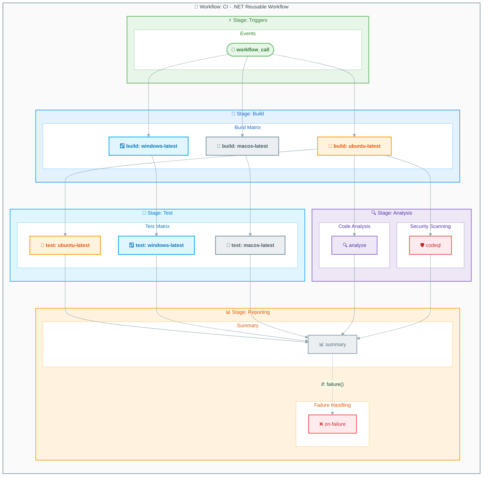

# Workflow: CI - .NET Reusable Workflow

## Overview

| Property | Value |
|----------|-------|
| **File** | `.github/workflows/ci-dotnet-reusable.yml` |
| **Name** | `CI - .NET Reusable Workflow` |
| **Triggers** | `workflow_call` |

This reusable workflow provides comprehensive CI capabilities including cross-platform builds, testing, code analysis, and security scanning. It is called by `ci-dotnet.yml` and can be reused by other workflows.

---

## Workflow Diagram



---

## Jobs

### Job: build

- **Runs on:** `${{ matrix.os }}` (ubuntu-latest, windows-latest, macos-latest)
- **Depends on:** None
- **Strategy:** Matrix with `os: [ubuntu-latest, windows-latest, macos-latest]`
- **Fail-fast:** `false`

#### Steps

1. 📥 Checkout code
2. 🔧 Setup .NET SDK
3. 📦 Restore dependencies
4. 🔨 Build solution
5. 📤 Upload build artifacts

---

### Job: test

- **Runs on:** `${{ matrix.os }}` (ubuntu-latest, windows-latest, macos-latest)
- **Depends on:** `build`
- **Strategy:** Matrix with `os: [ubuntu-latest, windows-latest, macos-latest]`
- **Fail-fast:** `false`

#### Steps

1. 📥 Checkout code
2. 🔧 Setup .NET SDK
3. 📥 Download build artifacts
4. 🧪 Run tests with coverage
5. 📤 Upload test results
6. 📤 Upload code coverage

---

### Job: analyze

- **Runs on:** `ubuntu-latest`
- **Depends on:** `build`
- **Condition:** `inputs.enable-code-analysis == true`

#### Steps

1. 📥 Checkout code
2. 🔧 Setup .NET SDK
3. 🔍 Run dotnet format check
4. 📊 Report analysis results

---

### Job: codeql

- **Runs on:** `ubuntu-latest`
- **Depends on:** `build`

#### Steps

1. 📥 Checkout code
2. 🛡️ Initialize CodeQL
3. 🔧 Setup .NET SDK
4. 🔨 Build project
5. 🔍 Perform CodeQL analysis
6. 📤 Upload SARIF results

---

### Job: summary

- **Runs on:** `ubuntu-latest`
- **Depends on:** `build`, `test`, `analyze`, `codeql`
- **Condition:** `always()`

#### Steps

1. 📥 Download all artifacts
2. 📊 Generate summary report
3. 💬 Post PR comment (if pull request)

---

### Job: on-failure

- **Runs on:** `ubuntu-latest`
- **Depends on:** `build`, `test`, `analyze`, `codeql`
- **Condition:** `failure()`

#### Steps

1. 📥 Download failure logs
2. 🔍 Analyze failure cause
3. 💬 Post failure notification

---

## Inputs and Secrets

### Inputs

| Name | Required | Default | Description |
|------|----------|---------|-------------|
| `configuration` | No | `Release` | Build configuration |
| `dotnet-version` | No | `10.0.x` | .NET SDK version |
| `solution-file` | No | `app.sln` | Solution file to build |
| `test-results-artifact-name` | No | `test-results` | Test results artifact name |
| `build-artifacts-name` | No | `build-artifacts` | Build artifacts name |
| `coverage-artifact-name` | No | `code-coverage` | Coverage artifact name |
| `artifact-retention-days` | No | `30` | Artifact retention period |
| `runs-on` | No | `ubuntu-latest` | Default runner OS |
| `enable-code-analysis` | No | `true` | Enable code analysis |
| `fail-on-format-issues` | No | `true` | Fail if format issues found |

### Secrets

Inherits all secrets from the calling workflow.

---

## Permissions

```yaml
permissions:
  contents: read
  checks: write
  pull-requests: write
  security-events: write
```

---

## Artifacts and Outputs

### Artifacts Uploaded

| Name | Description | Retention |
|------|-------------|-----------|
| `build-artifacts-ubuntu-latest` | Build output for Ubuntu | 30 days |
| `build-artifacts-windows-latest` | Build output for Windows | 30 days |
| `build-artifacts-macos-latest` | Build output for macOS | 30 days |
| `test-results-ubuntu-latest` | Test results for Ubuntu | 30 days |
| `test-results-windows-latest` | Test results for Windows | 30 days |
| `test-results-macos-latest` | Test results for macOS | 30 days |
| `code-coverage-ubuntu-latest` | Coverage for Ubuntu | 30 days |
| `code-coverage-windows-latest` | Coverage for Windows | 30 days |
| `code-coverage-macos-latest` | Coverage for macOS | 30 days |
| `codeql-sarif-results` | CodeQL security scan results | 30 days |

### Outputs

| Name | Description |
|------|-------------|
| `build-success` | Whether build succeeded |
| `test-success` | Whether tests passed |
| `analysis-success` | Whether analysis passed |

---

## Dependencies

### External Actions

| Action | Version | Purpose |
|--------|---------|---------|
| `actions/checkout` | `v4` | Checkout repository |
| `actions/setup-dotnet` | `v4` | Setup .NET SDK |
| `actions/upload-artifact` | `v4` | Upload artifacts |
| `actions/download-artifact` | `v4` | Download artifacts |
| `github/codeql-action/init` | `v3` | Initialize CodeQL |
| `github/codeql-action/analyze` | `v3` | Run CodeQL analysis |
| `github/codeql-action/upload-sarif` | `v3` | Upload SARIF results |

---

## Matrix Strategy Details

### Build and Test Matrix

```yaml
strategy:
  fail-fast: false
  matrix:
    os: [ubuntu-latest, windows-latest, macos-latest]
```

| OS | Runner | Icon | Color |
|----|--------|------|-------|
| Ubuntu | `ubuntu-latest` | 🐧 | Orange (#FFF3E0) |
| Windows | `windows-latest` | 🪟 | Light Blue (#E1F5FE) |
| macOS | `macos-latest` | 🍎 | Gray (#ECEFF1) |

---

## Usage Examples

This is a reusable workflow and cannot be triggered directly. It must be called from another workflow:

### Basic Call

```yaml
jobs:
  ci:
    uses: ./.github/workflows/ci-dotnet-reusable.yml
    secrets: inherit
```

### Call with Custom Configuration

```yaml
jobs:
  ci:
    uses: ./.github/workflows/ci-dotnet-reusable.yml
    with:
      configuration: Debug
      dotnet-version: "9.0.x"
      enable-code-analysis: false
    secrets: inherit
```

---

## See Also

- [ci-dotnet.md](ci-dotnet.md) - Main CI workflow that calls this reusable workflow
- [azure-dev.md](azure-dev.md) - Azure deployment workflow
- [README.md](README.md) - Workflow index
