# Workflow: CI - .NET Reusable Workflow

> This reusable workflow provides comprehensive CI capabilities including cross-platform builds, testing, code analysis, and security scanning.

---

## Table of Contents

- [Overview](#overview)
- [Workflow Diagram](#workflow-diagram)
- [Jobs](#jobs)
  - [Job: build](#job-build)
  - [Job: test](#job-test)
  - [Job: analyze](#job-analyze)
  - [Job: codeql](#job-codeql)
  - [Job: summary](#job-summary)
  - [Job: on-failure](#job-on-failure)
- [Inputs and Secrets](#inputs-and-secrets)
  - [Inputs](#inputs)
  - [Secrets](#secrets)
- [Permissions](#permissions)
- [Artifacts and Outputs](#artifacts-and-outputs)
  - [Artifacts Uploaded](#artifacts-uploaded)
  - [Outputs](#outputs)
- [Dependencies](#dependencies)
- [Matrix Strategy Details](#matrix-strategy-details)
- [Usage Examples](#usage-examples)
- [See Also](#see-also)

---

## Overview

| Property     | Value                                        |
|:-------------|:---------------------------------------------|
| **File**     | `.github/workflows/ci-dotnet-reusable.yml`   |
| **Name**     | `CI - .NET Reusable Workflow`                |
| **Triggers** | `workflow_call`                              |

This workflow is called by `ci-dotnet.yml` and can be reused by other workflows needing .NET CI capabilities.

> ℹ️ **Note**: This is a reusable workflow and cannot be triggered directly. It must be called from another workflow using the `uses` keyword.

---

## Workflow Diagram

The following diagram illustrates the job execution flow across multiple platforms.

```mermaid
%%{init: {'theme': 'base', 'themeVariables': {'fontSize': '14px', 'primaryColor': '#E3F2FD', 'lineColor': '#90A4AE', 'textColor': '#37474F', 'clusterBkg': '#FAFAFA'}}}%%
flowchart TB
    subgraph wf["🔄 Workflow: CI - .NET Reusable Workflow"]
        direction TB
        style wf fill:#FAFAFA,stroke:#90A4AE,stroke-width:2px,color:#37474F
        
        subgraph triggers-stage["⚡ Stage: Triggers"]
            direction LR
            style triggers-stage fill:#E8F5E9,stroke:#66BB6A,stroke-width:2px,color:#2E7D32
            subgraph trigger-events["Events"]
                direction LR
                style trigger-events fill:#FFFFFF,stroke:#A5D6A7,stroke-width:1px,color:#2E7D32
                workflow-call(["🔔 workflow_call"]):::node-trigger
            end
        end
        
        subgraph build-stage["🔨 Stage: Build"]
            direction TB
            style build-stage fill:#E3F2FD,stroke:#42A5F5,stroke-width:2px,color:#1565C0
            subgraph build-matrix["Build Matrix"]
                direction LR
                style build-matrix fill:#FFFFFF,stroke:#90CAF9,stroke-width:1px,color:#1565C0
                build-ubuntu["🐧 build: ubuntu-latest"]:::node-ubuntu
                build-windows["🪟 build: windows-latest"]:::node-windows
                build-macos["🍎 build: macos-latest"]:::node-macos
            end
        end
        
        subgraph test-stage["🧪 Stage: Test"]
            direction TB
            style test-stage fill:#E1F5FE,stroke:#29B6F6,stroke-width:2px,color:#0277BD
            subgraph test-matrix["Test Matrix"]
                direction LR
                style test-matrix fill:#FFFFFF,stroke:#81D4FA,stroke-width:1px,color:#0277BD
                test-ubuntu["🐧 test: ubuntu-latest"]:::node-ubuntu
                test-windows["🪟 test: windows-latest"]:::node-windows
                test-macos["🍎 test: macos-latest"]:::node-macos
            end
        end
        
        subgraph analysis-stage["🔍 Stage: Analysis"]
            direction TB
            style analysis-stage fill:#EDE7F6,stroke:#9575CD,stroke-width:2px,color:#512DA8
            subgraph code-analysis-group["Code Analysis"]
                direction LR
                style code-analysis-group fill:#FFFFFF,stroke:#B39DDB,stroke-width:1px,color:#512DA8
                analyze["🔍 analyze"]:::node-lint
            end
            subgraph security-group["Security Scanning"]
                direction LR
                style security-group fill:#FFFFFF,stroke:#B39DDB,stroke-width:1px,color:#512DA8
                codeql["🛡️ codeql"]:::node-security
            end
        end
        
        subgraph reporting-stage["📊 Stage: Reporting"]
            direction TB
            style reporting-stage fill:#FFF3E0,stroke:#FFA726,stroke-width:2px,color:#E65100
            subgraph summary-group["Summary"]
                direction LR
                style summary-group fill:#FFFFFF,stroke:#FFCC80,stroke-width:1px,color:#E65100
                summary-job["📊 summary"]:::node-artifact
            end
            subgraph failure-group["Failure Handling"]
                direction LR
                style failure-group fill:#FFFFFF,stroke:#FFCC80,stroke-width:1px,color:#E65100
                on-failure["❌ on-failure"]:::node-error
            end
        end
    end
    
    workflow-call --> build-ubuntu & build-windows & build-macos
    build-ubuntu --> test-ubuntu
    build-windows --> test-windows
    build-macos --> test-macos
    build-ubuntu --> analyze
    build-ubuntu --> codeql
    test-ubuntu --> summary-job
    test-windows --> summary-job
    test-macos --> summary-job
    analyze --> summary-job
    codeql --> summary-job
    summary-job -.->|"if: failure()"| on-failure
    
    classDef node-trigger fill:#E8F5E9,stroke:#66BB6A,stroke-width:2px,color:#2E7D32,font-weight:bold
    classDef node-build fill:#E3F2FD,stroke:#42A5F5,stroke-width:2px,color:#1565C0
    classDef node-lint fill:#EDE7F6,stroke:#9575CD,stroke-width:2px,color:#512DA8
    classDef node-security fill:#FFEBEE,stroke:#EF5350,stroke-width:2px,color:#C62828
    classDef node-artifact fill:#ECEFF1,stroke:#90A4AE,stroke-width:2px,color:#546E7A
    classDef node-error fill:#FFEBEE,stroke:#EF5350,stroke-width:2px,color:#C62828
    classDef node-ubuntu fill:#FFF3E0,stroke:#FF9800,stroke-width:2px,color:#E65100,font-weight:bold
    classDef node-windows fill:#E1F5FE,stroke:#03A9F4,stroke-width:2px,color:#0277BD,font-weight:bold
    classDef node-macos fill:#ECEFF1,stroke:#78909C,stroke-width:2px,color:#455A64,font-weight:bold
```



---

## Jobs

### Job: build

| Property       | Value                                                          |
|:---------------|:---------------------------------------------------------------|
| **Runs on**    | `${{ matrix.os }}` (ubuntu-latest, windows-latest, macos-latest) |
| **Depends on** | None                                                           |
| **Strategy**   | Matrix with `os: [ubuntu-latest, windows-latest, macos-latest]`  |
| **Fail-fast**  | `false`                                                        |

#### Steps

1. 📥 Checkout code
2. 🔧 Setup .NET SDK
3. 📦 Restore dependencies
4. 🔨 Build solution
5. 📤 Upload build artifacts

---

### Job: test

| Property       | Value                                                          |
|:---------------|:---------------------------------------------------------------|
| **Runs on**    | `${{ matrix.os }}` (ubuntu-latest, windows-latest, macos-latest) |
| **Depends on** | `build`                                                        |
| **Strategy**   | Matrix with `os: [ubuntu-latest, windows-latest, macos-latest]`  |
| **Fail-fast**  | `false`                                                        |

#### Steps

1. 📥 Checkout code
2. 🔧 Setup .NET SDK
3. 📥 Download build artifacts
4. 🧪 Run tests with coverage
5. 📤 Upload test results
6. 📤 Upload code coverage

---

### Job: analyze

| Property       | Value                                    |
|:---------------|:-----------------------------------------|
| **Runs on**    | `ubuntu-latest`                          |
| **Depends on** | `build`                                  |
| **Condition**  | `inputs.enable-code-analysis == true`    |

#### Steps

1. 📥 Checkout code
2. 🔧 Setup .NET SDK
3. 🔍 Run dotnet format check
4. 📊 Report analysis results

---

### Job: codeql

| Property       | Value              |
|:---------------|:-------------------|
| **Runs on**    | `ubuntu-latest`    |
| **Depends on** | `build`            |

#### Steps

1. 📥 Checkout code
2. 🛡️ Initialize CodeQL
3. 🔧 Setup .NET SDK
4. 🔨 Build project
5. 🔍 Perform CodeQL analysis
6. 📤 Upload SARIF results

> 🔒 **Security**: CodeQL scans for common security vulnerabilities and coding errors. Review findings in the **Security** tab of your repository.

---

### Job: summary

| Property       | Value                                    |
|:---------------|:-----------------------------------------|
| **Runs on**    | `ubuntu-latest`                          |
| **Depends on** | `build`, `test`, `analyze`, `codeql`     |
| **Condition**  | `always()`                               |

#### Steps

1. 📥 Download all artifacts
2. 📊 Generate summary report
3. 💬 Post PR comment (if pull request)

---

### Job: on-failure

| Property       | Value                                    |
|:---------------|:-----------------------------------------|
| **Runs on**    | `ubuntu-latest`                          |
| **Depends on** | `build`, `test`, `analyze`, `codeql`     |
| **Condition**  | `failure()`                              |

#### Steps

1. 📥 Download failure logs
2. 🔍 Analyze failure cause
3. 💬 Post failure notification

---

## Inputs and Secrets

### Inputs

| Name                         | Required | Default           | Description                        |
|:-----------------------------|:--------:|:------------------|:-----------------------------------|
| `configuration`              |    No    | `Release`         | Build configuration                |
| `dotnet-version`             |    No    | `10.0.x`          | .NET SDK version                   |
| `solution-file`              |    No    | `app.sln`         | Solution file to build             |
| `test-results-artifact-name` |    No    | `test-results`    | Test results artifact name         |
| `build-artifacts-name`       |    No    | `build-artifacts` | Build artifacts name               |
| `coverage-artifact-name`     |    No    | `code-coverage`   | Coverage artifact name             |
| `artifact-retention-days`    |    No    | `30`              | Artifact retention period          |
| `runs-on`                    |    No    | `ubuntu-latest`   | Default runner OS                  |
| `enable-code-analysis`       |    No    | `true`            | Enable code analysis               |
| `fail-on-format-issues`      |    No    | `true`            | Fail if format issues found        |

### Secrets

Inherits all secrets from the calling workflow using `secrets: inherit`.

---

## Permissions

```yaml
permissions:
  contents: read
  checks: write
  pull-requests: write
  security-events: write
```

---

## Artifacts and Outputs

### Artifacts Uploaded

| Name                             | Description                    | Retention |
|:---------------------------------|:-------------------------------|----------:|
| `build-artifacts-ubuntu-latest`  | Build output for Ubuntu        |   30 days |
| `build-artifacts-windows-latest` | Build output for Windows       |   30 days |
| `build-artifacts-macos-latest`   | Build output for macOS         |   30 days |
| `test-results-ubuntu-latest`     | Test results for Ubuntu        |   30 days |
| `test-results-windows-latest`    | Test results for Windows       |   30 days |
| `test-results-macos-latest`      | Test results for macOS         |   30 days |
| `code-coverage-ubuntu-latest`    | Coverage for Ubuntu            |   30 days |
| `code-coverage-windows-latest`   | Coverage for Windows           |   30 days |
| `code-coverage-macos-latest`     | Coverage for macOS             |   30 days |
| `codeql-sarif-results`           | CodeQL security scan results   |   30 days |

### Outputs

| Name               | Description                    |
|:-------------------|:-------------------------------|
| `build-success`    | Whether build succeeded        |
| `test-success`     | Whether tests passed           |
| `analysis-success` | Whether analysis passed        |

---

## Dependencies

### External Actions

| Action                             | Version | Purpose                |
|:-----------------------------------|:-------:|:-----------------------|
| `actions/checkout`                 |  `v4`   | Checkout repository    |
| `actions/setup-dotnet`             |  `v4`   | Setup .NET SDK         |
| `actions/upload-artifact`          |  `v4`   | Upload artifacts       |
| `actions/download-artifact`        |  `v4`   | Download artifacts     |
| `github/codeql-action/init`        |  `v3`   | Initialize CodeQL      |
| `github/codeql-action/analyze`     |  `v3`   | Run CodeQL analysis    |
| `github/codeql-action/upload-sarif`|  `v3`   | Upload SARIF results   |

---

## Matrix Strategy Details

### Build and Test Matrix

```yaml
strategy:
  fail-fast: false
  matrix:
    os: [ubuntu-latest, windows-latest, macos-latest]
```

The table below describes each platform in the build matrix.

| OS      | Runner            | Icon | Color           |
|:--------|:------------------|:----:|:----------------|
| Ubuntu  | `ubuntu-latest`   |  🐧  | Orange (#FFF3E0)|
| Windows | `windows-latest`  |  🪟  | Blue (#E1F5FE)  |
| macOS   | `macos-latest`    |  🍎  | Gray (#ECEFF1)  |

> 💡 **Tip**: Setting `fail-fast: false` ensures all matrix jobs complete even if one fails. This provides comprehensive test results across all platforms.

---

## Usage Examples

> ⚠️ **Warning**: This is a reusable workflow and cannot be triggered directly. It must be called from another workflow.

### Basic Call

```yaml
jobs:
  ci:
    uses: ./.github/workflows/ci-dotnet-reusable.yml
    secrets: inherit
```

### Call with Custom Configuration

```yaml
jobs:
  ci:
    uses: ./.github/workflows/ci-dotnet-reusable.yml
    with:
      configuration: Debug
      dotnet-version: "9.0.x"
      enable-code-analysis: false
    secrets: inherit
```

---

## See Also

- [CI - .NET Build and Test](ci-dotnet.md) — Main CI workflow that calls this reusable workflow
- [CD - Azure Deployment](azure-dev.md) — Azure deployment workflow
- [Workflow Index](README.md) — Complete workflow listing

---

[↑ Back to Top](#table-of-contents)
