# 🔧 CI - .NET Reusable Workflow

> 📚 **Summary**: This reusable workflow provides comprehensive CI capabilities including cross-platform builds, testing with coverage, code formatting analysis, and CodeQL security scanning.

---

## 📋 Table of Contents

- [Overview](#overview)
- [Workflow Diagram](#workflow-diagram)
- [Inputs](#inputs)
- [Outputs](#outputs)
- [Job Details](#job-details)
- [OS Matrix Configuration](#os-matrix-configuration)
- [Artifacts](#artifacts)
- [Best Practices](#best-practices)
- [See Also](#see-also)

---

## Overview

| Property | Value |
|----------|-------|
| **Workflow Name** | `CI - .NET Reusable Workflow` |
| **File Location** | `.github/workflows/ci-dotnet-reusable.yml` |
| **Type** | Reusable (workflow_call) |
| **Total Jobs** | 6 |
| **Timeout** | Varies by job (15-45 minutes) |

### Key Features

- ✅ **Cross-platform matrix builds** - Ubuntu, Windows, macOS
- ✅ **Comprehensive testing** - With code coverage (Cobertura format)
- ✅ **Code formatting** - .editorconfig compliance verification
- ✅ **Security scanning** - CodeQL with extended security queries
- ✅ **Rich summaries** - Detailed GitHub step summaries
- ✅ **Configurable inputs** - Extensive customization options

---

## Workflow Diagram

This workflow contains **6 jobs** with the following dependency structure:

```mermaid
%%{init: {'theme': 'base', 'themeVariables': { 'primaryColor': '#1976D2', 'primaryTextColor': '#FFFFFF', 'lineColor': '#616161', 'clusterBkg': '#E3F2FD', 'clusterBorder': '#1976D2'}}}%%
flowchart TB
    trigger["📞 workflow_call\nTriggered by caller workflow"]

    subgraph JOB1 ["build job"]
        direction LR
        b1["🐧 ubuntu-latest"]
        b2["🪟 windows-latest"]
        b3["🍎 macos-latest"]
    end

    subgraph JOB2 ["test job"]
        direction LR
        t1["🐧 ubuntu-latest"]
        t2["🪟 windows-latest"]
        t3["🍎 macos-latest"]
    end

    subgraph JOB3 ["analyze job"]
        analyze["🎨 Code Format\nruns-on: inputs.runs-on\nif: enable-code-analysis"]
    end

    subgraph JOB4 ["codeql job"]
        codeql["🛡️ Security Scan\nruns-on: inputs.runs-on\nalways runs"]
    end

    subgraph JOB5 ["summary job"]
        summary["📊 Aggregate Results\nruns-on: inputs.runs-on\nif: always()"]
    end

    subgraph JOB6 ["on-failure job"]
        onfailure["❌ Failure Handler\nruns-on: inputs.runs-on\nif: failure()"]
    end

    trigger --> JOB1
    JOB1 -->|needs: build| JOB2
    JOB1 -->|needs: build| JOB3
    JOB1 -->|needs: build| JOB4
    JOB2 -->|needs: build, test, analyze, codeql| JOB5
    JOB3 --> JOB5
    JOB4 --> JOB5
    JOB5 -.-> JOB6

    style trigger fill:#FF9800,stroke:#E65100,color:#fff
    style b1 fill:#E65100,stroke:#BF360C,color:#fff
    style b2 fill:#0277BD,stroke:#01579B,color:#fff
    style b3 fill:#424242,stroke:#212121,color:#fff
    style t1 fill:#E65100,stroke:#BF360C,color:#fff
    style t2 fill:#0277BD,stroke:#01579B,color:#fff
    style t3 fill:#424242,stroke:#212121,color:#fff
    style analyze fill:#00BCD4,stroke:#00838F,color:#fff
    style codeql fill:#00BCD4,stroke:#00838F,color:#fff
    style summary fill:#607D8B,stroke:#455A64,color:#fff
    style onfailure fill:#F44336,stroke:#C62828,color:#fff
```



### Job Dependencies

| Job | Depends On | Condition |
|-----|------------|----------|
| `build` | - | Always runs |
| `test` | `build` | Always runs |
| `analyze` | `build` | `if: inputs.enable-code-analysis` |
| `codeql` | `build` | Always runs |
| `summary` | `build`, `test`, `analyze`, `codeql` | `if: always()` |
| `on-failure` | `build`, `test`, `analyze`, `codeql` | `if: failure()` |

---

## Inputs

### Required Inputs

| Input | Type | Default | Description |
|-------|------|---------|-------------|
| `configuration` | `string` | `Release` | Build configuration (Debug/Release) |
| `dotnet-version` | `string` | `10.0.x` | .NET SDK version to use |
| `solution-file` | `string` | `app.sln` | Solution file path |

### Optional Inputs

| Input | Type | Default | Description |
|-------|------|---------|-------------|
| `runs-on` | `string` | `ubuntu-latest` | Default runner for non-matrix jobs |
| `enable-code-analysis` | `boolean` | `true` | Enable code formatting analysis |
| `fail-on-format-issues` | `boolean` | `true` | Fail on formatting issues |
| `build-artifacts-name` | `string` | `build-artifacts` | Build artifacts name prefix |
| `test-results-artifact-name` | `string` | `test-results` | Test results artifacts name prefix |
| `coverage-artifact-name` | `string` | `code-coverage` | Coverage artifacts name prefix |
| `artifact-retention-days` | `number` | `5` | Artifact retention period |

---

## Outputs

| Output | Source | Description |
|--------|--------|-------------|
| `build-version` | `jobs.build.outputs.build-version` | Generated build version (1.0.{run_number}) |
| `build-result` | `jobs.build.result` | Build job result |
| `test-result` | `jobs.test.result` | Test job result |
| `analyze-result` | `jobs.analyze.result` | Analysis job result |
| `codeql-result` | `jobs.codeql.result` | CodeQL scan result |

---

## Job Details

### 🔨 Build Job

**Purpose**: Cross-platform compilation with artifact generation

| Property | Value |
|----------|-------|
| **Name** | `🔨 Build (${{ matrix.os }})` |
| **Timeout** | 15 minutes |
| **Matrix** | `ubuntu-latest`, `windows-latest`, `macos-latest` |
| **Fail-fast** | `false` |

**Steps**:

1. 📥 Checkout repository (full history)
2. 🔧 Setup .NET SDK
3. ☁️ Update .NET workloads
4. 🏷️ Generate build version
5. 📥 Restore dependencies
6. 🔨 Build solution
7. 📤 Upload build artifacts
8. 📊 Generate build summary

---

### 🧪 Test Job

**Purpose**: Cross-platform testing with code coverage

| Property | Value |
|----------|-------|
| **Name** | `🧪 Test (${{ matrix.os }})` |
| **Timeout** | 30 minutes |
| **Matrix** | `ubuntu-latest`, `windows-latest`, `macos-latest` |
| **Fail-fast** | `false` |
| **Needs** | `build` |

**Steps**:

1. 📥 Checkout repository
2. 🔧 Setup .NET SDK
3. ☁️ Update .NET workloads
4. 📥 Restore dependencies
5. 🔨 Build solution
6. 🧪 Run tests with coverage
7. 📋 Publish test results (dorny/test-reporter)
8. 📤 Upload test results
9. 📤 Upload code coverage
10. 📊 Generate test summary

---

### 🔍 Analyze Job

**Purpose**: Code formatting verification

| Property | Value |
|----------|-------|
| **Name** | `🔍 Analyze` |
| **Timeout** | 15 minutes |
| **Runner** | `${{ inputs.runs-on }}` |
| **Needs** | `build` |
| **Condition** | `${{ inputs.enable-code-analysis }}` |

**Steps**:

1. 📥 Checkout repository
2. 🔧 Setup .NET SDK
3. ☁️ Update .NET workloads
4. 📥 Restore dependencies
5. 🎨 Verify code formatting (`dotnet format --verify-no-changes`)
6. 📊 Generate analysis summary
7. ❌ Fail on format issues (if configured)

---

### 🛡️ CodeQL Job

**Purpose**: Security vulnerability scanning

| Property | Value |
|----------|-------|
| **Name** | `🛡️ CodeQL Security Scan` |
| **Timeout** | 45 minutes |
| **Runner** | `${{ inputs.runs-on }}` |
| **Needs** | `build` |

**Steps**:

1. 📥 Checkout repository (full history)
2. 🔧 Setup .NET SDK
3. 🛡️ Initialize CodeQL (csharp, security-extended, security-and-quality)
4. 🔨 Autobuild for CodeQL
5. 🛡️ Perform CodeQL analysis
6. 📤 Upload CodeQL SARIF results
7. 📊 Generate CodeQL summary

---

### 📊 Summary Job

**Purpose**: Aggregate workflow results

| Property | Value |
|----------|-------|
| **Name** | `📊 Summary` |
| **Timeout** | 5 minutes |
| **Runner** | `${{ inputs.runs-on }}` |
| **Needs** | `build`, `test`, `analyze`, `codeql` |
| **Condition** | `always()` |

---

### ❌ On Failure Job

**Purpose**: Visual failure indication and reporting

| Property | Value |
|----------|-------|
| **Name** | `❌ Failed` |
| **Timeout** | 5 minutes |
| **Runner** | `${{ inputs.runs-on }}` |
| **Needs** | `build`, `test`, `analyze`, `codeql` |
| **Condition** | `failure()` |

---

## OS Matrix Configuration


### Matrix Strategy

```yaml
strategy:
  fail-fast: false
  matrix:
    os: [ubuntu-latest, windows-latest, macos-latest]
```

> ⚠️ **Note**: `fail-fast: false` ensures all platform builds complete even if one fails.

---

## Artifacts

### Build Artifacts

| Artifact | Pattern | Description |
|----------|---------|-------------|
| `build-artifacts-ubuntu-latest` | `**/bin/{config}/**` | Ubuntu build output |
| `build-artifacts-windows-latest` | `**/bin/{config}/**` | Windows build output |
| `build-artifacts-macos-latest` | `**/bin/{config}/**` | macOS build output |

### Test Artifacts

| Artifact | Pattern | Description |
|----------|---------|-------------|
| `test-results-{os}` | `**/TestResults/**/*.trx` | Test execution results |
| `code-coverage-{os}` | `**/coverage.cobertura.xml` | Code coverage reports |
| `codeql-sarif-results` | `codeql-results/` | CodeQL SARIF results |

---

## Best Practices

### Security Best Practices Applied

| Practice | Status | Description |
|----------|--------|-------------|
| Pinned action versions (SHA) | ✅ | All actions use commit SHA |
| Least privilege permissions | ✅ | Only required permissions granted |
| Secret inheritance | ✅ | `secrets: inherit` for secure passing |
| CodeQL on every run | ✅ | No conditional skipping |
| SARIF upload | ✅ | Security results in Security tab |

### CI Best Practices Applied

| Practice | Status | Description |
|----------|--------|-------------|
| Cross-platform testing | ✅ | Ubuntu, Windows, macOS |
| Full git history | ✅ | `fetch-depth: 0` for blame info |
| Code coverage | ✅ | Cobertura format for compatibility |
| Rich summaries | ✅ | GitHub step summaries for visibility |

---

## See Also

- [ci-dotnet.md](ci-dotnet.md) - CI orchestrator workflow
- [azure-dev.md](azure-dev.md) - CD workflow documentation
- [README.md](README.md) - Workflows overview
- [CodeQL Documentation](https://codeql.github.com/docs/)
- [dorny/test-reporter](https://github.com/dorny/test-reporter)

---

[⬆️ Back to Top](#-ci---net-reusable-workflow)
