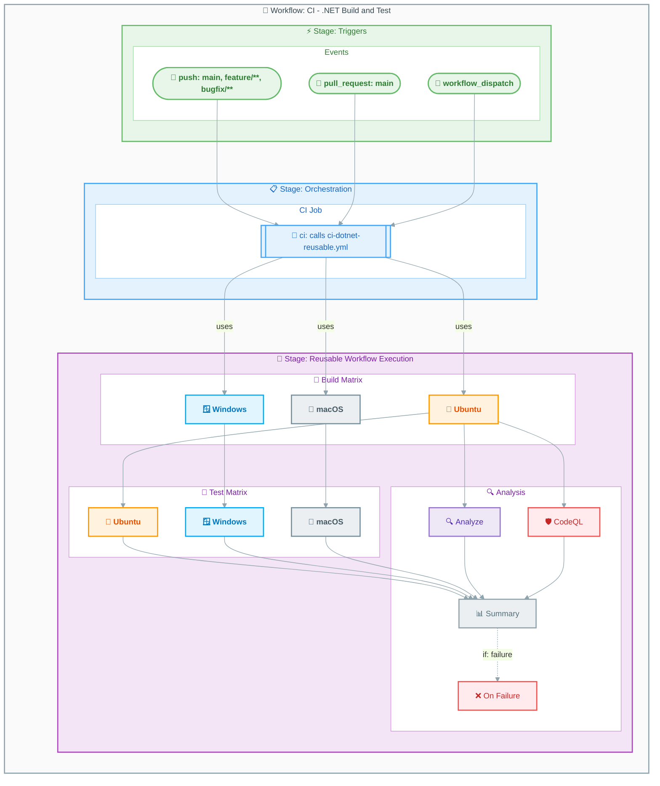

# Workflow: CI - .NET Build and Test

## Overview

| Property | Value |
|----------|-------|
| **File** | `.github/workflows/ci-dotnet.yml` |
| **Name** | `CI - .NET Build and Test` |
| **Triggers** | `push`, `pull_request`, `workflow_dispatch` |

This workflow serves as the main CI orchestrator. It triggers on code changes and calls the reusable CI workflow (`ci-dotnet-reusable.yml`) to execute cross-platform builds, tests, code analysis, and security scanning.

---

## Workflow Diagram



---

## Jobs

### Job: ci

- **Runs on:** N/A (reusable workflow call)
- **Depends on:** None
- **Condition:** Always runs

#### Configuration

```yaml
ci:
  name: 🚀 CI
  uses: ./.github/workflows/ci-dotnet-reusable.yml
  with:
    configuration: ${{ inputs.configuration || 'Release' }}
    dotnet-version: "10.0.x"
    solution-file: "app.sln"
    test-results-artifact-name: "test-results"
    build-artifacts-name: "build-artifacts"
    coverage-artifact-name: "code-coverage"
    artifact-retention-days: 30
    runs-on: "ubuntu-latest"
    enable-code-analysis: ${{ inputs.enable-code-analysis == '' && true || inputs.enable-code-analysis }}
    fail-on-format-issues: true
  secrets: inherit
```

---

## Inputs and Secrets

### Inputs

| Name | Required | Default | Description |
|------|----------|---------|-------------|
| `configuration` | No | `Release` | Build configuration (Release/Debug) |
| `enable-code-analysis` | No | `true` | Enable code formatting analysis |

### Secrets

No secrets directly referenced. Uses `secrets: inherit` to pass all secrets to the reusable workflow.

---

## Permissions

```yaml
permissions:
  contents: read
  checks: write
  pull-requests: write
  security-events: write
```

---

## Artifacts and Outputs

### Artifacts

No artifacts directly uploaded. Artifacts are managed by the called reusable workflow:

- `build-artifacts-{os}` - Compiled binaries per platform
- `test-results-{os}` - Test results per platform
- `code-coverage-{os}` - Coverage reports per platform
- `codeql-sarif-results` - Security scan results

### Outputs

No outputs defined. Outputs are provided by the reusable workflow.

---

## Dependencies

### External Actions

| Action | Version | Purpose |
|--------|---------|---------|
| N/A | N/A | This workflow only calls a reusable workflow |

### Reusable Workflows

| Workflow | Path |
|----------|------|
| CI - .NET Reusable Workflow | `.github/workflows/ci-dotnet-reusable.yml` |

---

## Usage Examples

### Manual Trigger with Default Configuration

```bash
gh workflow run "CI - .NET Build and Test"
```

### Manual Trigger with Debug Configuration

```bash
gh workflow run "CI - .NET Build and Test" -f configuration=Debug
```

### Manual Trigger without Code Analysis

```bash
gh workflow run "CI - .NET Build and Test" -f enable-code-analysis=false
```

### Triggered by Push

Automatically triggered on push to:

- `main`
- `feature/**`
- `bugfix/**`
- `hotfix/**`
- `release/**`
- `chore/**`
- `docs/**`
- `refactor/**`
- `test/**`

With path filters:

- `src/**`
- `app.*/**`
- `*.sln`
- `global.json`
- `.github/workflows/ci-dotnet.yml`
- `.github/workflows/ci-dotnet-reusable.yml`

---

## See Also

- [ci-dotnet-reusable.md](ci-dotnet-reusable.md) - Reusable CI workflow documentation
- [azure-dev.md](azure-dev.md) - Azure deployment workflow documentation
- [README.md](README.md) - Workflow index
