# CI - .NET Build and Test Workflow

[](../../.github/workflows/ci-dotnet.yml)

## Overview

| Property | Value |
|----------|-------|
| **Workflow Name** | `CI - .NET Build and Test` |
| **File** | [`.github/workflows/ci-dotnet.yml`](../../.github/workflows/ci-dotnet.yml) |
| **Purpose** | Orchestrates the CI pipeline by calling the reusable workflow |

### Description

This workflow serves as the entry point for the CI pipeline, handling:

- Trigger configuration for push and pull request events
- Path filters for relevant source changes
- Manual workflow dispatch with configurable options
- Delegation to the comprehensive reusable CI workflow

---

## Trigger Events

### `push`

| Property | Value |
|----------|-------|
| **Branches** | `main`, `feature/**`, `bugfix/**`, `hotfix/**`, `release/**`, `chore/**`, `docs/**`, `refactor/**`, `test/**` |
| **Paths** | `src/**`, `app.*/**`, `*.sln`, `global.json`, `.github/workflows/ci-dotnet.yml`, `.github/workflows/ci-dotnet-reusable.yml` |

### `pull_request`

| Property | Value |
|----------|-------|
| **Branches** | `main` |
| **Paths** | `src/**`, `app.*/**`, `*.sln`, `global.json`, `.github/workflows/ci-dotnet.yml`, `.github/workflows/ci-dotnet-reusable.yml` |

### `workflow_dispatch` (Manual Trigger)

| Input | Type | Required | Default | Options | Description |
|-------|------|----------|---------|---------|-------------|
| `configuration` | `choice` | No | `Release` | `Release`, `Debug` | Build configuration |
| `enable-code-analysis` | `boolean` | No | `true` | - | Enable code formatting analysis |

---

## Workflow Diagram

```mermaid
%%{init: {'theme': 'base', 'themeVariables': {'fontSize': '14px', 'primaryColor': '#1976D2', 'lineColor': '#78909C', 'textColor': '#37474F'}}}%%
flowchart TB
    subgraph wf["🔄 Workflow: CI - .NET Build and Test"]
        direction TB
        style wf fill:#263238,stroke:#455A64,stroke-width:3px,color:#ECEFF1
        
        subgraph triggers["⚡ Stage: Triggers"]
            direction LR
            style triggers fill:#37474F,stroke:#66BB6A,stroke-width:2px,color:#A5D6A7
            subgraph events["Events"]
                style events fill:#455A64,stroke:#78909C,stroke-width:1px,color:#CFD8DC
                push(["🔔 push: main, feature/**"]):::node-trigger
                pr(["🔔 pull_request: main"]):::node-trigger
                manual(["🔔 workflow_dispatch"]):::node-trigger
            end
        end
        
        subgraph ci-stage["🔄 Stage: CI Pipeline"]
            direction TB
            style ci-stage fill:#37474F,stroke:#42A5F5,stroke-width:2px,color:#90CAF9
            subgraph reusable["📦 Reusable Workflow"]
                style reusable fill:#455A64,stroke:#4FC3F7,stroke-width:1px,color:#B3E5FC
                ci-call[["🔄 ci-dotnet-reusable.yml"]]:::node-build
            end
        end
        
        subgraph build-stage["🔨 Stage: Build"]
            direction TB
            style build-stage fill:#37474F,stroke:#42A5F5,stroke-width:2px,color:#90CAF9
            subgraph build-matrix["🔨 Build Matrix"]
                direction LR
                style build-matrix fill:#455A64,stroke:#4FC3F7,stroke-width:1px,color:#B3E5FC
                build-ubuntu["🐧 Ubuntu"]:::node-ubuntu
                build-windows["🪟 Windows"]:::node-windows
                build-macos["🍎 macOS"]:::node-macos
            end
        end
        
        subgraph test-stage["🧪 Stage: Test"]
            direction TB
            style test-stage fill:#37474F,stroke:#AB47BC,stroke-width:2px,color:#CE93D8
            subgraph test-matrix["🧪 Test Matrix"]
                direction LR
                style test-matrix fill:#455A64,stroke:#4FC3F7,stroke-width:1px,color:#B3E5FC
                test-ubuntu["🐧 Ubuntu"]:::node-ubuntu
                test-windows["🪟 Windows"]:::node-windows
                test-macos["🍎 macOS"]:::node-macos
            end
        end
        
        subgraph analysis-stage["🔍 Stage: Analysis"]
            direction LR
            style analysis-stage fill:#37474F,stroke:#BA68C8,stroke-width:2px,color:#E1BEE7
            subgraph quality["Quality Checks"]
                style quality fill:#455A64,stroke:#BA68C8,stroke-width:1px,color:#E1BEE7
                analyze["🔍 Analyze"]:::node-lint
            end
            subgraph security["Security"]
                style security fill:#455A64,stroke:#EF5350,stroke-width:1px,color:#EF9A9A
                codeql["🛡️ CodeQL"]:::node-security
            end
        end
        
        subgraph summary-stage["📊 Stage: Summary"]
            direction LR
            style summary-stage fill:#37474F,stroke:#66BB6A,stroke-width:2px,color:#A5D6A7
            subgraph reports["Reports"]
                style reports fill:#455A64,stroke:#66BB6A,stroke-width:1px,color:#C8E6C9
                summary["📊 Summary"]:::node-production
                on-failure["❌ On Failure"]:::node-error
            end
        end
    end
    
    %% Trigger connections
    push & pr & manual -->|"triggers"| ci-call
    
    %% Reusable workflow executes matrix builds
    ci-call -->|"executes"| build-ubuntu & build-windows & build-macos
    
    %% Build to Test (OS-specific)
    build-ubuntu --> test-ubuntu
    build-windows --> test-windows
    build-macos --> test-macos
    
    %% Build to Analysis
    build-ubuntu & build-windows & build-macos --> analyze & codeql
    
    %% All jobs to Summary
    test-ubuntu & test-windows & test-macos --> summary
    analyze & codeql --> summary
    
    %% Failure handling
    build-ubuntu & build-windows & build-macos -.->|"on failure"| on-failure
    test-ubuntu & test-windows & test-macos -.->|"on failure"| on-failure
    analyze & codeql -.->|"on failure"| on-failure
    
    %% Material Design Node Classes
    classDef node-trigger fill:#43A047,stroke:#66BB6A,stroke-width:2px,color:#FFFFFF,font-weight:bold
    classDef node-build fill:#1976D2,stroke:#42A5F5,stroke-width:2px,color:#FFFFFF
    classDef node-lint fill:#8E24AA,stroke:#BA68C8,stroke-width:2px,color:#FFFFFF
    classDef node-security fill:#C62828,stroke:#EF5350,stroke-width:2px,color:#FFFFFF
    classDef node-production fill:#2E7D32,stroke:#66BB6A,stroke-width:2px,color:#FFFFFF,font-weight:bold
    classDef node-error fill:#C62828,stroke:#EF5350,stroke-width:2px,color:#FFFFFF
    
    %% OS-Specific Node Classes (Material Design)
    classDef node-ubuntu fill:#E65100,stroke:#FF9800,stroke-width:2px,color:#FFFFFF,font-weight:bold
    classDef node-windows fill:#0277BD,stroke:#03A9F4,stroke-width:2px,color:#FFFFFF,font-weight:bold
    classDef node-macos fill:#455A64,stroke:#78909C,stroke-width:2px,color:#FFFFFF,font-weight:bold
    
    linkStyle default stroke:#78909C,stroke-width:2px
```



---

## Jobs Breakdown

### 🚀 CI

| Property | Value |
|----------|-------|
| **Name** | `🚀 CI` |
| **Type** | Reusable Workflow Call |
| **Workflow** | `./.github/workflows/ci-dotnet-reusable.yml` |

#### Inputs Passed

| Input | Value |
|-------|-------|
| `configuration` | `${{ inputs.configuration \|\| 'Release' }}` |
| `dotnet-version` | `10.0.x` |
| `solution-file` | `app.sln` |
| `test-results-artifact-name` | `test-results` |
| `build-artifacts-name` | `build-artifacts` |
| `coverage-artifact-name` | `code-coverage` |
| `artifact-retention-days` | `30` |
| `runs-on` | `ubuntu-latest` |
| `enable-code-analysis` | `${{ inputs.enable-code-analysis == '' && true \|\| inputs.enable-code-analysis }}` |
| `fail-on-format-issues` | `true` |

---

## Features (via Reusable Workflow)

| Feature | Description |
|---------|-------------|
| **Cross-platform builds** | Ubuntu, Windows, macOS |
| **Cross-platform testing** | Code coverage with Cobertura |
| **Code formatting analysis** | .editorconfig compliance |
| **CodeQL security scanning** | Always enabled |
| **Test result publishing** | Detailed summaries via dorny/test-reporter |
| **Build artifacts upload** | Per-platform artifacts |

---

## Permissions

| Permission | Level | Purpose |
|------------|-------|---------|
| `contents` | `read` | Read repository contents for checkout |
| `checks` | `write` | Create check runs for test results |
| `pull-requests` | `write` | Post comments on pull requests |
| `security-events` | `write` | Upload CodeQL SARIF results to Security tab |

---

## Concurrency

| Property | Value |
|----------|-------|
| **Group** | `${{ github.workflow }}-${{ github.event.pull_request.number \|\| github.ref }}` |
| **Cancel In Progress** | `true` |

---

## Path Filters

### Watched Paths

| Path Pattern | Description |
|--------------|-------------|
| `src/**` | Source code changes |
| `app.*/**` | Application project changes |
| `*.sln` | Solution file changes |
| `global.json` | .NET SDK version changes |
| `.github/workflows/ci-dotnet.yml` | This workflow file |
| `.github/workflows/ci-dotnet-reusable.yml` | Reusable workflow file |

---

## Dependencies

### Reusable Workflows

| Workflow | Purpose |
|----------|---------|
| `./.github/workflows/ci-dotnet-reusable.yml` | Comprehensive CI pipeline execution |

---

## Usage Examples

### Automatic Trigger (Push to main)

The workflow runs automatically when pushing to the `main` branch with changes in watched paths:

```bash
git push origin main
```

### Automatic Trigger (Feature Branch)

```bash
git checkout -b feature/my-feature
# Make changes to src/
git add .
git commit -m "Add new feature"
git push origin feature/my-feature
```

### Manual Trigger (Default Configuration)

```bash
gh workflow run ci-dotnet.yml
```

### Manual Trigger (Debug Build)

```bash
gh workflow run ci-dotnet.yml -f configuration=Debug
```

### Manual Trigger (Disable Code Analysis)

```bash
gh workflow run ci-dotnet.yml -f enable-code-analysis=false
```

### Manual Trigger (Full Options)

```bash
gh workflow run ci-dotnet.yml \
  -f configuration=Release \
  -f enable-code-analysis=true
```

---

## Branch Patterns

| Pattern | Example | Description |
|---------|---------|-------------|
| `main` | `main` | Main branch |
| `feature/**` | `feature/auth`, `feature/api/users` | Feature branches |
| `bugfix/**` | `bugfix/login-issue` | Bug fix branches |
| `hotfix/**` | `hotfix/security-patch` | Hotfix branches |
| `release/**` | `release/v1.0.0` | Release branches |
| `chore/**` | `chore/update-deps` | Maintenance branches |
| `docs/**` | `docs/api-reference` | Documentation branches |
| `refactor/**` | `refactor/cleanup` | Refactoring branches |
| `test/**` | `test/integration` | Test branches |

---

## Artifacts Generated

The following artifacts are produced by the reusable workflow:

| Artifact | Description | Retention |
|----------|-------------|-----------|
| `build-artifacts-ubuntu-latest` | Compiled binaries (Ubuntu) | 30 days |
| `build-artifacts-windows-latest` | Compiled binaries (Windows) | 30 days |
| `build-artifacts-macos-latest` | Compiled binaries (macOS) | 30 days |
| `test-results-ubuntu-latest` | Test results .trx (Ubuntu) | 30 days |
| `test-results-windows-latest` | Test results .trx (Windows) | 30 days |
| `test-results-macos-latest` | Test results .trx (macOS) | 30 days |
| `code-coverage-ubuntu-latest` | Cobertura coverage (Ubuntu) | 30 days |
| `code-coverage-windows-latest` | Cobertura coverage (Windows) | 30 days |
| `code-coverage-macos-latest` | Cobertura coverage (macOS) | 30 days |
| `codeql-sarif-results` | Security scan SARIF | 30 days |

---

## Prerequisites

| Requirement | Description |
|-------------|-------------|
| **Reusable Workflow** | `.github/workflows/ci-dotnet-reusable.yml` must exist |
| **Branch Location** | Workflow must be on default branch (main) or same branch for reference resolution |
| **Solution File** | `app.sln` must exist in repository root |

---

## Related Documentation

- [GitHub Actions - Triggers](https://docs.github.com/en/actions/using-workflows/events-that-trigger-workflows)
- [GitHub Actions - Reusable Workflows](https://docs.github.com/en/actions/using-workflows/reusing-workflows)
- [.NET Build and Test](https://docs.github.com/en/actions/automating-builds-and-tests/building-and-testing-net)
- [CI Reusable Workflow](ci-dotnet-reusable.md)
- [CD Workflow](azure-dev.md)
