# Workflow: CI - .NET Build and Test

> This workflow serves as the main CI orchestrator, triggering cross-platform builds, tests, code analysis, and security scanning.

---

## Table of Contents

- [Overview](#overview)
- [Workflow Diagram](#workflow-diagram)
- [Jobs](#jobs)
  - [Job: ci](#job-ci)
- [Inputs and Secrets](#inputs-and-secrets)
  - [Inputs](#inputs)
  - [Secrets](#secrets)
- [Permissions](#permissions)
- [Artifacts and Outputs](#artifacts-and-outputs)
  - [Artifacts](#artifacts)
  - [Outputs](#outputs)
- [Dependencies](#dependencies)
  - [External Actions](#external-actions)
  - [Reusable Workflows](#reusable-workflows)
- [Trigger Configuration](#trigger-configuration)
  - [Branch Filters](#branch-filters)
  - [Path Filters](#path-filters)
- [Usage Examples](#usage-examples)
- [See Also](#see-also)

---

## Overview

| Property     | Value                                             |
|:-------------|:--------------------------------------------------|
| **File**     | `.github/workflows/ci-dotnet.yml`                 |
| **Name**     | `CI - .NET Build and Test`                        |
| **Triggers** | `push`, `pull_request`, `workflow_dispatch`       |

This workflow triggers on code changes and calls the reusable CI workflow (`ci-dotnet-reusable.yml`) to execute cross-platform builds, tests, code analysis, and security scanning.

---

## Workflow Diagram

The following diagram shows how this orchestrator workflow delegates to the reusable CI workflow.

```mermaid
%%{init: {'theme': 'base', 'themeVariables': {'fontSize': '14px', 'primaryColor': '#E3F2FD', 'lineColor': '#90A4AE', 'textColor': '#37474F', 'clusterBkg': '#FAFAFA'}}}%%
flowchart TB
    subgraph wf["🔄 Workflow: CI - .NET Build and Test"]
        direction TB
        style wf fill:#FAFAFA,stroke:#90A4AE,stroke-width:2px,color:#37474F
        
        subgraph triggers-stage["⚡ Stage: Triggers"]
            direction LR
            style triggers-stage fill:#E8F5E9,stroke:#66BB6A,stroke-width:2px,color:#2E7D32
            subgraph trigger-events["Events"]
                direction LR
                style trigger-events fill:#FFFFFF,stroke:#A5D6A7,stroke-width:1px,color:#2E7D32
                push-main(["🔔 push: main, feature/**, bugfix/**"]):::node-trigger
                pr-main(["🔔 pull_request: main"]):::node-trigger
                dispatch(["🔔 workflow_dispatch"]):::node-trigger
            end
        end
        
        subgraph orchestration-stage["📋 Stage: Orchestration"]
            direction TB
            style orchestration-stage fill:#E3F2FD,stroke:#42A5F5,stroke-width:2px,color:#1565C0
            subgraph ci-job-group["CI Job"]
                direction LR
                style ci-job-group fill:#FFFFFF,stroke:#90CAF9,stroke-width:1px,color:#1565C0
                ci-job[["🚀 ci: calls ci-dotnet-reusable.yml"]]:::node-build
            end
        end
        
        subgraph reusable-stage["🔧 Stage: Reusable Workflow Execution"]
            direction TB
            style reusable-stage fill:#F3E5F5,stroke:#AB47BC,stroke-width:2px,color:#7B1FA2
            subgraph build-matrix["🔨 Build Matrix"]
                direction LR
                style build-matrix fill:#FFFFFF,stroke:#CE93D8,stroke-width:1px,color:#7B1FA2
                build-ubuntu["🐧 Ubuntu"]:::node-ubuntu
                build-windows["🪟 Windows"]:::node-windows
                build-macos["🍎 macOS"]:::node-macos
            end
            subgraph test-matrix["🧪 Test Matrix"]
                direction LR
                style test-matrix fill:#FFFFFF,stroke:#CE93D8,stroke-width:1px,color:#7B1FA2
                test-ubuntu["🐧 Ubuntu"]:::node-ubuntu
                test-windows["🪟 Windows"]:::node-windows
                test-macos["🍎 macOS"]:::node-macos
            end
            subgraph analysis-group["🔍 Analysis"]
                direction LR
                style analysis-group fill:#FFFFFF,stroke:#CE93D8,stroke-width:1px,color:#7B1FA2
                analyze["🔍 Analyze"]:::node-lint
                codeql["🛡️ CodeQL"]:::node-security
                summary-job["📊 Summary"]:::node-artifact
                on-failure["❌ On Failure"]:::node-error
            end
        end
    end
    
    push-main --> ci-job
    pr-main --> ci-job
    dispatch --> ci-job
    ci-job -->|"uses"| build-ubuntu & build-windows & build-macos
    build-ubuntu --> test-ubuntu
    build-windows --> test-windows
    build-macos --> test-macos
    build-ubuntu --> analyze
    build-ubuntu --> codeql
    test-ubuntu & test-windows & test-macos --> summary-job
    analyze --> summary-job
    codeql --> summary-job
    summary-job -.->|"if: failure"| on-failure
    
    classDef node-trigger fill:#E8F5E9,stroke:#66BB6A,stroke-width:2px,color:#2E7D32,font-weight:bold
    classDef node-build fill:#E3F2FD,stroke:#42A5F5,stroke-width:2px,color:#1565C0
    classDef node-lint fill:#EDE7F6,stroke:#9575CD,stroke-width:2px,color:#512DA8
    classDef node-security fill:#FFEBEE,stroke:#EF5350,stroke-width:2px,color:#C62828
    classDef node-artifact fill:#ECEFF1,stroke:#90A4AE,stroke-width:2px,color:#546E7A
    classDef node-error fill:#FFEBEE,stroke:#EF5350,stroke-width:2px,color:#C62828
    classDef node-ubuntu fill:#FFF3E0,stroke:#FF9800,stroke-width:2px,color:#E65100,font-weight:bold
    classDef node-windows fill:#E1F5FE,stroke:#03A9F4,stroke-width:2px,color:#0277BD,font-weight:bold
    classDef node-macos fill:#ECEFF1,stroke:#78909C,stroke-width:2px,color:#455A64,font-weight:bold
```



---

## Jobs

### Job: ci

| Property       | Value                            |
|:---------------|:---------------------------------|
| **Runs on**    | N/A (reusable workflow call)     |
| **Depends on** | None                             |
| **Condition**  | Always runs                      |

#### Configuration

```yaml
ci:
  name: 🚀 CI
  uses: ./.github/workflows/ci-dotnet-reusable.yml
  with:
    configuration: ${{ inputs.configuration || 'Release' }}
    dotnet-version: "10.0.x"
    solution-file: "app.sln"
    test-results-artifact-name: "test-results"
    build-artifacts-name: "build-artifacts"
    coverage-artifact-name: "code-coverage"
    artifact-retention-days: 30
    runs-on: "ubuntu-latest"
    enable-code-analysis: ${{ inputs.enable-code-analysis == '' && true || inputs.enable-code-analysis }}
    fail-on-format-issues: true
  secrets: inherit
```

> ℹ️ **Note**: This job delegates all CI tasks to the reusable workflow. View [ci-dotnet-reusable.md](ci-dotnet-reusable.md) for details on individual build, test, and analysis jobs.

---

## Inputs and Secrets

### Inputs

| Name                   | Required | Default   | Description                              |
|:-----------------------|:--------:|:----------|:-----------------------------------------|
| `configuration`        |    No    | `Release` | Build configuration (Release/Debug)      |
| `enable-code-analysis` |    No    | `true`    | Enable code formatting analysis          |

### Secrets

No secrets directly referenced. Uses `secrets: inherit` to pass all secrets to the reusable workflow.

> 🔒 **Security**: Secrets are inherited from the repository settings and passed through to the reusable workflow securely.

---

## Permissions

```yaml
permissions:
  contents: read
  checks: write
  pull-requests: write
  security-events: write
```

---

## Artifacts and Outputs

### Artifacts

No artifacts directly uploaded. Artifacts are managed by the called reusable workflow:

| Artifact Pattern           | Description                 |
|:---------------------------|:----------------------------|
| `build-artifacts-{os}`     | Compiled binaries per OS    |
| `test-results-{os}`        | Test results per OS         |
| `code-coverage-{os}`       | Coverage reports per OS     |
| `codeql-sarif-results`     | Security scan results       |

### Outputs

No outputs defined. Outputs are provided by the reusable workflow.

---

## Dependencies

### External Actions

| Action | Version | Purpose                                  |
|:-------|:-------:|:-----------------------------------------|
| N/A    |   N/A   | This workflow only calls a reusable workflow |

### Reusable Workflows

| Workflow                     | Path                                       |
|:-----------------------------|:-------------------------------------------|
| CI - .NET Reusable Workflow  | `.github/workflows/ci-dotnet-reusable.yml` |

---

## Trigger Configuration

### Branch Filters

Automatically triggered on push to the following branches:

| Branch Pattern | Purpose                     |
|:---------------|:----------------------------|
| `main`         | Main development branch     |
| `feature/**`   | Feature branches            |
| `bugfix/**`    | Bug fix branches            |
| `hotfix/**`    | Hotfix branches             |
| `release/**`   | Release branches            |
| `chore/**`     | Chore/maintenance branches  |
| `docs/**`      | Documentation branches      |
| `refactor/**`  | Refactoring branches        |
| `test/**`      | Test branches               |

### Path Filters

The workflow runs only when changes are detected in the following paths:

| Path                                        | Description                      |
|:--------------------------------------------|:---------------------------------|
| `src/**`                                    | Source code                      |
| `app.*/**`                                  | Application projects             |
| `*.sln`                                     | Solution files                   |
| `global.json`                               | .NET SDK version configuration   |
| `.github/workflows/ci-dotnet.yml`           | This workflow file               |
| `.github/workflows/ci-dotnet-reusable.yml`  | Reusable workflow file           |

> 💡 **Tip**: Path filters prevent unnecessary CI runs when only non-code files change (like README updates).

---

## Usage Examples

### Manual Trigger with Default Configuration

```bash
gh workflow run "CI - .NET Build and Test"
```

### Manual Trigger with Debug Configuration

```bash
gh workflow run "CI - .NET Build and Test" -f configuration=Debug
```

### Manual Trigger without Code Analysis

```bash
gh workflow run "CI - .NET Build and Test" -f enable-code-analysis=false
```

---

## See Also

- [CI - .NET Reusable Workflow](ci-dotnet-reusable.md) — Reusable CI workflow documentation
- [CD - Azure Deployment](azure-dev.md) — Azure deployment workflow documentation
- [Workflow Index](README.md) — Complete workflow listing

---

[↑ Back to Top](#table-of-contents)
