# 🔄 CI - .NET Build and Test

> 📚 **Summary**: This workflow serves as the main CI orchestrator, triggering the reusable `.NET` CI workflow for comprehensive build, test, and analysis operations.

---

## 📋 Table of Contents

- [Overview](#overview)
- [Workflow Diagram](#workflow-diagram)
- [Triggers](#triggers)
- [Configuration](#configuration)
- [Job Details](#job-details)
- [Usage Examples](#usage-examples)
- [Troubleshooting](#troubleshooting)
- [See Also](#see-also)

---

## Overview

| Property | Value |
|----------|-------|
| **Workflow Name** | `CI - .NET Build and Test` |
| **File Location** | `.github/workflows/ci-dotnet.yml` |
| **Type** | Orchestrator |
| **Calls** | `ci-dotnet-reusable.yml` |

### Key Features

- ✅ **Multi-branch support** - Triggers on main, feature/**, bugfix/**, release/**, hotfix/**
- ✅ **Pull request validation** - Runs on all PR types
- ✅ **Manual dispatch** - Can be triggered manually with custom configuration
- ✅ **Configurable options** - Build configuration and code analysis settings

---

## Workflow Diagram

```mermaid
%%{init: {'theme': 'base', 'themeVariables': { 'primaryColor': '#1976D2', 'primaryTextColor': '#FFFFFF', 'primaryBorderColor': '#0D47A1', 'lineColor': '#424242', 'secondaryColor': '#4CAF50', 'tertiaryColor': '#E3F2FD'}}}%%
flowchart TB
    subgraph workflow-ci ["🔄 CI - .NET Build and Test Workflow"]
        direction TB
        
        subgraph triggers ["🎯 Level 1: Triggers"]
            direction LR
            trigger-push["📤 Push<br/>(main, feature/**, bugfix/**, release/**, hotfix/**)"]
            trigger-pr["🔀 Pull Request<br/>(all branches)"]
            trigger-dispatch["🖱️ workflow_dispatch<br/>(manual)"]
        end

        subgraph orchestration ["📋 Level 2: Orchestration"]
            direction TB
            call-reusable["🔧 Call Reusable Workflow<br/>ci-dotnet-reusable.yml"]
        end

        subgraph reusable-jobs ["🔨 Level 3: Reusable Workflow Jobs"]
            direction TB
            
            subgraph build-group ["🔨 Build Job Group"]
                direction LR
                build-ubuntu["🐧 Build<br/>ubuntu-latest"]
                build-windows["🪟 Build<br/>windows-latest"]
                build-macos["🍎 Build<br/>macos-latest"]
            end

            subgraph test-group ["🧪 Test Job Group"]
                direction LR
                test-ubuntu["🐧 Test<br/>ubuntu-latest"]
                test-windows["🪟 Test<br/>windows-latest"]
                test-macos["🍎 Test<br/>macos-latest"]
            end

            subgraph analysis-group ["🔍 Analysis Job Group"]
                direction LR
                analyze["🎨 Analyze<br/>Code Format"]
                codeql["🛡️ CodeQL<br/>Security Scan"]
            end

            summary["📊 Summary"]
            on-failure["❌ On Failure"]
        end
    end

    triggers --> orchestration
    orchestration --> reusable-jobs
    build-group --> test-group
    test-group --> analysis-group
    analysis-group --> summary
    analysis-group -.->|failure| on-failure

    classDef trigger fill:#FF9800,stroke:#E65100,color:#FFFFFF
    classDef orchestration fill:#1976D2,stroke:#0D47A1,color:#FFFFFF
    classDef build fill:#4CAF50,stroke:#2E7D32,color:#FFFFFF
    classDef test fill:#9C27B0,stroke:#6A1B9A,color:#FFFFFF
    classDef analysis fill:#00BCD4,stroke:#00838F,color:#FFFFFF
    classDef summary fill:#607D8B,stroke:#37474F,color:#FFFFFF
    classDef failure fill:#F44336,stroke:#C62828,color:#FFFFFF

    class trigger-push,trigger-pr,trigger-dispatch trigger
    class call-reusable orchestration
    class build-ubuntu,build-windows,build-macos build
    class test-ubuntu,test-windows,test-macos test
    class analyze,codeql analysis
    class summary summary
    class on-failure failure
```



---

## Triggers

### Push Events

```yaml
on:
  push:
    branches:
      - main
      - feature/**
      - bugfix/**
      - release/**
      - hotfix/**
```

### Pull Request Events

```yaml
on:
  pull_request:
    branches:
      - main
```

### Manual Dispatch

```yaml
on:
  workflow_dispatch:
    inputs:
      configuration:
        description: "Build configuration"
        default: "Release"
        type: choice
        options:
          - Debug
          - Release
      enable-code-analysis:
        description: "Enable code analysis"
        default: true
        type: boolean
```

---

## Configuration

### Inputs Passed to Reusable Workflow

| Input | Default | Description |
|-------|---------|-------------|
| `configuration` | `Release` | Build configuration (Debug/Release) |
| `dotnet-version` | `10.0.x` | .NET SDK version |
| `solution-file` | `app.sln` | Solution file to build |
| `enable-code-analysis` | `true` | Enable code formatting analysis |
| `fail-on-format-issues` | `false` | Fail workflow on format issues |

---

## Job Details

### CI Job

This workflow contains a single job that calls the reusable CI workflow:

```yaml
jobs:
  ci:
    name: 🔄 CI
    uses: ./.github/workflows/ci-dotnet-reusable.yml
    with:
      configuration: ${{ inputs.configuration || 'Release' }}
      dotnet-version: "10.0.x"
      solution-file: "app.sln"
      enable-code-analysis: ${{ inputs.enable-code-analysis != false }}
      fail-on-format-issues: false
    secrets: inherit
```

---

## Usage Examples

### Trigger via GitHub CLI

```bash
# Run with default configuration
gh workflow run "CI - .NET Build and Test"

# Run with Debug configuration
gh workflow run "CI - .NET Build and Test" \
  -f configuration=Debug

# Run without code analysis
gh workflow run "CI - .NET Build and Test" \
  -f enable-code-analysis=false
```

### Trigger via Push

```bash
# Push to feature branch triggers CI
git checkout -b feature/my-feature
git push origin feature/my-feature
```

### Trigger via Pull Request

```bash
# Create PR to trigger CI
gh pr create --base main --head feature/my-feature
```

---

## Troubleshooting

### Common Issues

| Issue | Solution |
|-------|----------|
| **Workflow not triggering** | Verify branch name matches pattern (feature/**, bugfix/**, etc.) |
| **Build failures** | Check reusable workflow outputs for detailed error messages |
| **Code analysis failures** | Run `dotnet format` locally to fix formatting issues |

### Viewing Logs

```bash
# View recent CI runs
gh run list --workflow="CI - .NET Build and Test"

# View detailed logs for a specific run
gh run view <run-id> --log
```

---

## See Also

- [ci-dotnet-reusable.md](ci-dotnet-reusable.md) - Reusable CI workflow details
- [azure-dev.md](azure-dev.md) - CD workflow documentation
- [README.md](README.md) - Workflows overview

---

[⬆️ Back to Top](#-ci---net-build-and-test)
