# Generate-Orders (.ps1 / .sh)


## 📋 Overview

`Generate-Orders` is a sophisticated test data generator that creates realistic e-commerce order data for testing and demonstrating the Azure Logic Apps Monitoring solution. Available in both PowerShell (`.ps1`) and Bash (`.sh`) versions, it generates randomized orders with products, customers, delivery addresses, and order metadata, outputting a JSON file ready for ingestion into the monitoring system.

**Available Versions:**
- **Windows/PowerShell**: `Generate-Orders.ps1`
- **Linux/macOS/Bash**: `Generate-Orders.sh` (wraps Python script)

**Workflow Position**: 🔧 Standalone utility (not part of main deployment workflow)

**Use After**: Complete the main workflow (check-dev-workstation → preprovision → postprovision) before generating test data

## 🎯 Purpose

This script helps developers and testers:
- 🎲 **Generate Test Data**: Create realistic order data for development and testing
- 📊 **Load Testing**: Generate large batches of orders for performance testing
- 🔬 **Scenario Testing**: Create controlled test datasets with specific characteristics
- 📈 **Demo Preparation**: Generate sample data for demonstrations and presentations
- 🔄 **Continuous Testing**: Integrate with CI/CD for automated test data generation
- ⚙️ **Independent Tool**: Runs independently from the main deployment workflow

## 🏗️ Data Structure

### Generated Order Schema

Each order contains the following structure:

```json
{
  "orderId": "ORD-20250124-AB12CD34",
  "orderDate": "2024-08-15T14:30:22Z",
  "customerId": "CUST-5A3B9C7D",
  "customerEmail": "customer.5a3b9c7d@example.com",
  "totalAmount": 459.97,
  "orderStatus": "Pending",
  "deliveryAddress": "350 Fifth Ave, New York, NY, USA",
  "products": [
    {
      "productId": "PROD-1002",
      "description": "Mechanical Keyboard",
      "quantity": 1,
      "unitPrice": 89.99,
      "totalPrice": 89.99
    },
    {
      "productId": "PROD-6001",
      "description": "Monitor 27\" 4K",
      "quantity": 1,
      "unitPrice": 369.98,
      "totalPrice": 369.98
    }
  ]
}
```

### Product Catalog (20 Products)

| Product ID | Description | Base Price | Category |
|------------|-------------|------------|----------|
| PROD-1001 | Wireless Mouse | $25.99 | Peripherals |
| PROD-1002 | Mechanical Keyboard | $89.99 | Peripherals |
| PROD-1003 | USB-C Hub | $34.99 | Accessories |
| PROD-2001 | Noise Cancelling Headphones | $149.99 | Audio |
| PROD-2002 | Bluetooth Speaker | $79.99 | Audio |
| PROD-3001 | External SSD 1TB | $119.99 | Storage |
| PROD-3002 | Portable Charger | $49.99 | Power |
| PROD-4001 | Webcam 1080p | $69.99 | Video |
| PROD-4002 | Laptop Stand | $39.99 | Furniture |
| PROD-5001 | Cable Organizer | $12.99 | Organization |
| PROD-5002 | Smartphone Holder | $19.99 | Accessories |
| PROD-6001 | Monitor 27" 4K | $399.99 | Displays |
| PROD-6002 | Monitor Arm | $89.99 | Furniture |
| PROD-7001 | Ergonomic Chair | $299.99 | Furniture |
| PROD-7002 | Standing Desk | $499.99 | Furniture |
| PROD-8001 | USB Microphone | $99.99 | Audio |
| PROD-8002 | Ring Light | $44.99 | Video |
| PROD-9001 | Graphics Tablet | $199.99 | Creative |
| PROD-9002 | Drawing Pen Set | $29.99 | Creative |
| PROD-A001 | Wireless Earbuds | $129.99 | Audio |

### Delivery Addresses (20 Locations)

Global coverage including:
- 🇺🇸 United States (5 locations)
- 🇬🇧 United Kingdom (2 locations)
- 🇩🇪 Germany (2 locations)
- 🇯🇵 Japan, 🇫🇷 France, 🇪🇸 Spain, 🇮🇹 Italy, 🇧🇷 Brazil
- 🇨🇳 China, 🇰🇷 South Korea, 🇦🇺 Australia (2 locations)
- 🇨🇦 Canada

## 🚀 Usage

### Basic Usage

**PowerShell (Windows):**
```powershell
# Generate 50 orders (default)
.\Generate-Orders.ps1
```

**Bash (Linux/macOS):**
```bash
# Generate 50 orders (default)
./Generate-Orders.sh
```

**Output:**
```
[10:15:30] Starting order generation...
[10:15:30] Parameters:
[10:15:30]   Order Count: 50
[10:15:30]   Output Path: Z:\Azure-LogicApps-Monitoring\infra\data\ordersBatch.json
[10:15:30]   Products Per Order: 1-6
[10:15:30] 
[10:15:30] Generating orders...
[10:15:31] Progress: 10/50 (20%)
[10:15:32] Progress: 20/50 (40%)
[10:15:33] Progress: 30/50 (60%)
[10:15:34] Progress: 40/50 (80%)
[10:15:35] Progress: 50/50 (100%)
[10:15:35] 
[10:15:35] ✓ Successfully generated 50 orders
[10:15:35] ✓ Saved to: Z:\Azure-LogicApps-Monitoring\infra\data\ordersBatch.json
[10:15:35] 
[10:15:35] Summary:
[10:15:35]   Total Orders: 50
[10:15:35]   Total Revenue: $14,527.33
[10:15:35]   Average Order Value: $290.55
[10:15:35]   Total Products: 187
[10:15:35]   Unique Products: 20
[10:15:35]   File Size: 45.2 KB
[10:15:35] 
[10:15:35] Operation completed in 5.2 seconds
```

### Generate Specific Number of Orders

**PowerShell (Windows):**
```powershell
# Generate 100 orders
.\Generate-Orders.ps1 -OrderCount 100

# Generate 1000 orders for load testing
.\Generate-Orders.ps1 -OrderCount 1000

# Generate 10 orders for quick testing
.\Generate-Orders.ps1 -OrderCount 10
```

**Bash (Linux/macOS):**
```bash
# Generate 100 orders
./Generate-Orders.sh --order-count 100

# Generate 1000 orders for load testing
./Generate-Orders.sh --order-count 1000

# Generate 10 orders for quick testing
./Generate-Orders.sh --order-count 10
```

### Custom Output Path

**PowerShell (Windows):**
```powershell
# Save to custom location
.\Generate-Orders.ps1 -OutputPath "C:\TestData\orders.json"

# Save to timestamped file
$timestamp = Get-Date -Format "yyyyMMdd-HHmmss"
.\Generate-Orders.ps1 -OutputPath "orders-$timestamp.json"
```

**Bash (Linux/macOS):**
```bash
# Save to custom location
./Generate-Orders.sh --output-path "/tmp/TestData/orders.json"

# Save to timestamped file
timestamp=$(date +"%Y%m%d-%H%M%S")
./Generate-Orders.sh --output-path "orders-$timestamp.json"
```

### Control Products Per Order

**PowerShell (Windows):**
```powershell
# Generate orders with 1-3 products each
.\Generate-Orders.ps1 -MinProducts 1 -MaxProducts 3

# Generate large orders with 5-10 products each
.\Generate-Orders.ps1 -MinProducts 5 -MaxProducts 10

# Generate single-product orders
.\Generate-Orders.ps1 -MinProducts 1 -MaxProducts 1
```

**Bash (Linux/macOS):**
```bash
# Generate orders with 1-3 products each
./Generate-Orders.sh --min-products 1 --max-products 3

# Generate large orders with 5-10 products each
./Generate-Orders.sh --min-products 5 --max-products 10

# Generate single-product orders
./Generate-Orders.sh --min-products 1 --max-products 1
```

### Combined Options

**PowerShell (Windows):**
```powershell
# Custom configuration for load testing
.\Generate-Orders.ps1 `
    -OrderCount 500 `
    -OutputPath "C:\LoadTest\orders.json" `
    -MinProducts 2 `
    -MaxProducts 8 `
    -Verbose
```

**Bash (Linux/macOS):**
```bash
# Custom configuration for load testing
./Generate-Orders.sh \
    --order-count 500 \
    --output-path "/tmp/LoadTest/orders.json" \
    --min-products 2 \
    --max-products 8 \
    --verbose
```

### WhatIf Mode

**PowerShell (Windows):**
```powershell
# Preview what would be generated
.\Generate-Orders.ps1 -WhatIf -Verbose
```

**Bash (Linux/macOS):**
```bash
# Preview what would be generated
./Generate-Orders.sh --dry-run --verbose
```

**Output:**
```
What if: Performing operation "Generate Orders" with parameters:
  Order Count: 50
  Output Path: Z:\Azure-LogicApps-Monitoring\infra\data\ordersBatch.json
  Min Products: 1
  Max Products: 6

What if: Would generate 50 orders with approximately 150-180 products
What if: Would write to file: ordersBatch.json
What if: Estimated file size: 40-50 KB

No changes were made. This was a simulation.
```

## 🔧 Parameters

### `-OrderCount`

Number of orders to generate.

**Type:** `Int32`  
**Required:** No  
**Default:** `50`  
**Valid Range:** `1-10000`

**PowerShell Examples:**
```powershell
.\Generate-Orders.ps1 -OrderCount 100
.\Generate-Orders.ps1 -OrderCount 1000
```

**Bash Examples:**
```bash
./Generate-Orders.sh --order-count 100
./Generate-Orders.sh --order-count 1000
```

---

### `-OutputPath` (PowerShell) / `--output-path` (Bash)

File path where the JSON output will be saved.

**Type:** `String`  
**Required:** No  
**Default:** `../infra/data/ordersBatch.json` (relative to script location)

**PowerShell Examples:**
```powershell
.\Generate-Orders.ps1 -OutputPath "C:\temp\orders.json"
.\Generate-Orders.ps1 -OutputPath ".\my-orders.json"
```

**Bash Examples:**
```bash
./Generate-Orders.sh --output-path "/tmp/orders.json"
./Generate-Orders.sh --output-path "./my-orders.json"
```

**Note:** The directory will be created automatically if it doesn't exist.

---

### `-MinProducts` (PowerShell) / `--min-products` (Bash)

Minimum number of products per order.

**Type:** `Int32`  
**Required:** No  
**Default:** `1`  
**Valid Range:** `1-20`

**PowerShell Examples:**
```powershell
.\Generate-Orders.ps1 -MinProducts 2
.\Generate-Orders.ps1 -MinProducts 5 -MaxProducts 10
```

**Bash Examples:**
```bash
./Generate-Orders.sh --min-products 2
./Generate-Orders.sh --min-products 5 --max-products 10
```

---

### `-MaxProducts` (PowerShell) / `--max-products` (Bash)

Maximum number of products per order.

**Type:** `Int32`  
**Required:** No  
**Default:** `6`  
**Valid Range:** `1-20`

**PowerShell Examples:**
```powershell
.\Generate-Orders.ps1 -MaxProducts 10
.\Generate-Orders.ps1 -MinProducts 1 -MaxProducts 3
```

**Bash Examples:**
```bash
./Generate-Orders.sh --max-products 10
./Generate-Orders.sh --min-products 1 --max-products 3
```

**Note:** Must be greater than or equal to `MinProducts`.

## 📚 Examples

### Example 1: Quick Test Dataset

**PowerShell (Windows):**
```powershell
# Generate 10 orders for quick testing
cd Z:\Azure-LogicApps-Monitoring\hooks
.\Generate-Orders.ps1 -OrderCount 10

# Use the generated data
$orders = Get-Content ..\infra\data\ordersBatch.json | ConvertFrom-Json
Write-Host "Generated $($orders.Count) orders"
```

**Bash (Linux/macOS):**
```bash
# Generate 10 orders for quick testing
cd /path/to/Azure-LogicApps-Monitoring/hooks
./Generate-Orders.sh --order-count 10

# Use the generated data
orders_count=$(jq 'length' ../infra/data/ordersBatch.json)
echo "Generated $orders_count orders"
```

---

### Example 2: Load Testing Dataset

**PowerShell (Windows):**
```powershell
# Generate 5000 orders for load testing
.\Generate-Orders.ps1 -OrderCount 5000 -Verbose

# Verify file was created
$file = Get-Item ..\infra\data\ordersBatch.json
Write-Host "File size: $([Math]::Round($file.Length / 1MB, 2)) MB"
```

**Bash (Linux/macOS):**
```bash
# Generate 5000 orders for load testing
./Generate-Orders.sh --order-count 5000 --verbose

# Verify file was created
file_size=$(du -h ../infra/data/ordersBatch.json | cut -f1)
echo "File size: $file_size"
```

---

### Example 3: Specific Product Range

**PowerShell (Windows):**
```powershell
# Generate orders with exactly 3-5 products each
.\Generate-Orders.ps1 `
    -OrderCount 100 `
    -MinProducts 3 `
    -MaxProducts 5

# Analyze the distribution
$orders = Get-Content ..\infra\data\ordersBatch.json | ConvertFrom-Json
$orders | ForEach-Object { $_.products.Count } | 
    Measure-Object -Average -Minimum -Maximum
```

**Bash (Linux/macOS):**
```bash
# Generate orders with exactly 3-5 products each
./Generate-Orders.sh \
    --order-count 100 \
    --min-products 3 \
    --max-products 5

# Analyze the distribution
jq '[.[] | .products | length] | {avg: (add/length), min: min, max: max}' \
    ../infra/data/ordersBatch.json
```

---

### Example 4: Multiple Test Files

```powershell
# Generate multiple datasets with different characteristics
@(
    @{ Count = 50; Min = 1; Max = 3; Name = "small-orders" },
    @{ Count = 50; Min = 5; Max = 10; Name = "large-orders" },
    @{ Count = 100; Min = 1; Max = 6; Name = "mixed-orders" }
) | ForEach-Object {
    .\Generate-Orders.ps1 `
        -OrderCount $_.Count `
        -MinProducts $_.Min `
        -MaxProducts $_.Max `
        -OutputPath "C:\TestData\$($_.Name).json"
}
```

---

### Example 5: CI/CD Integration

```powershell
# Add to CI/CD pipeline
$ErrorActionPreference = 'Stop'

try {
    # Generate test data
    & ./hooks/Generate-Orders.ps1 -OrderCount 100 -Verbose
    
    if ($LASTEXITCODE -ne 0) {
        throw "Order generation failed"
    }
    
    # Verify output file
    $outputFile = "./infra/data/ordersBatch.json"
    if (-not (Test-Path $outputFile)) {
        throw "Output file not created"
    }
    
    # Validate JSON
    $orders = Get-Content $outputFile | ConvertFrom-Json
    if ($orders.Count -ne 100) {
        throw "Expected 100 orders, got $($orders.Count)"
    }
    
    Write-Host "✓ Test data generated and validated"
}
catch {
    Write-Error "Test data generation failed: $_"
    exit 1
}
```

---

### Example 6: Data Analysis

```powershell
# Generate orders
.\Generate-Orders.ps1 -OrderCount 200

# Analyze the generated data
$orders = Get-Content ..\infra\data\ordersBatch.json | ConvertFrom-Json

# Revenue statistics
$totalRevenue = ($orders | Measure-Object -Property totalAmount -Sum).Sum
$avgOrder = ($orders | Measure-Object -Property totalAmount -Average).Average
Write-Host "Total Revenue: $([Math]::Round($totalRevenue, 2))"
Write-Host "Average Order: $([Math]::Round($avgOrder, 2))"

# Product distribution
$productCounts = $orders | ForEach-Object { $_.products.Count }
$productCounts | Group-Object | Select-Object Name, Count | Sort-Object Name

# Top products
$orders | Select-Object -ExpandProperty products | 
    Group-Object productId | 
    Sort-Object Count -Descending | 
    Select-Object -First 5 Name, Count
```

---

## 🛠️ How It Works

### Workflow Diagram

**Context**: 🔧 Standalone utility - Run after deployment workflow completes

```mermaid
flowchart LR
    Start["Generate-Orders.ps1 starts<br/>(Standalone Utility)"]
    Start --> Validate["Validate parameters<br/>• OrderCount (1-10000)<br/>• MinProducts ≤ MaxProducts<br/>• Output path is valid"]
    Validate --> Init["Initialize data structures<br/>• Load product catalog (20)<br/>• Load address pool (20)<br/>• Prepare orders array"]
    Init --> OrderLoop["For each order (loop)"]
    
    subgraph OrderProcessing["Order Generation Loop"]
        OrderLoop --> OrderSteps["1. Generate order ID<br/>2. Generate customer info<br/>3. Select random address<br/>4. Generate order date<br/>5. Determine product count"]
        OrderSteps --> ProductLoop["For each product in order"]
        
        subgraph ProductProcessing["Product Loop"]
            ProductLoop --> ProductSteps["• Select random product<br/>• Generate quantity (1-5)<br/>• Apply price variation<br/>• Calculate total price"]
        end
        
        ProductSteps --> FinalizeOrder["6. Calculate order total<br/>7. Set order status<br/>8. Add to orders array"]
    end
    
    FinalizeOrder --> WriteJSON["Write JSON to file<br/>• Format as indented JSON<br/>• Write to specified path<br/>• Create directory if needed"]
    WriteJSON --> Summary["Display summary<br/>• Total orders<br/>• Total revenue<br/>• Average order value<br/>• File size<br/>• Execution time"]
    
    classDef startClass fill:#d4edda,stroke:#28a745,stroke-width:2px,color:#155724
    classDef validateClass fill:#cfe2ff,stroke:#0d6efd,stroke-width:2px,color:#084298
    classDef loopClass fill:#fff3cd,stroke:#ffc107,stroke-width:3px,color:#856404
    classDef processClass fill:#e2d5f1,stroke:#6f42c1,stroke-width:2px,color:#3d2065
    classDef outputClass fill:#d1ecf1,stroke:#17a2b8,stroke-width:2px,color:#0c5460
    
    class Start startClass
    class Validate,Init validateClass
    class OrderLoop,ProductLoop loopClass
    class OrderSteps,ProductSteps,FinalizeOrder processClass
    class WriteJSON,Summary outputClass
```



### Key Algorithms

#### Order ID Generation

```powershell
function New-OrderId {
    $date = Get-Date -Format "yyyyMMdd"
    $random = -join ((65..90) + (48..57) | Get-Random -Count 8 | ForEach-Object { [char]$_ })
    return "ORD-$date-$random"
}
```

**Format:** `ORD-YYYYMMDD-XXXXXXXX`  
**Example:** `ORD-20250124-AB12CD34`

#### Customer ID Generation

```powershell
function New-CustomerId {
    $guid = [guid]::NewGuid().ToString().Replace('-', '').Substring(0, 8)
    return "CUST-$guid".ToUpper()
}
```

**Format:** `CUST-XXXXXXXX` (hex)  
**Example:** `CUST-5A3B9C7D`

#### Price Variation

```powershell
function Get-VariedPrice {
    param([decimal]$BasePrice)
    
    # Apply ±20% variation
    $variation = (Get-Random -Minimum -20 -Maximum 20) / 100
    $price = $BasePrice * (1 + $variation)
    
    return [Math]::Round($price, 2)
}
```

**Purpose:** Simulates real-world price fluctuations, promotions, and discounts

#### Random Date Generation

```powershell
function Get-RandomDate {
    $start = [datetime]'2024-01-01'
    $end = [datetime]'2025-12-31'
    $range = ($end - $start).Days
    $randomDays = Get-Random -Minimum 0 -Maximum $range
    
    return $start.AddDays($randomDays).ToString('yyyy-MM-ddTHH:mm:ssZ')
}
```

**Range:** January 1, 2024 to December 31, 2025

## ⚠️ Troubleshooting

### Common Issues and Solutions

#### Issue: File Access Denied

**Error Message:**
```
Access to the path 'Z:\...\ordersBatch.json' is denied
```

**Solution:**
```powershell
# Check if file is in use
Get-Process | Where-Object { $_.Path -like "*code*" } | Stop-Process -Force

# Or save to different location
.\Generate-Orders.ps1 -OutputPath "C:\temp\orders.json"
```

---

#### Issue: Invalid Parameter Range

**Error Message:**
```
Cannot validate argument on parameter 'MinProducts'. 
The 1 argument is less than the minimum allowed range of 2.
```

**Solution:**
```powershell
# Ensure MinProducts ≤ MaxProducts
.\Generate-Orders.ps1 -MinProducts 2 -MaxProducts 5

# Not: -MinProducts 5 -MaxProducts 2  (invalid)
```

---

#### Issue: Out of Memory (Large Datasets)

**Error Message:**
```
Out of memory exception when generating 10000 orders
```

**Solution:**
```powershell
# Generate in smaller batches
$batchSize = 1000
$totalOrders = 10000

for ($i = 0; $i -lt $totalOrders; $i += $batchSize) {
    $outputPath = "orders-batch-$($i / $batchSize).json"
    .\Generate-Orders.ps1 -OrderCount $batchSize -OutputPath $outputPath
}

# Merge files afterward
$allOrders = @()
Get-ChildItem "orders-batch-*.json" | ForEach-Object {
    $allOrders += Get-Content $_ | ConvertFrom-Json
}
$allOrders | ConvertTo-Json -Depth 10 | Set-Content "all-orders.json"
```

---

#### Issue: JSON Formatting Issues

**Error Message:**
```
Conversion from JSON failed with error: Invalid JSON
```

**Solution:**
```powershell
# Validate generated JSON
$jsonContent = Get-Content ..\infra\data\ordersBatch.json -Raw
try {
    $orders = $jsonContent | ConvertFrom-Json
    Write-Host "✓ Valid JSON with $($orders.Count) orders"
}
catch {
    Write-Error "Invalid JSON: $_"
}

# Regenerate if invalid
.\Generate-Orders.ps1 -OrderCount 50
```

---
## 🔧 Technical Implementation

This section provides technical details about the order generation scripts.

### Generate-Orders.ps1 (PowerShell)

**Architecture:**
```powershell
Generate-Orders.ps1
├── Parameter Validation
├── Initialize-OrderData
│   ├── Product catalog
│   ├── Customer pool
│   └── Order status types
├── Generate-Orders
│   ├── For each order
│   │   ├── Generate OrderId (GUID)
│   │   ├── Select random customer
│   │   ├── Select random products (1-$MaxProducts)
│   │   ├── Calculate quantities and prices
│   │   └── Set order status
│   └── Add to orders array
├── Export-OrdersToJson
└── Display summary
```

**Key Functions:**

1. **New-RandomOrder**
```powershell
function New-RandomOrder {
    param(
        [int]$MaxProducts = 5
    )
    
    $order = @{
        OrderId = (New-Guid).ToString()
        CustomerId = Get-Random -InputObject $script:Customers
        OrderDate = (Get-Date).AddDays(-(Get-Random -Minimum 0 -Maximum 90))
        Items = @()
        TotalAmount = 0
        Status = Get-Random -InputObject @('Pending', 'Processing', 'Shipped', 'Delivered')
    }
    
    $productCount = Get-Random -Minimum 1 -Maximum ($MaxProducts + 1)
    $selectedProducts = Get-Random -InputObject $script:Products -Count $productCount
    
    foreach ($product in $selectedProducts) {
        $quantity = Get-Random -Minimum 1 -Maximum 10
        $item = @{
            ProductId = $product.Id
            ProductName = $product.Name
            Quantity = $quantity
            UnitPrice = $product.Price
            LineTotal = $quantity * $product.Price
        }
        $order.Items += $item
        $order.TotalAmount += $item.LineTotal
    }
    
    return $order
}
```

2. **Export-OrdersToJson**
```powershell
function Export-OrdersToJson {
    param(
        [array]$Orders,
        [string]$OutputPath
    )
    
    $json = $Orders | ConvertTo-Json -Depth 10
    $json | Out-File -FilePath $OutputPath -Encoding UTF8
}
```

### generate_orders_script.py (Python)

**Architecture:**
```python
generate_orders_script.py
├── Import libraries (json, uuid, datetime, random)
├── Define product catalog
├── Define customer pool
├── generate_order() function
├── generate_orders_batch() function
├── save_to_json() function
└── main() execution
```

**Key Functions:**

1. **generate_order()**
```python
import uuid
import random
from datetime import datetime, timedelta

def generate_order(max_products=5):
    order_id = str(uuid.uuid4())
    customer_id = random.choice(customers)
    order_date = datetime.now() - timedelta(days=random.randint(0, 90))
    
    items = []
    total = 0
    
    num_products = random.randint(1, max_products)
    selected_products = random.sample(products, num_products)
    
    for product in selected_products:
        quantity = random.randint(1, 10)
        line_total = quantity * product['price']
        
        items.append({
            'productId': product['id'],
            'productName': product['name'],
            'quantity': quantity,
            'unitPrice': product['price'],
            'lineTotal': line_total
        })
        total += line_total
    
    return {
        'orderId': order_id,
        'customerId': customer_id,
        'orderDate': order_date.isoformat(),
        'items': items,
        'totalAmount': total,
        'status': random.choice(['Pending', 'Processing', 'Shipped', 'Delivered'])
    }
```

2. **save_to_json()**
```python
import json

def save_to_json(orders, output_path):
    with open(output_path, 'w', encoding='utf-8') as f:
        json.dump(orders, f, indent=2, ensure_ascii=False)
```

### Data Format Specification

**Output JSON Schema:**
```json
{
  "type": "array",
  "items": {
    "type": "object",
    "required": ["orderId", "customerId", "orderDate", "items", "totalAmount", "status"],
    "properties": {
      "orderId": {
        "type": "string",
        "format": "uuid",
        "description": "Unique identifier for the order"
      },
      "customerId": {
        "type": "string",
        "description": "Customer identifier"
      },
      "orderDate": {
        "type": "string",
        "format": "date-time",
        "description": "ISO 8601 timestamp"
      },
      "items": {
        "type": "array",
        "minItems": 1,
        "items": {
          "type": "object",
          "required": ["productId", "productName", "quantity", "unitPrice", "lineTotal"],
          "properties": {
            "productId": {
              "type": "string",
              "description": "Product SKU"
            },
            "productName": {
              "type": "string",
              "description": "Product display name"
            },
            "quantity": {
              "type": "integer",
              "minimum": 1,
              "description": "Number of units ordered"
            },
            "unitPrice": {
              "type": "number",
              "minimum": 0,
              "description": "Price per unit"
            },
            "lineTotal": {
              "type": "number",
              "minimum": 0,
              "description": "quantity * unitPrice"
            }
          }
        }
      },
      "totalAmount": {
        "type": "number",
        "minimum": 0,
        "description": "Sum of all line totals"
      },
      "status": {
        "type": "string",
        "enum": ["Pending", "Processing", "Shipped", "Delivered"],
        "description": "Current order status"
      }
    }
  }
}
```

**Example Output:**
```json
[
  {
    "orderId": "a1b2c3d4-e5f6-7890-abcd-ef1234567890",
    "customerId": "CUST-001",
    "orderDate": "2025-11-15T10:30:00Z",
    "items": [
      {
        "productId": "PROD-101",
        "productName": "Laptop",
        "quantity": 2,
        "unitPrice": 999.99,
        "lineTotal": 1999.98
      },
      {
        "productId": "PROD-205",
        "productName": "Mouse",
        "quantity": 3,
        "unitPrice": 29.99,
        "lineTotal": 89.97
      }
    ],
    "totalAmount": 2089.95,
    "status": "Processing"
  }
]
```

### Product Catalog

**Included Products:**

| Product ID | Name | Category | Price Range |
|------------|------|----------|-------------|
| PROD-101 | Laptop | Electronics | $800-$1500 |
| PROD-102 | Desktop | Electronics | $600-$1200 |
| PROD-103 | Tablet | Electronics | $300-$800 |
| PROD-201 | Keyboard | Accessories | $50-$150 |
| PROD-202 | Mouse | Accessories | $20-$80 |
| PROD-203 | Monitor | Electronics | $200-$600 |
| PROD-204 | Webcam | Accessories | $40-$150 |
| PROD-205 | Headset | Accessories | $50-$200 |
| PROD-301 | Office Chair | Furniture | $150-$500 |
| PROD-302 | Desk | Furniture | $200-$800 |

### Logic Apps Integration

**Upload to Storage Account:**
```powershell
# Generate orders
.\Generate-Orders.ps1 -OrderCount 100 -OutputPath "orders.json"

# Upload to Azure Storage
az storage blob upload `
    --account-name <storage-account> `
    --container-name orders `
    --file orders.json `
    --name "batch-$(Get-Date -Format 'yyyyMMdd-HHmmss').json"
```

**Logic App Trigger:**
- Trigger Type: `When a blob is added or modified`
- Container: `orders`
- Polling Interval: 1 minute
- File Pattern: `batch-*.json`

**Processing Flow:**
```
1. Blob added to Storage Account
2. Logic App triggered
3. Parse JSON content
4. For each order:
   - Validate order schema
   - Send to Service Bus queue
   - Log to Application Insights
5. Update blob metadata (processed = true)
```

### Performance Characteristics

**Generation Speed:**
- 10 orders: < 1 second
- 100 orders: 1-2 seconds
- 1,000 orders: 5-10 seconds
- 10,000 orders: 30-60 seconds

**File Size:**
- 10 orders: ~3 KB
- 100 orders: ~30 KB
- 1,000 orders: ~300 KB
- 10,000 orders: ~3 MB

**Memory Usage:**
- PowerShell: ~50 MB baseline + (orders * 1 KB)
- Python: ~30 MB baseline + (orders * 0.8 KB)

---
## 📖 Related Documentation

- **[postprovision.ps1](./postprovision.md)** - Uses generated orders during provisioning
- **[preprovision.ps1](./preprovision.ps1)** - Pre-provisioning validation
- **[Main README](./README.md)** - Hooks directory overview
- **[Azure Logic Apps](https://learn.microsoft.com/azure/logic-apps/)** - Microsoft documentation

## 🎓 Best Practices

### Data Generation Guidelines

| Scenario | Recommended Settings |
|----------|---------------------|
| **Unit Testing** | 10-20 orders, 1-3 products |
| **Integration Testing** | 50-100 orders, 1-6 products |
| **Load Testing** | 1000-5000 orders, 2-8 products |
| **Performance Testing** | 5000-10000 orders, varied products |
| **Demo/Presentation** | 20-50 orders, 2-5 products |

### File Management

```powershell
# Keep generated files organized
$testDataDir = "C:\TestData"
New-Item -ItemType Directory -Path $testDataDir -Force

# Generate timestamped files
$timestamp = Get-Date -Format "yyyyMMdd-HHmmss"
.\Generate-Orders.ps1 -OutputPath "$testDataDir\orders-$timestamp.json"

# Clean up old files (keep last 5)
Get-ChildItem $testDataDir -Filter "orders-*.json" | 
    Sort-Object LastWriteTime -Descending | 
    Select-Object -Skip 5 | 
    Remove-Item
```

### Version Control

```gitignore
# Add to .gitignore to avoid committing generated test data
infra/data/ordersBatch.json
**/orders-*.json
```

## 📊 Performance

**Generation Speed:**
- 10 orders: ~0.1 seconds
- 50 orders: ~0.3 seconds
- 100 orders: ~0.5 seconds
- 500 orders: ~2.5 seconds
- 1000 orders: ~5 seconds
- 5000 orders: ~25 seconds

**File Sizes (Approximate):**
- 10 orders: 10 KB
- 50 orders: 45 KB
- 100 orders: 90 KB
- 500 orders: 450 KB
- 1000 orders: 900 KB
- 5000 orders: 4.5 MB

**Resource Usage:**
- Memory: ~100 MB (for 1000 orders)
- CPU: Low-medium during generation
- Disk: Proportional to order count

## 🔄 Version History

| Version | Date | Changes |
|---------|------|---------|
| **1.0.0** | 2025-12-24 | Production release |
|           |            | • 20-product catalog |
|           |            | • 20 global addresses |
|           |            | • Price variation algorithm |
|           |            | • Progress tracking |
|           |            | • Comprehensive validation |
|           |            | • 480+ lines of code |

## 📞 Support

### Getting Help

1. **Review Error Messages**: Script provides detailed error messages
2. **Check Parameters**: Ensure valid ranges and values
3. **Verify Output Path**: Ensure directory exists and is writable
4. **Test Small Batches**: Start with 10 orders to verify functionality

### Customization

The script can be easily customized:

**Add More Products:**
```powershell
# Edit Generate-Orders.ps1 around line 75
$script:Products += [PSCustomObject]@{ 
    Id = 'PROD-B001'
    Description = 'New Product'
    BasePrice = 59.99 
}
```

**Add More Addresses:**
```powershell
# Edit Generate-Orders.ps1 around line 125
$script:Addresses += 'New Address, City, Country'
```

**Customize Order Statuses:**
```powershell
# Find the status array and modify
$statuses = @('Pending', 'Processing', 'Shipped', 'Delivered', 'Cancelled')
```

## 📄 License

Copyright (c) 2025 Azure-LogicApps-Monitoring Team. All rights reserved.

## 🔗 Quick Links

- **Repository**: [Azure-LogicApps-Monitoring](https://github.com/Evilazaro/Azure-LogicApps-Monitoring)
- **Issues**: [Report Bug](https://github.com/Evilazaro/Azure-LogicApps-Monitoring/issues)
- **Test Data Best Practices**: [Learn More](https://learn.microsoft.com/azure/architecture/patterns/)

---

**Last Updated**: December 24, 2025  
**Script Version**: 1.0.0  
**Compatibility**: PowerShell 7.0+, Windows/macOS/Linux
