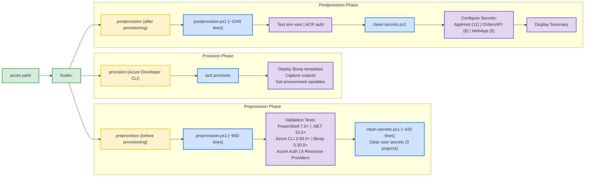

# Azure-LogicApps-Monitoring - Hooks Directory


## 📋 Overview

This directory contains PowerShell automation scripts that are executed during the Azure deployment lifecycle via Azure Developer CLI (azd). These scripts ensure that the environment is properly configured and prepared before and after provisioning Azure resources.

## 📑 Table of Contents

- [Core Scripts](#core-scripts)
- [Documentation Files](#documentation-files)
- [Quick Start](#quick-start)
- [Architecture](#architecture)
- [Common Workflows](#common-workflows)
- [Troubleshooting](#troubleshooting)
- [Best Practices](#best-practices)
- [Support](#support)

## 🔧 Core Scripts

### Production Scripts

#### 1. `preprovision.ps1` (Production Script)
**Purpose**: Pre-provisioning validation and preparation  
**Execution**: Automatically called by `azd provision` or `azd up`  
**Version**: 2.0.0  
**Lines of Code**: ~850

**What It Does**:
- ✓ Validates PowerShell 7.0+ is installed
- ✓ Validates .NET SDK 10.0+ is installed and configured
- ✓ Validates Azure Developer CLI (azd) is available
- ✓ Validates Azure CLI 2.60.0+ is installed
- ✓ Validates user is authenticated to Azure subscription
- ✓ Validates Bicep CLI 0.30.0+ is installed
- ✓ Validates 8 required Azure Resource Providers are registered
- ℹ️ Displays Azure subscription quota requirements
- 🧹 Clears user secrets for all projects (optional)

**Usage**:
```powershell
# Validate environment only (no secrets clearing)
.\preprovision.ps1 -ValidateOnly

# Full execution (validation + secrets clearing)
.\preprovision.ps1

# Force execution without prompts (CI/CD)
.\preprovision.ps1 -Force

# Preview changes without executing
.\preprovision.ps1 -WhatIf

# Detailed logging for troubleshooting
.\preprovision.ps1 -Verbose

# Validate but skip secrets clearing
.\preprovision.ps1 -SkipSecretsClear
```

**Parameters**:
- `-ValidateOnly`: Performs validation without clearing secrets
- `-SkipSecretsClear`: Validates and runs but skips secret clearing
- `-Force`: Forces execution without confirmation prompts
- `-WhatIf`: Shows what would happen without executing
- `-Confirm`: Prompts for confirmation before operations
- `-Verbose`: Displays detailed diagnostic information

**Exit Codes**:
- `0`: Success - all validations passed
- `1`: Failure - one or more validations failed

---

#### 2. `postprovision.ps1` (Production Script)
**Purpose**: Post-provisioning configuration and secret management  
**Execution**: Automatically called by `azd provision` or `azd up` after infrastructure deployment  
**Version**: 2.0.0  
**Lines of Code**: ~1040

**What It Does**:
- ✓ Validates required environment variables (set by azd)
- ✓ Authenticates to Azure Container Registry (if configured)
- ✓ Clears existing .NET user secrets via clean-secrets.ps1
- ✓ Configures user secrets with Azure resource information
- ✓ Sets connection strings, endpoints, and API keys
- ✓ Configures 26 secrets across 3 projects

**Usage**:
```powershell
# Automatic execution during azd provision
azd provision  # postprovision runs automatically

# Manual execution
.\postprovision.ps1

# Force mode (no prompts)
.\postprovision.ps1 -Force

# Preview changes
.\postprovision.ps1 -WhatIf

# Detailed logging
.\postprovision.ps1 -Verbose
```

**Parameters**:
- `-Force`: Skip confirmation prompts (used by azd)
- `-WhatIf`: Preview what would be configured
- `-Confirm`: Prompt for confirmation before operations
- `-Verbose`: Display detailed diagnostic information

**Exit Codes**:
- `0`: Success - all secrets configured successfully
- `1`: Failure - one or more operations failed

**Documentation**: 📖 [postprovision.md](./postprovision.md)

---

#### 3. `check-dev-workstation.ps1` (Developer Tool)
**Purpose**: Developer workstation prerequisite validation  
**Execution**: Manual execution before development work  
**Version**: 1.0.0  
**Lines of Code**: ~130

**What It Does**:
- ✓ Validates all development prerequisites (wrapper for preprovision.ps1 -ValidateOnly)
- ✓ Non-destructive read-only checks
- ✓ Quick environment validation for developers
- ✓ Ensures workstation readiness before starting work

**Usage**:
```powershell
# Standard validation
.\check-dev-workstation.ps1

# Detailed output
.\check-dev-workstation.ps1 -Verbose
```

**Parameters**:
- `-Verbose`: Display detailed diagnostic information

**Exit Codes**:
- `0`: Success - workstation is ready
- `1`: Failure - missing prerequisites

**Documentation**: 📖 [check-dev-workstation.md](./check-dev-workstation.md)

---

#### 4. `clean-secrets.ps1` (Utility Script)
**Purpose**: Clear .NET user secrets for all projects  
**Execution**: Called by `preprovision.ps1` or manually  
**Version**: 1.0.0  
**Lines of Code**: ~450

**What It Does**:
- Scans workspace for .NET projects with user secrets configured
- Clears user secrets using `dotnet user-secrets clear`
- Validates .NET SDK availability before execution
- Provides detailed execution summary

#### 4. `clean-secrets.ps1` (Utility Script)
**Purpose**: Clear .NET user secrets for all projects  
**Execution**: Called by preprovision.ps1 and postprovision.ps1, or manually  
**Version**: 2.0.0  
**Lines of Code**: ~420

**What It Does**:
- Clears user secrets for app.AppHost project
- Clears user secrets for eShop.Orders.API project
- Clears user secrets for eShop.Web.App project
- Validates .NET SDK availability before execution
- Provides detailed execution summary

**Usage**:
```powershell
# Interactive mode with confirmation
.\clean-secrets.ps1

# Force mode (no confirmations)
.\clean-secrets.ps1 -Force

# Preview mode
.\clean-secrets.ps1 -WhatIf

# Verbose output
.\clean-secrets.ps1 -Verbose
```

**Parameters**:
- `-Force`: Skip confirmation prompts
- `-WhatIf`: Show what would be cleared without executing
- `-Verbose`: Display detailed logging

**Exit Codes**:
- `0`: Success - all secrets cleared
- `1`: Failure - one or more operations failed

**Documentation**: 📖 [clean-secrets.md](./clean-secrets.md)

---

#### 5. `Generate-Orders.ps1` (Test Data Generator)
**Purpose**: Generate sample e-commerce order data for testing  
**Execution**: Manual execution when test data is needed  
**Version**: 1.0.0  
**Lines of Code**: ~480

**What It Does**:
- 🎲 Generates randomized order data with realistic structure
- 📦 20-product catalog with varied pricing
- 🌍 20 global delivery addresses
- 💰 Price variation simulation (±20%)
- 📊 Configurable order volume and products per order
- 📁 Outputs JSON file ready for Logic Apps ingestion

**Usage**:
```powershell
# Generate 50 orders (default)
.\Generate-Orders.ps1

# Generate custom number of orders
.\Generate-Orders.ps1 -OrderCount 100

# Custom output path
.\Generate-Orders.ps1 -OutputPath "C:\TestData\orders.json"

# Control products per order
.\Generate-Orders.ps1 -MinProducts 2 -MaxProducts 8

# Combined options
.\Generate-Orders.ps1 `
    -OrderCount 500 `
    -OutputPath "orders.json" `
    -MinProducts 1 `
    -MaxProducts 6 `
    -Verbose
```

**Parameters**:
- `-OrderCount`: Number of orders to generate (1-10000, default: 50)
- `-OutputPath`: Output file path (default: ..\infra\data\ordersBatch.json)
- `-MinProducts`: Minimum products per order (1-20, default: 1)
- `-MaxProducts`: Maximum products per order (1-20, default: 6)
- `-WhatIf`: Preview what would be generated
- `-Verbose`: Display detailed generation progress

**Documentation**: 📖 [Generate-Orders.md](./Generate-Orders.md)

---

### Legacy/Placeholder Scripts

#### 6. `preprovision.sh` (POSIX Script)
**Status**: Not implemented  
**Note**: Use PowerShell Core (pwsh) on Linux/macOS for cross-platform compatibility

#### 7. `generate_orders_script.py` (Python Script)
**Purpose**: Python implementation of order generation  
**Status**: Alternative to Generate-Orders.ps1  
**Language**: Python 3.x

---

## 📚 Documentation Files

### Individual Script Documentation

| File | Description | Lines | Status |
|------|-------------|-------|--------|
| **[check-dev-workstation.md](./check-dev-workstation.md)** | Complete guide for workstation validation script | ~500 | ✅ Complete |
| **[clean-secrets.md](./clean-secrets.md)** | Comprehensive documentation for secret clearing | ~650 | ✅ Complete |
| **[Generate-Orders.md](./Generate-Orders.md)** | Test data generation guide with examples | ~700 | ✅ Complete |
| **[postprovision.md](./postprovision.md)** | Post-provisioning configuration documentation | ~750 | ✅ Complete |

### preprovision.ps1 Documentation Suite

| File | Description | Lines | Status |
|------|-------------|-------|--------|
| **[PREPROVISION-ENHANCEMENTS.md](./PREPROVISION-ENHANCEMENTS.md)** | Technical deep-dive into preprovision enhancements | ~450 | ✅ Complete |
| **[PREPROVISION-QUICK-REFERENCE.md](./PREPROVISION-QUICK-REFERENCE.md)** | Quick reference guide with common scenarios | ~400 | ✅ Complete |
| **[ENHANCEMENT-SUMMARY.md](./ENHANCEMENT-SUMMARY.md)** | Executive summary of project improvements | ~350 | ✅ Complete |
| **[VALIDATION-WORKFLOW.md](./VALIDATION-WORKFLOW.md)** | Visual workflow diagrams and process flows | ~300 | ✅ Complete |

### Directory Documentation

| File | Description | Lines | Status |
|------|-------------|-------|--------|
| **[README.md](./README.md)** | This file - navigation hub for hooks directory | ~600 | ✅ Complete |

---

## 🚀 Quick Start

## 🚀 Quick Start

### First Time Developer Setup

```powershell
# 1. Navigate to repository root
cd Z:\Azure-LogicApps-Monitoring

# 2. Check if workstation is ready
.\hooks\check-dev-workstation.ps1 -Verbose

# 3. If validation passes, provision infrastructure
azd provision  # Automatically runs preprovision.ps1 and postprovision.ps1

# 4. Run application locally
azd up
```

### Daily Development Workflow

```powershell
# Option 1: Clear secrets before testing
.\hooks\clean-secrets.ps1 -Force
azd up

# Option 2: Full re-provisioning
azd provision  # Clears and reconfigures secrets automatically
```

### Generate Test Data

```powershell
# Generate sample orders for testing
cd hooks
.\Generate-Orders.ps1 -OrderCount 100

# Use generated data
$orders = Get-Content ..\infra\data\ordersBatch.json | ConvertFrom-Json
Write-Host "Generated $($orders.Count) orders"
```

### CI/CD Pipeline Setup

```yaml
# GitHub Actions example
- name: Validate Environment
  run: |
    pwsh -Command ".\hooks\preprovision.ps1 -Force -InformationAction Continue"
  shell: pwsh

- name: Deploy to Azure
  run: azd provision --no-prompt
  shell: pwsh
  # postprovision.ps1 runs automatically
```

---

## 🏗️ Architecture

## 🏗️ Architecture

### Script Execution Flow



### Script Relationships Matrix

| Script | Calls | Called By | Purpose |
|--------|-------|-----------|---------|
| **preprovision.ps1** | clean-secrets.ps1 | azd provision | Pre-provision validation |
| **postprovision.ps1** | clean-secrets.ps1 | azd provision | Post-provision configuration |
| **clean-secrets.ps1** | None | preprovision, postprovision, manual | Clear user secrets |
| **check-dev-workstation.ps1** | preprovision.ps1 | Developer | Workstation validation |
| **Generate-Orders.ps1** | None | Developer, CI/CD | Test data generation |

---

## 📋 Validation Prerequisites

### Required Tools (Validated by preprovision.ps1)

| Tool | Minimum Version | Purpose |
|------|----------------|---------|
| **PowerShell** | 7.0 | Script execution environment |
| **.NET SDK** | 10.0 | Build and run .NET Aspire applications |
| **Azure Developer CLI** | Latest | Deployment orchestration (azd) |
| **Azure CLI** | 2.60.0 | Azure resource management |
| **Bicep CLI** | 0.30.0 | Infrastructure as Code deployment |

### Required Azure Configuration

**Azure Authentication**:
- Must be authenticated via `az login`
- Must have active subscription selected
- Must have appropriate permissions (Contributor or Owner)

**Resource Providers** (8 required):
1. `Microsoft.App` - Container Apps
2. `Microsoft.ServiceBus` - Service Bus
3. `Microsoft.Storage` - Storage Accounts
4. `Microsoft.Web` - Logic Apps Standard
5. `Microsoft.ContainerRegistry` - Container Registry
6. `Microsoft.Insights` - Application Insights
7. `Microsoft.OperationalInsights` - Log Analytics
8. `Microsoft.ManagedIdentity` - Managed Identities

**Resource Quotas** (informational):
- Container Apps: Minimum 2
- Storage Accounts: Minimum 3
- Service Bus Namespaces: Minimum 1
- Logic Apps Standard: Minimum 1
- Container Registries: Minimum 1

---

## 📋 Common Workflows

### Scenario 1: New Developer Onboarding

```powershell
# Step 1: Clone repository
git clone <repository-url>
cd Azure-LogicApps-Monitoring

# Step 2: Install prerequisites
# - PowerShell 7.x
# - .NET 10.0 SDK
# - Azure CLI 2.60.0+
# - Azure Developer CLI (azd)
# - Bicep CLI 0.30.0+

# Step 3: Authenticate to Azure
az login
az account set --subscription "Your-Subscription-Name"

# Step 4: Validate workstation
.\hooks\check-dev-workstation.ps1 -Verbose

# Step 5: Register Azure resource providers (if needed)
az provider register --namespace Microsoft.App --wait
# Repeat for other required providers...

# Step 6: Deploy infrastructure
azd up
# This runs preprovision.ps1 and postprovision.ps1 automatically
```

**Documentation**: 
- 📖 [check-dev-workstation.md](./check-dev-workstation.md) - Detailed validation guide
- 📖 [PREPROVISION-QUICK-REFERENCE.md](./PREPROVISION-QUICK-REFERENCE.md) - Prerequisites reference

---

### Scenario 2: Troubleshooting Failed Validation

```powershell
# Get comprehensive diagnostics
.\hooks\preprovision.ps1 -ValidateOnly -Verbose -InformationAction Continue

# Check specific tools manually
dotnet --version        # Should be 10.0+
az version             # Should be 2.60.0+
az account show        # Should show active subscription
az bicep version       # Should be 0.30.0+
azd version           # Any version
pwsh --version        # Should be 7.0+

# Check resource provider registration status
az provider list --query "[?registrationState=='NotRegistered'].namespace" -o table

# Register missing providers
$providers = @(
    "Microsoft.App",
    "Microsoft.ServiceBus",
    "Microsoft.Storage",
    "Microsoft.Web",
    "Microsoft.ContainerRegistry",
    "Microsoft.Insights",
    "Microsoft.OperationalInsights",
    "Microsoft.ManagedIdentity"
)

foreach ($provider in $providers) {
    Write-Host "Registering $provider..."
    az provider register --namespace $provider --wait
}

# Verify registration
az provider list --query "[?namespace in $providers].[namespace, registrationState]" -o table

# Retry validation
.\hooks\preprovision.ps1 -ValidateOnly
```

**Documentation**: 
- 📖 [PREPROVISION-ENHANCEMENTS.md](./PREPROVISION-ENHANCEMENTS.md) - Technical troubleshooting
- 📖 [VALIDATION-WORKFLOW.md](./VALIDATION-WORKFLOW.md) - Visual workflow diagrams

---

### Scenario 3: CI/CD Pipeline Integration

**GitHub Actions:**
```yaml
name: Deploy to Azure

on:
  push:
    branches: [main]
  workflow_dispatch:

jobs:
  deploy:
    runs-on: windows-latest
    
    steps:
      - name: Checkout Code
        uses: actions/checkout@v3
      
      - name: Setup PowerShell
        uses: azure/powershell@v1
        with:
          azPSVersion: 'latest'
      
      - name: Azure Login
        uses: azure/login@v1
        with:
          creds: ${{ secrets.AZURE_CREDENTIALS }}
      
      - name: Install Azure Developer CLI
        run: |
          winget install Microsoft.AzureDeveloperCLI
      
      - name: Pre-provision Validation
        run: |
          .\hooks\preprovision.ps1 -Force -InformationAction Continue
        shell: pwsh
        
      - name: Deploy Infrastructure
        run: azd provision --no-prompt
        shell: pwsh
        env:
          AZURE_SUBSCRIPTION_ID: ${{ secrets.AZURE_SUBSCRIPTION_ID }}
          
      - name: Verify Secrets Configuration
        run: |
          dotnet user-secrets list --project app.AppHost/app.AppHost.csproj
        shell: pwsh
```

**Azure DevOps:**
```yaml
trigger:
  - main

pool:
  vmImage: 'windows-latest'

steps:
  - task: AzureCLI@2
    displayName: 'Azure Login'
    inputs:
      azureSubscription: 'AzureServiceConnection'
      scriptType: 'pscore'
      scriptLocation: 'inlineScript'
      inlineScript: 'az account show'

  - task: PowerShell@2
    displayName: 'Pre-provision Validation'
    inputs:
      targetType: 'filePath'
      filePath: './hooks/preprovision.ps1'
      arguments: '-Force -InformationAction Continue'
      pwsh: true

  - task: PowerShell@2
    displayName: 'Deploy Infrastructure'
    inputs:
      targetType: 'inline'
      script: 'azd provision --no-prompt'
      pwsh: true
```

**Documentation**: 
- 📖 [PREPROVISION-QUICK-REFERENCE.md](./PREPROVISION-QUICK-REFERENCE.md) - CI/CD integration examples

---

### Scenario 4: Secret Management

**Clear and Reconfigure Secrets:**
```powershell
# Option 1: Manual clearing and reconfiguration
.\hooks\clean-secrets.ps1 -Force
.\hooks\postprovision.ps1 -Force

# Option 2: Let azd handle it (recommended)
azd provision  # Automatically clears and reconfigures

# Verify secrets were set correctly
dotnet user-secrets list --project app.AppHost\app.AppHost.csproj
dotnet user-secrets list --project src\eShop.Orders.API\eShop.Orders.API.csproj
dotnet user-secrets list --project src\eShop.Web.App\eShop.Web.App.csproj
```

**Preview Secret Operations:**
```powershell
# See what would be cleared
.\hooks\clean-secrets.ps1 -WhatIf

# See what would be configured
.\hooks\postprovision.ps1 -WhatIf
```

**Documentation**: 
- 📖 [clean-secrets.md](./clean-secrets.md) - Secret clearing guide
- 📖 [postprovision.md](./postprovision.md) - Secret configuration guide

---

### Scenario 5: Test Data Generation

**Generate Sample Orders:**
```powershell
# Basic generation (50 orders)
.\hooks\Generate-Orders.ps1

# Large dataset for load testing
.\hooks\Generate-Orders.ps1 -OrderCount 1000 -Verbose

# Custom configuration
.\hooks\Generate-Orders.ps1 `
    -OrderCount 200 `
    -OutputPath "C:\TestData\orders.json" `
    -MinProducts 2 `
    -MaxProducts 8

# Preview without generating
.\hooks\Generate-Orders.ps1 -WhatIf

# Verify generated data
$orders = Get-Content infra\data\ordersBatch.json | ConvertFrom-Json
$orders | Measure-Object -Property totalAmount -Sum -Average
$orders | Select-Object -First 3 | ConvertTo-Json -Depth 10
```

**Generate Multiple Datasets:**
```powershell
# Create different test scenarios
$scenarios = @(
    @{ Name = "small-orders"; Count = 50; Min = 1; Max = 2 },
    @{ Name = "medium-orders"; Count = 50; Min = 3; Max = 5 },
    @{ Name = "large-orders"; Count = 50; Min = 6; Max = 10 }
)

foreach ($scenario in $scenarios) {
    .\Generate-Orders.ps1 `
        -OrderCount $scenario.Count `
        -MinProducts $scenario.Min `
        -MaxProducts $scenario.Max `
        -OutputPath "C:\TestData\$($scenario.Name).json"
}
```

**Documentation**: 
- 📖 [Generate-Orders.md](./Generate-Orders.md) - Complete generation guide

---

### Scenario 6: Multi-Environment Management

```powershell
# Create and configure multiple environments
$environments = @('dev', 'staging', 'prod')

foreach ($env in $environments) {
    Write-Host "`n=== Configuring environment: $env ===" -ForegroundColor Cyan
    
    # Create environment
    azd env new $env
    
    # Set environment-specific variables
    azd env set ENVIRONMENT_NAME $env
    
    # Provision infrastructure
    azd provision --environment $env
    # preprovision.ps1 and postprovision.ps1 run automatically
    
    Write-Host "✓ $env environment configured" -ForegroundColor Green
}

# Switch between environments
azd env select dev      # Switch to dev
azd env select staging  # Switch to staging

# List all environments
azd env list

# View environment-specific configuration
azd env get-values
```

---

## Scenario 7: Manual Secret Management
---

## Scenario 7: Manual Secret Management

```powershell
# List all configured secrets for a project
dotnet user-secrets list --project app.AppHost\app.AppHost.csproj

# Set a specific secret
dotnet user-secrets set "ConnectionStrings:Custom" "Server=..." `
    --project app.AppHost\app.AppHost.csproj

# Remove a specific secret
dotnet user-secrets remove "ConnectionStrings:Custom" `
    --project app.AppHost\app.AppHost.csproj

# Clear all secrets for a project
dotnet user-secrets clear --project app.AppHost\app.AppHost.csproj

# Initialize user secrets for a new project
dotnet user-secrets init --project MyNewProject\MyNewProject.csproj
```

---

## ⚠️ Troubleshooting

### Common Issues and Solutions

#### Issue: "PowerShell version X is not supported"
**Solution**: Install PowerShell 7.0 or higher
```powershell
winget install Microsoft.PowerShell
```

#### Issue: ".NET SDK 10.0 or higher is required"
**Solution**: Install .NET 10.0 SDK
```powershell
winget install Microsoft.DotNet.SDK.10
# Or download from: https://dotnet.microsoft.com/download/dotnet/10.0
```

#### Issue: "Azure CLI X or higher is required"
**Solution**: Install or upgrade Azure CLI
```powershell
winget install Microsoft.AzureCLI
```

#### Issue: "User is not authenticated to Azure"
**Solution**: Login to Azure
```powershell
az login
az account set --subscription "Your-Subscription-Name"
az account show  # Verify
```

#### Issue: "Bicep CLI X or higher is required"
**Solution**: Install or upgrade Bicep
```powershell
az bicep install
# Or upgrade:
az bicep upgrade
```

#### Issue: "Resource provider not registered"
**Solution**: Register the required provider
```powershell
az provider register --namespace Microsoft.App --wait
az provider register --namespace Microsoft.ServiceBus --wait
# Repeat for each unregistered provider
```

#### Issue: Script execution policy error
**Solution**: Set execution policy
```powershell
Set-ExecutionPolicy -ExecutionPolicy RemoteSigned -Scope CurrentUser
```

---

## Performance Considerations

### Execution Times
- **preprovision.ps1 -ValidateOnly**: 14-16 seconds
- **preprovision.ps1 (full)**: 18-22 seconds
- **clean-secrets.ps1**: 2-5 seconds

### Network Dependencies
- Azure CLI operations require internet connectivity
- Resource provider checks make 8 API calls to Azure
- Authentication validation requires Azure subscription access

### Optimization Tips
- Use `-ValidateOnly` when only checking prerequisites
- Use `-SkipSecretsClear` when secrets don't need clearing
- Run with `-Verbose` only when troubleshooting
- Cache tool versions in CI/CD for faster execution

---

## Best Practices

### Development
1. ✅ Always run `-ValidateOnly` before first deployment
2. ✅ Use `-Verbose` when troubleshooting issues
3. ✅ Clear secrets before committing code
4. ✅ Test scripts locally before CI/CD integration
5. ❌ Don't skip prerequisite validation
6. ❌ Don't commit user secrets to source control

### CI/CD
1. ✅ Always use `-Force` parameter in pipelines
2. ✅ Check exit codes (`$LASTEXITCODE`)
3. ✅ Use `-InformationAction Continue` for logging
4. ✅ Run validation as separate step before deployment
5. ❌ Don't ignore validation warnings
6. ❌ Don't deploy without authentication

### Operations
1. ✅ Monitor execution times in logs
2. ✅ Review warnings even if validation passes
3. ✅ Keep documentation up to date
4. ✅ Test in non-production first
5. ❌ Don't bypass validation in production
6. ❌ Don't ignore resource provider registration

## 📞 Support and Resources

### 📖 Documentation Navigator

**Individual Script Guides:**
- [check-dev-workstation.md](./check-dev-workstation.md) - Workstation validation (500 lines)
- [clean-secrets.md](./clean-secrets.md) - Secret clearing guide (650 lines)
- [Generate-Orders.md](./Generate-Orders.md) - Test data generation (700 lines)
- [postprovision.md](./postprovision.md) - Post-provision configuration (750 lines)

**preprovision.ps1 Documentation Suite:**
- [PREPROVISION-ENHANCEMENTS.md](./PREPROVISION-ENHANCEMENTS.md) - Technical deep-dive (450 lines)
- [PREPROVISION-QUICK-REFERENCE.md](./PREPROVISION-QUICK-REFERENCE.md) - Quick reference (400 lines)
- [ENHANCEMENT-SUMMARY.md](./ENHANCEMENT-SUMMARY.md) - Executive summary (350 lines)
- [VALIDATION-WORKFLOW.md](./VALIDATION-WORKFLOW.md) - Visual workflows (300 lines)

**Directory Documentation:**
- [README.md](./README.md) - This file - navigation hub

### 🔗 External Resources

**Azure Documentation:**
- [Azure CLI Documentation](https://docs.microsoft.com/cli/azure/)
- [Azure Developer CLI (azd)](https://aka.ms/azd)
- [Bicep Documentation](https://learn.microsoft.com/azure/azure-resource-manager/bicep/)
- [Azure Logic Apps Standard](https://learn.microsoft.com/azure/logic-apps/)
- [Azure Resource Providers](https://learn.microsoft.com/azure/azure-resource-manager/management/azure-services-resource-providers)

**.NET Documentation:**
- [.NET 10.0 Documentation](https://dotnet.microsoft.com/download/dotnet/10.0)
- [.NET User Secrets](https://learn.microsoft.com/aspnet/core/security/app-secrets)
- [.NET Aspire](https://learn.microsoft.com/dotnet/aspire/)

**PowerShell Documentation:**
- [PowerShell 7+ Documentation](https://learn.microsoft.com/powershell/)
- [PowerShell Best Practices](https://learn.microsoft.com/powershell/scripting/developer/cmdlet/strongly-encouraged-development-guidelines)
- [Comment-Based Help](https://learn.microsoft.com/powershell/module/microsoft.powershell.core/about/about_comment_based_help)

### 🆘 Getting Help

1. **Review Documentation**: Check the relevant markdown file for your script
2. **Use Verbose Mode**: Run scripts with `-Verbose` for detailed diagnostics
3. **Check Tool Versions**: Verify all tools meet minimum requirements
4. **Verify Azure Authentication**: Ensure `az account show` works
5. **Review Logs**: Check output for specific error messages and solutions
6. **Consult Troubleshooting**: Each documentation file has a dedicated troubleshooting section

### 🐛 Reporting Issues

When reporting problems, include:

1. **Script Output**: Full output with `-Verbose` flag
2. **Environment Details**:
   ```powershell
   $PSVersionTable
   dotnet --version
   az --version
   azd version
   az bicep version
   ```
3. **Azure Context**:
   ```powershell
   az account show
   az provider list --query "[?registrationState=='NotRegistered']" -o table
   ```
4. **Error Details**: Complete error messages and stack traces

---

## 🎓 Best Practices
