# Azure Logic Apps Monitoring - Developer Inner Loop Workflow


## 📋 Table of Contents

- [Overview](#-overview)
- [Developer Inner Loop Workflow](#-developer-inner-loop-workflow)
  - [Workflow Phases](#workflow-phases)
- [Quick Start Guide](#-quick-start-guide)
- [CI/CD Pipeline Integration](#-cicd-pipeline-integration)
- [Best Practices](#-best-practices)
- [Troubleshooting](#-troubleshooting)
- [Related Documentation](#-related-documentation)

---

## 🎯 Overview

This directory contains automation scripts that streamline the Azure Logic Apps Monitoring solution's development lifecycle. These scripts integrate seamlessly with Azure Developer CLI (azd) to validate prerequisites, provision infrastructure, configure secrets, and generate test data—ensuring developers can focus on building features rather than managing environment setup.

The scripts support cross-platform execution (Windows, Linux, and macOS) with dual implementations in PowerShell and Bash. They execute automatically as part of the azd lifecycle hooks during `azd provision` and `azd up` commands, eliminating manual configuration steps and reducing the risk of environment-related deployment failures. Whether you're onboarding a new team member, reprovisioning infrastructure, or troubleshooting configuration issues, these scripts provide a consistent and reliable workflow.

By automating environment validation, secret management, and test data generation, the hooks directory reduces time-to-productivity for developers while maintaining configuration consistency across development, testing, and production environments. Each script is designed with safety in mind, offering dry-run modes, verbose logging, and force options for CI/CD integration.

### Available Scripts

| Script | PowerShell | Bash | Purpose | Documentation |
|--------|------------|------|---------|---------------|
| **Environment Check** | `check-dev-workstation.ps1` | `check-dev-workstation.sh` | Validate workstation prerequisites | [📄 check-dev-workstation.md](./check-dev-workstation.md) |
| **Pre-Provisioning** | `preprovision.ps1` | `preprovision.sh` | Validate and prepare for deployment | [📄 VALIDATION-WORKFLOW.md](./VALIDATION-WORKFLOW.md) |
| **Post-Provisioning** | `postprovision.ps1` | `postprovision.sh` | Configure secrets after deployment | [📄 postprovision.md](./postprovision.md) |
| **Secrets Management** | `clean-secrets.ps1` | `clean-secrets.sh` | Clear .NET user secrets | [📄 clean-secrets.md](./clean-secrets.md) |
| **Test Data** | `Generate-Orders.ps1` | `Generate-Orders.sh` | Generate sample order data | [📄 Generate-Orders.md](./Generate-Orders.md) |

---

## 🔄 Developer Inner Loop Workflow

The Developer Inner Loop consists of iterative cycles through validation, provisioning, configuration, and testing phases.

### Workflow Phases

```mermaid
graph LR
    Start[Developer Workstation] --> Phase1
    
    subgraph Phase1["🔍 Phase 1: Environment Validation"]
        direction LR
        CheckDev[check-dev-workstation<br/>Optional but Recommended]
        PreProv[preprovision<br/>Required by azd]
        CheckDev --> PreProv
    end
    
    Phase1 --> Decision1{Prerequisites<br/>Met?}
    Decision1 -->|No| Fix[Fix Issues]
    Fix --> Phase1
    Decision1 -->|Yes| Phase2
    
    subgraph Phase2["🚀 Phase 2: Infrastructure Provisioning"]
        direction LR
        AzdProv[azd provision<br/>Bicep Deployment]
    end
    
    Phase2 --> Decision2{Deployment<br/>Success?}
    Decision2 -->|No| Debug[Debug & Retry]
    Debug --> Phase2
    Decision2 -->|Yes| Phase3
    
    subgraph Phase3["⚙️ Phase 3: Post-Deployment Configuration"]
        direction LR
        PostProv[postprovision] --> CleanSec[clean-secrets]
        CleanSec --> SetSec[Configure User Secrets<br/>26 secrets across 3 projects]
    end
    
    Phase3 --> Phase4
    
    subgraph Phase4["🧪 Phase 4: Test Data Generation"]
        direction LR
        GenOrders[Generate-Orders<br/>Optional]
    end
    
    Phase4 --> Ready[Ready for Development]
    Ready --> Develop[Develop & Test]
    Develop --> Changes{Need to<br/>Reprovision?}
    Changes -->|Yes| Phase1
    Changes -->|No| Develop
    
    style Start fill:#e3f2fd,stroke:#1976d2,stroke-width:2px
    style Ready fill:#d1e7dd,stroke:#198754,stroke-width:2px
    style Develop fill:#d1e7dd,stroke:#198754,stroke-width:2px
    style Fix fill:#f8d7da,stroke:#dc3545,stroke-width:2px
    style Debug fill:#f8d7da,stroke:#dc3545,stroke-width:2px
    style Decision1 fill:#fff3cd,stroke:#ffc107,stroke-width:2px
    style Decision2 fill:#fff3cd,stroke:#ffc107,stroke-width:2px
    style Changes fill:#fff3cd,stroke:#ffc107,stroke-width:2px
```



---

## 🚀 Quick Start Guide

### Azure Developer CLI Overview

Azure Developer CLI (azd) is a command-line tool that accelerates the time from development to deployment by providing a consistent workflow for building, deploying, and monitoring cloud applications on Azure. It abstracts the complexity of infrastructure provisioning, application deployment, and environment management into simple, repeatable commands that work across different Azure services and application architectures.

The azd workflow is built around a convention-based approach using an `azure.yaml` file that defines your application's structure, services, and deployment targets. When you run commands like `azd up` or `azd provision`, azd orchestrates the entire deployment process—from validating prerequisites to deploying infrastructure with Bicep templates, configuring application secrets, and deploying application code. This automation eliminates manual steps and ensures consistency across team members and environments.

For the Azure Logic Apps Monitoring solution, azd integrates with custom lifecycle hooks (preprovision and postprovision scripts) to validate development environments, configure .NET user secrets with Azure resource information, and generate test data automatically. This seamless integration means developers can provision a complete, ready-to-use environment with a single command, reducing setup time from hours to minutes while maintaining configuration accuracy and security best practices.

### azd Lifecycle Hooks

#### Understanding azure.yaml

The `azure.yaml` file serves as the central configuration for Azure Developer CLI, defining your application's metadata, services, infrastructure location, and lifecycle hooks. This declarative file tells azd how to build, package, and deploy your application, where to find your infrastructure-as-code templates (Bicep or Terraform), and what custom scripts to execute at specific points in the deployment lifecycle. The azure.yaml configuration ensures that every team member follows the same deployment process, reducing environment inconsistencies and configuration drift.

```yaml
# yaml-language-server: $schema=https://raw.githubusercontent.com/Azure/azure-dev/main/schemas/v1.0/azure.yaml.json

# ==============================================================================
# Azure Developer CLI (azd) Configuration
# ==============================================================================
# This configuration defines the infrastructure, services, and lifecycle hooks
# for the Azure Logic Apps Monitoring solution. It orchestrates environment
# setup, provisioning, and post-deployment configuration.
#
# Documentation: https://learn.microsoft.com/azure/developer/azure-developer-cli/
# ==============================================================================

# ------------------------------------------------------------------------------
# Project Metadata
# ------------------------------------------------------------------------------
# Unique identifier for this azd template
name: azure-logicapps-monitoring

# Template version and metadata for azd template gallery
metadata:
  template: azure-logicapps-monitoring@0.0.1

# ------------------------------------------------------------------------------
# Infrastructure Configuration
# ------------------------------------------------------------------------------
# Defines how and where infrastructure is defined and deployed
infra:
  provider: bicep                      # Infrastructure as Code provider
  path: infra                          # Directory containing Bicep templates
  module: main                         # Entry point Bicep module (main.bicep)

# ------------------------------------------------------------------------------
# Lifecycle Hooks
# ------------------------------------------------------------------------------
# Scripts executed at specific points in the azd workflow to automate
# environment validation, configuration, and data generation

hooks:
  # Pre-provisioning validation hook
  # Executes before 'azd provision' to validate workstation prerequisites
  preprovision:
    posix:                             # Linux/macOS configuration
      shell: sh
      run: ./hooks/preprovision.sh
      continueOnError: false           # Fail fast on validation errors
    windows:                           # Windows configuration
      shell: pwsh
      run: ./hooks/preprovision.ps1
      continueOnError: false

  # Post-provisioning configuration hook
  # Executes after 'azd provision' to configure local development secrets
  # and generate test data for the application
  postprovision:
    posix:                             # Linux/macOS configuration
      shell: sh
      run: |
        ./hooks/postprovision.sh       # Configure .NET user secrets
        ./hooks/Generate-Orders.sh     # Generate test order data
      continueOnError: false
    windows:                           # Windows configuration
      shell: pwsh
      run: |
        ./hooks/postprovision.ps1      # Configure .NET user secrets
        ./hooks/Generate-Orders.ps1    # Generate test order data
      continueOnError: false

# ------------------------------------------------------------------------------
# Application Services
# ------------------------------------------------------------------------------
# Defines the application components to be deployed to Azure

services:
  # .NET Aspire AppHost orchestrating the monitoring solution
  app:
    language: dotnet                   # Service implementation language
    project: ./app.AppHost/app.AppHost.csproj  # Path to project file
    host: containerapp                 # Target hosting platform (Azure Container Apps)
```

For this project, azure.yaml defines the Orders API and Web App services, specifies the Bicep infrastructure templates in the `infra/` directory, and declares preprovision and postprovision hooks that execute platform-specific scripts. The hooks section is particularly powerful because it allows you to inject custom validation, configuration, and data generation logic into the azd workflow without modifying azd itself. This extensibility makes azd suitable for complex enterprise scenarios where standard deployment workflows need augmentation with organization-specific requirements.

The azure.yaml format supports both Windows (PowerShell) and POSIX (Bash) environments, allowing the same configuration file to work seamlessly across developer workstations regardless of operating system. This cross-platform support, combined with the ability to define custom hooks, makes azd an ideal orchestrator for complex, multi-service applications that require careful coordination of infrastructure, configuration, and application deployment.

#### Lifecycle Hooks Overview

Lifecycle hooks are extension points in the Azure Developer CLI workflow that allow you to execute custom scripts before (preprovision) or after (postprovision) infrastructure provisioning. These hooks enable you to add validation logic, environment preparation steps, secret management, or post-deployment configuration that goes beyond azd's built-in capabilities. Hooks execute in the context of the azd command, inheriting environment variables set by azd and able to access deployment outputs from your Bicep templates.

The preprovision hook is your opportunity to validate that the development environment is properly configured before azd attempts to deploy infrastructure. This is where you check for required tools (Azure CLI, .NET SDK, PowerShell), verify Azure authentication, ensure resource providers are registered, and clear stale configuration that might interfere with the new deployment. By catching configuration issues early, preprovision hooks prevent failed deployments and save developers time troubleshooting errors that could have been detected upfront.

The postprovision hook executes after infrastructure is successfully deployed but before application code deployment. At this stage, azd has set environment variables containing Azure resource names, connection strings, and endpoints from your Bicep template outputs. The postprovision hook uses these values to configure .NET user secrets, authenticate to Azure Container Registry, upload test data, or perform any other configuration that requires knowledge of the deployed infrastructure. This automation ensures that developers have a fully configured, ready-to-use environment immediately after provisioning completes.

#### Execution Flow


### First-Time Setup

#### Windows (PowerShell)

```powershell
# 1. Navigate to repository root
cd Z:\Azure-LogicApps-Monitoring

# 2. Validate your workstation (optional but recommended)
.\hooks\check-dev-workstation.ps1

# 3. Provision infrastructure (preprovision runs automatically)
azd provision

# 4. Generate test data (optional)
.\hooks\Generate-Orders.ps1 -OrderCount 100

# 5. Start local development
azd up
```

#### Linux/macOS (Bash)

```bash
# 1. Navigate to repository root
cd /path/to/Azure-LogicApps-Monitoring

# 2. Make scripts executable
chmod +x hooks/*.sh

# 3. Validate your workstation (optional but recommended)
./hooks/check-dev-workstation.sh

# 4. Provision infrastructure (preprovision runs automatically)
azd provision

# 5. Generate test data (optional)
./hooks/Generate-Orders.sh --order-count 100

# 6. Start local development
azd up
```

### Subsequent Development Cycles

```powershell
# Check for environment changes
.\hooks\check-dev-workstation.ps1

# Re-provision if infrastructure changed
azd provision

# Generate fresh test data
.\hooks\Generate-Orders.ps1
```

### Manual Secret Management

```powershell
# Clear all secrets
.\hooks\clean-secrets.ps1 -Force

# Reconfigure secrets without reprovisioning
.\hooks\postprovision.ps1 -Force
```

---

##  CI/CD Pipeline Integration

### GitHub Actions

```yaml
name: Deploy to Azure

on:
  push:
    branches: [main]
  workflow_dispatch:

jobs:
  deploy:
    runs-on: ubuntu-latest
    steps:
      - name: Checkout code
        uses: actions/checkout@v4

      - name: Setup PowerShell
        uses: actions/setup-powershell@v1
        with:
          pwsh-version: '7.4'

      - name: Install Azure Developer CLI
        run: |
          curl -fsSL https://aka.ms/install-azd.sh | bash

      - name: Azure Login
        uses: azure/login@v1
        with:
          creds: ${{ secrets.AZURE_CREDENTIALS }}

      - name: Check workstation prerequisites
        run: |
          chmod +x hooks/check-dev-workstation.sh
          ./hooks/check-dev-workstation.sh --verbose

      - name: Provision infrastructure
        run: azd provision --no-prompt
        env:
          AZURE_SUBSCRIPTION_ID: ${{ secrets.AZURE_SUBSCRIPTION_ID }}
          AZURE_LOCATION: eastus

      - name: Generate test data
        run: |
          chmod +x hooks/Generate-Orders.sh
          ./hooks/Generate-Orders.sh --order-count 100 --verbose
```

### Azure DevOps

```yaml
trigger:
  branches:
    include:
      - main

pool:
  vmImage: 'ubuntu-latest'

steps:
  - task: PowerShell@2
    displayName: 'Install Azure Developer CLI'
    inputs:
      targetType: 'inline'
      script: |
        curl -fsSL https://aka.ms/install-azd.sh | bash

  - task: AzureCLI@2
    displayName: 'Check workstation prerequisites'
    inputs:
      azureSubscription: '$(azureServiceConnection)'
      scriptType: 'bash'
      scriptLocation: 'scriptPath'
      scriptPath: 'hooks/check-dev-workstation.sh'
      arguments: '--verbose'

  - task: AzureCLI@2
    displayName: 'Provision infrastructure'
    inputs:
      azureSubscription: '$(azureServiceConnection)'
      scriptType: 'bash'
      scriptLocation: 'inlineScript'
      inlineScript: |
        azd provision --no-prompt
    env:
      AZURE_SUBSCRIPTION_ID: $(azureSubscriptionId)
      AZURE_LOCATION: eastus

  - task: PowerShell@2
    displayName: 'Generate test data'
    inputs:
      targetType: 'filePath'
      filePath: 'hooks/Generate-Orders.ps1'
      arguments: '-OrderCount 100 -Force -Verbose'
```

---

## ✅ Best Practices

### Development Workflow

1. **Always run check-dev-workstation first** on new workstations or after updates
2. **Let azd manage the lifecycle** - don't call preprovision/postprovision manually unless needed
3. **Use -Verbose for troubleshooting** to get detailed diagnostic information
4. **Generate fresh test data** after each provisioning for consistent testing
5. **Clear secrets before reprovisioning** to avoid stale configuration issues

### Script Execution

1. **Use -Force in CI/CD pipelines** to skip interactive prompts
2. **Enable verbose logging in CI/CD** for audit trails and troubleshooting
3. **Set continueOnError: false** in azd hooks to fail fast on errors
4. **Test scripts locally** before committing to version control
5. **Keep scripts executable** on Unix systems: `chmod +x hooks/*.sh`

### Secret Management

1. **Never commit secrets** to version control
2. **Use .NET user secrets** for local development
3. **Use Azure Key Vault** for production secrets
4. **Clear secrets regularly** during development to prevent stale data
5. **Validate secrets configuration** after postprovision execution

### Azure Resource Management

1. **Register resource providers** before first deployment
2. **Check Azure quotas** before large deployments
3. **Use consistent naming** across environments
4. **Tag resources appropriately** for cost tracking
5. **Clean up unused resources** with `azd down`

### Cross-Platform Development

1. **Test on multiple platforms** (Windows, Linux, macOS)
2. **Use cross-platform tools** (PowerShell 7+, Azure CLI, .NET SDK)
3. **Maintain both .ps1 and .sh versions** of scripts
4. **Use consistent line endings** (LF) for shell scripts
5. **Validate scripts** with ShellCheck (Bash) and PSScriptAnalyzer (PowerShell)

---

## 🛠️ Troubleshooting

### Common Issues

#### Issue: "PowerShell version is too old"

**Solution:**
```powershell
# Install PowerShell 7.0+
# Windows:
winget install Microsoft.PowerShell

# Linux/macOS:
# See: https://learn.microsoft.com/powershell/scripting/install/installing-powershell
```

#### Issue: ".NET SDK not found"

**Solution:**
```bash
# Install .NET SDK 10.0+
# Windows:
winget install Microsoft.DotNet.SDK.10

# Linux/macOS:
# See: https://dotnet.microsoft.com/download
```

#### Issue: "Azure CLI authentication failed"

**Solution:**
```bash
# Login to Azure
az login

# Set subscription (if multiple)
az account set --subscription "your-subscription-id"

# Verify login
az account show
```

#### Issue: "Resource provider not registered"

**Solution:**
```bash
# Register required providers
az provider register --namespace Microsoft.App
az provider register --namespace Microsoft.ServiceBus
az provider register --namespace Microsoft.Storage
az provider register --namespace Microsoft.Web
az provider register --namespace Microsoft.ContainerRegistry
az provider register --namespace Microsoft.Insights
az provider register --namespace Microsoft.OperationalInsights
az provider register --namespace Microsoft.ManagedIdentity

# Check registration status
az provider show --namespace Microsoft.App --query "registrationState"
```

#### Issue: "Secrets not configured after provisioning"

**Solution:**
```powershell
# Manually run postprovision
.\hooks\postprovision.ps1 -Force -Verbose

# Verify secrets are set
dotnet user-secrets list --project app.AppHost
```

#### Issue: "Generate-Orders fails with Python error"

**Solution:**
```bash
# Install Python 3.8+
# Windows:
winget install Python.Python.3.12

# Linux:
sudo apt install python3.12

# macOS:
brew install python@3.12
```

### Debug Mode

Enable verbose output for detailed diagnostics:

```powershell
# Windows
$VerbosePreference = 'Continue'
.\hooks\check-dev-workstation.ps1 -Verbose
.\hooks\preprovision.ps1 -Verbose
.\hooks\postprovision.ps1 -Verbose
.\hooks\Generate-Orders.ps1 -Verbose

# Linux/macOS
./hooks/check-dev-workstation.sh --verbose
./hooks/preprovision.sh --verbose
./hooks/postprovision.sh --verbose
./hooks/Generate-Orders.sh --verbose
```

### Getting Help

For additional assistance:

1. **Review detailed script documentation**:
   - [check-dev-workstation.md](./check-dev-workstation.md)
   - [VALIDATION-WORKFLOW.md](./VALIDATION-WORKFLOW.md)
   - [postprovision.md](./postprovision.md)
   - [clean-secrets.md](./clean-secrets.md)
   - [Generate-Orders.md](./Generate-Orders.md)

2. **Check Azure Developer CLI documentation**: https://learn.microsoft.com/azure/developer/azure-developer-cli/

3. **Review Azure CLI documentation**: https://learn.microsoft.com/cli/azure/

4. **Open an issue**: [GitHub Issues](https://github.com/Evilazaro/Azure-LogicApps-Monitoring/issues)

---

## 📖 Related Documentation

### Script Documentation

- [check-dev-workstation.md](./check-dev-workstation.md) - Workstation validation details
- [VALIDATION-WORKFLOW.md](./VALIDATION-WORKFLOW.md) - Pre-provisioning workflow
- [postprovision.md](./postprovision.md) - Post-provisioning configuration
- [clean-secrets.md](./clean-secrets.md) - Secret management details
- [Generate-Orders.md](./Generate-Orders.md) - Test data generation details

### Azure Documentation

- [Azure Developer CLI](https://learn.microsoft.com/azure/developer/azure-developer-cli/)
- [Azure CLI](https://learn.microsoft.com/cli/azure/)
- [Bicep](https://learn.microsoft.com/azure/azure-resource-manager/bicep/)
- [.NET User Secrets](https://learn.microsoft.com/aspnet/core/security/app-secrets)
- [Azure Resource Providers](https://learn.microsoft.com/azure/azure-resource-manager/management/resource-providers-and-types)

### Repository Documentation

- [README.md](../README.md) - Project overview
- [azure.yaml](../azure.yaml) - azd configuration
- [infra/README.md](../infra/README.md) - Infrastructure documentation

---

**Made with ❤️ by Evilazaro | Principal Cloud Solution Architect | Microsoft**
