# Azure Logic Apps Monitoring - Developer Inner Loop Workflow


## 📋 Table of Contents

- [Overview](#-overview)
- [Developer Inner Loop Workflow](#-developer-inner-loop-workflow)
  - [Workflow Phases](#workflow-phases)
  - [Workflow Diagram](#workflow-diagram)
- [Quick Start Guide](#-quick-start-guide)
- [Scripts Reference](#-scripts-reference)
  - [check-dev-workstation](#check-dev-workstation)
  - [preprovision](#preprovision)
  - [postprovision](#postprovision)
  - [clean-secrets](#clean-secrets)
  - [Generate-Orders](#generate-orders)
- [Azure Developer CLI Integration](#-azure-developer-cli-integration)
- [CI/CD Pipeline Integration](#-cicd-pipeline-integration)
- [Best Practices](#-best-practices)
- [Troubleshooting](#-troubleshooting)
- [Related Documentation](#-related-documentation)

---

## 🎯 Overview

The `hooks` directory contains essential automation scripts for the **Developer Inner Loop Workflow** of the Azure Logic Apps Monitoring solution. These scripts orchestrate environment validation, infrastructure provisioning, secret management, and test data generation to ensure a seamless development and deployment experience.

### Purpose

This workflow enables developers to:

- ✅ **Validate Environment**: Ensure workstation meets all prerequisites before development
- ✅ **Automate Configuration**: Configure .NET user secrets automatically after provisioning
- ✅ **Manage Secrets**: Clear and reset secrets for clean environment states
- ✅ **Generate Test Data**: Create realistic order data for testing and demonstrations
- ✅ **Prevent Failures**: Detect configuration issues early to avoid deployment failures
- ✅ **Cross-Platform Support**: Work seamlessly on Windows, Linux, and macOS

### Available Scripts

| Script | PowerShell | Bash | Purpose | Documentation |
|--------|------------|------|---------|---------------|
| **Environment Check** | `check-dev-workstation.ps1` | `check-dev-workstation.sh` | Validate workstation prerequisites | [📄 Details](#check-dev-workstation) |
| **Pre-Provisioning** | `preprovision.ps1` | `preprovision.sh` | Validate and prepare for deployment | [📄 Details](#preprovision) |
| **Post-Provisioning** | `postprovision.ps1` | `postprovision.sh` | Configure secrets after deployment | [📄 Details](#postprovision) |
| **Secrets Management** | `clean-secrets.ps1` | `clean-secrets.sh` | Clear .NET user secrets | [📄 Details](#clean-secrets) |
| **Test Data** | `Generate-Orders.ps1` | `Generate-Orders.sh` | Generate sample order data | [📄 Details](#generate-orders) |

---

## 🔄 Developer Inner Loop Workflow

The Developer Inner Loop consists of iterative cycles through validation, provisioning, configuration, and testing phases.

### Workflow Phases

```mermaid
flowchart TB
    Start([Developer Workstation]) --> Phase1
    
    subgraph Phase1["🔍 Phase 1: Environment Validation"]
        CheckDev["check-dev-workstation<br/>(Optional but Recommended)<br/>⏱️ 3-5 seconds"]
        PreProv["preprovision<br/>(Required by azd)<br/>⏱️ 14-22 seconds"]
        CheckDev --> PreProv
    end
    
    Phase1 --> Decision1{Prerequisites<br/>Met?}
    Decision1 -->|❌ No| Fix["Fix Issues:<br/>• Install missing tools<br/>• Update versions<br/>• Configure Azure"]
    Fix --> Phase1
    Decision1 -->|✅ Yes| Phase2
    
    subgraph Phase2["🚀 Phase 2: Infrastructure Provisioning"]
        AzdProv["azd provision<br/>(Bicep Deployment)<br/>⏱️ 5-10 minutes"]
    end
    
    Phase2 --> Decision2{Deployment<br/>Success?}
    Decision2 -->|❌ No| Debug["Debug:<br/>• Check Azure quota<br/>• Review error logs<br/>• Verify permissions"]
    Debug --> Phase2
    Decision2 -->|✅ Yes| Phase3
    
    subgraph Phase3["⚙️ Phase 3: Post-Deployment Configuration"]
        PostProv["postprovision<br/>(Automatic by azd)<br/>⏱️ 8-13 seconds"]
        PostProv --> CleanSec["clean-secrets<br/>(Called internally)<br/>⏱️ 2-4 seconds"]
        CleanSec --> SetSec["Set 26 User Secrets<br/>Across 3 Projects"]
    end
    
    Phase3 --> Phase4
    
    subgraph Phase4["🧪 Phase 4: Test Data Generation"]
        GenOrders["Generate-Orders<br/>(Optional)<br/>⏱️ 2-10 seconds"]
    end
    
    Phase4 --> Ready([Ready for Development])
    Ready --> Develop["Develop & Test"]
    Develop --> Changes{Need to<br/>Reprovision?}
    Changes -->|Yes| Phase1
    Changes -->|No| Develop
    
    classDef phaseClass fill:#e3f2fd,stroke:#1976d2,stroke-width:2px
    classDef successClass fill:#d4edda,stroke:#28a745,stroke-width:2px
    classDef errorClass fill:#f8d7da,stroke:#dc3545,stroke-width:2px
    classDef decisionClass fill:#fff3cd,stroke:#ffc107,stroke-width:2px
    classDef processClass fill:#f5f5f5,stroke:#6c757d,stroke-width:2px
    
    class Phase1,Phase2,Phase3,Phase4 phaseClass
    class Ready,Develop successClass
    class Fix,Debug errorClass
    class Decision1,Decision2,Changes decisionClass
    class CheckDev,PreProv,AzdProv,PostProv,CleanSec,SetSec,GenOrders processClass
```



### Workflow Diagram

```mermaid
sequenceDiagram
    participant Dev as Developer
    participant Check as check-dev-workstation
    participant Pre as preprovision
    participant AZD as Azure Developer CLI
    participant Azure as Azure Resources
    participant Post as postprovision
    participant Clean as clean-secrets
    participant Gen as Generate-Orders
    
    Dev->>Check: 1. Validate workstation (optional)
    Check-->>Dev: ✓ All prerequisites met
    
    Dev->>AZD: 2. Run azd provision
    AZD->>Pre: 3. Execute preprovision hook
    Pre->>Pre: • Validate PowerShell 7.0+
    Pre->>Pre: • Validate .NET SDK 10.0+
    Pre->>Pre: • Validate Azure CLI
    Pre->>Pre: • Validate Bicep CLI
    Pre->>Pre: • Check Azure authentication
    Pre->>Pre: • Verify resource providers
    Pre->>Clean: • Clear old secrets
    Pre-->>AZD: ✓ Validation complete
    
    AZD->>Azure: 4. Deploy Bicep templates
    Azure-->>AZD: ✓ Resources provisioned
    
    AZD->>Post: 5. Execute postprovision hook
    Post->>Post: • Validate environment vars
    Post->>Post: • Authenticate to ACR
    Post->>Clean: • Clear stale secrets
    Post->>Post: • Configure 26 secrets
    Post-->>AZD: ✓ Configuration complete
    
    AZD-->>Dev: ✓ Deployment successful
    
    Dev->>Gen: 6. Generate test data (optional)
    Gen-->>Dev: ✓ 50 orders created
    
    Dev->>Dev: 7. Start development
```



---

## 🚀 Quick Start Guide

### First-Time Setup

#### Windows (PowerShell)

```powershell
# 1. Navigate to repository root
cd Z:\Azure-LogicApps-Monitoring

# 2. Validate your workstation (optional but recommended)
.\hooks\check-dev-workstation.ps1

# 3. Provision infrastructure (preprovision runs automatically)
azd provision

# 4. Generate test data (optional)
.\hooks\Generate-Orders.ps1 -OrderCount 100

# 5. Start local development
azd up
```

#### Linux/macOS (Bash)

```bash
# 1. Navigate to repository root
cd /path/to/Azure-LogicApps-Monitoring

# 2. Make scripts executable
chmod +x hooks/*.sh

# 3. Validate your workstation (optional but recommended)
./hooks/check-dev-workstation.sh

# 4. Provision infrastructure (preprovision runs automatically)
azd provision

# 5. Generate test data (optional)
./hooks/Generate-Orders.sh --order-count 100

# 6. Start local development
azd up
```

### Subsequent Development Cycles

```powershell
# Check for environment changes
.\hooks\check-dev-workstation.ps1

# Re-provision if infrastructure changed
azd provision

# Generate fresh test data
.\hooks\Generate-Orders.ps1
```

### Manual Secret Management

```powershell
# Clear all secrets
.\hooks\clean-secrets.ps1 -Force

# Reconfigure secrets without reprovisioning
.\hooks\postprovision.ps1 -Force
```

---

## 📚 Scripts Reference

### check-dev-workstation

**Purpose**: Validates developer workstation prerequisites before starting work.

**Platforms**: Windows, Linux, macOS

**Files**: 
- [check-dev-workstation.md](./check-dev-workstation.md) - Complete documentation
- `check-dev-workstation.ps1` - PowerShell implementation
- `check-dev-workstation.sh` - Bash implementation

#### What It Validates

| Component | Version Required | Purpose |
|-----------|-----------------|---------|
| PowerShell | 7.0+ | Cross-platform scripting |
| .NET SDK | 10.0+ | Application development |
| Azure Developer CLI | Latest | Infrastructure automation |
| Azure CLI | 2.60.0+ | Azure management |
| Bicep CLI | 0.30.0+ | Infrastructure as Code |
| Azure Login | Active | Azure authentication |
| Resource Providers | 8 providers | Azure service access |

#### Usage

**Windows:**
```powershell
# Standard validation
.\check-dev-workstation.ps1

# With detailed output
.\check-dev-workstation.ps1 -Verbose
```

**Linux/macOS:**
```bash
# Standard validation
./check-dev-workstation.sh

# With detailed output
./check-dev-workstation.sh --verbose
```

#### Exit Codes

- `0` - ✅ All validations passed
- `1` - ❌ One or more validations failed

#### When to Use

- ✅ Before starting development on a new workstation
- ✅ After updating development tools
- ✅ When encountering deployment issues
- ✅ As part of onboarding new team members
- ✅ In CI/CD pipelines for environment validation

---

### preprovision

**Purpose**: Comprehensive environment validation and secret clearing before infrastructure provisioning.

**Platforms**: Windows, Linux, macOS

**Integration**: Automatically called by `azd provision` and `azd up`

**Files**:
- [VALIDATION-WORKFLOW.md](./VALIDATION-WORKFLOW.md) - Detailed workflow documentation
- `preprovision.ps1` - PowerShell implementation
- `preprovision.sh` - Bash implementation

#### What It Does

1. **Validates PowerShell Version** (7.0+)
2. **Validates .NET SDK** (10.0+)
3. **Validates Azure Developer CLI** (azd)
4. **Validates Azure CLI** (2.60.0+) and authentication
5. **Validates Bicep CLI** (0.30.0+)
6. **Checks 8 Azure Resource Providers** registration
7. **Displays Azure Quota Information** (informational)
8. **Clears User Secrets** (via clean-secrets.ps1)

#### Usage

**Automatic Execution:**
```powershell
# Preprovision runs automatically
azd provision
```

**Manual Execution:**

**Windows:**
```powershell
# Standard execution
.\preprovision.ps1

# Skip confirmation prompts
.\preprovision.ps1 -Force

# Validate only (skip secret clearing)
.\preprovision.ps1 -ValidateOnly

# Verbose diagnostics
.\preprovision.ps1 -Verbose
```

**Linux/macOS:**
```bash
# Standard execution
./preprovision.sh

# Skip confirmation prompts
./preprovision.sh --force

# Validate only (skip secret clearing)
./preprovision.sh --validate-only

# Verbose diagnostics
./preprovision.sh --verbose
```

#### Parameters

| Parameter | Type | Description |
|-----------|------|-------------|
| `-Force` / `--force` | Switch | Skip confirmation prompts |
| `-ValidateOnly` / `--validate-only` | Switch | Skip secret clearing |
| `-SkipSecretsClear` / `--skip-secrets-clear` | Switch | Skip secret clearing |
| `-Verbose` / `--verbose` | Switch | Show detailed diagnostics |

#### Performance

- **Validation Only**: 14-16 seconds
- **Full Execution** (with secret clearing): 18-22 seconds

#### Azure Resource Providers Validated

1. `Microsoft.App` - Container Apps
2. `Microsoft.ServiceBus` - Service Bus messaging
3. `Microsoft.Storage` - Storage accounts
4. `Microsoft.Web` - Logic Apps and App Services
5. `Microsoft.ContainerRegistry` - Container registries
6. `Microsoft.Insights` - Application Insights
7. `Microsoft.OperationalInsights` - Log Analytics
8. `Microsoft.ManagedIdentity` - Managed identities

---

### postprovision

**Purpose**: Automatically configures .NET user secrets with Azure resource information after infrastructure deployment.

**Platforms**: Windows, Linux, macOS

**Integration**: Automatically called by `azd provision` and `azd up` after deployment

**Files**:
- [postprovision.md](./postprovision.md) - Complete documentation
- `postprovision.ps1` - PowerShell implementation
- `postprovision.sh` - Bash implementation

#### What It Does

1. **Validates Environment Variables** set by azd
2. **Authenticates to Azure Container Registry** (if configured)
3. **Clears Stale Secrets** (via clean-secrets.ps1)
4. **Configures 26 User Secrets** across 3 projects:
   - **app.AppHost**: 12 secrets
   - **eShop.Orders.API**: 8 secrets
   - **eShop.Web.App**: 6 secrets

#### Required Environment Variables

| Variable | Description | Set By |
|----------|-------------|--------|
| `AZURE_SUBSCRIPTION_ID` | Azure subscription GUID | azd |
| `AZURE_RESOURCE_GROUP` | Resource group name | azd |
| `AZURE_LOCATION` | Azure region | azd |
| `AZURE_CONTAINER_REGISTRY_ENDPOINT` | ACR endpoint | azd |
| `AZURE_SERVICEBUS_NAMESPACE` | Service Bus namespace | azd |
| `AZURE_STORAGE_ACCOUNT_NAME` | Storage account name | azd |
| `AZURE_APP_INSIGHTS_CONNECTION_STRING` | App Insights connection | azd |
| `ORDERS_API_ENDPOINT` | Orders API URL | azd |

#### Usage

**Automatic Execution:**
```powershell
# Postprovision runs automatically after deployment
azd provision
```

**Manual Execution:**

**Windows:**
```powershell
# Standard execution
.\postprovision.ps1

# Skip confirmation prompts
.\postprovision.ps1 -Force

# Verbose diagnostics
.\postprovision.ps1 -Verbose

# Preview mode (no changes)
.\postprovision.ps1 -WhatIf
```

**Linux/macOS:**
```bash
# Standard execution
./postprovision.sh

# Skip confirmation prompts
./postprovision.sh --force

# Verbose diagnostics
./postprovision.sh --verbose

# Preview mode (no changes)
./postprovision.sh --dry-run
```

#### Performance

- **Typical Execution**: 8-13 seconds
- Includes secret clearing and configuration for 3 projects

#### Configured Secrets Summary

**app.AppHost (12 secrets):**
- Azure subscription and resource group details
- Application Insights connection string
- Container registry endpoint
- Service Bus and Storage connection strings
- API endpoints

**eShop.Orders.API (8 secrets):**
- Service Bus connection and configuration
- Storage account connection
- Application Insights instrumentation
- API-specific settings

**eShop.Web.App (6 secrets):**
- Application Insights connection
- Orders API endpoint
- Service Bus configuration
- Web app settings

---

### clean-secrets

**Purpose**: Safely clears .NET user secrets from all projects to ensure clean configuration state.

**Platforms**: Windows, Linux, macOS

**Integration**: Called automatically by preprovision and postprovision scripts

**Files**:
- [clean-secrets.md](./clean-secrets.md) - Complete documentation
- `clean-secrets.ps1` - PowerShell implementation
- `clean-secrets.sh` - Bash implementation

#### Target Projects

| Project | Path |
|---------|------|
| **app.AppHost** | `app.AppHost/app.AppHost.csproj` |
| **eShop.Orders.API** | `src/eShop.Orders.API/eShop.Orders.API.csproj` |
| **eShop.Web.App** | `src/eShop.Web.App/eShop.Web.App.csproj` |

#### Usage

**Windows:**
```powershell
# Interactive mode (prompts for confirmation)
.\clean-secrets.ps1

# Skip confirmation
.\clean-secrets.ps1 -Force

# Preview mode
.\clean-secrets.ps1 -WhatIf

# Verbose output
.\clean-secrets.ps1 -Verbose

# Combined options
.\clean-secrets.ps1 -Force -Verbose
```

**Linux/macOS:**
```bash
# Interactive mode (prompts for confirmation)
./clean-secrets.sh

# Skip confirmation
./clean-secrets.sh --force

# Preview mode
./clean-secrets.sh --dry-run

# Verbose output
./clean-secrets.sh --verbose

# Combined options
./clean-secrets.sh --force --verbose
```

#### Parameters

| Parameter | Type | Description |
|-----------|------|-------------|
| `-Force` / `--force` | Switch | Skip confirmation prompts |
| `-WhatIf` / `--dry-run` | Switch | Preview without changes |
| `-Verbose` / `--verbose` | Switch | Show detailed output |

#### Performance

- **Typical Execution**: 2-4 seconds
- Clears secrets from 3 projects

#### When to Use

- ✅ Before reprovisioning infrastructure
- ✅ When troubleshooting configuration issues
- ✅ To reset to clean state for testing
- ✅ Automatically called by preprovision and postprovision

#### User Secrets Location

- **Windows**: `%APPDATA%\Microsoft\UserSecrets\<user-secrets-id>\secrets.json`
- **Linux/macOS**: `~/.microsoft/usersecrets/<user-secrets-id>/secrets.json`

---

### Generate-Orders

**Purpose**: Generates realistic e-commerce order data for testing, demonstrations, and load testing.

**Platforms**: Windows, Linux, macOS

**Integration**: Standalone utility, can be called manually or from CI/CD pipelines

**Files**:
- [Generate-Orders.md](./Generate-Orders.md) - Complete documentation
- `Generate-Orders.ps1` - PowerShell implementation
- `Generate-Orders.sh` - Bash implementation
- `generate_orders_script.py` - Python implementation (used internally)

#### Generated Data Structure

Each order includes:
- **Order ID**: Unique identifier (e.g., `ORD-20250124-AB12CD34`)
- **Order Date**: ISO 8601 timestamp
- **Customer Information**: ID and email
- **Total Amount**: Calculated from products
- **Order Status**: Default "Pending"
- **Delivery Address**: From 20 global locations
- **Products**: 1-6 products with pricing (20-product catalog)

#### Product Catalog

20 products across categories:
- **Peripherals**: Mouse, Keyboard, Hub
- **Audio**: Headphones, Speaker, Microphone, Earbuds
- **Storage**: External SSD, Portable Charger
- **Video**: Webcam, Ring Light
- **Furniture**: Chair, Desk, Stands
- **Displays**: Monitor, Monitor Arm
- **Creative**: Graphics Tablet, Drawing Pens
- **Accessories**: Cable Organizer, Phone Holder

#### Usage

**Windows:**
```powershell
# Generate 50 orders (default)
.\Generate-Orders.ps1

# Generate specific number
.\Generate-Orders.ps1 -OrderCount 100

# Custom output path
.\Generate-Orders.ps1 -OutputPath "C:\temp\orders.json"

# Control products per order
.\Generate-Orders.ps1 -MinProducts 2 -MaxProducts 4

# Combined options
.\Generate-Orders.ps1 -OrderCount 1000 -MinProducts 3 -MaxProducts 5 -Verbose

# Preview mode
.\Generate-Orders.ps1 -WhatIf
```

**Linux/macOS:**
```bash
# Generate 50 orders (default)
./Generate-Orders.sh

# Generate specific number
./Generate-Orders.sh --order-count 100

# Custom output path
./Generate-Orders.sh --output-path "/tmp/orders.json"

# Control products per order
./Generate-Orders.sh --min-products 2 --max-products 4

# Combined options
./Generate-Orders.sh --order-count 1000 --min-products 3 --max-products 5 --verbose

# Preview mode
./Generate-Orders.sh --dry-run
```

#### Parameters

| Parameter | Type | Default | Range | Description |
|-----------|------|---------|-------|-------------|
| `-OrderCount` / `--order-count` | Integer | 50 | 1-10,000 | Number of orders to generate |
| `-OutputPath` / `--output-path` | String | `infra/data/ordersBatch.json` | - | Output file path |
| `-MinProducts` / `--min-products` | Integer | 1 | 1-20 | Minimum products per order |
| `-MaxProducts` / `--max-products` | Integer | 6 | 1-20 | Maximum products per order |
| `-WhatIf` / `--dry-run` | Switch | - | - | Preview without generating |
| `-Verbose` / `--verbose` | Switch | - | - | Show detailed output |

#### Performance

- **50 orders**: ~5 seconds
- **100 orders**: ~8 seconds
- **1,000 orders**: ~45 seconds
- **10,000 orders**: ~7 minutes

#### Output Example

```json
[
  {
    "orderId": "ORD-20250124-AB12CD34",
    "orderDate": "2024-08-15T14:30:22Z",
    "customerId": "CUST-5A3B9C7D",
    "customerEmail": "customer.5a3b9c7d@example.com",
    "totalAmount": 459.97,
    "orderStatus": "Pending",
    "deliveryAddress": "350 Fifth Ave, New York, NY, USA",
    "products": [
      {
        "productId": "PROD-1002",
        "description": "Mechanical Keyboard",
        "quantity": 1,
        "unitPrice": 89.99,
        "totalPrice": 89.99
      }
    ]
  }
]
```

#### Use Cases

- 🧪 **Development Testing**: Generate sample data for local testing
- 📊 **Load Testing**: Create large datasets (1,000-10,000 orders) for performance testing
- 🎯 **Demo Preparation**: Generate realistic data for demonstrations
- 🔄 **CI/CD Integration**: Automatically create test data in pipelines
- 🔬 **Scenario Testing**: Control product counts for specific test scenarios

---

## ⚙️ Azure Developer CLI Integration

The scripts integrate seamlessly with Azure Developer CLI (azd) through the `azure.yaml` configuration file.

### azd Lifecycle Hooks

```yaml
hooks:
  # Executes before infrastructure provisioning
  preprovision:
    posix:
      shell: sh
      run: ./hooks/preprovision.sh
      continueOnError: false
    windows:
      shell: pwsh
      run: ./hooks/preprovision.ps1
      continueOnError: false

  # Executes after infrastructure provisioning
  postprovision:
    posix:
      shell: sh
      run: |
        ./hooks/postprovision.sh
        ./hooks/Generate-Orders.sh
      continueOnError: false
    windows:
      shell: pwsh
      run: |
        ./hooks/postprovision.ps1
        ./hooks/Generate-Orders.ps1
      continueOnError: false
```

### azd Commands

| Command | Description | Hooks Executed |
|---------|-------------|----------------|
| `azd provision` | Deploy infrastructure only | preprovision → postprovision |
| `azd up` | Full deployment (provision + deploy) | preprovision → postprovision |
| `azd deploy` | Deploy application code only | None |
| `azd down` | Delete all resources | None |

### Workflow Example

```powershell
# Initialize environment
azd init

# Set environment variables (optional)
azd env set AZURE_LOCATION eastus

# Full deployment with automatic hooks
azd up
```

**Execution Flow:**
1. User runs `azd up`
2. azd executes `preprovision.ps1` (Windows) or `preprovision.sh` (Linux/macOS)
3. preprovision validates environment and clears secrets
4. azd deploys Bicep templates
5. azd sets environment variables from Bicep outputs
6. azd executes `postprovision.ps1` (Windows) or `postprovision.sh` (Linux/macOS)
7. postprovision configures user secrets
8. postprovision executes `Generate-Orders.ps1` (Windows) or `Generate-Orders.sh` (Linux/macOS)
9. Deployment complete

---

## 🔄 CI/CD Pipeline Integration

### GitHub Actions

```yaml
name: Deploy to Azure

on:
  push:
    branches: [main]
  workflow_dispatch:

jobs:
  deploy:
    runs-on: ubuntu-latest
    steps:
      - name: Checkout code
        uses: actions/checkout@v4

      - name: Setup PowerShell
        uses: actions/setup-powershell@v1
        with:
          pwsh-version: '7.4'

      - name: Install Azure Developer CLI
        run: |
          curl -fsSL https://aka.ms/install-azd.sh | bash

      - name: Azure Login
        uses: azure/login@v1
        with:
          creds: ${{ secrets.AZURE_CREDENTIALS }}

      - name: Check workstation prerequisites
        run: |
          chmod +x hooks/check-dev-workstation.sh
          ./hooks/check-dev-workstation.sh --verbose

      - name: Provision infrastructure
        run: azd provision --no-prompt
        env:
          AZURE_SUBSCRIPTION_ID: ${{ secrets.AZURE_SUBSCRIPTION_ID }}
          AZURE_LOCATION: eastus

      - name: Generate test data
        run: |
          chmod +x hooks/Generate-Orders.sh
          ./hooks/Generate-Orders.sh --order-count 100 --verbose
```

### Azure DevOps

```yaml
trigger:
  branches:
    include:
      - main

pool:
  vmImage: 'ubuntu-latest'

steps:
  - task: PowerShell@2
    displayName: 'Install Azure Developer CLI'
    inputs:
      targetType: 'inline'
      script: |
        curl -fsSL https://aka.ms/install-azd.sh | bash

  - task: AzureCLI@2
    displayName: 'Check workstation prerequisites'
    inputs:
      azureSubscription: '$(azureServiceConnection)'
      scriptType: 'bash'
      scriptLocation: 'scriptPath'
      scriptPath: 'hooks/check-dev-workstation.sh'
      arguments: '--verbose'

  - task: AzureCLI@2
    displayName: 'Provision infrastructure'
    inputs:
      azureSubscription: '$(azureServiceConnection)'
      scriptType: 'bash'
      scriptLocation: 'inlineScript'
      inlineScript: |
        azd provision --no-prompt
    env:
      AZURE_SUBSCRIPTION_ID: $(azureSubscriptionId)
      AZURE_LOCATION: eastus

  - task: PowerShell@2
    displayName: 'Generate test data'
    inputs:
      targetType: 'filePath'
      filePath: 'hooks/Generate-Orders.ps1'
      arguments: '-OrderCount 100 -Force -Verbose'
```

---

## ✅ Best Practices

### Development Workflow

1. **Always run check-dev-workstation first** on new workstations or after updates
2. **Let azd manage the lifecycle** - don't call preprovision/postprovision manually unless needed
3. **Use -Verbose for troubleshooting** to get detailed diagnostic information
4. **Generate fresh test data** after each provisioning for consistent testing
5. **Clear secrets before reprovisioning** to avoid stale configuration issues

### Script Execution

1. **Use -Force in CI/CD pipelines** to skip interactive prompts
2. **Enable verbose logging in CI/CD** for audit trails and troubleshooting
3. **Set continueOnError: false** in azd hooks to fail fast on errors
4. **Test scripts locally** before committing to version control
5. **Keep scripts executable** on Unix systems: `chmod +x hooks/*.sh`

### Secret Management

1. **Never commit secrets** to version control
2. **Use .NET user secrets** for local development
3. **Use Azure Key Vault** for production secrets
4. **Clear secrets regularly** during development to prevent stale data
5. **Validate secrets configuration** after postprovision execution

### Azure Resource Management

1. **Register resource providers** before first deployment
2. **Check Azure quotas** before large deployments
3. **Use consistent naming** across environments
4. **Tag resources appropriately** for cost tracking
5. **Clean up unused resources** with `azd down`

### Cross-Platform Development

1. **Test on multiple platforms** (Windows, Linux, macOS)
2. **Use cross-platform tools** (PowerShell 7+, Azure CLI, .NET SDK)
3. **Maintain both .ps1 and .sh versions** of scripts
4. **Use consistent line endings** (LF) for shell scripts
5. **Validate scripts** with ShellCheck (Bash) and PSScriptAnalyzer (PowerShell)

---

## 🛠️ Troubleshooting

### Common Issues

#### Issue: "PowerShell version is too old"

**Solution:**
```powershell
# Install PowerShell 7.0+
# Windows:
winget install Microsoft.PowerShell

# Linux/macOS:
# See: https://learn.microsoft.com/powershell/scripting/install/installing-powershell
```

#### Issue: ".NET SDK not found"

**Solution:**
```bash
# Install .NET SDK 10.0+
# Windows:
winget install Microsoft.DotNet.SDK.10

# Linux/macOS:
# See: https://dotnet.microsoft.com/download
```

#### Issue: "Azure CLI authentication failed"

**Solution:**
```bash
# Login to Azure
az login

# Set subscription (if multiple)
az account set --subscription "your-subscription-id"

# Verify login
az account show
```

#### Issue: "Resource provider not registered"

**Solution:**
```bash
# Register required providers
az provider register --namespace Microsoft.App
az provider register --namespace Microsoft.ServiceBus
az provider register --namespace Microsoft.Storage
az provider register --namespace Microsoft.Web
az provider register --namespace Microsoft.ContainerRegistry
az provider register --namespace Microsoft.Insights
az provider register --namespace Microsoft.OperationalInsights
az provider register --namespace Microsoft.ManagedIdentity

# Check registration status
az provider show --namespace Microsoft.App --query "registrationState"
```

#### Issue: "Secrets not configured after provisioning"

**Solution:**
```powershell
# Manually run postprovision
.\hooks\postprovision.ps1 -Force -Verbose

# Verify secrets are set
dotnet user-secrets list --project app.AppHost
```

#### Issue: "Generate-Orders fails with Python error"

**Solution:**
```bash
# Install Python 3.8+
# Windows:
winget install Python.Python.3.12

# Linux:
sudo apt install python3.12

# macOS:
brew install python@3.12
```

### Debug Mode

Enable verbose output for detailed diagnostics:

```powershell
# Windows
$VerbosePreference = 'Continue'
.\hooks\check-dev-workstation.ps1 -Verbose
.\hooks\preprovision.ps1 -Verbose
.\hooks\postprovision.ps1 -Verbose
.\hooks\Generate-Orders.ps1 -Verbose

# Linux/macOS
./hooks/check-dev-workstation.sh --verbose
./hooks/preprovision.sh --verbose
./hooks/postprovision.sh --verbose
./hooks/Generate-Orders.sh --verbose
```

### Getting Help

For additional assistance:

1. **Review detailed script documentation**:
   - [check-dev-workstation.md](./check-dev-workstation.md)
   - [VALIDATION-WORKFLOW.md](./VALIDATION-WORKFLOW.md)
   - [postprovision.md](./postprovision.md)
   - [clean-secrets.md](./clean-secrets.md)
   - [Generate-Orders.md](./Generate-Orders.md)

2. **Check Azure Developer CLI documentation**: https://learn.microsoft.com/azure/developer/azure-developer-cli/

3. **Review Azure CLI documentation**: https://learn.microsoft.com/cli/azure/

4. **Open an issue**: [GitHub Issues](https://github.com/Evilazaro/Azure-LogicApps-Monitoring/issues)

---

## 📖 Related Documentation

### Script Documentation

- [check-dev-workstation.md](./check-dev-workstation.md) - Workstation validation details
- [VALIDATION-WORKFLOW.md](./VALIDATION-WORKFLOW.md) - Pre-provisioning workflow
- [postprovision.md](./postprovision.md) - Post-provisioning configuration
- [clean-secrets.md](./clean-secrets.md) - Secret management details
- [Generate-Orders.md](./Generate-Orders.md) - Test data generation details

### Azure Documentation

- [Azure Developer CLI](https://learn.microsoft.com/azure/developer/azure-developer-cli/)
- [Azure CLI](https://learn.microsoft.com/cli/azure/)
- [Bicep](https://learn.microsoft.com/azure/azure-resource-manager/bicep/)
- [.NET User Secrets](https://learn.microsoft.com/aspnet/core/security/app-secrets)
- [Azure Resource Providers](https://learn.microsoft.com/azure/azure-resource-manager/management/resource-providers-and-types)

### Repository Documentation

- [README.md](../README.md) - Project overview
- [azure.yaml](../azure.yaml) - azd configuration
- [infra/README.md](../infra/README.md) - Infrastructure documentation

---

## 📝 Version History

| Version | Date | Changes |
|---------|------|---------|
| 1.0.0 | 2025-12-24 | Initial comprehensive documentation |

---

## 📄 License

This project is licensed under the MIT License - see the [LICENSE](../LICENSE.md) file for details.

---

## 🤝 Contributing

Contributions are welcome! Please see [CONTRIBUTING.md](../CONTRIBUTING.md) for guidelines.

---

## 🔒 Security

For security issues, please see [SECURITY.md](../SECURITY.md) for reporting procedures.

---

**Made with ❤️ by the Azure Logic Apps Monitoring Team**
