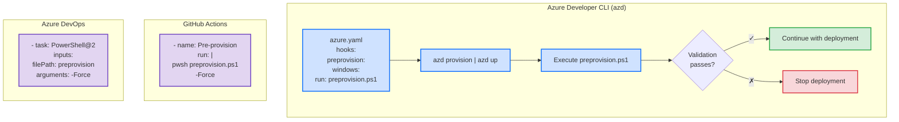

# Pre-Provisioning Script - Validation Workflow

# Pre-Provisioning Script - Validation Workflow

## Visual Workflow

### Main Validation Flow


### Parameter Modes

```mermaid
flowchart TD
    subgraph ValidateOnly["-ValidateOnly"]
        VO1["Steps 1 & 2: Full validation"]
        VO2["Step 3: SKIPPED (no secrets clearing)"]
        VO1 --> VO2
    end
    
    subgraph SkipSecretsClear["-SkipSecretsClear"]
        SS1["Steps 1 & 2: Full validation"]
        SS2["Step 3: SKIPPED (no secrets clearing)"]
        SS1 --> SS2
    end
    
    subgraph Force["-Force"]
        F1["Steps 1 & 2: Full validation"]
        F2["Step 3: Execute WITHOUT confirmation"]
        F1 --> F2
    end
    
    subgraph WhatIf["-WhatIf"]
        WI1["Steps 1 & 2: Full validation"]
        WI2["Step 3: PREVIEW only (no execution)"]
        WI1 --> WI2
    end
    
    subgraph Verbose["-Verbose"]
        V1["All steps: Detailed logging"]
        V2["Shows: Tool paths, versions, auth"]
        V3["Useful for: Troubleshooting, audit"]
        V1 --> V2 --> V3
    end
    
    classDef paramClass fill:#e2d5f1,stroke:#6f42c1,stroke-width:2px
    class ValidateOnly,SkipSecretsClear,Force,WhatIf,Verbose paramClass
```



### Failure Handling Flow


### Integration Points



## Validation Matrix

| Component | Check Type | Version Check | Auth Check | Registration Check |
|-----------|-----------|---------------|------------|-------------------|
| PowerShell | ✓ | ✓ (7.0+) | ✗ | ✗ |
| .NET SDK | ✓ | ✓ (10.0+) | ✗ | ✗ |
| azd | ✓ | ✓ (any) | ✗ | ✗ |
| Azure CLI | ✓ | ✓ (2.60.0+) | ✓ | ✗ |
| Bicep CLI | ✓ | ✓ (0.30.0+) | ✗ | ✗ |
| Resource Providers | ✓ | ✗ | ✗ | ✓ (8 providers) |
| Azure Quota | ℹ | ✗ | ✗ | ✗ |

Legend:
- ✓ : Check performed and required
- ✗ : Check not performed
- ℹ : Informational only

## Time Breakdown

```
┌─────────────────────────────────────────────────────────┐
│  Typical Execution Timeline                             │
│                                                         │
│  0s    │ Start, Display Header                         │
│  0.5s  │ PowerShell Version Check                      │
│  1.0s  │ .NET SDK Check                                │
│  1.5s  │ Azure Developer CLI Check                     │
│  2.0s  │ Azure CLI Version Check                       │
│  3.0s  │ Azure Authentication Check                    │
│  4.0s  │ Bicep CLI Check                               │
│  5.0s  │ Resource Provider 1 Check                     │
│  6.0s  │ Resource Provider 2 Check                     │
│  7.0s  │ Resource Provider 3 Check                     │
│  8.0s  │ Resource Provider 4 Check                     │
│  9.0s  │ Resource Provider 5 Check                     │
│  10.0s │ Resource Provider 6 Check                     │
│  11.0s │ Resource Provider 7 Check                     │
│  12.0s │ Resource Provider 8 Check                     │
│  13.0s │ Quota Information Display                     │
│  14.0s │ Execute clean-secrets.ps1 (if not skipped)    │
│  20.0s │ Display Summary                               │
│  20.0s │ Exit                                          │
│                                                         │
│  Total: 14-16s (ValidateOnly)                          │
│         18-22s (Full execution with secrets clearing)  │
└─────────────────────────────────────────────────────────┘
```

## Success Criteria

```
┌─────────────────────────────────────────────────────────────────┐
│  All validations must PASS for successful execution:           │
│                                                                 │
│  ✓ PowerShell 7.0+                                             │
│  ✓ .NET SDK 10.0+                                              │
│  ✓ Azure Developer CLI (any version)                           │
│  ✓ Azure CLI 2.60.0+                                           │
│  ✓ Azure authenticated (az account show succeeds)              │
│  ✓ Bicep CLI 0.30.0+                                           │
│  ✓ All 8 resource providers registered                         │
│  ℹ  Quota information displayed (non-blocking)                 │
│                                                                 │
│  Result: Ready for Azure deployment                            │
└─────────────────────────────────────────────────────────────────┘
```
