# Pre-Provisioning Script - Validation Workflow

# Pre-Provisioning Script - Validation Workflow

**Recommended Workflow Order**: 
1. 🔍 **check-dev-workstation** (.ps1 or .sh) - Quick workstation validation (optional but recommended)
2. ✅ **preprovision** (.ps1 or .sh) - Comprehensive validation (this document)
3. 🚀 **azd provision** - Deploy infrastructure (automatically runs postprovision.ps1 or .sh)

---

## Visual Workflow

### Main Validation Flow

```mermaid
flowchart LR
    Start["PREPROVISION (.PS1/.SH) START<br/>Version 2.0.0"]
    Start --> Step1["STEP 1: PowerShell Version<br/>Minimum: 7.0 | Current: 7.5.4"]
    
    Step1 --> Decision1{Pass?}
    Decision1 -->|✓ PASS| Step2["STEP 2: Prerequisites Validation"]
    Decision1 -->|✗ FAIL| Error1["ERROR: Upgrade PowerShell"]
    
    Step2 --> Prereqs["Validate Prerequisites:<br/>2.1 .NET SDK (10.0+)<br/>2.2 Azure Developer CLI<br/>2.3 Azure CLI (2.60.0+)<br/>2.4 Bicep CLI (0.30.0+)<br/>2.5 Resource Providers (8)<br/>2.6 Azure Quota (info)"]
    
    Prereqs --> Decision2{All Pass?}
    Decision2 -->|✓ ALL PASS| Step3["STEP 3: Clear User Secrets<br/>Execute: clean-secrets.ps1<br/>Projects: Orders.API, Web.App, AppHost"]
    Decision2 -->|✗ ANY FAIL| Error2["ERROR: Fix prerequisites"]
    
    Step3 --> Decision3{Skip?}
    Decision3 -->|No| ClearSecrets["Clear all project secrets"]
    Decision3 -->|Yes| Skip["SKIPPED<br/>--validate-only<br/>--skip-secrets-clear<br/>--dry-run"]
    
    ClearSecrets --> Summary["EXECUTION SUMMARY<br/>Status: ✓ SUCCESS<br/>Duration: 14-22 seconds<br/>Exit Code: 0"]
    Skip --> Summary
    Summary --> Ready["READY FOR DEPLOYMENT<br/>azd provision | azd up"]
    
    classDef successClass fill:#d4edda,stroke:#28a745,stroke-width:2px
    classDef errorClass fill:#f8d7da,stroke:#dc3545,stroke-width:2px
    classDef processClass fill:#cfe2ff,stroke:#0d6efd,stroke-width:2px
    classDef decisionClass fill:#fff3cd,stroke:#ffc107,stroke-width:2px
    classDef skipClass fill:#e2e3e5,stroke:#6c757d,stroke-width:2px
    
    class Start,Summary,Ready successClass
    class Error1,Error2 errorClass
    class Step1,Step2,Prereqs,Step3,ClearSecrets processClass
    class Decision1,Decision2,Decision3 decisionClass
    class Skip skipClass
```



### Parameter Modes


### Failure Handling Flow

```mermaid
flowchart LR
    Failure["Validation Failure<br/>in Step 2"]
    Failure --> Display["Display error with ✗ symbol"]
    Display --> Instructions["Show installation/fix instructions"]
    Instructions --> SetFlag["Set prerequisitesFailed = true"]
    SetFlag --> Continue["Continue checking remaining"]
    Continue --> ThrowError["After all checks:<br/>Throw error and exit code 1"]
    ThrowError --> FailureSummary["Display failure summary<br/>with duration"]

    classDef failureClass fill:#f8d7da,stroke:#dc3545,stroke-width:2px
    classDef processClass fill:#fff3cd,stroke:#ffc107,stroke-width:2px

    class Failure,ThrowError,FailureSummary failureClass
    class Display,Instructions,SetFlag,Continue processClass
```



### Integration Points

```mermaid
flowchart TD
    CheckDev["1️⃣ check-dev-workstation (.ps1/.sh)<br/>(optional but recommended)"]
    CheckDev --> AZD
    
    subgraph AZD["Azure Developer CLI (azd)"]
        AzdYaml["azure.yaml<br/>hooks:<br/>  preprovision:<br/>    windows: preprovision.ps1<br/>    posix: preprovision.sh"]
        AzdYaml --> AzdCmd["azd provision | azd up"]
        AzdCmd --> Execute["2️⃣ Execute preprovision (.ps1/.sh)"]
        Execute --> Validate{Validation<br/>passes?}
        Validate -->|✓| Deploy["Continue with deployment"]
        Deploy --> Post["3️⃣ Execute postprovision (.ps1/.sh)"]
        Validate -->|✗| Stop["Stop deployment"]
    end
    
    subgraph GitHub["GitHub Actions"]
        GHAction1["- name: Check workstation<br/>  run: |<br/>    # Windows: pwsh check-dev-workstation.ps1<br/>    # Linux: bash check-dev-workstation.sh"]
        GHAction2["- name: Pre-provision<br/>  run: |<br/>    # Windows: pwsh preprovision.ps1 -Force<br/>    # Linux: bash preprovision.sh --force"]
        GHAction1 --> GHAction2
    end
    
    subgraph AzureDevOps["Azure DevOps"]
        ADOTask1["- task: PowerShell@2<br/>  inputs:<br/>    filePath: check-dev-workstation"]
        ADOTask2["- task: PowerShell@2<br/>  inputs:<br/>    filePath: preprovision<br/>    arguments: -Force"]
        ADOTask1 --> ADOTask2
    end
    
    classDef devClass fill:#fff3cd,stroke:#fd7e14,stroke-width:3px
    classDef azdClass fill:#cfe2ff,stroke:#0d6efd,stroke-width:2px
    classDef ciClass fill:#e2d5f1,stroke:#6f42c1,stroke-width:2px
    classDef successClass fill:#d4edda,stroke:#28a745,stroke-width:2px
    classDef failClass fill:#f8d7da,stroke:#dc3545,stroke-width:2px
    
    class CheckDev devClass
    class AzdYaml,AzdCmd,Execute azdClass
    class GHAction1,GHAction2,ADOTask1,ADOTask2 ciClass
    class Deploy,Post successClass
    class Stop failClass
```



## Validation Matrix

| Component | Check Type | Version Check | Auth Check | Registration Check |
|-----------|-----------|---------------|------------|-------------------|
| PowerShell | ✓ | ✓ (7.0+) | ✗ | ✗ |
| .NET SDK | ✓ | ✓ (10.0+) | ✗ | ✗ |
| azd | ✓ | ✓ (any) | ✗ | ✗ |
| Azure CLI | ✓ | ✓ (2.60.0+) | ✓ | ✗ |
| Bicep CLI | ✓ | ✓ (0.30.0+) | ✗ | ✗ |
| Resource Providers | ✓ | ✗ | ✗ | ✓ (8 providers) |
| Azure Quota | ℹ | ✗ | ✗ | ✗ |

Legend:
- ✓ : Check performed and required
- ✗ : Check not performed
- ℹ : Informational only

## Time Breakdown

```
┌─────────────────────────────────────────────────────────┐
│  Typical Execution Timeline                             │
│                                                         │
│  0s    │ Start, Display Header                         │
│  0.5s  │ PowerShell Version Check                      │
│  1.0s  │ .NET SDK Check                                │
│  1.5s  │ Azure Developer CLI Check                     │
│  2.0s  │ Azure CLI Version Check                       │
│  3.0s  │ Azure Authentication Check                    │
│  4.0s  │ Bicep CLI Check                               │
│  5.0s  │ Resource Provider 1 Check                     │
│  6.0s  │ Resource Provider 2 Check                     │
│  7.0s  │ Resource Provider 3 Check                     │
│  8.0s  │ Resource Provider 4 Check                     │
│  9.0s  │ Resource Provider 5 Check                     │
│  10.0s │ Resource Provider 6 Check                     │
│  11.0s │ Resource Provider 7 Check                     │
│  12.0s │ Resource Provider 8 Check                     │
│  13.0s │ Quota Information Display                     │
│  14.0s │ Execute clean-secrets.ps1 (if not skipped)    │
│  20.0s │ Display Summary                               │
│  20.0s │ Exit                                          │
│                                                         │
│  Total: 14-16s (ValidateOnly)                          │
│         18-22s (Full execution with secrets clearing)  │
└─────────────────────────────────────────────────────────┘
```

## Success Criteria

```
┌─────────────────────────────────────────────────────────────────┐
│  All validations must PASS for successful execution:           │
│                                                                 │
│  ✓ PowerShell 7.0+                                             │
│  ✓ .NET SDK 10.0+                                              │
│  ✓ Azure Developer CLI (any version)                           │
│  ✓ Azure CLI 2.60.0+                                           │
│  ✓ Azure authenticated (az account show succeeds)              │
│  ✓ Bicep CLI 0.30.0+                                           │
│  ✓ All 8 resource providers registered                         │
│  ℹ  Quota information displayed (non-blocking)                 │
│                                                                 │
│  Result: Ready for Azure deployment                            │
└─────────────────────────────────────────────────────────────────┘
```
