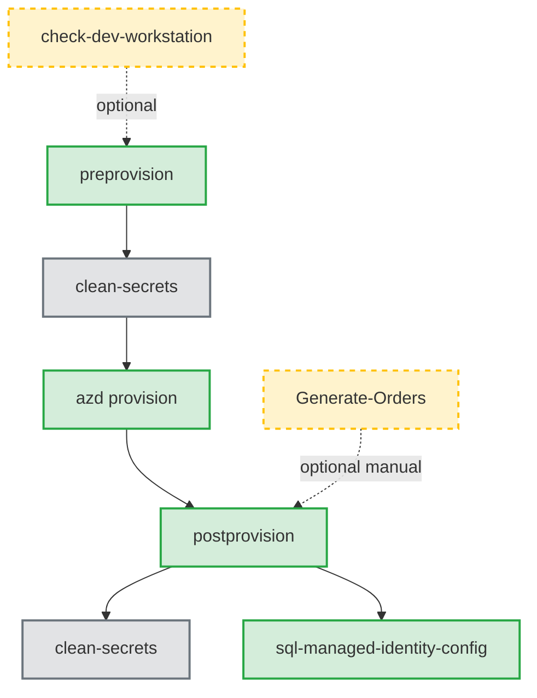

# Azure Logic Apps Monitoring - Complete Validation Workflow

**Complete Deployment Workflow Order**:

1. 🔍 **check-dev-workstation** (.ps1 or .sh) - Quick workstation validation (optional but recommended)
2. ✅ **preprovision** (.ps1 or .sh) - Comprehensive pre-provisioning validation
3. 🚀 **azd provision** - Deploy Azure infrastructure with Bicep
4. ⚙️ **postprovision** (.ps1 or .sh) - Configure .NET user secrets (automatic)
5. 🔐 **sql-managed-identity-config** (.ps1 or .sh) - Configure SQL Database managed identity access (automatic)
6. 📊 **Generate-Orders** (.ps1 or .sh) - Generate test data (optional, manual)

---

## 📋 Available Scripts Overview

This workflow uses multiple automation scripts from the hooks directory:

| Script                          | Version | Purpose                                      | Execution               | Duration  |
| ------------------------------- | ------- | -------------------------------------------- | ----------------------- | --------- |
| **check-dev-workstation**       | 1.0.0   | Validate workstation prerequisites           | Manual (recommended)    | 3-5 sec   |
| **preprovision**                | 2.0.0   | Pre-deployment validation & secrets clearing | Automatic via azd       | 14-22 sec |
| **postprovision**               | 2.0.0   | Configure .NET user secrets post-deployment  | Automatic via azd       | 10-20 sec |
| **sql-managed-identity-config** | 1.0.0   | Configure SQL Database managed identity      | Called by postprovision | 5-10 sec  |
| **clean-secrets**               | 2.0.0   | Clear .NET user secrets utility              | Called by other scripts | 2-4 sec   |
| **Generate-Orders**             | 1.0.0   | Generate test order data                     | Manual (optional)       | 1-5 sec   |

### Script Dependencies



---

## Visual Workflow

### Complete Deployment Flow

```mermaid
flowchart TB
    Start["🚀 START DEPLOYMENT<br/>Developer runs: azd up"]

    subgraph Optional["Optional Pre-Check"]
        Check["1️⃣ check-dev-workstation<br/>Quick validation (3-5s)"]
    end

    subgraph PreProvision["2️⃣ Pre-Provisioning (Automatic)"]
        PreStart["PREPROVISION START<br/>Version 2.0.0 (2025-12-29)"]
        PreStep1["Step 1: PowerShell/Bash Version<br/>PS: 7.0+ | Bash: 4.0+"]
        PreStep2["Step 2: Prerequisites<br/>.NET 10.0+ | azd | Azure CLI 2.60.0+<br/>Bicep 0.30.0+ | 8 Resource Providers"]
        PreStep3["Step 3: Clear User Secrets<br/>Call clean-secrets script"]

        PreStart --> PreStep1
        PreStep1 --> PreDecision1{Pass?}
        PreDecision1 -->|✓| PreStep2
        PreDecision1 -->|✗| PreError1["ERROR: Fix environment"]
        PreStep2 --> PreDecision2{Pass?}
        PreDecision2 -->|✓| PreStep3
        PreDecision2 -->|✗| PreError2["ERROR: Install tools"]
        PreStep3 --> PreReady["✓ Ready for provisioning"]
    end

    subgraph Provision["3️⃣ Azure Provisioning"]
        AzdProv["Deploy Infrastructure<br/>Bicep templates (5-10 min)<br/>SQL DB | Service Bus | Container Apps"]
    end

    subgraph PostProvision["4️⃣ Post-Provisioning (Automatic)"]
        PostStart["POSTPROVISION START<br/>Version 2.0.0"]
        PostStep1["Step 1: Validate Env Vars<br/>26 azd outputs"]
        PostStep2["Step 2: ACR Authentication<br/>(if configured)"]
        PostStep3["Step 3: Clear Old Secrets<br/>Call clean-secrets script"]
        PostStep4["Step 4: Set New Secrets<br/>26 secrets across 2 projects"]
        PostStep5["Step 5: SQL Managed Identity<br/>Call sql-managed-identity-config"]

        PostStart --> PostStep1
        PostStep1 --> PostDecision1{Valid?}
        PostDecision1 -->|✓| PostStep2
        PostDecision1 -->|✗| PostError1["ERROR: Missing vars"]
        PostStep2 --> PostStep3
        PostStep3 --> PostStep4
        PostStep4 --> PostStep5
        PostStep5 --> PostReady["✓ Configuration complete"]
    end

    subgraph SqlConfig["🔐 SQL Managed Identity Configuration"]
        SqlStart["SQL-MANAGED-IDENTITY-CONFIG<br/>Version 1.0.0 (2025-12-29)"]
        SqlStep1["Step 1: Validate Azure Auth"]
        SqlStep2["Step 2: Validate sqlcmd"]
        SqlStep3["Step 3: Construct Connection"]
        SqlStep4["Step 4: Acquire Access Token"]
        SqlStep5["Step 5: Execute SQL Script<br/>Create user | Assign roles"]

        SqlStart --> SqlStep1
        SqlStep1 --> SqlDecision1{Pass?}
        SqlDecision1 -->|✓| SqlStep2
        SqlDecision1 -->|✗| SqlError1["ERROR: Not authenticated"]
        SqlStep2 --> SqlDecision2{Pass?}
        SqlDecision2 -->|✓| SqlStep3
        SqlDecision2 -->|✗| SqlError2["ERROR: Install sqlcmd"]
        SqlStep3 --> SqlStep4
        SqlStep4 --> SqlDecision3{Success?}
        SqlDecision3 -->|✓| SqlStep5
        SqlDecision3 -->|✗| SqlError3["ERROR: Token failed"]
        SqlStep5 --> SqlReady["✓ SQL access configured"]
    end

    subgraph Optional2["Optional Post-Deployment"]
        GenOrders["📊 Generate-Orders<br/>Test data generation (manual)"]
    end

    Start --> Check
    Check -.optional.-> PreStart
    Start --> PreStart
    PreReady --> AzdProv
    AzdProv --> PostStart
    PostReady --> Complete
    PostStep5 --> SqlStart
    SqlReady --> PostReady
    Complete -.optional.-> GenOrders

    Complete["✅ DEPLOYMENT COMPLETE<br/>Environment ready for development"]

    classDef successClass fill:#d4edda,stroke:#28a745,stroke-width:2px
    classDef errorClass fill:#f8d7da,stroke:#dc3545,stroke-width:2px
    classDef processClass fill:#cfe2ff,stroke:#0d6efd,stroke-width:2px
    classDef decisionClass fill:#fff3cd,stroke:#ffc107,stroke-width:2px
    classDef optionalClass fill:#e2e3e5,stroke:#6c757d,stroke-width:2px,stroke-dasharray: 5 5

    class Start,PreReady,PostReady,SqlReady,Complete successClass
    class PreError1,PreError2,PostError1,SqlError1,SqlError2,SqlError3 errorClass
    class PreStep1,PreStep2,PreStep3,PostStep1,PostStep2,PostStep3,PostStep4,PostStep5,SqlStep1,SqlStep2,SqlStep3,SqlStep4,SqlStep5,AzdProv processClass
    class PreDecision1,PreDecision2,PostDecision1,SqlDecision1,SqlDecision2,SqlDecision3 decisionClass
    class Check,GenOrders optionalClass
```



### Pre-Provisioning Validation Flow (preprovision.ps1/sh)

### Pre-Provisioning Validation Flow (preprovision.ps1/sh)



```mermaid
flowchart LR
    Start["PREPROVISION (.PS1/.SH) START<br/>Version 2.0.0<br/>PS: 2025-12-24 | Bash: 2025-12-29"]
    Start --> Step1["STEP 1: Runtime Version<br/>PowerShell: 7.0+ | Bash: 4.0+"]

    Step1 --> Decision1{Pass?}
    Decision1 -->|✓ PASS| Step2["STEP 2: Prerequisites Validation"]
    Decision1 -->|✗ FAIL| Error1["ERROR: Upgrade PowerShell"]

    Step2 --> Prereqs["Validate Prerequisites:<br/>2.1 .NET SDK (10.0+)<br/>2.2 Azure Developer CLI<br/>2.3 Azure CLI (2.60.0+)<br/>2.4 Bicep CLI (0.30.0+)<br/>2.5 Resource Providers (8)<br/>2.6 Azure Quota (info)"]

    Prereqs --> Decision2{All Pass?}
    Decision2 -->|✓ ALL PASS| Step3["STEP 3: Clear User Secrets<br/>Execute: clean-secrets.ps1<br/>Projects: Orders.API, Web.App, AppHost"]
    Decision2 -->|✗ ANY FAIL| Error2["ERROR: Fix prerequisites"]

    Step3 --> Decision3{Skip?}
    Decision3 -->|No| ClearSecrets["Clear all project secrets"]
    Decision3 -->|Yes| Skip["SKIPPED<br/>--validate-only<br/>--skip-secrets-clear<br/>--dry-run"]

    ClearSecrets --> Summary["EXECUTION SUMMARY<br/>Status: ✓ SUCCESS<br/>Duration: 14-22 seconds<br/>Exit Code: 0"]
    Skip --> Summary
    Summary --> Ready["READY FOR DEPLOYMENT<br/>azd provision | azd up"]

    classDef successClass fill:#d4edda,stroke:#28a745,stroke-width:2px
    classDef errorClass fill:#f8d7da,stroke:#dc3545,stroke-width:2px
    classDef processClass fill:#cfe2ff,stroke:#0d6efd,stroke-width:2px
    classDef decisionClass fill:#fff3cd,stroke:#ffc107,stroke-width:2px
    classDef skipClass fill:#e2e3e5,stroke:#6c757d,stroke-width:2px

    class Start,Summary,Ready successClass
    class Error1,Error2 errorClass
    class Step1,Step2,Prereqs,Step3,ClearSecrets processClass
    class Decision1,Decision2,Decision3 decisionClass
    class Skip skipClass
```

### Parameter Modes


### Failure Handling Flow

```mermaid
flowchart LR
    Failure["Validation Failure<br/>in Step 2"]
    Failure --> Display["Display error with ✗ symbol"]
    Display --> Instructions["Show installation/fix instructions"]
    Instructions --> SetFlag["Set prerequisitesFailed = true"]
    SetFlag --> Continue["Continue checking remaining"]
    Continue --> ThrowError["After all checks:<br/>Throw error and exit code 1"]
    ThrowError --> FailureSummary["Display failure summary<br/>with duration"]

    classDef failureClass fill:#f8d7da,stroke:#dc3545,stroke-width:2px
    classDef processClass fill:#fff3cd,stroke:#ffc107,stroke-width:2px

    class Failure,ThrowError,FailureSummary failureClass
    class Display,Instructions,SetFlag,Continue processClass
```



### Integration Points

```mermaid
flowchart TD
    CheckDev["1️⃣ check-dev-workstation (.ps1/.sh)<br/>(optional but recommended)<br/>Version: 1.0.0"]
    CheckDev --> AZD

    subgraph AZD["Azure Developer CLI (azd)"]
        AzdYaml["azure.yaml<br/>hooks:<br/>  preprovision:<br/>    windows: preprovision.ps1<br/>    posix: preprovision.sh<br/>  postprovision:<br/>    windows: postprovision.ps1<br/>    posix: postprovision.sh"]
        AzdYaml --> AzdCmd["azd provision | azd up"]
        AzdCmd --> Execute["2️⃣ Execute preprovision (.ps1/.sh)<br/>Version: 2.0.0"]
        Execute --> Validate{Validation<br/>passes?}
        Validate -->|✓| Deploy["Continue with deployment<br/>Bicep: infra/main.bicep"]
        Deploy --> Post["3️⃣ Execute postprovision (.ps1/.sh)<br/>Version: 2.0.0"]
        Post --> SqlConfig["4️⃣ Execute sql-managed-identity-config<br/>Version: 1.0.0 (2025-12-29)"]
        SqlConfig --> Ready["✓ Ready for development"]
        Validate -->|✗| Stop["Stop deployment"]
    end

    subgraph Utilities["Utility Scripts (Called by others)"]
        CleanSec["clean-secrets (.ps1/.sh)<br/>Version: 2.0.0<br/>Called by: preprovision & postprovision"]
        GenOrd["Generate-Orders (.ps1/.sh)<br/>Version: 1.0.0<br/>Manual execution (optional)"]
    end

    subgraph GitHub["GitHub Actions Integration"]
        GHAction1["- name: Check workstation<br/>  run: |<br/>    # Windows: pwsh check-dev-workstation.ps1<br/>    # Linux: bash check-dev-workstation.sh"]
        GHAction2["- name: Pre-provision<br/>  run: |<br/>    # Windows: pwsh preprovision.ps1 -Force<br/>    # Linux: bash preprovision.sh --force"]
        GHAction3["- name: Deploy<br/>  run: azd up --no-prompt"]
        GHAction1 --> GHAction2
        GHAction2 --> GHAction3
    end

    subgraph AzureDevOps["Azure DevOps Pipeline Integration"]
        ADOTask1["- task: PowerShell@2<br/>  inputs:<br/>    filePath: hooks/check-dev-workstation.ps1"]
        ADOTask2["- task: PowerShell@2<br/>  inputs:<br/>    filePath: hooks/preprovision.ps1<br/>    arguments: -Force"]
        ADOTask3["- task: AzureCLI@2<br/>  inputs:<br/>    scriptType: pscore<br/>    scriptLocation: inlineScript<br/>    inlineScript: azd up --no-prompt"]
        ADOTask1 --> ADOTask2
        ADOTask2 --> ADOTask3
    end

    Execute -.calls.-> CleanSec
    Post -.calls.-> CleanSec
    Ready -.manual.-> GenOrd

    classDef devClass fill:#fff3cd,stroke:#fd7e14,stroke-width:3px
    classDef azdClass fill:#cfe2ff,stroke:#0d6efd,stroke-width:2px
    classDef ciClass fill:#e2d5f1,stroke:#6f42c1,stroke-width:2px
    classDef successClass fill:#d4edda,stroke:#28a745,stroke-width:2px
    classDef failClass fill:#f8d7da,stroke:#dc3545,stroke-width:2px
    classDef utilClass fill:#e2e3e5,stroke:#6c757d,stroke-width:2px

    class CheckDev devClass
    class AzdYaml,AzdCmd,Execute azdClass
    class GHAction1,GHAction2,GHAction3,ADOTask1,ADOTask2,ADOTask3 ciClass
    class Deploy,Post,SqlConfig,Ready successClass
    class Stop failClass
    class CleanSec,GenOrd utilClass
```



## Script Details

### check-dev-workstation

**Version:** 1.0.0  
**Purpose:** Quick prerequisite validation (wrapper around preprovision --validate-only)  
**Execution:** Manual (recommended before main workflow)  
**Duration:** 3-5 seconds  
**Documentation:** [check-dev-workstation.md](./check-dev-workstation.md)

**Validates:**

- PowerShell 7.0+ (Windows) or Bash 4.0+ (Linux/macOS)
- .NET SDK 10.0+
- Azure Developer CLI (azd)
- Azure CLI 2.60.0+
- Bicep CLI 0.30.0+
- Azure authentication status
- 8 Azure Resource Providers registration

### preprovision

**Version:** 2.0.0  
**Last Modified:** PowerShell: 2025-12-24 | Bash: 2025-12-29  
**Purpose:** Comprehensive pre-deployment validation and secrets clearing  
**Execution:** Automatic via azd hooks  
**Duration:** 14-22 seconds  
**Documentation:** Current document

**Operations:**

1. Validate runtime version (PowerShell 7.0+ or Bash 4.0+)
2. Validate all prerequisites (same as check-dev-workstation)
3. Clear user secrets via clean-secrets script (unless skipped)
4. Exit with code 0 (success) or 1 (failure)

**Parameters:**

- `--force` / `-Force`: Skip confirmation prompts
- `--skip-secrets-clear` / `-SkipSecretsClear`: Skip secrets clearing
- `--validate-only` / `-ValidateOnly`: Only validate without changes
- `--verbose` / `-Verbose`: Detailed logging
- `--dry-run` / `-WhatIf`: Preview mode (PowerShell only)

### postprovision

**Version:** 2.0.0  
**Last Modified:** 2025-12-17  
**Purpose:** Configure .NET user secrets with Azure resource information  
**Execution:** Automatic via azd hooks after provisioning  
**Duration:** 10-20 seconds  
**Documentation:** [postprovision.md](./postprovision.md)

**Operations:**

1. Validate 26 required environment variables set by azd
2. Authenticate to Azure Container Registry (if configured)
3. Clear old secrets via clean-secrets script
4. Set 26 new secrets across 2 projects:
   - app.AppHost (14 secrets)
   - eShop.Orders.API (12 secrets)
5. Call sql-managed-identity-config to configure database access
6. Validate all secrets were set correctly

**Required Environment Variables:**

- `AZURE_SUBSCRIPTION_ID`
- `AZURE_RESOURCE_GROUP`
- `AZURE_LOCATION`
- `AZURE_SERVICEBUS_NAMESPACE`
- `AZURE_STORAGE_ACCOUNT_NAME`
- `AZURE_APP_INSIGHTS_CONNECTION_STRING`
- Plus 20 more from Bicep outputs

### sql-managed-identity-config

**Version:** 1.0.0  
**Last Modified:** PowerShell: 2025-12-26 | Bash: 2025-12-29  
**Purpose:** Configure SQL Database user with managed identity authentication  
**Execution:** Automatic via postprovision script  
**Duration:** 5-10 seconds  
**Documentation:** No dedicated markdown (embedded help in scripts)

**Operations:**

1. Validate Azure CLI authentication (version 2.60.0+)
2. Validate sqlcmd utility availability
3. Construct connection details for Azure environment
4. Acquire Entra ID access token for Azure SQL Database
5. Generate T-SQL script to:
   - Create contained database user from external provider
   - Assign database roles (default: db_datareader, db_datawriter)
6. Execute SQL script with comprehensive error handling
7. Return JSON result object (Success/Error with details)

**Parameters:**

- `--sql-server-name`: Azure SQL Server name (required)
- `--database-name`: Target database name (required)
- `--principal-name`: Managed identity display name (required)
- `--database-roles`: Comma-separated roles (default: db_datareader,db_datawriter)
- `--azure-environment`: Azure cloud (default: AzureCloud)
- `--command-timeout`: SQL timeout in seconds (default: 120, range: 30-600)
- `--verbose`: Detailed logging

**Security Features:**

- Azure AD token authentication (no passwords)
- SQL injection protection via parameter sanitization
- TLS 1.2+ encryption enforced
- Token lifetime validation
- Idempotent execution (safe to re-run)

**Multi-Cloud Support:**

- AzureCloud (Public Azure)
- AzureUSGovernment
- AzureChinaCloud
- AzureGermanCloud

### clean-secrets

**Version:** 2.0.0  
**Purpose:** Clear .NET user secrets utility  
**Execution:** Called by preprovision and postprovision scripts  
**Duration:** 2-4 seconds  
**Documentation:** [clean-secrets.md](./clean-secrets.md)

**Clears secrets from:**

- app.AppHost/app.AppHost.csproj
- src/eShop.Orders.API/eShop.Orders.API.csproj
- src/eShop.Web.App/eShop.Web.App.csproj

### Generate-Orders

**Version:** 1.0.0  
**Purpose:** Generate test order data for development/testing  
**Execution:** Manual (optional, not part of deployment workflow)  
**Duration:** 1-5 seconds  
**Documentation:** [Generate-Orders.md](./Generate-Orders.md)

**Features:**

- Generates 1-10,000 orders with realistic data
- 20-product catalog with pricing variations
- Global delivery addresses (15 countries)
- Configurable products per order (1-6)
- JSON output format
- Progress tracking and statistics

---

## Validation Matrix

| Component          | Check Type | Version Check | Auth Check | Registration Check |
| ------------------ | ---------- | ------------- | ---------- | ------------------ |
| PowerShell         | ✓          | ✓ (7.0+)      | ✗          | ✗                  |
| .NET SDK           | ✓          | ✓ (10.0+)     | ✗          | ✗                  |
| azd                | ✓          | ✓ (any)       | ✗          | ✗                  |
| Azure CLI          | ✓          | ✓ (2.60.0+)   | ✓          | ✗                  |
| Bicep CLI          | ✓          | ✓ (0.30.0+)   | ✗          | ✗                  |
| Resource Providers | ✓          | ✗             | ✗          | ✓ (8 providers)    |
| Azure Quota        | ℹ          | ✗             | ✗          | ✗                  |

Legend:

- ✓ : Check performed and required
- ✗ : Check not performed
- ℹ : Informational only

## Complete Deployment Timeline

```
┌─────────────────────────────────────────────────────────────────────┐
│  Complete azd up Timeline (from start to ready)                    │
│                                                                     │
│  PHASE 1: Pre-Provisioning Validation (preprovision)               │
│  0s     │ Start, Display Header                                    │
│  0.5s   │ Runtime Version Check (PowerShell/Bash)                  │
│  1.0s   │ .NET SDK 10.0+ Check                                     │
│  1.5s   │ Azure Developer CLI Check                                │
│  2.0s   │ Azure CLI 2.60.0+ Version Check                          │
│  3.0s   │ Azure Authentication Check                               │
│  4.0s   │ Bicep CLI 0.30.0+ Check                                  │
│  5-12s  │ Resource Provider Checks (8 providers)                   │
│  13s    │ Quota Information Display                                │
│  14-20s │ Execute clean-secrets (if not skipped)                   │
│  20s    │ Display Summary & Exit                                   │
│         │                                                           │
│         │ Subtotal: 14-22 seconds                                  │
│                                                                     │
│  PHASE 2: Azure Infrastructure Provisioning                        │
│  0-300s │ Deploy Bicep templates (5-10 minutes)                    │
│         │ - SQL Database & Server                                  │
│         │ - Service Bus Namespace, Topics, Subscriptions           │
│         │ - Container Registry                                     │
│         │ - Container Apps Environment                             │
│         │ - Application Insights & Log Analytics                   │
│         │ - Storage Accounts                                       │
│         │ - Managed Identities                                     │
│         │                                                           │
│         │ Subtotal: 5-10 minutes (300-600 seconds)                 │
│                                                                     │
│  PHASE 3: Post-Provisioning Configuration (postprovision)          │
│  0s     │ Start, Display Header                                    │
│  0.5s   │ Validate 26 Environment Variables                        │
│  1-2s   │ Azure Container Registry Authentication (if configured)  │
│  2-4s   │ Execute clean-secrets                                    │
│  4-14s  │ Set 26 Secrets Across 2 Projects                        │
│         │ - app.AppHost (14 secrets)                               │
│         │ - eShop.Orders.API (12 secrets)                          │
│  14s    │ Call sql-managed-identity-config                         │
│         │                                                           │
│         │ Subtotal (before SQL config): 10-15 seconds              │
│                                                                     │
│  PHASE 4: SQL Managed Identity Configuration                       │
│  0s     │ Start sql-managed-identity-config                        │
│  0.5s   │ Validate Azure CLI Authentication                        │
│  1.0s   │ Validate sqlcmd Utility                                  │
│  1.5s   │ Construct Connection Details                             │
│  2-3s   │ Acquire Entra ID Access Token                            │
│  3-8s   │ Generate & Execute SQL Script                            │
│         │ - Create database user from external provider            │
│         │ - Assign database roles                                  │
│  8-10s  │ Display Summary & Return JSON Result                     │
│         │                                                           │
│         │ Subtotal: 5-10 seconds                                   │
│                                                                     │
│  PHASE 5: Final Validation & Summary                               │
│  0-5s   │ Validate All Secrets Set Correctly                       │
│  5s     │ Display Comprehensive Summary                            │
│         │                                                           │
│         │ Subtotal: 5 seconds                                      │
│                                                                     │
│  ═════════════════════════════════════════════════════════════════  │
│  TOTAL TIME: 340-657 seconds (5.7 - 11 minutes)                    │
│  ═════════════════════════════════════════════════════════════════  │
│                                                                     │
│  Breakdown:                                                         │
│    • Pre-provisioning:     14-22 seconds                           │
│    • Azure provisioning:   300-600 seconds (5-10 min)              │
│    • Post-provisioning:    10-15 seconds                           │
│    • SQL configuration:    5-10 seconds                            │
│    • Final validation:     5 seconds                               │
│                                                                     │
│  Optional Scripts (Manual):                                         │
│    • check-dev-workstation:  3-5 seconds (before preprovision)     │
│    • Generate-Orders:        1-5 seconds (after deployment)        │
└─────────────────────────────────────────────────────────────────────┘
```

## Success Criteria

### Pre-Provisioning (preprovision)

```
┌─────────────────────────────────────────────────────────────────┐
│  All validations must PASS for successful execution:           │
│                                                                 │
│  ✓ Runtime: PowerShell 7.0+ OR Bash 4.0+                      │
│  ✓ .NET SDK 10.0+                                              │
│  ✓ Azure Developer CLI (any version)                           │
│  ✓ Azure CLI 2.60.0+                                           │
│  ✓ Azure authenticated (az account show succeeds)              │
│  ✓ Bicep CLI 0.30.0+                                           │
│  ✓ All 8 resource providers registered                         │
│  ℹ  Quota information displayed (non-blocking)                 │
│                                                                 │
│  Optional: User secrets cleared (unless --skip-secrets-clear)  │
│                                                                 │
│  Result: Exit code 0, ready for Azure deployment               │
└─────────────────────────────────────────────────────────────────┘
```

### Post-Provisioning (postprovision)

```
┌─────────────────────────────────────────────────────────────────┐
│  All operations must SUCCEED for successful execution:         │
│                                                                 │
│  ✓ All 26 environment variables set by azd                     │
│  ✓ Azure Container Registry authentication (if configured)     │
│  ✓ Old secrets cleared successfully                            │
│  ✓ All 26 new secrets set across 2 projects                    │
│  ✓ SQL managed identity configured successfully                │
│  ✓ All secrets validated after configuration                   │
│                                                                 │
│  Configured Projects:                                           │
│    • app.AppHost: 14 secrets                                   │
│    • eShop.Orders.API: 12 secrets                              │
│                                                                 │
│  Result: Exit code 0, application ready for local development  │
└─────────────────────────────────────────────────────────────────┘
```

### SQL Managed Identity Configuration (sql-managed-identity-config)

```
┌─────────────────────────────────────────────────────────────────┐
│  All steps must SUCCEED for successful execution:              │
│                                                                 │
│  ✓ Azure CLI authenticated with valid token                    │
│  ✓ sqlcmd utility available and functional                     │
│  ✓ SQL Server connection details constructed                   │
│  ✓ Entra ID access token acquired for SQL Database             │
│  ✓ T-SQL script generated with proper escaping                 │
│  ✓ SQL script executed successfully                            │
│  ✓ Database user created (or already exists)                   │
│  ✓ Database roles assigned to user                             │
│                                                                 │
│  Security Requirements:                                         │
│    • Must be authenticated as SQL Server Entra ID admin        │
│    • Access token must be valid JWT format                     │
│    • TLS 1.2+ encryption enforced on connection                │
│                                                                 │
│  Result: JSON output with Success: true, managed identity has  │
│          database access with assigned roles                   │
└─────────────────────────────────────────────────────────────────┘
```

## Related Documentation

This document focuses on the validation workflow. For detailed information about each script, refer to:

- **[README.md](./README.md)** - Complete hooks directory overview and developer inner loop workflow
- **[check-dev-workstation.md](./check-dev-workstation.md)** - Workstation validation script documentation
- **[postprovision.md](./postprovision.md)** - Post-provisioning configuration script documentation
- **[clean-secrets.md](./clean-secrets.md)** - Secrets management utility documentation
- **[Generate-Orders.md](./Generate-Orders.md)** - Test data generation script documentation

### Script Versions Reference

| Script                      | PowerShell Version | Bash Version       | Last Modified |
| --------------------------- | ------------------ | ------------------ | ------------- |
| check-dev-workstation       | 1.0.0              | 1.0.0              | -             |
| preprovision                | 2.0.0 (2025-12-24) | 2.0.0 (2025-12-29) | Latest        |
| postprovision               | 2.0.0 (2025-12-17) | 2.0.0              | -             |
| sql-managed-identity-config | 1.0.0 (2025-12-26) | 1.0.0 (2025-12-29) | Latest        |
| clean-secrets               | 2.0.0              | 2.0.0              | -             |
| Generate-Orders             | 1.0.0              | 1.0.0              | -             |

---

**Made with ❤️ by Evilazaro | Principal Cloud Solution Architect | Microsoft**
