# check-dev-workstation (.ps1 / .sh)


## 📋 Overview

The `check-dev-workstation` script is a critical first-step validation tool in the Developer Inner Loop Workflow for Azure Logic Apps Monitoring. It performs comprehensive environment validation to ensure your workstation meets all prerequisites before development begins. Available in both PowerShell (`.ps1`) and Bash (`.sh`) versions, this script provides cross-platform compatibility for Windows, Linux, and macOS environments.

As a lightweight wrapper around the preprovision script in validation-only mode, it executes read-only checks without modifying any configuration. The script validates essential components including PowerShell 7.0+, .NET SDK 10.0+, Azure CLI, Bicep CLI, Azure authentication status, and registration of eight critical Azure resource providers. This non-destructive validation typically completes in 3-5 seconds, providing immediate feedback on environment readiness.

Running this script before `preprovision.ps1` and `postprovision.ps1` helps developers identify configuration issues early, avoid deployment failures, and save valuable development time by ensuring all prerequisites are properly installed and configured.

## 📑 Table of Contents

- [Overview](#-overview)
- [What It Validates](#-what-it-validates)
- [Usage](#-usage)
  - [Basic Usage](#basic-usage)
  - [Verbose Mode](#verbose-mode)
- [Exit Codes](#-exit-codes)
- [Parameters](#-parameters)
- [Examples](#-examples)
- [How It Works](#️-how-it-works)
  - [Internal Process Flow](#internal-process-flow)
  - [Integration Points](#integration-points)
- [Troubleshooting](#️-troubleshooting)
- [Technical Implementation Details](#-technical-implementation-details)
- [Related Documentation](#-related-documentation)
- [Security Considerations](#-security-considerations)
- [Best Practices](#-best-practices)
- [Performance](#-performance)
- [Version History](#-version-history)

## 🎯 Purpose

This script helps developers:
- ✅ **Verify Environment**: Check that all required tools and SDKs are properly installed
- ✅ **Detect Issues Early**: Identify configuration problems before starting development work  
- ✅ **Save Time**: Avoid deployment failures due to missing prerequisites
- ✅ **Non-Destructive**: Performs read-only checks without modifying any configuration
- ✅ **Fast Validation**: Quick prerequisite check before running `preprovision.ps1`

## 🔍 What It Validates

The script performs comprehensive validation of:

| Category | Validation | Minimum Version | Purpose |
|----------|-----------|----------------|---------|
| **Runtime** | PowerShell | 7.0+ | Cross-platform scripting engine |
| **SDK** | .NET SDK | 10.0+ | Application development framework |
| **Azure Tools** | Azure Developer CLI (azd) | Latest | Infrastructure provisioning |
| **Azure Tools** | Azure CLI | 2.60.0+ | Azure resource management |
| **Infrastructure** | Bicep CLI | 0.30.0+ | Infrastructure as Code |
| **Authentication** | Azure Login | Active | Azure subscription access |
| **Resource Providers** | Azure Providers | Registered | 8 required providers |

### Azure Resource Providers Validated
1. `Microsoft.App` - Container Apps
2. `Microsoft.ServiceBus` - Service Bus messaging
3. `Microsoft.Storage` - Storage accounts
4. `Microsoft.Web` - Logic Apps and App Services
5. `Microsoft.ContainerRegistry` - Container registries
6. `Microsoft.Insights` - Application Insights
7. `Microsoft.OperationalInsights` - Log Analytics
8. `Microsoft.ManagedIdentity` - Managed identities

## 🚀 Usage

### Basic Usage

**PowerShell (Windows):**
```powershell
# Standard validation
.\check-dev-workstation.ps1
```

**Bash (Linux/macOS):**
```bash
# Standard validation
./check-dev-workstation.sh
```

**Output Example:**
```
[12:34:56] ✓ PowerShell 7.4.1 (required: 7.0+)
[12:34:57] ✓ .NET SDK 10.0.0 (required: 10.0+)
[12:34:58] ✓ Azure Developer CLI 1.5.0
[12:34:59] ✓ Azure CLI 2.62.0 (required: 2.60.0+)
[12:35:00] ✓ Bicep CLI 0.30.23 (required: 0.30.0+)
[12:35:01] ✓ Azure login verified
[12:35:02] ✓ All 8 resource providers registered

Validation completed successfully! ✓
Your workstation is ready for development.
```

### Verbose Mode

**PowerShell (Windows):**
```powershell
# Get detailed diagnostic information
.\check-dev-workstation.ps1 -Verbose
```

**Bash (Linux/macOS):**
```bash
# Get detailed diagnostic information
./check-dev-workstation.sh --verbose
```

**Output Example:**
```
VERBOSE: Starting workstation validation...
VERBOSE: Validating PowerShell version...
VERBOSE: Found PowerShell version: 7.4.1
VERBOSE: PowerShell version check: PASS
VERBOSE: Validating .NET SDK...
VERBOSE: Found .NET SDK version: 10.0.0
VERBOSE: .NET SDK check: PASS
VERBOSE: Checking Azure CLI installation...
VERBOSE: Azure CLI version: 2.62.0
VERBOSE: Minimum required: 2.60.0
VERBOSE: Azure CLI check: PASS
...
```

## 📊 Exit Codes

The script uses standard exit codes to indicate validation status:

| Exit Code | Status | Description |
|-----------|--------|-------------|
| `0` | ✅ Success | All validations passed - workstation is ready |
| `1` | ❌ Failure | One or more validations failed - see error output |

### Example: Checking Exit Code

**PowerShell (Windows):**
```powershell
.\check-dev-workstation.ps1
if ($LASTEXITCODE -eq 0) {
    Write-Host "✓ Environment validated successfully"
} else {
    Write-Host "✗ Environment validation failed"
}
```

**Bash (Linux/macOS):**
```bash
./check-dev-workstation.sh
if [ $? -eq 0 ]; then
    echo "✓ Environment validated successfully"
else
    echo "✗ Environment validation failed"
fi
```

## 🔧 Parameters

### `-Verbose` (PowerShell) / `--verbose` (Bash)

Enables detailed diagnostic output for troubleshooting.

**Type:** `SwitchParameter` (PowerShell) / `Flag` (Bash)  
**Required:** No  
**Default:** `$false` / `false`

**PowerShell Usage:**
```powershell
.\check-dev-workstation.ps1 -Verbose
```

**Bash Usage:**
```bash
./check-dev-workstation.sh --verbose
```

**Use Cases:**
- Troubleshooting validation failures
- Understanding the validation sequence
- Debugging environment configuration issues
- Generating detailed logs for support requests

## 📚 Examples

### Example 1: Quick Check Before Starting Work

**PowerShell (Windows):**
```powershell
# Run a quick validation before starting development
.\check-dev-workstation.ps1

# If successful, proceed with development
# If failed, review error messages and install missing components
```

**Bash (Linux/macOS):**
```bash
# Run a quick validation before starting development
./check-dev-workstation.sh

# If successful, proceed with development
# If failed, review error messages and install missing components
```

### Example 2: Automated CI/CD Pre-Flight Check

**PowerShell (Windows):**
```powershell
# Add to CI/CD pipeline
.\check-dev-workstation.ps1
if ($LASTEXITCODE -ne 0) {
    Write-Error "Environment validation failed"
    exit 1
}

# Continue with build/deploy process
Write-Host "Environment validated - proceeding with build..."
```

**Bash (Linux/macOS):**
```bash
# Add to CI/CD pipeline
./check-dev-workstation.sh
if [ $? -ne 0 ]; then
    echo "ERROR: Environment validation failed" >&2
    exit 1
fi

# Continue with build/deploy process
echo "Environment validated - proceeding with build..."
```

### Example 3: Troubleshooting Setup Issues

**PowerShell (Windows):**
```powershell
# Get detailed output for troubleshooting
.\check-dev-workstation.ps1 -Verbose 2>&1 | Tee-Object -FilePath "validation-log.txt"

# Review the log file
Get-Content validation-log.txt
```

**Bash (Linux/macOS):**
```bash
# Get detailed output for troubleshooting
./check-dev-workstation.sh --verbose 2>&1 | tee validation-log.txt

# Review the log file
cat validation-log.txt
```

### Example 4: Scheduled Validation Task

**PowerShell (Windows - Scheduled Task):**
```powershell
# Create a scheduled task to validate environment daily
$action = New-ScheduledTaskAction -Execute "pwsh" -Argument "-File Z:\Azure-LogicApps-Monitoring\hooks\check-dev-workstation.ps1"
$trigger = New-ScheduledTaskTrigger -Daily -At 9:00AM
Register-ScheduledTask -Action $action -Trigger $trigger -TaskName "ValidateDevEnvironment"
```

**Bash (Linux/macOS - Cron Job):**
```bash
# Add to crontab for daily validation at 9:00 AM
# Open crontab editor
crontab -e

# Add this line:
0 9 * * * cd /path/to/Azure-LogicApps-Monitoring/hooks && ./check-dev-workstation.sh >> /tmp/validation.log 2>&1
```

## 🛠️ How It Works

### Internal Process Flow

The script executes a streamlined validation workflow through four distinct phases:

```mermaid
flowchart LR
    Start(["🚀 check-dev-workstation starts"])
    Init["1️⃣ Script Initialization<br/>• Set StrictMode<br/>• Configure error preferences<br/>• Validate prerequisites"]
    Path["2️⃣ Path Resolution<br/>• Locate preprovision script<br/>• Verify script exists<br/>• Prepare execution context"]
    Delegate["3️⃣ Validation Delegation<br/>• Invoke preprovision -ValidateOnly<br/>• Pass -Verbose flag if set<br/>• Monitor execution"]
    Check{"All validations<br/>passed?"}
    Success["✅ Success Path<br/>• Format success message<br/>• Exit code: 0<br/>• Display summary"]
    Failure["❌ Failure Path<br/>• Format error details<br/>• Exit code: 1<br/>• Show remediation steps"]
    End(["🏁 Script completes"])
    
    Start --> Init
    Init --> Path
    Path --> Delegate
    Delegate --> Check
    Check -->|Yes| Success
    Check -->|No| Failure
    Success --> End
    Failure --> End
    
    classDef startEnd fill:#e8f5e9,stroke:#2e7d32,stroke-width:3px,color:#1b5e20
    classDef process fill:#e3f2fd,stroke:#1976d2,stroke-width:2px,color:#0d47a1
    classDef decision fill:#fff3e0,stroke:#f57c00,stroke-width:2px,color:#e65100
    classDef success fill:#c8e6c9,stroke:#388e3c,stroke-width:2px,color:#1b5e20
    classDef failure fill:#ffcdd2,stroke:#d32f2f,stroke-width:2px,color:#b71c1c
    
    class Start,End startEnd
    class Init,Path,Delegate process
    class Check decision
    class Success success
    class Failure failure
```



**Process Details:**

1. **Script Initialization**: Establishes strict error handling and validates that PowerShell 7.0+ is available
2. **Path Resolution**: Locates the preprovision script in the same directory and confirms it's executable
3. **Validation Delegation**: Invokes preprovision with `-ValidateOnly` flag, delegating all validation logic
4. **Result Processing**: Captures exit codes, formats output, and returns appropriate status to the caller

### Integration Points

| Aspect | Details |
|--------|---------|
| **Called By** | • Manual execution by developers during workstation setup<br/>• CI/CD pipelines for environment pre-flight checks<br/>• Automated scripts and scheduled tasks<br/>• Team onboarding workflows |
| **Calls** | • `preprovision.ps1` (or `preprovision.sh`) with `-ValidateOnly` flag<br/>• Azure CLI commands for authentication verification<br/>• Version check commands (`dotnet --version`, `az --version`, `bicep --version`) |
| **Dependencies** | • **Runtime:** PowerShell 7.0+ (cross-platform)<br/>• **Scripts:** preprovision script in same directory<br/>• **Tools:** Azure CLI, .NET SDK 10.0+, Bicep CLI, Azure Developer CLI<br/>• **Azure:** Active Azure subscription and authentication |
| **Outputs** | • **Exit Code:** `0` (success) or `1` (failure)<br/>• **Console Output:** Formatted validation messages with timestamps<br/>• **Verbose Logs:** Detailed diagnostic information (optional)<br/>• **Summary:** Pass/fail status for each validation check |
| **Integration Role** | Acts as a **gateway validation layer** ensuring environment readiness before any provisioning or deployment operations. Provides fail-fast feedback to prevent downstream errors in the development workflow. |

## ⚠️ Troubleshooting

### Common Issues and Solutions

#### Issue: PowerShell Version Too Old

**Error Message:**
```
ERROR: PowerShell 7.0 or higher is required
Found: PowerShell 5.1
```

**Solution:**
1. Download PowerShell 7+ from: https://github.com/PowerShell/PowerShell/releases
2. Install for your platform (Windows, macOS, Linux)
3. Run the script using `pwsh` instead of `powershell`

**Verify Installation (PowerShell):**
```powershell
pwsh --version
```

**Verify Installation (Bash):**
```bash
pwsh --version
```

---

#### Issue: .NET SDK Not Found

**Error Message:**
```
ERROR: .NET SDK 10.0 or higher is required
dotnet command not found
```

**Solution:**
1. Download .NET SDK from: https://dotnet.microsoft.com/download
2. Install .NET 10.0 SDK or higher
3. Restart your terminal
4. Verify installation:

**PowerShell:**
```powershell
dotnet --version
```

**Bash:**
```bash
dotnet --version
```

---

#### Issue: Azure CLI Not Authenticated

**Error Message:**
```
ERROR: Not authenticated to Azure
Please run 'az login' first
```

**Solution (PowerShell):**
```powershell
# Login to Azure
az login

# Verify authentication
az account show

# Set default subscription (if needed)
az account set --subscription "Your-Subscription-Name"
```

**Solution (Bash):**
```bash
# Login to Azure
az login

# Verify authentication
az account show

# Set default subscription (if needed)
az account set --subscription "Your-Subscription-Name"
```

---

#### Issue: Resource Providers Not Registered

**Error Message:**
```
ERROR: Required Azure Resource Provider not registered
Microsoft.App is not registered in subscription
```

**Solution (PowerShell):**
```powershell
# Register the provider
az provider register --namespace Microsoft.App

# Wait for registration to complete (can take 5-10 minutes)
az provider show --namespace Microsoft.App --query "registrationState"

# Register all required providers at once
$providers = @(
    "Microsoft.App",
    "Microsoft.ServiceBus",
    "Microsoft.Storage",
    "Microsoft.Web",
    "Microsoft.ContainerRegistry",
    "Microsoft.Insights",
    "Microsoft.OperationalInsights",
    "Microsoft.ManagedIdentity"
)

foreach ($provider in $providers) {
    az provider register --namespace $provider
    Write-Host "Registering $provider..."
}
```

**Solution (Bash):**
```bash
# Register the provider
az provider register --namespace Microsoft.App

# Wait for registration to complete (can take 5-10 minutes)
az provider show --namespace Microsoft.App --query "registrationState"

# Register all required providers at once
providers=(
    "Microsoft.App"
    "Microsoft.ServiceBus"
    "Microsoft.Storage"
    "Microsoft.Web"
    "Microsoft.ContainerRegistry"
    "Microsoft.Insights"
    "Microsoft.OperationalInsights"
    "Microsoft.ManagedIdentity"
)

for provider in "${providers[@]}"; do
    az provider register --namespace "$provider"
    echo "Registering $provider..."
done
```

---

#### Issue: preprovision script Not Found

**Error Message:**
```
ERROR: Cannot find preprovision script in current directory
```

**Solution (PowerShell - Windows):**
```powershell
# Navigate to hooks directory
cd Z:\Azure-LogicApps-Monitoring\hooks

# Verify preprovision.ps1 exists
Test-Path .\preprovision.ps1

# Run validation
.\check-dev-workstation.ps1
```

**Solution (Bash - Linux/macOS):**
```bash
# Navigate to hooks directory
cd /path/to/Azure-LogicApps-Monitoring/hooks

# Verify preprovision.sh exists
ls -la preprovision.sh

# Run validation
./check-dev-workstation.sh
```

---

## � Technical Implementation Details

This section provides technical insights into the check-dev-workstation.ps1 implementation.

### Script Architecture

**Modular Function Design:**
```
check-dev-workstation.ps1
├── Initialize-Script
├── Test-PowerShellVersion
├── Test-DotNetSDK
├── Test-AzureDeveloperCLI
├── Test-AzureCLI
├── Test-BicepCLI
├── Show-ValidationSummary
└── Exit with appropriate code
```

### Validation Logic

**Version Comparison:**
```powershell
function Test-ToolVersion {
    param(
        [version]$CurrentVersion,
        [version]$MinimumVersion,
        [string]$ToolName
    )
    
    if ($CurrentVersion -ge $MinimumVersion) {
        Write-Host "[✓] $ToolName version: $CurrentVersion" -ForegroundColor Green
        return $true
    }
    else {
        Write-Warning "[!] $ToolName version $CurrentVersion is below minimum $MinimumVersion"
        return $false
    }
}
```

## �📖 Related Documentation

- **[preprovision.ps1](./preprovision.ps1)** - Comprehensive pre-provisioning validation (called by this script)
- **[VALIDATION-WORKFLOW.md](./VALIDATION-WORKFLOW.md)** - Visual workflow diagrams
- **[clean-secrets.md](./clean-secrets.md)** - User secrets management
- **[postprovision.md](./postprovision.md)** - Post-provisioning configuration
- **[Main README](./README.md)** - Hooks directory overview

## 🔐 Security Considerations

### Safe Operations

This script is **completely safe** to run on developer workstations because it:

- ✅ **Read-Only Operations**: Only performs validation checks
- ✅ **No Modifications**: Does not modify any files or configurations
- ✅ **No Secrets**: Does not access or display sensitive information
- ✅ **No Network Changes**: Does not create or modify Azure resources
- ✅ **Idempotent**: Can be run multiple times without side effects

### Authentication Requirements

- **Azure Subscription Access**: Requires authenticated Azure CLI session
- **Permissions Needed**: Read-only access to check:
  - Subscription details
  - Resource provider registration status
  - No write permissions required

## 🎓 Best Practices

### When to Use This Script

| Scenario | Recommended Use |
|----------|----------------|
| **New Developer Onboarding** | Run before first `azd provision` |
| **After Tool Updates** | Run after updating Azure CLI, .NET SDK, or Bicep |
| **CI/CD Pre-Flight** | Run in pipeline before deployment jobs |
| **Troubleshooting** | Run with `-Verbose` when diagnosing issues |
| **Regular Maintenance** | Run weekly to verify environment health |

### Development Workflow Integration

**PowerShell (Windows):**
```powershell
# Typical development workflow

# Step 1: Validate environment
.\check-dev-workstation.ps1 -Verbose

# Step 2: If validation passes, provision infrastructure
azd provision

# Step 3: Run application locally
azd up
```

**Bash (Linux/macOS):**
```bash
# Typical development workflow

# Step 1: Validate environment
./check-dev-workstation.sh --verbose

# Step 2: If validation passes, provision infrastructure
azd provision

# Step 3: Run application locally
azd up
```

### Team Standards

**Recommended Practices:**
1. **First Day Setup**: Run before starting any development
2. **Pull Request Checks**: Include in PR validation
3. **Sprint Kickoff**: Validate at beginning of each sprint
4. **Onboarding Docs**: Link in team onboarding documentation

## 📊 Performance

### Performance Characteristics

| Characteristic | Details |
|----------------|---------|
| **Execution Time** | • **Standard validation:** 3-5 seconds<br/>• **With -Verbose flag:** 5-8 seconds<br/>• **With slow network:** 10-15 seconds (Azure provider checks)<br/>• **Fast path:** Sub-second for local tool checks only<br/>• **Blocking operations:** Azure CLI queries for authentication and provider status |
| **Resource Usage** | • **Memory:** ~50 MB peak during execution<br/>• **CPU:** Low utilization - validation checks only<br/>• **Disk I/O:** Minimal - reads preprovision script, no writes<br/>• **Baseline:** Lightweight wrapper with minimal overhead |
| **Network Impact** | • **Azure CLI queries:** Authentication status and resource provider registration<br/>• **API calls:** Read-only operations via Azure CLI<br/>• **Bandwidth:** < 1 KB for provider status checks<br/>• **Offline mode:** Partial - local tools validated, Azure checks fail gracefully<br/>• **No modifications:** Zero write operations to Azure resources |
| **Scalability** | • **Consistent performance:** Same execution time regardless of repository size<br/>• **No degradation:** Independent of project complexity<br/>• **Parallel safe:** Can run simultaneously in multiple terminals<br/>• **Cache benefits:** Azure CLI caches authentication tokens |
| **Optimization** | • **Delegation pattern:** Leverages existing preprovision script logic<br/>• **No redundancy:** Single validation pass with -ValidateOnly flag<br/>• **Early exit:** Stops immediately on critical failures<br/>• **Efficient checks:** Version comparisons use native commands |

## 🔄 Version History

| Version | Date | Changes |
|---------|------|---------|
| **1.0.0** | 2025-12-24 | Initial production release |
|           |            | • Full validation suite |
|           |            | • Comprehensive error handling |
|           |            | • Verbose logging support |
|           |            | • Exit code support |

##  Quick Links

- **Repository**: [Azure-LogicApps-Monitoring](https://github.com/Evilazaro/Azure-LogicApps-Monitoring)
- **Issues**: [Report Bug](https://github.com/Evilazaro/Azure-LogicApps-Monitoring/issues)
- **Documentation**: [Main Docs](../README.md)

---

**Last Updated**: December 24, 2025  
**Script Version**: 1.0.0  
**Compatibility**: PowerShell 7.0+, Windows/macOS/Linux
