# clean-secrets.ps1


## 📋 Overview

`clean-secrets.ps1` is a utility script that safely clears .NET user secrets from all projects in the Azure Logic Apps Monitoring solution. It ensures a clean state for secret management, particularly useful before re-provisioning infrastructure or troubleshooting configuration issues.

**Called By**: 
- **preprovision.ps1** (2️⃣ Second in workflow)
- **postprovision.ps1** (3️⃣ Third in workflow)
- Manual execution by developers

## 📑 Table of Contents

- [Purpose](#purpose)
- [Target Projects](#target-projects)
- [Usage](#usage)
- [Parameters](#parameters)
- [Examples](#examples)
- [How It Works](#how-it-works)
- [Troubleshooting](#troubleshooting)
- [Technical Implementation](#technical-implementation)
- [Related Documentation](#related-documentation)
- [Security Considerations](#security-considerations)
- [Best Practices](#best-practices)
- [Performance](#performance)
- [Version History](#version-history)
- [Support](#support)
- [License](#license)
- [Quick Links](#quick-links)

## 🎯 Purpose

This script helps developers and operators:
- 🧹 **Clear Secrets**: Remove all user secrets from configured projects
- 🔄 **Reset State**: Prepare for fresh configuration during re-provisioning
- 🔍 **Troubleshoot**: Eliminate stale secrets when debugging configuration issues
- ✅ **Safe Execution**: Validate .NET SDK availability before making changes
- 📊 **Detailed Logging**: Track which secrets are cleared and provide execution summary
- 🔗 **Workflow Integration**: Automatically invoked by preprovision and postprovision scripts

## 🏗️ Target Projects

The script clears user secrets from three projects:

| Project | Path | Secret ID Required |
|---------|------|-------------------|
| **App Host** | `app.AppHost/app.AppHost.csproj` | Yes |
| **Orders API** | `src/eShop.Orders.API/eShop.Orders.API.csproj` | Yes |
| **Web App** | `src/eShop.Web.App/eShop.Web.App.csproj` | Yes |

### How User Secrets Work

.NET user secrets are stored in:
- **Windows**: `%APPDATA%\Microsoft\UserSecrets\<user-secrets-id>\secrets.json`
- **Linux/macOS**: `~/.microsoft/usersecrets/<user-secrets-id>/secrets.json`

Each project has a unique `UserSecretsId` in its `.csproj` file:

```xml
<PropertyGroup>
  <UserSecretsId>12345678-1234-1234-1234-123456789012</UserSecretsId>
</PropertyGroup>
```

## 🚀 Usage

### Basic Usage

```powershell
# Interactive mode - prompts for confirmation
.\clean-secrets.ps1
```

**Confirmation Prompt:**
```
Confirm
Are you sure you want to clear user secrets for all projects?
This action will remove all stored secrets from:
  - app.AppHost
  - eShop.Orders.API
  - eShop.Web.App

[Y] Yes  [A] Yes to All  [N] No  [L] No to All  [S] Suspend  [?] Help (default is "N"):
```

### Force Mode (No Confirmation)

```powershell
# Skip all confirmation prompts
.\clean-secrets.ps1 -Force
```

**Output:**
```
[10:15:30] Starting user secrets cleanup...
[10:15:31] ✓ .NET SDK validated (version 10.0.0)
[10:15:32] ✓ Cleared secrets for app.AppHost
[10:15:33] ✓ Cleared secrets for eShop.Orders.API
[10:15:34] ✓ Cleared secrets for eShop.Web.App

Summary:
  Total projects: 3
  Cleared successfully: 3
  Errors: 0

Operation completed successfully in 4.2 seconds.
```

### Preview Mode (WhatIf)

```powershell
# Show what would be cleared without making changes
.\clean-secrets.ps1 -WhatIf
```

**Output:**
```
What if: Performing operation "Clear User Secrets" on target "app.AppHost".
What if: Performing operation "Clear User Secrets" on target "eShop.Orders.API".
What if: Performing operation "Clear User Secrets" on target "eShop.Web.App".

No changes were made. This was a simulation.
```

### Verbose Mode

```powershell
# Get detailed execution information
.\clean-secrets.ps1 -Verbose
```

**Output:**
```
VERBOSE: Script started at 2025-12-24 10:15:30
VERBOSE: Validating .NET SDK availability...
VERBOSE: Found .NET SDK version: 10.0.0
VERBOSE: .NET SDK validation: PASS
VERBOSE: Processing project: app.AppHost
VERBOSE: Project path: Z:\Azure-LogicApps-Monitoring\app.AppHost\app.AppHost.csproj
VERBOSE: Executing: dotnet user-secrets clear --project "app.AppHost.csproj"
VERBOSE: Successfully cleared secrets for app.AppHost
VERBOSE: Processing project: eShop.Orders.API
...
```

### Combined Options

```powershell
# Preview with verbose output
.\clean-secrets.ps1 -WhatIf -Verbose

# Force execution with verbose logging
.\clean-secrets.ps1 -Force -Verbose
```

## 🔧 Parameters

### `-Force`

Skips all confirmation prompts and forces immediate execution.

**Type:** `SwitchParameter`  
**Required:** No  
**Default:** `$false`  
**Confirm Impact:** High (requires confirmation without `-Force`)

**Example:**
```powershell
.\clean-secrets.ps1 -Force
```

**Use Cases:**
- Automated CI/CD pipelines
- Scripted provisioning workflows
- Batch operations
- Non-interactive environments

---

### `-WhatIf`

Shows what operations would be performed without making actual changes.

**Type:** `SwitchParameter` (built-in)  
**Required:** No  
**Default:** `$false`

**Example:**
```powershell
.\clean-secrets.ps1 -WhatIf
```

**Use Cases:**
- Verifying script behavior before execution
- Auditing planned changes
- Training and demonstrations
- Testing script logic

---

### `-Confirm`

Prompts for confirmation before each operation.

**Type:** `SwitchParameter` (built-in)  
**Required:** No  
**Default:** `$true` (due to `ConfirmImpact = 'High'`)

**Example:**
```powershell
# Explicitly request confirmation
.\clean-secrets.ps1 -Confirm

# Suppress confirmation (same as -Force)
.\clean-secrets.ps1 -Confirm:$false
```

---

### `-Verbose`

Enables detailed diagnostic output for troubleshooting.

**Type:** `SwitchParameter` (built-in)  
**Required:** No  
**Default:** `$false`

**Example:**
```powershell
.\clean-secrets.ps1 -Verbose
```

**Use Cases:**
- Troubleshooting failures
- Debugging script execution
- Generating detailed logs
- Understanding internal operations

## 📚 Examples

### Example 1: Clean Secrets Before Re-provisioning

```powershell
# Scenario: About to run 'azd provision' and want clean state
cd Z:\Azure-LogicApps-Monitoring\hooks

# Clear all existing secrets
.\clean-secrets.ps1 -Force

# Proceed with provisioning
cd ..
azd provision
```

---

### Example 2: Troubleshooting Configuration Issues

```powershell
# Scenario: Application not working, suspect stale secrets

# Step 1: Preview what will be cleared
.\clean-secrets.ps1 -WhatIf

# Step 2: Clear secrets with verbose output
.\clean-secrets.ps1 -Force -Verbose

# Step 3: Re-run postprovision to set fresh secrets
.\postprovision.ps1
```

---

### Example 3: CI/CD Pipeline Integration

```powershell
# In CI/CD pipeline script
$ErrorActionPreference = 'Stop'

try {
    # Clear secrets non-interactively
    & ./hooks/clean-secrets.ps1 -Force
    
    if ($LASTEXITCODE -ne 0) {
        throw "Failed to clear secrets"
    }
    
    Write-Host "✓ Secrets cleared successfully"
}
catch {
    Write-Error "Secret clearing failed: $_"
    exit 1
}
```

---

### Example 4: Verify Secrets Are Cleared

```powershell
# Clear secrets
.\clean-secrets.ps1 -Force

# Verify they're gone
dotnet user-secrets list --project ..\app.AppHost\app.AppHost.csproj
# Should output: "No secrets configured for this application"
```

---

### Example 5: Scheduled Cleanup Task

```powershell
# Create scheduled task for weekly cleanup
$action = New-ScheduledTaskAction `
    -Execute "pwsh" `
    -Argument "-File Z:\Azure-LogicApps-Monitoring\hooks\clean-secrets.ps1 -Force"

$trigger = New-ScheduledTaskTrigger `
    -Weekly `
    -DaysOfWeek Monday `
    -At 6:00AM

Register-ScheduledTask `
    -Action $action `
    -Trigger $trigger `
    -TaskName "CleanDevSecrets" `
    -Description "Weekly cleanup of development user secrets"
```

---

## 🛠️ How It Works

### Workflow Diagram

**Context**: Helper script called by preprovision.ps1 (2️⃣) and postprovision.ps1 (3️⃣)

```mermaid
flowchart LR
    Start["clean-secrets.ps1 starts<br/>(Helper Script)"]
    Start --> Validate["Validate prerequisites<br/>• PowerShell 7.0+<br/>• .NET SDK available<br/>• Project files exist"]
    Validate --> Confirm["Confirmation check<br/>• Skip if -Force specified<br/>• Prompt user otherwise<br/>• Exit if declined"]
    Confirm --> Clear1["Clear app.AppHost secrets<br/>dotnet user-secrets clear"]
    Clear1 --> Clear2["Clear eShop.Orders.API secrets<br/>dotnet user-secrets clear"]
    Clear2 --> Clear3["Clear eShop.Web.App secrets<br/>dotnet user-secrets clear"]
    Clear3 --> Summary["Display summary<br/>• Total projects processed<br/>• Success count<br/>• Error count<br/>• Execution time"]
    
    classDef startClass fill:#d4edda,stroke:#28a745,stroke-width:2px,color:#155724
    classDef validateClass fill:#cfe2ff,stroke:#0d6efd,stroke-width:2px,color:#084298
    classDef confirmClass fill:#fff3cd,stroke:#ffc107,stroke-width:2px,color:#856404
    classDef clearClass fill:#e2d5f1,stroke:#6f42c1,stroke-width:2px,color:#3d2065
    classDef summaryClass fill:#d1ecf1,stroke:#17a2b8,stroke-width:2px,color:#0c5460
    
    class Start startClass
    class Validate validateClass
    class Confirm confirmClass
    class Clear1,Clear2,Clear3 clearClass
    class Summary summaryClass
```



### Internal Functions

#### `Test-DotNetSDK`
Validates that .NET SDK is available and accessible.

```powershell
function Test-DotNetSDK {
    try {
        $version = dotnet --version
        Write-Verbose ".NET SDK version: $version"
        return $true
    }
    catch {
        Write-Error ".NET SDK not found. Please install .NET SDK 10.0+"
        return $false
    }
}
```

#### `Clear-ProjectSecrets`
Clears secrets for a specific project.

```powershell
function Clear-ProjectSecrets {
    param(
        [string]$ProjectName,
        [string]$ProjectPath
    )
    
    if ($PSCmdlet.ShouldProcess($ProjectName, "Clear User Secrets")) {
        dotnet user-secrets clear --project $ProjectPath
        
        if ($LASTEXITCODE -eq 0) {
            Write-Information "✓ Cleared secrets for $ProjectName"
            return $true
        }
        else {
            Write-Warning "Failed to clear secrets for $ProjectName"
            return $false
        }
    }
}
```

#### `Get-ProjectsList`
Returns array of projects with their paths.

```powershell
function Get-ProjectsList {
    return @(
        @{
            Name = "app.AppHost"
            Path = "..\app.AppHost\app.AppHost.csproj"
        },
        @{
            Name = "eShop.Orders.API"
            Path = "..\src\eShop.Orders.API\eShop.Orders.API.csproj"
        },
        @{
            Name = "eShop.Web.App"
            Path = "..\src\eShop.Web.App\eShop.Web.App.csproj"
        }
    )
}
```

## ⚠️ Troubleshooting

### Common Issues and Solutions

#### Issue: .NET SDK Not Found

**Error Message:**
```
ERROR: .NET SDK not found
Please install .NET SDK 10.0+
```

**Solution:**
```powershell
# Download and install .NET SDK 10.0+
# https://dotnet.microsoft.com/download

# Verify installation
dotnet --version

# Restart terminal and try again
.\clean-secrets.ps1
```

---

#### Issue: Project File Not Found

**Error Message:**
```
ERROR: Project file not found
Path: Z:\Azure-LogicApps-Monitoring\app.AppHost\app.AppHost.csproj
```

**Solution:**
```powershell
# Ensure you're in the hooks directory
cd Z:\Azure-LogicApps-Monitoring\hooks

# Verify project structure
Test-Path ..\app.AppHost\app.AppHost.csproj

# If false, check repository integrity
git status
```

---

#### Issue: User Secrets Not Configured

**Error Message:**
```
Could not find the global property 'UserSecretsId' in MSBuild project
```

**Explanation:**
This error occurs when a project doesn't have user secrets configured. This is normal if the project hasn't been initialized with secrets yet.

**Solution:**
```powershell
# Initialize user secrets for the project
dotnet user-secrets init --project ..\app.AppHost\app.AppHost.csproj

# Verify secrets ID was added
Select-String -Path ..\app.AppHost\app.AppHost.csproj -Pattern "UserSecretsId"
```

---

#### Issue: Permission Denied

**Error Message:**
```
Access to the path 'C:\Users\...\Microsoft\UserSecrets\...' is denied
```

**Solution:**
```powershell
# Run PowerShell as Administrator (Windows)
Start-Process pwsh -Verb RunAs

# Navigate to hooks directory
cd Z:\Azure-LogicApps-Monitoring\hooks

# Run script
.\clean-secrets.ps1 -Force
```

---

#### Issue: Script Execution Policy

**Error Message:**
```
.\clean-secrets.ps1 : File cannot be loaded because running scripts is disabled
```

**Solution:**
```powershell
# Check current execution policy
Get-ExecutionPolicy

# Set execution policy (current user)
Set-ExecutionPolicy -ExecutionPolicy RemoteSigned -Scope CurrentUser

# Verify
Get-ExecutionPolicy

# Run script
.\clean-secrets.ps1
```

---
## 🔧 Technical Implementation

This section provides technical details about the clean-secrets.ps1 implementation.

### How It Works

**Project Discovery Process:**
```powershell
# 1. Find solution file
$solutionPath = Get-ChildItem -Path $PSScriptRoot -Filter "*.sln" -Recurse

# 2. Parse project references
$projects = dotnet sln $solutionPath list | Select-Object -Skip 2

# 3. For each project, check for UserSecretsId
foreach ($project in $projects) {
    $projectXml = [xml](Get-Content $project)
    $secretId = $projectXml.Project.PropertyGroup.UserSecretsId
    
    if ($secretId) {
        # 4. Clear secrets
        dotnet user-secrets clear --project $project
    }
}
```

**Target Projects in This Repository:**

1. **app.AppHost**
   - Path: `app.AppHost/app.AppHost.csproj`
   - UserSecretsId: Generated GUID
   - Purpose: Aspire orchestration secrets

2. **eShop.Orders.API**
   - Path: `src/eShop.Orders.API/eShop.Orders.API.csproj`
   - UserSecretsId: Generated GUID
   - Purpose: API connection strings and keys

3. **eShop.Web.App**
   - Path: `src/eShop.Web.App/eShop.Web.App.csproj`
   - UserSecretsId: Generated GUID
   - Purpose: Web app configuration

### Secret Storage Location

**Windows:**
```
%APPDATA%\Microsoft\UserSecrets\<UserSecretsId>\secrets.json
```

**Linux/macOS:**
```
~/.microsoft/usersecrets/<UserSecretsId>/secrets.json
```

**What Gets Cleared:**
- All key-value pairs in secrets.json
- File remains but content becomes `{}`
- UserSecretsId in .csproj is preserved

### Integration with Deployment Workflow

**Workflow Position:**


**Called By:**
- **preprovision.ps1** - Before provisioning (unless `-SkipSecretsClear`)
- **postprovision.ps1** - Before setting new secrets
- **Manual execution** - For troubleshooting

**Call Chain:**
```
preprovision.ps1
  └─> Invoke-CleanSecrets function
       └─> .\clean-secrets.ps1 -Force
```

### Error Handling

**Common Errors & Solutions:**

1. **"dotnet command not found"**
   - Cause: .NET SDK not installed
   - Solution: Install .NET SDK 10.0+

2. **"Project does not contain UserSecretsId"**
   - Cause: Project not initialized for user secrets
   - Solution: Run `dotnet user-secrets init --project <path>`

3. **"Access denied to secrets file"**
   - Cause: File permissions issue
   - Solution: Run PowerShell as Administrator

4. **"Project file not found"**
   - Cause: Incorrect path or missing project
   - Solution: Verify project exists and .csproj path is correct

### Performance Metrics

**Execution Time:**
- Single project: < 1 second
- Three projects: 2-3 seconds
- **Fast:** Minimal I/O operations

**Operations Performed:**
- Find .sln file: 1 file system scan
- Parse project list: 1 dotnet sln command
- Clear secrets: 3 dotnet user-secrets commands

### Security Considerations

**What This Script Does NOT Do:**
- ❌ Does not access or read secret values
- ❌ Does not transmit secrets over network
- ❌ Does not log secret values
- ❌ Does not modify .csproj files

**What This Script DOES Do:**
- ✅ Clears secrets from local file system only
- ✅ Preserves UserSecretsId configuration
- ✅ Logs project paths (not secret values)
- ✅ Uses official .NET CLI commands

**Best Practices:**
- Always clear secrets before provisioning (prevents stale data)
- Never commit secrets.json to source control (already in .gitignore)
- Use Azure Key Vault for production secrets
- Rotate secrets regularly

---
## 📖 Related Documentation

- **[postprovision.ps1](./postprovision.md)** - Sets user secrets after provisioning (inverse operation)
- **[preprovision.ps1](./preprovision.ps1)** - Calls this script during pre-provisioning
- **[check-dev-workstation.md](./check-dev-workstation.md)** - Environment validation
- **[Main README](./README.md)** - Hooks directory overview
- **[.NET User Secrets](https://learn.microsoft.com/aspnet/core/security/app-secrets)** - Official Microsoft documentation

## 🔐 Security Considerations

### Safe Operations

✅ **Safe to Run:**
- Only modifies user-secrets storage (not project files)
- Does not modify source code
- Does not affect production environments
- Local operation only (no network calls)
- Idempotent (can run multiple times safely)

### What Gets Deleted

This script clears:
- Connection strings stored in user secrets
- API keys stored in user secrets
- Azure resource information stored in user secrets
- Application configuration stored in user secrets

This script does **NOT** affect:
- appsettings.json files
- appsettings.Development.json files
- Environment variables
- Azure Key Vault secrets
- Production secrets
- Source code

### When to Run

| Scenario | Safe to Run? | Notes |
|----------|--------------|-------|
| **Local Development** | ✅ Yes | Standard use case |
| **Before Provisioning** | ✅ Yes | Ensures clean state |
| **CI/CD Pipeline** | ✅ Yes | Use `-Force` flag |
| **Production Environment** | ⚠️ No | Never affects production |
| **Shared Workstation** | ⚠️ Caution | Other users affected |

## 🎓 Best Practices

### When to Use This Script

| Situation | Recommendation |
|-----------|----------------|
| **Before `azd provision`** | ✅ Recommended |
| **After failed provisioning** | ✅ Recommended |
| **Configuration errors** | ✅ Recommended |
| **Switching environments** | ✅ Recommended |
| **Team onboarding** | ✅ Recommended |
| **Regular development** | ⚠️ Only if needed |

### Development Workflow Integration

```powershell
# Typical re-provisioning workflow

# Step 1: Clear old secrets
.\hooks\clean-secrets.ps1 -Force

# Step 2: Provision fresh infrastructure
azd provision

# Step 3: Verify new secrets were set
dotnet user-secrets list --project app.AppHost\app.AppHost.csproj

# Step 4: Run application
azd up
```

### Team Standards

**Recommended Practices:**
1. **Document Usage**: Add to team's runbook
2. **CI/CD Integration**: Include in deployment scripts
3. **Error Handling**: Always check exit codes
4. **Verbose Logging**: Use `-Verbose` in CI/CD for audit trails
5. **Regular Execution**: Clear secrets before each provisioning

## 📊 Performance

**Execution Time:**
- Standard execution: **2-4 seconds**
- With `-Verbose`: **3-5 seconds**
- Large number of secrets: **5-8 seconds**

**Resource Usage:**
- Memory: ~30 MB
- CPU: Low (dotnet CLI operations)
- Disk: Minimal (delete operations)
- Network: None

## 🔄 Version History

| Version | Date | Changes |
|---------|------|---------|
| **2.0.0** | 2025-12-24 | Production release |
|           |            | • Complete rewrite with best practices |
|           |            | • Added comprehensive error handling |
|           |            | • Implemented validation functions |
|           |            | • Added WhatIf support |
|           |            | • Comprehensive logging |
|           |            | • 420+ lines of production code |
| **1.0.0** | 2025-12-15 | Initial release |
|           |            | • Basic secret clearing |

## 📞 Support

### Getting Help

1. **Review Error Messages**: Script provides detailed errors with solutions
2. **Use Verbose Mode**: Run with `-Verbose` for diagnostic information
3. **Check .NET SDK**: Ensure .NET 10.0+ is installed (`dotnet --version`)
4. **Verify Projects**: Ensure all project files exist
5. **Review Logs**: Check output for specific error details

### Manual Secret Management

If the script fails, you can manually manage secrets:

```powershell
# List secrets for a project
dotnet user-secrets list --project ..\app.AppHost\app.AppHost.csproj

# Clear secrets manually
dotnet user-secrets clear --project ..\app.AppHost\app.AppHost.csproj

# Remove a specific secret
dotnet user-secrets remove "KeyName" --project ..\app.AppHost\app.AppHost.csproj

# Set a secret manually
dotnet user-secrets set "KeyName" "KeyValue" --project ..\app.AppHost\app.AppHost.csproj
```

### Reporting Issues

If you encounter bugs:

1. Run with verbose logging: `.\clean-secrets.ps1 -Verbose`
2. Capture complete output
3. Include environment details:
   - PowerShell version: `$PSVersionTable`
   - .NET SDK version: `dotnet --version`
   - OS version
4. Create GitHub issue with above information

## 📄 License

Copyright (c) 2025 Azure-LogicApps-Monitoring Team. All rights reserved.

This script is part of the Azure-LogicApps-Monitoring solution.

## 🔗 Quick Links

- **Repository**: [Azure-LogicApps-Monitoring](https://github.com/Evilazaro/Azure-LogicApps-Monitoring)
- **Issues**: [Report Bug](https://github.com/Evilazaro/Azure-LogicApps-Monitoring/issues)
- **User Secrets Docs**: [Microsoft Learn](https://learn.microsoft.com/aspnet/core/security/app-secrets)

---

**Last Updated**: December 24, 2025  
**Script Version**: 2.0.0  
**Compatibility**: PowerShell 7.0+, .NET 10.0+, Windows/macOS/Linux
