# postprovision.ps1


## 📋 Overview

`postprovision.ps1` is an Azure Developer CLI (azd) hook that automatically configures .NET user secrets with Azure resource information immediately after infrastructure provisioning completes. It bridges the gap between infrastructure deployment and application configuration, ensuring that applications have the correct connection strings, endpoints, and resource identifiers.

## 🎯 Purpose

This script is **automatically executed** by `azd provision` and `azd up` after infrastructure deployment. It:

- ✅ **Validates Environment**: Ensures all required environment variables are set by azd
- ✅ **Authenticates to Azure**: Handles Azure Container Registry authentication if configured
- ✅ **Clears Old Secrets**: Removes stale configuration using [clean-secrets.ps1](./clean-secrets.md)
- ✅ **Sets New Secrets**: Configures user secrets with fresh Azure resource information
- ✅ **Validates Configuration**: Verifies that all secrets were set correctly

## 🏗️ Required Environment Variables

The script requires the following environment variables to be set by Azure Developer CLI:

| Variable | Description | Example | Set By |
|----------|-------------|---------|--------|
| `AZURE_SUBSCRIPTION_ID` | Azure subscription GUID | `12345678-1234-...` | azd |
| `AZURE_RESOURCE_GROUP` | Resource group name | `rg-logicapps-dev` | azd |
| `AZURE_LOCATION` | Azure region | `eastus` | azd |
| `AZURE_CONTAINER_REGISTRY_ENDPOINT` | ACR endpoint (optional) | `myacr.azurecr.io` | azd |
| `AZURE_SERVICEBUS_NAMESPACE` | Service Bus namespace | `sb-orders-dev` | azd |
| `AZURE_STORAGE_ACCOUNT_NAME` | Storage account name | `storders001` | azd |
| `AZURE_APP_INSIGHTS_CONNECTION_STRING` | App Insights connection | `InstrumentationKey=...` | azd |
| `ORDERS_API_ENDPOINT` | Orders API URL | `https://api.contoso.com` | azd |

### How azd Sets These Variables

Azure Developer CLI automatically sets environment variables based on:
1. **Bicep outputs** defined in `main.bicep`
2. **Azure resource properties** discovered during provisioning
3. **User-defined variables** in `.azure/<environment>/.env`

Example Bicep output:
```bicep
output AZURE_STORAGE_ACCOUNT_NAME string = storageAccount.name
output AZURE_SERVICEBUS_NAMESPACE string = serviceBusNamespace.name
```

## 🚀 Usage

### Automatic Execution (Standard)

The script is **automatically called** by azd:

```powershell
# Script runs automatically after provisioning
azd provision

# Or during full deployment
azd up
```

**azd Execution Flow:**
```
azd provision
    │
    ├─> Deploy Bicep templates
    ├─> Set environment variables from outputs
    └─> Execute postprovision.ps1 ← (automatic)
```

### Manual Execution

You can also run the script manually:

```powershell
# Basic manual execution
.\postprovision.ps1
```

**Use Cases for Manual Execution:**
- Re-configure secrets after environment variable changes
- Fix configuration issues without re-provisioning
- Test secret configuration separately
- Update secrets after resource changes

### Force Mode

```powershell
# Skip confirmation prompts
.\postprovision.ps1 -Force
```

**Output:**
```
[10:15:30] Postprovision script v2.0.0
[10:15:30] ========================================
[10:15:30] 
[10:15:31] ✓ Validated 3 required environment variables
[10:15:32] ✓ Azure Container Registry authenticated
[10:15:33] ✓ Cleared existing user secrets
[10:15:34] 
[10:15:34] Configuring user secrets...
[10:15:35] ✓ app.AppHost: 12 secrets configured
[10:15:36] ✓ eShop.Orders.API: 8 secrets configured
[10:15:37] ✓ eShop.Web.App: 6 secrets configured
[10:15:37] 
[10:15:37] Summary:
[10:15:37]   Projects: 3
[10:15:37]   Secrets configured: 26
[10:15:37]   Errors: 0
[10:15:37] 
[10:15:37] ✓ Postprovision completed successfully in 7.2 seconds
```

### Verbose Mode

```powershell
# Get detailed diagnostic output
.\postprovision.ps1 -Verbose
```

**Output:**
```
VERBOSE: Starting postprovision script v2.0.0
VERBOSE: Validating environment variable: AZURE_SUBSCRIPTION_ID
VERBOSE: Found value length: 36
VERBOSE: Validating environment variable: AZURE_RESOURCE_GROUP
VERBOSE: Found value length: 22
VERBOSE: Validating environment variable: AZURE_LOCATION
VERBOSE: Found value length: 6
VERBOSE: All required environment variables validated
VERBOSE: Checking for Azure Container Registry configuration...
VERBOSE: Found ACR endpoint: myacr.azurecr.io
VERBOSE: Authenticating to ACR...
VERBOSE: ACR authentication successful
VERBOSE: Clearing existing user secrets...
VERBOSE: Calling clean-secrets.ps1...
VERBOSE: Secrets cleared successfully
VERBOSE: Configuring secrets for app.AppHost...
VERBOSE: Setting secret: ConnectionStrings:ServiceBus
VERBOSE: Secret set successfully
...
```

### Preview Mode (WhatIf)

```powershell
# Preview what would be configured
.\postprovision.ps1 -WhatIf
```

**Output:**
```
What if: Performing operation "Configure User Secrets" with configuration:
  
  Environment Variables:
    AZURE_SUBSCRIPTION_ID: 12345678-****
    AZURE_RESOURCE_GROUP: rg-logicapps-dev
    AZURE_LOCATION: eastus
  
  Projects to Configure:
    • app.AppHost (12 secrets)
    • eShop.Orders.API (8 secrets)
    • eShop.Web.App (6 secrets)
  
  Operations:
    1. Validate environment variables
    2. Authenticate to Azure Container Registry
    3. Clear existing secrets
    4. Configure 26 new secrets across 3 projects

No changes were made. This was a simulation.
```

## 🔧 Parameters

### `-Force`

Skips all confirmation prompts and forces immediate execution.

**Type:** `SwitchParameter`  
**Required:** No  
**Default:** `$false`  
**Confirm Impact:** Medium

**Example:**
```powershell
.\postprovision.ps1 -Force
```

**Use Cases:**
- CI/CD pipelines
- azd automatic execution
- Scripted deployments
- Non-interactive environments

---

### `-WhatIf`

Shows what operations would be performed without making actual changes.

**Type:** `SwitchParameter` (built-in)  
**Required:** No  
**Default:** `$false`

**Example:**
```powershell
.\postprovision.ps1 -WhatIf
```

**Use Cases:**
- Verifying configuration before applying
- Understanding script behavior
- Auditing planned changes
- Documentation and training

---

### `-Confirm`

Prompts for confirmation before operations.

**Type:** `SwitchParameter` (built-in)  
**Required:** No  
**Default:** `$true` (due to `ConfirmImpact = 'Medium'`)

**Example:**
```powershell
# Explicitly request confirmation
.\postprovision.ps1 -Confirm

# Suppress confirmation (same as -Force)
.\postprovision.ps1 -Confirm:$false
```

---

### `-Verbose`

Enables detailed diagnostic output.

**Type:** `SwitchParameter` (built-in)  
**Required:** No  
**Default:** `$false`

**Example:**
```powershell
.\postprovision.ps1 -Verbose
```

**Use Cases:**
- Troubleshooting failures
- Understanding execution flow
- Debugging configuration issues
- Generating detailed logs

## 📚 Configured User Secrets

### app.AppHost Project

| Secret Key | Source | Purpose |
|------------|--------|---------|
| `ConnectionStrings:ServiceBus` | `AZURE_SERVICEBUS_NAMESPACE` | Service Bus connection |
| `ConnectionStrings:Storage` | `AZURE_STORAGE_ACCOUNT_NAME` | Storage account access |
| `ConnectionStrings:Redis` | `AZURE_REDIS_CONNECTION_STRING` | Redis cache connection |
| `ConnectionStrings:CosmosDb` | `AZURE_COSMOSDB_CONNECTION_STRING` | Cosmos DB connection |
| `ApplicationInsights:ConnectionString` | `AZURE_APP_INSIGHTS_CONNECTION_STRING` | Telemetry |
| `Azure:SubscriptionId` | `AZURE_SUBSCRIPTION_ID` | Azure subscription |
| `Azure:ResourceGroup` | `AZURE_RESOURCE_GROUP` | Resource group name |
| `Azure:Location` | `AZURE_LOCATION` | Azure region |
| `Services:OrdersApi:Endpoint` | `ORDERS_API_ENDPOINT` | Orders API URL |
| `Services:OrdersApi:ApiKey` | `ORDERS_API_KEY` | API authentication |
| `AzureAd:TenantId` | `AZURE_TENANT_ID` | Azure AD tenant |
| `AzureAd:ClientId` | `AZURE_CLIENT_ID` | Application ID |

### eShop.Orders.API Project

| Secret Key | Source | Purpose |
|------------|--------|---------|
| `ConnectionStrings:ServiceBus` | `AZURE_SERVICEBUS_NAMESPACE` | Message queue access |
| `ConnectionStrings:OrdersDb` | `AZURE_SQL_CONNECTION_STRING` | Orders database |
| `ConnectionStrings:CosmosDb` | `AZURE_COSMOSDB_CONNECTION_STRING` | Document database |
| `ApplicationInsights:ConnectionString` | `AZURE_APP_INSIGHTS_CONNECTION_STRING` | Monitoring |
| `Azure:StorageAccountName` | `AZURE_STORAGE_ACCOUNT_NAME` | File storage |
| `Azure:KeyVaultEndpoint` | `AZURE_KEYVAULT_ENDPOINT` | Secret storage |
| `Authentication:ApiKey` | `ORDERS_API_KEY` | API security |
| `LogicApps:Endpoint` | `AZURE_LOGICAPP_ENDPOINT` | Logic Apps callback |

### eShop.Web.App Project

| Secret Key | Source | Purpose |
|------------|--------|---------|
| `Services:OrdersApi:Endpoint` | `ORDERS_API_ENDPOINT` | API base URL |
| `Services:OrdersApi:ApiKey` | `ORDERS_API_KEY` | API authentication |
| `ApplicationInsights:ConnectionString` | `AZURE_APP_INSIGHTS_CONNECTION_STRING` | Telemetry |
| `AzureAd:TenantId` | `AZURE_TENANT_ID` | Authentication |
| `AzureAd:ClientId` | `AZURE_CLIENT_ID` | App registration |
| `Redis:ConnectionString` | `AZURE_REDIS_CONNECTION_STRING` | Session state |

## 🛠️ How It Works

### Workflow Diagram

```mermaid
flowchart LR
    Start["azd provision completes<br/>• Infrastructure deployed<br/>• Outputs captured"]
    Start --> SetEnv["azd sets environment variables<br/>• From Bicep outputs<br/>• From resource properties<br/>• From .env file"]
    SetEnv --> Execute["azd executes postprovision.ps1"]
    
    subgraph ValidationPhase["Validation Phase"]
        Execute --> Validate["Validate environment variables<br/>• AZURE_SUBSCRIPTION_ID<br/>• AZURE_RESOURCE_GROUP<br/>• AZURE_LOCATION"]
        Validate --> ACRAuth["Azure Container Registry auth<br/>• Check for ACR endpoint<br/>• Run: az acr login<br/>• Handle errors gracefully"]
    end
    
    ACRAuth --> ClearSecrets["Clear existing secrets<br/>• Execute clean-secrets.ps1<br/>• Prepare clean slate"]
    
    subgraph ConfigurationPhase["Configuration Phase"]
        ClearSecrets --> ConfigAppHost["Configure app.AppHost secrets<br/>• 12 secrets from env vars<br/>• Connection strings<br/>• Service endpoints"]
        ConfigAppHost --> ConfigOrdersAPI["Configure eShop.Orders.API secrets<br/>• 8 secrets from env vars<br/>• Database connections<br/>• API keys"]
        ConfigOrdersAPI --> ConfigWebApp["Configure eShop.Web.App secrets<br/>• 6 secrets from env vars<br/>• Service endpoints<br/>• Authentication settings"]
    end
    
    ConfigWebApp --> Summary["Display summary and exit<br/>• Total projects configured<br/>• Total secrets set<br/>• Execution time<br/>• Exit code: 0 (success)"]
    
    classDef startClass fill:#d4edda,stroke:#28a745,stroke-width:2px,color:#155724
    classDef validateClass fill:#cfe2ff,stroke:#0d6efd,stroke-width:2px,color:#084298
    classDef configClass fill:#e2d5f1,stroke:#6f42c1,stroke-width:2px,color:#3d2065
    classDef summaryClass fill:#d1ecf1,stroke:#17a2b8,stroke-width:2px,color:#0c5460
    
    class Start startClass
    class SetEnv,Execute,Validate,ACRAuth validateClass
    class ClearSecrets,ConfigAppHost,ConfigOrdersAPI,ConfigWebApp configClass
    class Summary summaryClass
```



### Internal Functions

#### `Test-RequiredEnvironmentVariable`
Validates that a required environment variable exists and has a value.

```powershell
function Test-RequiredEnvironmentVariable {
    param([string]$Name)
    
    $value = [Environment]::GetEnvironmentVariable($Name)
    
    if ([string]::IsNullOrWhiteSpace($value)) {
        Write-Warning "Required variable '$Name' not set"
        return $false
    }
    
    return $true
}
```

#### `Set-DotNetUserSecret`
Sets a user secret with error handling and validation.

```powershell
function Set-DotNetUserSecret {
    param(
        [string]$Key,
        [string]$Value,
        [string]$ProjectPath
    )
    
    if ([string]::IsNullOrWhiteSpace($Value)) {
        Write-Verbose "Skipping empty value for key: $Key"
        return $false
    }
    
    if ($PSCmdlet.ShouldProcess($Key, "Set User Secret")) {
        $result = dotnet user-secrets set $Key $Value --project $ProjectPath 2>&1
        
        if ($LASTEXITCODE -eq 0) {
            Write-Verbose "✓ Set secret: $Key"
            return $true
        }
        else {
            Write-Warning "Failed to set secret: $Key - $result"
            return $false
        }
    }
}
```

#### `Test-AzureContainerRegistryAuth`
Authenticates to Azure Container Registry if configured.

```powershell
function Test-AzureContainerRegistryAuth {
    $acrEndpoint = [Environment]::GetEnvironmentVariable('AZURE_CONTAINER_REGISTRY_ENDPOINT')
    
    if ([string]::IsNullOrWhiteSpace($acrEndpoint)) {
        Write-Verbose "No ACR endpoint configured, skipping authentication"
        return $true
    }
    
    Write-Information "Authenticating to Azure Container Registry..."
    $result = az acr login --name $acrEndpoint 2>&1
    
    if ($LASTEXITCODE -eq 0) {
        Write-Information "✓ ACR authentication successful"
        return $true
    }
    else {
        Write-Warning "ACR authentication failed: $result"
        return $false
    }
}
```

## 📚 Examples

### Example 1: Standard azd Provisioning

```powershell
# Navigate to project root
cd Z:\Azure-LogicApps-Monitoring

# Provision infrastructure (postprovision runs automatically)
azd provision

# Verify secrets were set
dotnet user-secrets list --project app.AppHost\app.AppHost.csproj
```

---

### Example 2: Re-configure After Variable Change

```powershell
# Scenario: Updated an environment variable manually

# Re-run postprovision to update secrets
cd hooks
.\postprovision.ps1 -Force

# Restart application to pick up changes
azd up
```

---

### Example 3: Troubleshooting Configuration

```powershell
# Run with verbose output to diagnose issues
.\postprovision.ps1 -Verbose 2>&1 | Tee-Object -FilePath postprovision-log.txt

# Review the log
Get-Content postprovision-log.txt

# Verify specific secret
dotnet user-secrets list --project ..\app.AppHost\app.AppHost.csproj | 
    Select-String "ServiceBus"
```

---

### Example 4: CI/CD Integration

```powershell
# In CI/CD pipeline after azd provision
$ErrorActionPreference = 'Stop'

try {
    # Postprovision runs automatically with azd provision
    azd provision
    
    # Verify secrets were configured
    $secrets = dotnet user-secrets list --project app.AppHost/app.AppHost.csproj
    
    if ($secrets -notmatch "ConnectionStrings:ServiceBus") {
        throw "Required secrets not configured"
    }
    
    Write-Host "✓ Configuration verified"
}
catch {
    Write-Error "Provisioning failed: $_"
    exit 1
}
```

---

### Example 5: Multiple Environment Management

```powershell
# Switch between environments
$environments = @('dev', 'staging', 'prod')

foreach ($env in $environments) {
    Write-Host "Configuring environment: $env"
    
    # Switch environment
    azd env select $env
    
    # Re-run postprovision
    & ./hooks/postprovision.ps1 -Force
    
    Write-Host "✓ $env configured"
}
```

---

## ⚠️ Troubleshooting

### Common Issues and Solutions

#### Issue: Required Environment Variable Not Set

**Error Message:**
```
ERROR: Required environment variable 'AZURE_SUBSCRIPTION_ID' is not set
The following variables must be set by Azure Developer CLI:
  • AZURE_SUBSCRIPTION_ID
  • AZURE_RESOURCE_GROUP
  • AZURE_LOCATION
```

**Solution:**
```powershell
# Ensure you ran azd provision first
azd provision

# Or manually set environment variables
$env:AZURE_SUBSCRIPTION_ID = "your-subscription-id"
$env:AZURE_RESOURCE_GROUP = "your-resource-group"
$env:AZURE_LOCATION = "eastus"

# Then run postprovision
.\postprovision.ps1
```

---

#### Issue: ACR Authentication Failed

**Error Message:**
```
WARNING: ACR authentication failed
Unable to authenticate to Azure Container Registry: myacr.azurecr.io
```

**Solution:**
```powershell
# Login to Azure first
az login

# Set correct subscription
az account set --subscription "your-subscription-id"

# Manually authenticate to ACR
az acr login --name myacr

# Verify authentication
az acr repository list --name myacr

# Re-run postprovision
.\postprovision.ps1
```

---

#### Issue: User Secrets Not Configured

**Error Message:**
```
Could not find the global property 'UserSecretsId' in MSBuild project
```

**Solution:**
```powershell
# Initialize user secrets for the project
dotnet user-secrets init --project ..\app.AppHost\app.AppHost.csproj

# Verify UserSecretsId was added
Select-String -Path ..\app.AppHost\app.AppHost.csproj -Pattern "UserSecretsId"

# Re-run postprovision
.\postprovision.ps1 -Force
```

---

#### Issue: .NET SDK Not Found

**Error Message:**
```
ERROR: .NET SDK not found
Unable to execute dotnet user-secrets commands
```

**Solution:**
```powershell
# Download and install .NET SDK 10.0+
# https://dotnet.microsoft.com/download

# Verify installation
dotnet --version

# Restart terminal
exit

# Re-run postprovision
pwsh
cd Z:\Azure-LogicApps-Monitoring\hooks
.\postprovision.ps1
```

---

#### Issue: Project File Not Found

**Error Message:**
```
ERROR: Project file not found
Path: Z:\Azure-LogicApps-Monitoring\app.AppHost\app.AppHost.csproj
```

**Solution:**
```powershell
# Ensure you're in the hooks directory
cd Z:\Azure-LogicApps-Monitoring\hooks

# Verify project structure
Test-Path ..\app.AppHost\app.AppHost.csproj

# If false, check repository integrity
git status

# Pull latest changes if needed
git pull origin main

# Re-run postprovision
.\postprovision.ps1
```

---

## 📖 Related Documentation

- **[preprovision.ps1](./PREPROVISION-ENHANCEMENTS.md)** - Pre-provisioning validation (runs before)
- **[clean-secrets.ps1](./clean-secrets.md)** - Secret clearing (called by this script)
- **[check-dev-workstation.md](./check-dev-workstation.md)** - Environment validation
- **[Azure Developer CLI](https://learn.microsoft.com/azure/developer/azure-developer-cli/)** - azd documentation
- **[.NET User Secrets](https://learn.microsoft.com/aspnet/core/security/app-secrets)** - User secrets guide
- **[Main README](./README.md)** - Hooks directory overview

## 🔐 Security Considerations

### Safe Operations

✅ **Secure Practices:**
- Secrets stored locally in encrypted user profile
- Never committed to source control
- Separate secrets per user/machine
- No secrets in environment variables (after initial set)
- Cleared before provisioning (clean slate)

### What Gets Configured

**Sensitive Data:**
- Connection strings with credentials
- API keys and tokens
- Azure resource identifiers
- Application Insights instrumentation keys

**Non-Sensitive Data:**
- Azure subscription IDs
- Resource group names
- Azure regions
- Public endpoints

### Storage Location

User secrets are stored in:
- **Windows**: `%APPDATA%\Microsoft\UserSecrets\<id>\secrets.json`
- **Linux/macOS**: `~/.microsoft/usersecrets/<id>/secrets.json`

### Best Practices

1. **Never Commit Secrets**: Ensured by .NET user secrets design
2. **Rotate Regularly**: Use Azure Key Vault for production
3. **Limit Scope**: Each project has separate secrets
4. **Audit Access**: Review who has access to Azure resources
5. **Use Key Vault**: Migrate to Azure Key Vault for production workloads

## 🎓 Best Practices

### Development Workflow

```powershell
# Typical development workflow

# Step 1: Validate environment
.\check-dev-workstation.ps1

# Step 2: Clear old secrets (if needed)
.\clean-secrets.ps1 -Force

# Step 3: Provision infrastructure (postprovision runs automatically)
azd provision

# Step 4: Verify configuration
dotnet user-secrets list --project ..\app.AppHost\app.AppHost.csproj

# Step 5: Run application
azd up
```

### Multi-Environment Management

```powershell
# Manage multiple environments

# Create new environment
azd env new staging

# Provision staging
azd provision --environment staging

# Secrets configured automatically via postprovision

# Switch back to dev
azd env select dev

# Each environment has separate secrets
```

### CI/CD Integration

**GitHub Actions Example:**
```yaml
jobs:
  deploy:
    runs-on: ubuntu-latest
    steps:
      - uses: actions/checkout@v3
      
      - name: Azure Login
        uses: azure/login@v1
        with:
          creds: ${{ secrets.AZURE_CREDENTIALS }}
      
      - name: Provision Infrastructure
        run: |
          azd provision --no-prompt
          # postprovision.ps1 runs automatically
      
      - name: Verify Configuration
        run: |
          dotnet user-secrets list --project app.AppHost/app.AppHost.csproj
```

## 📊 Performance

**Execution Time:**
- Environment validation: 0.5 seconds
- ACR authentication: 2-3 seconds
- Clear secrets: 2-4 seconds (via clean-secrets.ps1)
- Configure secrets: 3-5 seconds (3 projects, 26 secrets)
- **Total**: 8-13 seconds

**Resource Usage:**
- Memory: ~50 MB
- CPU: Low (dotnet CLI + az CLI operations)
- Network: Minimal (ACR auth only)
- Disk: Minimal (secrets.json files)

## 🔄 Version History

| Version | Date | Changes |
|---------|------|---------|
| **2.0.0** | 2025-12-24 | Production release |
|           |            | • Complete rewrite with best practices |
|           |            | • Comprehensive validation |
|           |            | • Error handling and logging |
|           |            | • WhatIf support |
|           |            | • 1000+ lines of production code |
|           |            | • 26 secrets across 3 projects |
| **1.0.0** | 2025-12-15 | Initial release |
|           |            | • Basic secret configuration |

## 📞 Support

### Getting Help

1. **Review Error Messages**: Script provides detailed errors with context
2. **Use Verbose Mode**: Run with `-Verbose` for diagnostic information
3. **Check Environment Variables**: Verify azd set all required variables
4. **Verify Azure Login**: Ensure `az login` is successful
5. **Test Components**: Use `-WhatIf` to preview operations

### Manual Secret Management

If the script fails, manually configure secrets:

```powershell
# List current secrets
dotnet user-secrets list --project ..\app.AppHost\app.AppHost.csproj

# Set a secret manually
dotnet user-secrets set "ConnectionStrings:ServiceBus" "Endpoint=sb://..." `
    --project ..\app.AppHost\app.AppHost.csproj

# Remove a secret
dotnet user-secrets remove "ConnectionStrings:ServiceBus" `
    --project ..\app.AppHost\app.AppHost.csproj

# Clear all secrets
dotnet user-secrets clear --project ..\app.AppHost\app.AppHost.csproj
```

### Reporting Issues

When reporting problems:

1. Run with verbose logging: `.\postprovision.ps1 -Verbose`
2. Capture complete output
3. Include environment details:
   - PowerShell version: `$PSVersionTable`
   - .NET SDK version: `dotnet --version`
   - Azure CLI version: `az --version`
   - azd version: `azd version`
4. List environment variables: `azd env get-values`
5. Create GitHub issue with above information

## 📄 License

Copyright (c) 2025 Azure-LogicApps-Monitoring Team. All rights reserved.

This script is part of the Azure-LogicApps-Monitoring solution.

## 🔗 Quick Links

- **Repository**: [Azure-LogicApps-Monitoring](https://github.com/Evilazaro/Azure-LogicApps-Monitoring)
- **Issues**: [Report Bug](https://github.com/Evilazaro/Azure-LogicApps-Monitoring/issues)
- **Azure Developer CLI**: [Learn More](https://learn.microsoft.com/azure/developer/azure-developer-cli/)
- **User Secrets**: [Microsoft Learn](https://learn.microsoft.com/aspnet/core/security/app-secrets)

---

**Last Updated**: December 24, 2025  
**Script Version**: 2.0.0  
**Compatibility**: PowerShell 7.0+, .NET 10.0+, Azure CLI 2.60.0+
