# 🏗️ Infrastructure as Code (IaC)

[](https://learn.microsoft.com/azure/azure-resource-manager/bicep/)
[](https://azure.microsoft.com/)
[](https://learn.microsoft.com/azure/developer/azure-developer-cli/)

This folder contains Bicep templates for deploying the **Azure Logic Apps Monitoring Solution — eShop Orders Management** infrastructure.

---

## Table of Contents

- [Overview](#-overview)
- [Folder Structure](#-folder-structure)
- [Quick Start](#-quick-start)
- [Parameters](#️-parameters)
- [Module Reference](#-module-reference)
- [Resource Details](#-resource-details)
- [Outputs](#-outputs)
- [Architecture Diagram](#️-architecture-diagram)
- [Security Features](#-security-features)
- [Resource Tagging](#️-resource-tagging)
- [Related Documentation](#-related-documentation)
- [Troubleshooting](#️-troubleshooting)

---

## 📋 Overview

The infrastructure is organized into modular Bicep templates following Azure best practices for enterprise-grade deployments. The architecture deploys a comprehensive monitoring solution for Azure Logic Apps Standard, including networking, identity, monitoring, data services, messaging, and container workloads.

### Architecture Summary

| Layer          | Resources                                                        |
| :------------- | :--------------------------------------------------------------- |
| **Networking** | Virtual Network, Subnets (API, Data, Workflows)                  |
| **Identity**   | User-Assigned Managed Identity with RBAC role assignments        |
| **Monitoring** | Log Analytics Workspace, Application Insights                    |
| **Data**       | Azure SQL Server/Database, Storage Accounts, Private Endpoints   |
| **Messaging**  | Azure Service Bus Namespace, Topics, Subscriptions               |
| **Container**  | Container Registry, Container Apps Environment, Aspire Dashboard |
| **Workflows**  | Logic Apps Standard, App Service Plan, API Connections           |

---

## 📁 Folder Structure

```text
infra/
├── main.bicep                    # Root deployment template (subscription scope)
├── main.parameters.json          # Parameter file for Azure Developer CLI (azd)
├── types.bicep                   # Shared type definitions (tags, storage config, triggers)
├── data/                         # Generated deployment data (gitignored)
│   └── .gitignore
├── shared/                       # Shared infrastructure modules
│   ├── main.bicep                # Shared infrastructure orchestrator
│   ├── data/
│   │   └── main.bicep            # Storage accounts, SQL Server, Private Endpoints
│   ├── identity/
│   │   └── main.bicep            # Managed Identity with role assignments
│   ├── monitoring/
│   │   ├── main.bicep            # Monitoring orchestrator
│   │   ├── app-insights.bicep    # Application Insights configuration
│   │   └── log-analytics-workspace.bicep  # Log Analytics Workspace
│   └── network/
│       └── main.bicep            # Virtual Network and Subnets
└── workload/                     # Workload-specific modules
    ├── main.bicep                # Workload infrastructure orchestrator
    ├── logic-app.bicep           # Logic Apps Standard deployment
    ├── messaging/
    │   └── main.bicep            # Service Bus namespace, topics, subscriptions
    └── services/
        └── main.bicep            # Container Registry, Container Apps, Aspire Dashboard
```

---

## 🚀 Quick Start

### Prerequisites

> 📋 **Prerequisites**: Ensure the following tools are installed before deployment.

| Requirement         | Version | Purpose                        |
| :------------------ | :------ | :----------------------------- |
| Azure CLI           | ≥ 2.50  | Azure resource management      |
| Azure Developer CLI | ≥ 1.0   | Simplified deployment workflow |
| Bicep CLI           | ≥ 0.20  | Template compilation           |
| Azure Subscription  | —       | Target deployment environment  |

### Deploy with Azure Developer CLI (Recommended)

> 💡 **Tip**: Azure Developer CLI provides the simplest deployment experience with automatic parameter handling.

```powershell
# Initialize and deploy the entire solution
azd up
```

### Deploy with Azure CLI

```powershell
# Login to Azure
az login

# Set subscription
az account set --subscription "<SUBSCRIPTION_ID>"

# Deploy to subscription scope
az deployment sub create \
  --location <REGION> \
  --template-file main.bicep \
  --parameters location=<REGION> envName=<ENVIRONMENT>
```

### Example Deployment

```powershell
az deployment sub create \
  --location eastus \
  --template-file main.bicep \
  --parameters location=eastus envName=dev
```

---

## ⚙️ Parameters

### Root Template Parameters (`main.bicep`)

| Parameter               | Type   | Default  | Description                                                      |
| :---------------------- | :----- | :------- | :--------------------------------------------------------------- |
| `solutionName`          | string | `orders` | Base name prefix for all resources (3-20 chars)                  |
| `location`              | string | —        | Azure region for deployment                                      |
| `envName`               | string | —        | Environment: `dev`, `test`, `staging`, `prod`                    |
| `deployerPrincipalType` | string | `User`   | Principal type: `User` (interactive), `ServicePrincipal` (CI/CD) |
| `deployHealthModel`     | bool   | `true`   | Deploy Azure Monitor Health Model (requires tenant permissions)  |

### Parameter File (`main.parameters.json`)

The parameter file uses Azure Developer CLI environment variables:

```jsonc
{
  "parameters": {
    "location": { "value": "${AZURE_LOCATION}" },
    "envName": { "value": "${AZURE_ENV_NAME}" },
    "deployerPrincipalType": { "value": "${DEPLOYER_PRINCIPAL_TYPE=User}" },
    "deployHealthModel": { "value": "${DEPLOY_HEALTH_MODEL=true}" },
  },
}
```

---

## 📦 Module Reference

### Shared Infrastructure (`shared/`)

| Module                         | Purpose                                                          |
| :----------------------------- | :--------------------------------------------------------------- |
| `shared/main.bicep`            | Orchestrates identity, monitoring, network, and data deployments |
| `shared/identity/main.bicep`   | User-assigned managed identity with 20+ RBAC role assignments    |
| `shared/monitoring/main.bicep` | Log Analytics workspace and Application Insights                 |
| `shared/network/main.bicep`    | Virtual Network (10.0.0.0/16) with delegated subnets             |
| `shared/data/main.bicep`       | Storage accounts, Azure SQL, and private endpoints               |

### Workload Infrastructure (`workload/`)

| Module                          | Purpose                                                          |
| :------------------------------ | :--------------------------------------------------------------- |
| `workload/main.bicep`           | Orchestrates messaging, services, and Logic Apps deployments     |
| `workload/messaging/main.bicep` | Service Bus namespace with `ordersplaced` topic and subscription |
| `workload/services/main.bicep`  | Container Registry, Container Apps Environment, Aspire Dashboard |
| `workload/logic-app.bicep`      | Logic Apps Standard with App Service Plan and API connections    |

---

## 🔧 Resource Details

### Network Architecture

| Subnet    | Address Range | Delegation                 | Purpose                  |
| :-------- | :------------ | :------------------------- | :----------------------- |
| API       | 10.0.1.0/24   | Microsoft.App/environments | Container Apps hosting   |
| Data      | 10.0.2.0/24   | None (Private Endpoints)   | Secure PaaS connectivity |
| Workflows | 10.0.3.0/24   | Microsoft.Web/serverFarms  | Logic Apps Standard VNet |

### Managed Identity Role Assignments

The user-assigned managed identity is configured with least-privilege access:

| Category        | Roles                                                                    |
| :-------------- | :----------------------------------------------------------------------- |
| **Storage**     | Blob Data Owner/Contributor, File Data Privileged Contributor, SMB Admin |
| **Service Bus** | Data Owner, Data Sender, Data Receiver                                   |
| **Monitoring**  | Metrics Publisher, Monitoring Contributor, App Insights Contributor      |
| **Container**   | ACR Pull, ACR Push                                                       |

### Service Bus Configuration

| Resource       | Value                | Purpose                     |
| :------------- | :------------------- | :-------------------------- |
| Namespace Tier | Standard             | Production-ready messaging  |
| Topic Name     | `ordersplaced`       | Order processing events     |
| Subscription   | `orderprocessingsub` | Logic Apps workflow trigger |
| Dead-lettering | Enabled              | Failed message handling     |

---

## 📊 Outputs

The deployment produces the following outputs for application configuration:

### Identity Outputs

| Output                       | Description                              |
| :--------------------------- | :--------------------------------------- |
| `MANAGED_IDENTITY_CLIENT_ID` | Client ID for application authentication |
| `MANAGED_IDENTITY_NAME`      | Managed identity resource name           |

### Monitoring Outputs

| Output                                  | Description                        |
| :-------------------------------------- | :--------------------------------- |
| `AZURE_LOG_ANALYTICS_WORKSPACE_NAME`    | Log Analytics workspace name       |
| `APPLICATION_INSIGHTS_NAME`             | Application Insights instance name |
| `APPLICATIONINSIGHTS_CONNECTION_STRING` | Telemetry connection string        |

### Data Outputs

| Output                         | Description                            |
| :----------------------------- | :------------------------------------- |
| `ORDERSDATABASE_SQLSERVERFQDN` | SQL Server fully qualified domain name |
| `AZURE_SQL_SERVER_NAME`        | SQL Server instance name               |
| `AZURE_SQL_DATABASE_NAME`      | SQL Database name                      |

### Messaging Outputs

| Output                         | Description              |
| :----------------------------- | :----------------------- |
| `MESSAGING_SERVICEBUSENDPOINT` | Service Bus endpoint URL |
| `MESSAGING_SERVICEBUSHOSTNAME` | Service Bus hostname     |

### Container Outputs

| Output                                            | Description                     |
| :------------------------------------------------ | :------------------------------ |
| `AZURE_CONTAINER_REGISTRY_ENDPOINT`               | Container Registry login server |
| `AZURE_CONTAINER_APPS_ENVIRONMENT_NAME`           | Container Apps Environment name |
| `AZURE_CONTAINER_APPS_ENVIRONMENT_DEFAULT_DOMAIN` | Container Apps default domain   |

### Logic Apps Outputs

| Output                               | Description                             |
| :----------------------------------- | :-------------------------------------- |
| `LOGIC_APP_NAME`                     | Logic App resource name                 |
| `SERVICE_BUS_CONNECTION_RUNTIME_URL` | Service Bus API connection runtime URL  |
| `AZURE_BLOB_CONNECTION_RUNTIME_URL`  | Blob Storage API connection runtime URL |

---

## 🏛️ Architecture Diagram

```mermaid
---
title: Azure Infrastructure Architecture
---
flowchart TB
    %% ===== AZURE SUBSCRIPTION =====
    subgraph subscription["Azure Subscription"]
        %% ===== RESOURCE GROUP =====
        subgraph rg["Resource Group (rg-orders-{env}-{location})"]
            %% ===== SHARED INFRASTRUCTURE =====
            subgraph shared["Shared Infrastructure"]
                identity["🔐 Managed Identity"]
                monitoring["📊 Log Analytics<br/>Application Insights"]
                network["🌐 Virtual Network<br/>10.0.0.0/16"]
                data["💾 Storage Accounts<br/>Azure SQL"]
            end

            %% ===== WORKLOAD INFRASTRUCTURE =====
            subgraph workload["Workload Infrastructure"]
                messaging["📨 Service Bus<br/>ordersplaced topic"]
                services["📦 Container Registry<br/>Container Apps"]
                logicapp["⚡ Logic Apps Standard"]
            end
        end
    end

    %% ===== CONNECTIONS WITH LABELS =====
    identity -->|"RBAC access"| data
    identity -->|"RBAC access"| messaging
    identity -->|"RBAC access"| logicapp
    monitoring -->|"collect metrics"| services
    monitoring -->|"collect logs"| logicapp
    network -->|"private endpoints"| data
    network -->|"VNet integration"| services
    network -->|"VNet integration"| logicapp
    messaging -->|"trigger events"| logicapp

    %% ===== STYLING: NODE CLASSES =====
    classDef primary fill:#4F46E5,stroke:#3730A3,color:#FFFFFF
    classDef secondary fill:#10B981,stroke:#059669,color:#FFFFFF
    classDef datastore fill:#F59E0B,stroke:#D97706,color:#000000
    classDef trigger fill:#818CF8,stroke:#4F46E5,color:#FFFFFF

    class identity primary
    class monitoring secondary
    class network primary
    class data datastore
    class messaging trigger
    class services secondary
    class logicapp primary

    %% ===== STYLING: SUBGRAPH BACKGROUNDS =====
    style subscription fill:#F3F4F6,stroke:#6B7280,stroke-width:2px
    style rg fill:#EEF2FF,stroke:#4F46E5,stroke-width:2px
    style shared fill:#ECFDF5,stroke:#10B981,stroke-width:2px
    style workload fill:#FEF3C7,stroke:#F59E0B,stroke-width:2px
```



---

## 🔒 Security Features

| Feature                | Implementation                                                  |
| :--------------------- | :-------------------------------------------------------------- |
| **Authentication**     | Entra ID-only for SQL Server, Managed Identity for all services |
| **Network Isolation**  | Private Endpoints for Storage and SQL                           |
| **Encryption**         | TLS 1.2 minimum on all resources                                |
| **Secrets Management** | No hardcoded secrets; uses Managed Identity                     |
| **RBAC**               | Least-privilege role assignments                                |

---

## 🏷️ Resource Tagging

All resources are tagged for governance and cost tracking:

| Tag              | Value                         | Purpose                    |
| :--------------- | :---------------------------- | :------------------------- |
| `Solution`       | `orders`                      | Solution identifier        |
| `Environment`    | `dev`/`test`/`staging`/`prod` | Environment classification |
| `CostCenter`     | `Engineering`                 | Cost allocation            |
| `Owner`          | `Platform-Team`               | Resource ownership         |
| `BusinessUnit`   | `IT`                          | Organizational unit        |
| `DeploymentDate` | `YYYY-MM-DD`                  | Deployment timestamp       |
| `Repository`     | `Azure-LogicApps-Monitoring`  | Source repository          |
| `azd-env-name`   | `{envName}`                   | Azure Developer CLI tag    |

---

## 📖 Related Documentation

| Resource                                            | Description                       |
| :-------------------------------------------------- | :-------------------------------- |
| [Project README](../README.md)                      | Main project documentation        |
| [Architecture Documentation](../docs/architecture/) | Application and Data architecture |
| [Azure Developer CLI Config](../azure.yaml)         | azd deployment configuration      |
| [Hooks](../hooks/)                                  | Deployment lifecycle scripts      |

---

## 🛠️ Troubleshooting

<details>
<summary><strong>Deployment fails with "tenant-level permissions" error</strong></summary>

Set `deployHealthModel` to `false` for CI/CD pipelines:

```powershell
az deployment sub create \
  --template-file main.bicep \
  --parameters deployHealthModel=false
```

</details>

<details>
<summary><strong>Resource naming conflicts</strong></summary>

The templates use `uniqueString()` to generate globally unique names. If conflicts occur, modify the `solutionName` parameter or deploy to a different resource group.

</details>

<details>
<summary><strong>Subnet delegation errors</strong></summary>

Ensure no existing resources are using the subnets before deployment. Container Apps and Logic Apps require dedicated delegated subnets.

</details>

---

**Last Updated**: 2026-01-28  
**Maintainer**: Platform Team  
**Bicep Version**: 1.0.0  
**Repository**: [Evilazaro/Azure-LogicApps-Monitoring](https://github.com/Evilazaro/Azure-LogicApps-Monitoring)
